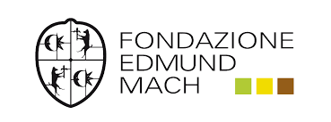
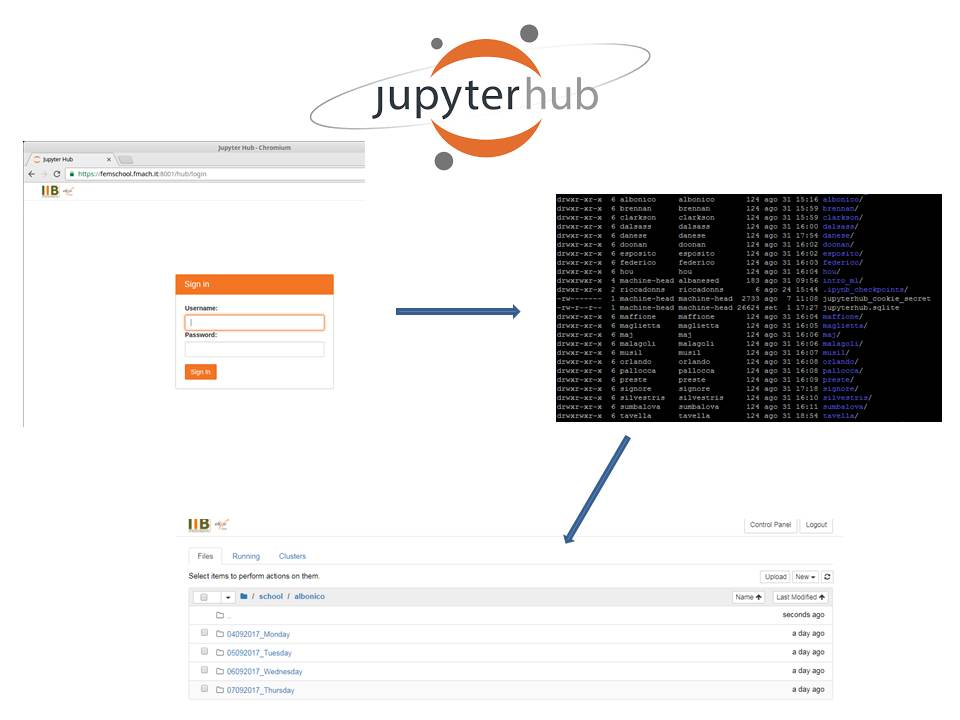
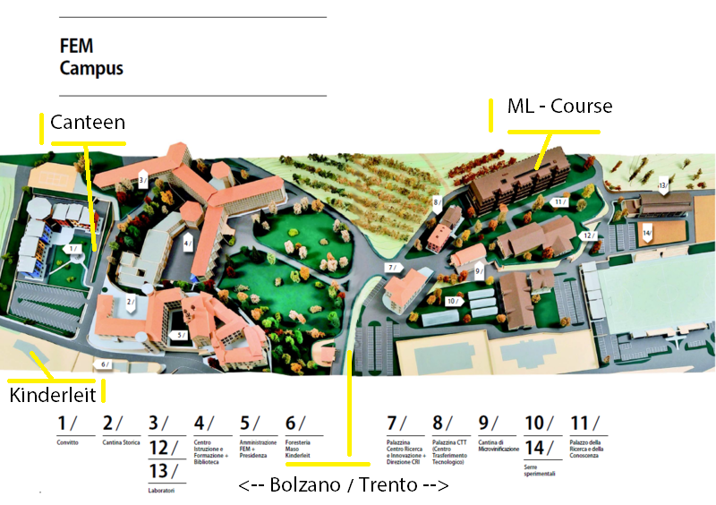

# MLB2017
## Machine Learning for Biologists

 <table style="width:100%">
  <tr>
    <td></td>
    <tr/>
</table>

In collaboration with

 <table style="width:100%">
  <tr>
    <td></td>
    <td></td>
    <tr/>
</table>

### Venue: Fondazione Edmund Mach, San Michele all'Adige, Trento, IT
### Date: 04-07/09/2017

### Instructors and helpers
- [**Giuseppe Jurman**](http://mpba.fbk.eu/people/profile/jurman) - Fondazione Bruno Kessler, Trento, IT
- [**Marco Chierici**](http://mpba.fbk.eu/people/profile/chierici) - Fondazione Bruno Kessler, Trento, IT
- [**Davide Albanese**](http://www.fmach.it/CRI/info-generali/organizzazione/Biologia-computazionale/ALBANESE-DAVIDE) - Fondazione E. Mach, Trento, IT
- [**Pietro Franceschi**](http://www.fmach.it/CRI/info-generali/organizzazione/Biologia-computazionale/FRANCESCHI-PIETRO) - Fondazione E. Mach, Trento, IT
- [**Marco Moretto**](http://www.fmach.it/CRI/info-generali/organizzazione/Biologia-computazionale/MORETTO-MARCO) - Fondazione E. Mach, Trento, IT
- [**Paolo Sonego**](http://www.fmach.it/CRI/info-generali/organizzazione/Biologia-computazionale/SONEGO-PAOLO) - Fondazione E. Mach, Trento, IT
- [**Samantha Riccadonna**](http://www.fmach.it/CRI/info-generali/organizzazione/Biologia-computazionale/RICCADONNA-SAMANTHA) - Fondazione E. Mach, Trento, IT
- [**Andrea Cattani**](http://www.fmach.it/Chi-siamo/Organizzazione/Direzione-Generale/DG-Ripartizione-Sistemi-Informativi-e-Comunicazione/CATTANI-ANDREA)  - Fondazione E. Mach, Trento, IT
 

### Organisers
- Alessandro Cestaro (Local Organizer, Fondazione E. Mach, Trento, IT )
- Vincenza Colonna (ELIXIR-IIB Training Coordinator Deputy, CNR, IT)
 

### Course Material
Days |Lessons  | Tutorials |
------------ | ------------- | ------------- |
day 1  | [Introduction to "omics" data. Principles of data exploration and  analysis](day1/Introduction.pdf) | [Practicals on principles of data exploration and  analysis](day1/Principles_of_data_exploration_and_analysis.md)|
day 2 | [Univariate](day2/Univariate/The_univariate_way.pdf)  and [Multivariate](day2/Multivariate/Going_Multivariate.pdf) analysis| [A gentle introduction to Machine Learning](day2/MLintroduction/A_gentle_introduction_to_Machine_Learning.pdf)|
day 3 | [Gene Expression Analysis](day3/GeneExpressionAnalysis/RNAseqDEAIntroduction2017.pdf) || 

### Programme

<table border="1">
<tr>
   <td colspan="4"><h3>Monday 04 September 2017 - Introduction </h3></td>
</tr>
<tr>
   <td>14:00-15:30</td>
   <td>Course opening</td>
   <td colspan="2">Participants’ self-presentations</td>
</tr>
<tr>
   <td>15:30-16:15</td>
   <td>Plenary lecture </td>
   <td >P. Franceschi, S. Riccadonna</td>
   <td> Introduction to "omics" data. Principles of data exploration and  analysis </td>
</tr>
<tr>
   <td>16:15-16:45</td>
   <td colspan="3">Coffee break</td>
</tr>
<tr>
   <td>16.45-19:00</td>
   <td>Practical</td>
   <td>P. Franceschi, S. Riccadonna</td>
   <td> Practicals on principles of data exploration and  analysis </td>
</tr>
<tr>
   <td>19:30-21:00</td>
   <td colspan="3">Welcome aperitivo at Cantina storica Istituto Agrario San Michele</td>
</tr>

<tr>
   <td colspan="4"><h3>Tuesday  05 September 2017 - Machine Learning </h3></td>
</tr>
<tr>
   <td>09:30-09:40</td>
   <td>Previously On</td>
   <td colspan="2">Recap of previous lessons by participants</td>
</tr>
<tr>
  <td>09:40-10:30</td>
  <td>Lecture</td>
  <td>D. Albanese, P. Franceschi, S. Riccadonna</td>
  <td>Univariate and Multivariate analysis</td>
</tr>
<tr>
   <td>10:30-11:00</td>
   <td colspan="3">Coffee break</td>
</tr>
<tr>
   <td>11:00-13:00</td>
   <td>Practical</td>
   <td>D. Albanese, P. Franceschi, S. Riccadonna</td>
   <td>Univariate and Multivariate analysis. Practical session with R</td>
</tr>
<tr>
   <td>13:00-14:30</td>
   <td colspan="3"> Lunch </td>
</tr>
<tr>
   <td>14:30-16:15</td>
   <td>Lecture</td>
   <td>D. Albanese, P. Franceschi, S. Ricadonna</td>
   <td>Machine Learning: introduction and applications to biological data. Classification basics, model selection and prediction</td>
</tr>
<tr>
<td>16:15-16:45</td>
<td colspan="3">Coffee Break</td>
<tr>
</tr>
   <td>16:45-18:30</td>
   <td>Practical</td>
   <td>D. Albanese, P. Franceschi, S. Riccadonna</td>
   <td>Performance measures and diagnostic plots</td>
</tr>

<tr>
   <td colspan="4"><h3>Wednesday  06 September 2017</h3></td>
</tr>
<tr>
   <td>09:30-09:40</td>
   <td>Previously On</td>
   <td colspan="2">Recap of previous lessons by participants</td>
</tr>
<tr>
  <td>09:40-10:30</td>
  <td>Lecture</td>
  <td>P. Sonego, S. Riccadonna </td>
  <td>Analyzing Gene Expression Data</td>
</tr>
<tr>
   <td>10:30-11:00</td>
   <td colspan="3">Coffee break</td>
</tr>
<tr>
   <td>11:00-13:00</td>
   <td>Practical</td>
   <td>P. Sonego, S. Riccadonna </td>
   <td>Analyzing Gene Expression Data</td>
</tr>
<tr>
   <td>13:00-14:30</td>
   <td colspan="3"> Lunch </td>
</tr>
<tr>
   <td>14:30-16:15</td>
   <td> Lecture </td>
   <td>M. Chierici, G. Jurman </td>
   <td>The Data Analysis Plan (DAP) - intro to unbiased pipelines for (binary) classification</td>
</tr>
<tr>
<td>16:15-16:45</td>
<td colspan="3">Coffee Break</td>
<tr>
</tr>
   <td>16:45-18:30</td>
   <td>Practical</td>
   <td>M. Chierici, G. Jurman</td>
   <td>Implementation of a basic DAP in Python (Scikit-Learn) with feature ranking and classification</td>
</tr>
<tr>
   <td>19:30-22:00</td>
   <td colspan="3">Social Dinner at Albergo Ai Spiazzi</td>
</tr>

<tr>
<td colspan="4"><h3>Thursday 07 September 2017</h3></td>
</tr>
<tr>
   <td>09:15-09:25</td>
   <td>Previously On</td>
   <td colspan="2">Recap of previous lessons by participants</td>
</tr>
<tr>
   <td>09:25-10:00</td>
   <td>Lecture</td>
   <td>M. Moretto, A. Cestaro</td>
   <td>Gene prediction methods as an example of ML on genomic data</td>
</tr>
<tr>
<td>10:00-10:30</td>
<td colspan="3">Coffee Break</td>
</tr>
<tr>
<td>10:30-12:30</td>
<td>Practical</td>
<td>M. Moretto, A. Cestaro</td>
 <td>Training a gene prediciton method</td>
</tr>
<tr>
<td>12:30-13:00</td>
<td colspan="3">Wrap-up and feedback</td>
</tr>
</table>

### Computing facility instruction

  

### Practical information

<table style="width:100%">
 <tr>
   <td></td>

   <tr/>
</table>
