# Familiarize with your data

### Datasets:

**Wine data**
It can be downloaded from the UCI Machine Learning Repository. 
A description can be found at https://archive.ics.uci.edu/ml/machine-learning-databases/wine/wine.names.
These data are the results of a chemical analysis of wines grown in the same region in Italy but derived from three
different cultivars. The analysis determined the quantities of 13 constituents found in each of the three types of wines. 

**Rubus untargeted metabolomics**
Untargeted metabolomics dataset (already preprocessed) described in Carvalho et al. Metabolomics, 2016, 12:144 [DOI:10.1007/s11306-016-1090-x].  The raw data are publicly available on MetaboLights (accession number MTBLS333). Raspberry fruits of different colors and varieties were collected from different locations, in different years, frozen and stored at different temperatures. In particular, there are 12 yellow, 1 pink and 13 red rasperries.

**Gene expression dataset**
RNA-Seq experiment studying the process of berry ripening in grapevine described in Pilati et al. PFront Plant Sci. 2017 Jun 21; 8 1093, [DOI: 10.3389/fpls.2017.01093]. See Wednesday lesson by Sonego P.


### Where/How to find help?


```R
help(read.table)
```

...otherwise...

- google
- stackoverflow [https://stackoverflow.com/questions/tagged/r]
- R-bloggers [https://www.r-bloggers.com/]
- books (*R for Data Science* by Wickham and Grolemund)


```R
#We will start exploring the Wine data. 
#You can find it in the data folder within "today" folder.
#Let's check which is the "starting directory" R (*the working directory*):

getwd()
```


'/school/04092017_Monday'


```R
#We will start exploring the Wine data. 
#You can find it in the data folder within "today" folder.
#let's import the data as

wine<-read.table("data/wine.data.txt",sep=",",header=FALSE)

#another way to write it could be
#wine<-read.table(file.path("data","wine.data.txt"),sep=",",header=FALSE)

#let's give a look at the structure of the dataset
str(wine)
```

    'data.frame':	178 obs. of  14 variables:
     $ V1 : int  1 1 1 1 1 1 1 1 1 1 ...
     $ V2 : num  14.2 13.2 13.2 14.4 13.2 ...
     $ V3 : num  1.71 1.78 2.36 1.95 2.59 1.76 1.87 2.15 1.64 1.35 ...
     $ V4 : num  2.43 2.14 2.67 2.5 2.87 2.45 2.45 2.61 2.17 2.27 ...
     $ V5 : num  15.6 11.2 18.6 16.8 21 15.2 14.6 17.6 14 16 ...
     $ V6 : int  127 100 101 113 118 112 96 121 97 98 ...
     $ V7 : num  2.8 2.65 2.8 3.85 2.8 3.27 2.5 2.6 2.8 2.98 ...
     $ V8 : num  3.06 2.76 3.24 3.49 2.69 3.39 2.52 2.51 2.98 3.15 ...
     $ V9 : num  0.28 0.26 0.3 0.24 0.39 0.34 0.3 0.31 0.29 0.22 ...
     $ V10: num  2.29 1.28 2.81 2.18 1.82 1.97 1.98 1.25 1.98 1.85 ...
     $ V11: num  5.64 4.38 5.68 7.8 4.32 6.75 5.25 5.05 5.2 7.22 ...
     $ V12: num  1.04 1.05 1.03 0.86 1.04 1.05 1.02 1.06 1.08 1.01 ...
     $ V13: num  3.92 3.4 3.17 3.45 2.93 2.85 3.58 3.58 2.85 3.55 ...
     $ V14: int  1065 1050 1185 1480 735 1450 1290 1295 1045 1045 ...


```R
#we can also give a look at the first rows
head(wine)
```


<table>
<thead><tr><th scope=col>V1</th><th scope=col>V2</th><th scope=col>V3</th><th scope=col>V4</th><th scope=col>V5</th><th scope=col>V6</th><th scope=col>V7</th><th scope=col>V8</th><th scope=col>V9</th><th scope=col>V10</th><th scope=col>V11</th><th scope=col>V12</th><th scope=col>V13</th><th scope=col>V14</th></tr></thead>
<tbody>
	<tr><td>1    </td><td>14.23</td><td>1.71 </td><td>2.43 </td><td>15.6 </td><td>127  </td><td>2.80 </td><td>3.06 </td><td>0.28 </td><td>2.29 </td><td>5.64 </td><td>1.04 </td><td>3.92 </td><td>1065 </td></tr>
	<tr><td>1    </td><td>13.20</td><td>1.78 </td><td>2.14 </td><td>11.2 </td><td>100  </td><td>2.65 </td><td>2.76 </td><td>0.26 </td><td>1.28 </td><td>4.38 </td><td>1.05 </td><td>3.40 </td><td>1050 </td></tr>
	<tr><td>1    </td><td>13.16</td><td>2.36 </td><td>2.67 </td><td>18.6 </td><td>101  </td><td>2.80 </td><td>3.24 </td><td>0.30 </td><td>2.81 </td><td>5.68 </td><td>1.03 </td><td>3.17 </td><td>1185 </td></tr>
	<tr><td>1    </td><td>14.37</td><td>1.95 </td><td>2.50 </td><td>16.8 </td><td>113  </td><td>3.85 </td><td>3.49 </td><td>0.24 </td><td>2.18 </td><td>7.80 </td><td>0.86 </td><td>3.45 </td><td>1480 </td></tr>
	<tr><td>1    </td><td>13.24</td><td>2.59 </td><td>2.87 </td><td>21.0 </td><td>118  </td><td>2.80 </td><td>2.69 </td><td>0.39 </td><td>1.82 </td><td>4.32 </td><td>1.04 </td><td>2.93 </td><td> 735 </td></tr>
	<tr><td>1    </td><td>14.20</td><td>1.76 </td><td>2.45 </td><td>15.2 </td><td>112  </td><td>3.27 </td><td>3.39 </td><td>0.34 </td><td>1.97 </td><td>6.75 </td><td>1.05 </td><td>2.85 </td><td>1450 </td></tr>
</tbody>
</table>


```R
colnames(wine)<-c("Cultivar","Alcohol","Malic_acid","Ash","Ash_Alcalinity","Magnesium",
                  "Total_Phenols","Flavanoids","Nonflavanoid_phenols",
                  "Proanthocyanins","Color_intensity","Color_hue","OD_ratio",
                  "Proline")
```


```R
head(wine)
```


<table>
<thead><tr><th scope=col>Cultivar</th><th scope=col>Alcohol</th><th scope=col>Malic_acid</th><th scope=col>Ash</th><th scope=col>Ash_Alcalinity</th><th scope=col>Magnesium</th><th scope=col>Total_Phenols</th><th scope=col>Flavanoids</th><th scope=col>Nonflavanoid_phenols</th><th scope=col>Proanthocyanins</th><th scope=col>Color_intensity</th><th scope=col>Color_hue</th><th scope=col>OD_ratio</th><th scope=col>Proline</th></tr></thead>
<tbody>
	<tr><td>1    </td><td>14.23</td><td>1.71 </td><td>2.43 </td><td>15.6 </td><td>127  </td><td>2.80 </td><td>3.06 </td><td>0.28 </td><td>2.29 </td><td>5.64 </td><td>1.04 </td><td>3.92 </td><td>1065 </td></tr>
	<tr><td>1    </td><td>13.20</td><td>1.78 </td><td>2.14 </td><td>11.2 </td><td>100  </td><td>2.65 </td><td>2.76 </td><td>0.26 </td><td>1.28 </td><td>4.38 </td><td>1.05 </td><td>3.40 </td><td>1050 </td></tr>
	<tr><td>1    </td><td>13.16</td><td>2.36 </td><td>2.67 </td><td>18.6 </td><td>101  </td><td>2.80 </td><td>3.24 </td><td>0.30 </td><td>2.81 </td><td>5.68 </td><td>1.03 </td><td>3.17 </td><td>1185 </td></tr>
	<tr><td>1    </td><td>14.37</td><td>1.95 </td><td>2.50 </td><td>16.8 </td><td>113  </td><td>3.85 </td><td>3.49 </td><td>0.24 </td><td>2.18 </td><td>7.80 </td><td>0.86 </td><td>3.45 </td><td>1480 </td></tr>
	<tr><td>1    </td><td>13.24</td><td>2.59 </td><td>2.87 </td><td>21.0 </td><td>118  </td><td>2.80 </td><td>2.69 </td><td>0.39 </td><td>1.82 </td><td>4.32 </td><td>1.04 </td><td>2.93 </td><td> 735 </td></tr>
	<tr><td>1    </td><td>14.20</td><td>1.76 </td><td>2.45 </td><td>15.2 </td><td>112  </td><td>3.27 </td><td>3.39 </td><td>0.34 </td><td>1.97 </td><td>6.75 </td><td>1.05 </td><td>2.85 </td><td>1450 </td></tr>
</tbody>
</table>


```R
#let's export the dataset for future use
?write.table
```


```R
write.table(wine, file="data/wine.data.names.txt", quote=FALSE, sep="\t", row.names=FALSE)
```

## Data exploration and visualization


```R
summary(wine)

```


        Cultivar        Alcohol        Malic_acid         Ash       
     Min.   :1.000   Min.   :11.03   Min.   :0.740   Min.   :1.360  
     1st Qu.:1.000   1st Qu.:12.36   1st Qu.:1.603   1st Qu.:2.210  
     Median :2.000   Median :13.05   Median :1.865   Median :2.360  
     Mean   :1.938   Mean   :13.00   Mean   :2.336   Mean   :2.367  
     3rd Qu.:3.000   3rd Qu.:13.68   3rd Qu.:3.083   3rd Qu.:2.558  
     Max.   :3.000   Max.   :14.83   Max.   :5.800   Max.   :3.230  
     Ash_Alcalinity    Magnesium      Total_Phenols     Flavanoids   
     Min.   :10.60   Min.   : 70.00   Min.   :0.980   Min.   :0.340  
     1st Qu.:17.20   1st Qu.: 88.00   1st Qu.:1.742   1st Qu.:1.205  
     Median :19.50   Median : 98.00   Median :2.355   Median :2.135  
     Mean   :19.49   Mean   : 99.74   Mean   :2.295   Mean   :2.029  
     3rd Qu.:21.50   3rd Qu.:107.00   3rd Qu.:2.800   3rd Qu.:2.875  
     Max.   :30.00   Max.   :162.00   Max.   :3.880   Max.   :5.080  
     Nonflavanoid_phenols Proanthocyanins Color_intensity    Color_hue     
     Min.   :0.1300       Min.   :0.410   Min.   : 1.280   Min.   :0.4800  
     1st Qu.:0.2700       1st Qu.:1.250   1st Qu.: 3.220   1st Qu.:0.7825  
     Median :0.3400       Median :1.555   Median : 4.690   Median :0.9650  
     Mean   :0.3619       Mean   :1.591   Mean   : 5.058   Mean   :0.9574  
     3rd Qu.:0.4375       3rd Qu.:1.950   3rd Qu.: 6.200   3rd Qu.:1.1200  
     Max.   :0.6600       Max.   :3.580   Max.   :13.000   Max.   :1.7100  
        OD_ratio        Proline      
     Min.   :1.270   Min.   : 278.0  
     1st Qu.:1.938   1st Qu.: 500.5  
     Median :2.780   Median : 673.5  
     Mean   :2.612   Mean   : 746.9  
     3rd Qu.:3.170   3rd Qu.: 985.0  
     Max.   :4.000   Max.   :1680.0  


```R
#let's define properly the type/class of the column indicating the type of wine
wine$Cultivar<-factor(wine$Cultivar)
summary(wine)
```


     Cultivar    Alcohol        Malic_acid         Ash        Ash_Alcalinity 
     1:59     Min.   :11.03   Min.   :0.740   Min.   :1.360   Min.   :10.60  
     2:71     1st Qu.:12.36   1st Qu.:1.603   1st Qu.:2.210   1st Qu.:17.20  
     3:48     Median :13.05   Median :1.865   Median :2.360   Median :19.50  
              Mean   :13.00   Mean   :2.336   Mean   :2.367   Mean   :19.49  
              3rd Qu.:13.68   3rd Qu.:3.083   3rd Qu.:2.558   3rd Qu.:21.50  
              Max.   :14.83   Max.   :5.800   Max.   :3.230   Max.   :30.00  
       Magnesium      Total_Phenols     Flavanoids    Nonflavanoid_phenols
     Min.   : 70.00   Min.   :0.980   Min.   :0.340   Min.   :0.1300      
     1st Qu.: 88.00   1st Qu.:1.742   1st Qu.:1.205   1st Qu.:0.2700      
     Median : 98.00   Median :2.355   Median :2.135   Median :0.3400      
     Mean   : 99.74   Mean   :2.295   Mean   :2.029   Mean   :0.3619      
     3rd Qu.:107.00   3rd Qu.:2.800   3rd Qu.:2.875   3rd Qu.:0.4375      
     Max.   :162.00   Max.   :3.880   Max.   :5.080   Max.   :0.6600      
     Proanthocyanins Color_intensity    Color_hue         OD_ratio    
     Min.   :0.410   Min.   : 1.280   Min.   :0.4800   Min.   :1.270  
     1st Qu.:1.250   1st Qu.: 3.220   1st Qu.:0.7825   1st Qu.:1.938  
     Median :1.555   Median : 4.690   Median :0.9650   Median :2.780  
     Mean   :1.591   Mean   : 5.058   Mean   :0.9574   Mean   :2.612  
     3rd Qu.:1.950   3rd Qu.: 6.200   3rd Qu.:1.1200   3rd Qu.:3.170  
     Max.   :3.580   Max.   :13.000   Max.   :1.7100   Max.   :4.000  
        Proline      
     Min.   : 278.0  
     1st Qu.: 500.5  
     Median : 673.5  
     Mean   : 746.9  
     3rd Qu.: 985.0  
     Max.   :1680.0  


```R
plot(x=wine$Color_intensity,y=wine$Color_hue)
```


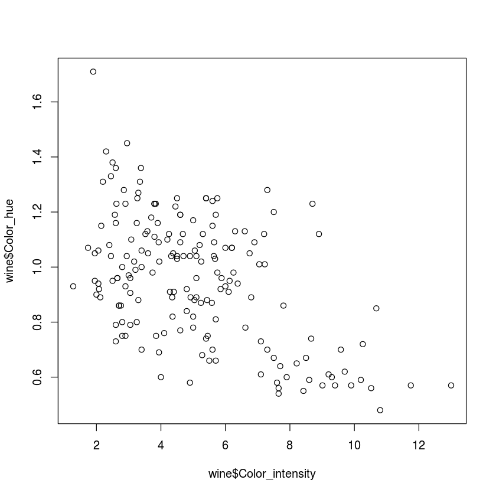


```R
plot(wine[,c("Alcohol","Total_Phenols","Color_intensity","Malic_acid","Flavanoids","Proline","OD_ratio")], 
     col=c("steelblue3","coral3","seagreen3")[as.numeric(wine$Cultivar)])
```


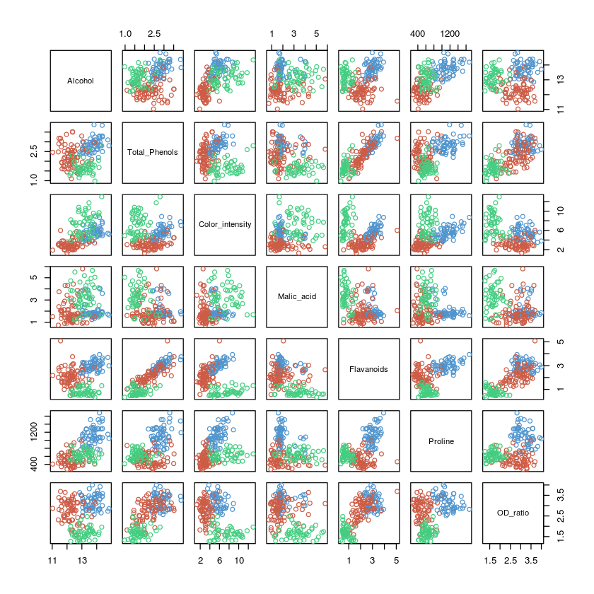


```R
plot(x=wine$Cultivar,y=wine$Total_Phenols)

#it is essentially a wrapper for the boxplot command which needs the data in formula format y~x:
#boxplot(wine$Total_Phenols~wine$Class)
```


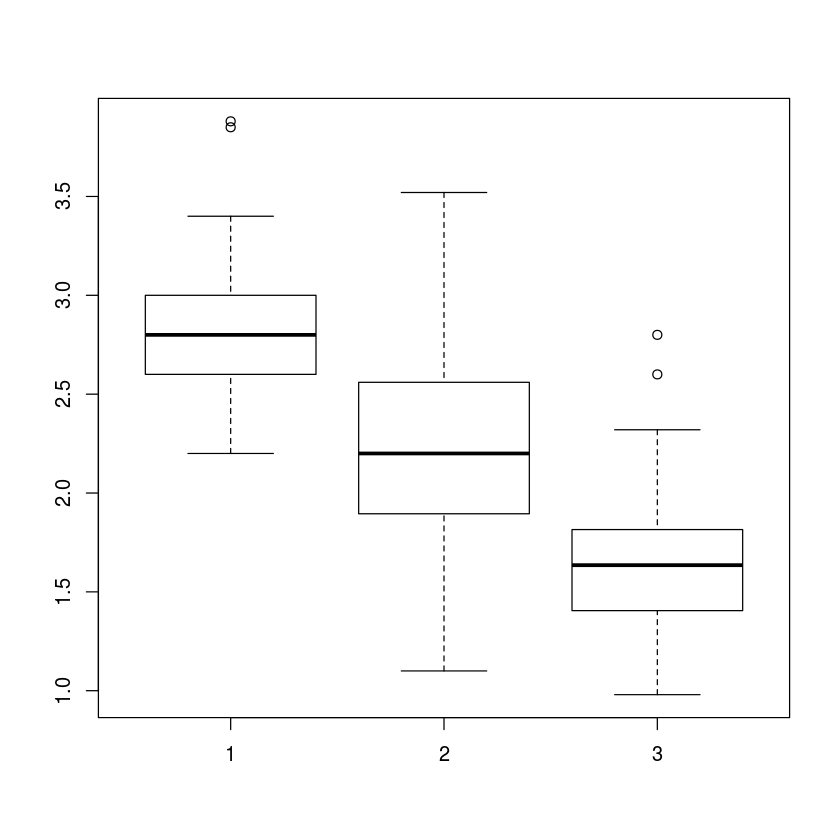


```R
quantile(wine$Total_Phenols)

```


<dl class=dl-horizontal>
	<dt>0%</dt>
		<dd>0.98</dd>
	<dt>25%</dt>
		<dd>1.7425</dd>
	<dt>50%</dt>
		<dd>2.355</dd>
	<dt>75%</dt>
		<dd>2.8</dd>
	<dt>100%</dt>
		<dd>3.88</dd>
</dl>


```R
by(data=wine$Total_Phenols,INDICES=wine$Cultivar,FUN=quantile)
#by(data=wine$Total_Phenols,INDICES=wine$Cultivar,FUN=mean)
```


    wine$Cultivar: 1
      0%  25%  50%  75% 100% 
    2.20 2.60 2.80 3.00 3.88 
    ------------------------------------------------------------ 
    wine$Cultivar: 2
       0%   25%   50%   75%  100% 
    1.100 1.895 2.200 2.560 3.520 
    ------------------------------------------------------------ 
    wine$Cultivar: 3
        0%    25%    50%    75%   100% 
    0.9800 1.4075 1.6350 1.8075 2.8000 


```R
boxplot(wine$Total_Phenols~wine$Cultivar,outline=FALSE, ylim=c(1,4))
points(x=jitter(as.numeric(wine$Cultivar)),y=wine$Total_Phenols, pch=19,
       col=c("steelblue3","coral3","seagreen3")[as.numeric(wine$Cultivar)])
```


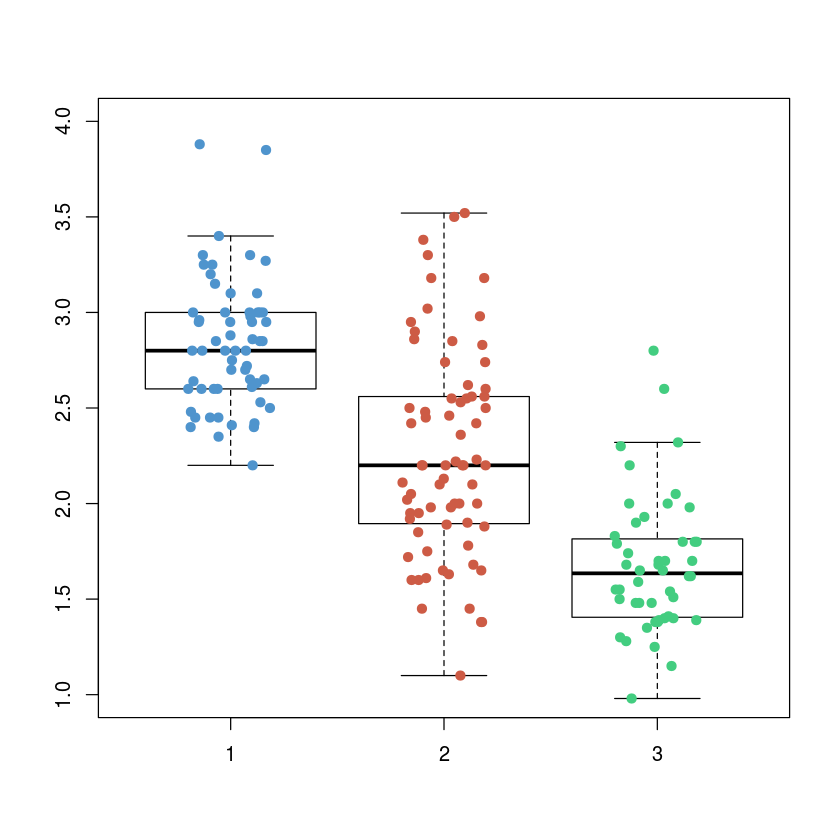


```R
##let's look at the same boxplot on a subset of the data points
#we choose 20 samples randomly
set.seed(100) #this is needed in order to obtain perfectly reproducible data even when random routines are needed
idx<-sample(1:nrow(wine),20) #randomly sampling 20 samples from the dataset
wine_subset<-wine[idx,] #we consider now the subset only
#lets look at how they are distributed among the cultivars
summary(wine_subset$Cultivar)


boxplot(wine_subset$Total_Phenols~wine_subset$Cultivar,outline=FALSE, ylim=c(1,4))
points(x=jitter(as.numeric(wine_subset$Cultivar)),y=wine_subset$Total_Phenols, pch=19,
       col=c("steelblue3","coral3","seagreen3")[as.numeric(wine_subset$Cultivar)])

#How does things change increasing the number of sampled points?
```


<dl class=dl-horizontal>
	<dt>1</dt>
		<dd>7</dd>
	<dt>2</dt>
		<dd>9</dd>
	<dt>3</dt>
		<dd>4</dd>
</dl>


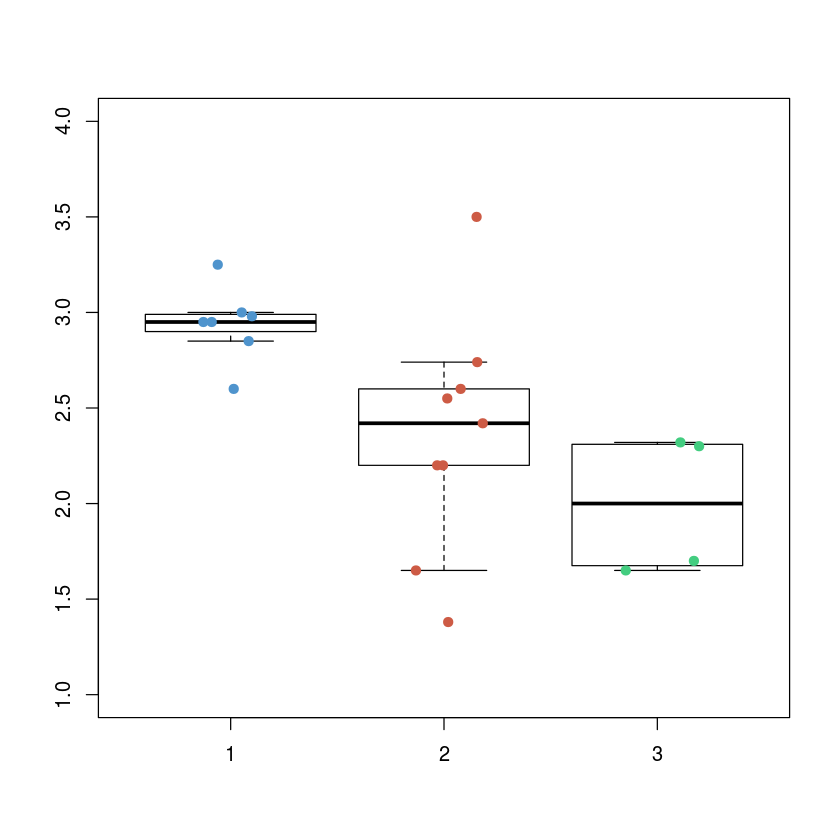


```R
hist(wine$Total_Phenols, breaks=20)
```


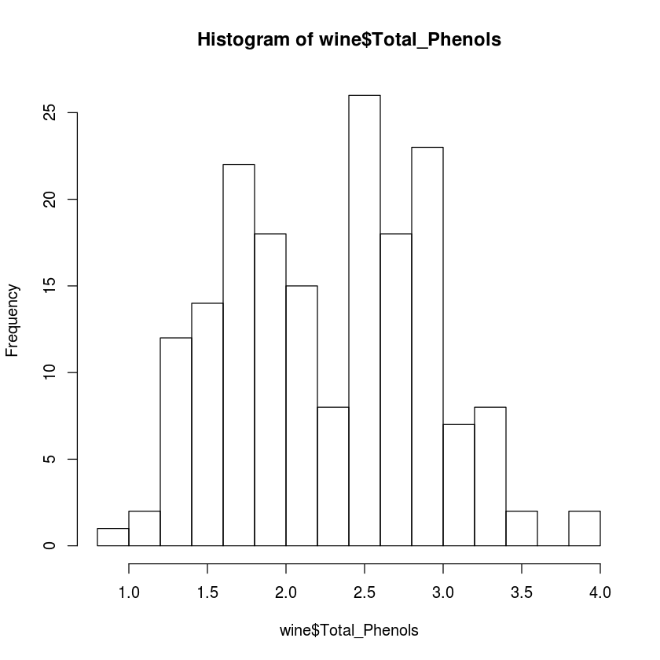


```R
hist(wine$Total_Phenols, breaks=20, freq=FALSE)
abline(v=mean(wine$Total_Phenols),lty=3)
lines(density(wine$Total_Phenols), col="coral3")

```


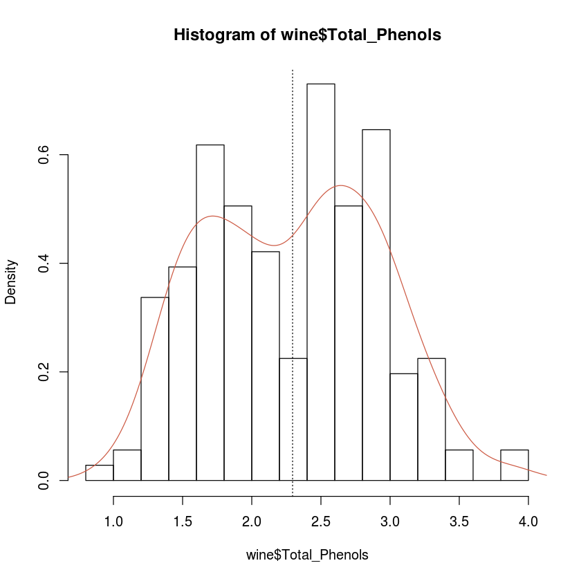


### Excercise:

##### Explore the distribution of the variable *Malic acid*. How does it change if you apply a square root (_sqrt_) or a logarithm (_log10_) transformation? Does the distribution change if you consider the class?


```R
nf<-layout(matrix(c(1,2,3),nrow=3,ncol=1,byrow=TRUE))
hist(wine[wine$Cultivar==2,"Malic_acid"],breaks=20, main="Malic Acid: original values")
hist(sqrt(wine[wine$Cultivar==2,"Malic_acid"]),breaks=30, freq=FALSE,main="Malic Acid: sqrt transformed values")
lines(density(sqrt(wine[wine$Cultivar==2,"Malic_acid"])), col="coral3")
hist(log10(wine[wine$Cultivar==2,"Malic_acid"]),breaks=30, freq=FALSE,main="Malic Acid: log10 transformed values")
lines(density(log10(wine[wine$Cultivar==2,"Malic_acid"])), col="coral3")
```


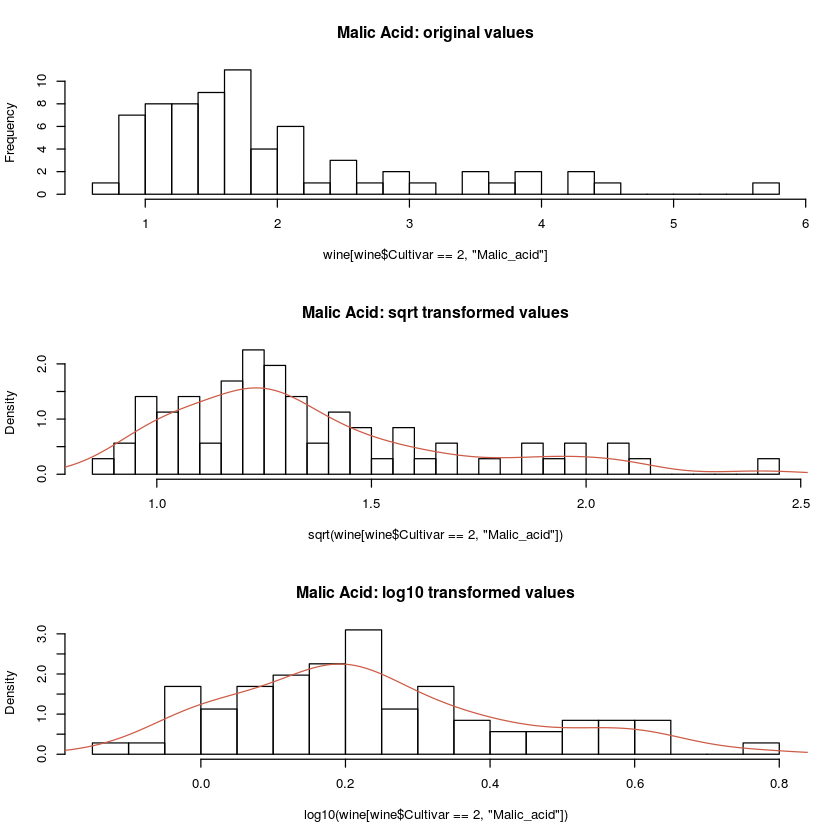


## Data transformations

We have just seen what happens with sqrt o log10: skewed distributions looks more gaussian-like.
How can we handle the need to make our data more "comparable"?
Have you ever heard about data scaling?

Let's start with data centering! It is equivalent to say that we subtract its mean from each variable (*mean centering*). The R command is scale.


```R
# Center data 
# Consider the variables of the wine dataset
# Look at the boxplot of all the variables
boxplot(wine[,-1], las=2) 
for(i in 2:ncol(wine)){
    xpos<-rep(i-1,nrow(wine))
    xpos<-xpos+jitter(rep(0,nrow(wine)),factor=10)
    points(x=xpos,y=wine[[i]], col="steelblue")
}
```


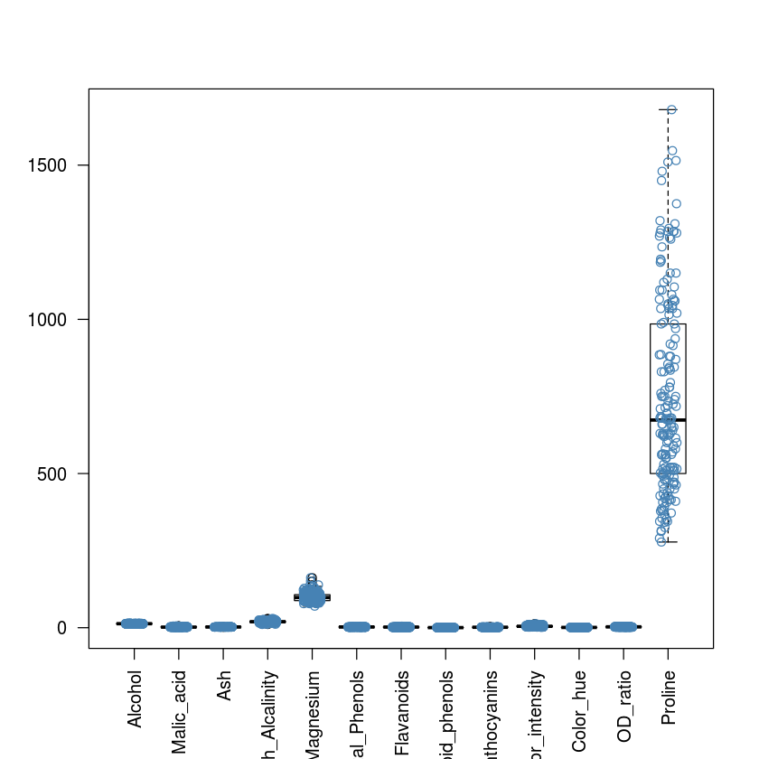


### Excercise
##### Transform your data mean centering them and then look at the boxplots. 


```R
#let's center the data with the scale command

wine.center<-scale(wine[,-1],center = TRUE,scale = FALSE)

dim(wine)
dim(wine.center)
str(wine.center) ##attention: now it is a matrix, not data.frame

#summary(wine.center)

#how does the boxplot change?
boxplot(wine.center, las=2)
for(i in 1:ncol(wine.center)){
    xpos<-rep(i,nrow(wine.center))
    xpos<-xpos+jitter(rep(0,nrow(wine.center)),factor=10)
    points(x=xpos,y=wine.center[,i], col="steelblue")
}
```


<ol class=list-inline>
	<li>178</li>
	<li>14</li>
</ol>


<ol class=list-inline>
	<li>178</li>
	<li>13</li>
</ol>


     num [1:178, 1:13] 1.229 0.199 0.159 1.369 0.239 ...
     - attr(*, "dimnames")=List of 2
      ..$ : NULL
      ..$ : chr [1:13] "Alcohol" "Malic_acid" "Ash" "Ash_Alcalinity" ...
     - attr(*, "scaled:center")= Named num [1:13] 13 2.34 2.37 19.49 99.74 ...
      ..- attr(*, "names")= chr [1:13] "Alcohol" "Malic_acid" "Ash" "Ash_Alcalinity" ...


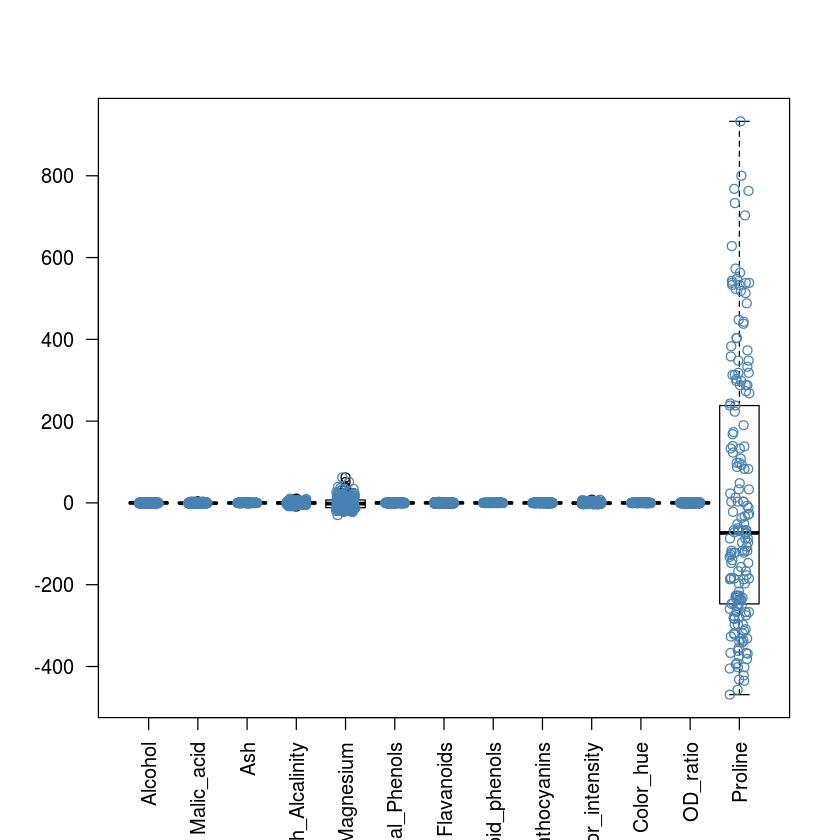


### Excercise
##### What does it happen if we require also to transform the variance of the data? For example, the "Unit Variance" scaling is quite common. It means that we require that all the variable has the same variance set to 1. Let's see how it changes our data.


```R
#let's apply both the mean centering and univariate scaling to the data with the scale command

wine.centerUV<-scale(wine[,-1],center = TRUE,scale = TRUE)

#how does the boxplot change?
boxplot(wine.centerUV, las=2, outline = FALSE, ylim=c(-3,4.5))
for(i in 1:ncol(wine.centerUV)){
    xpos<-rep(i,nrow(wine.centerUV))
    xpos<-xpos+jitter(rep(0,nrow(wine.centerUV)),factor=10)
    points(x=xpos,y=wine.centerUV[,i], col="steelblue")
}


```


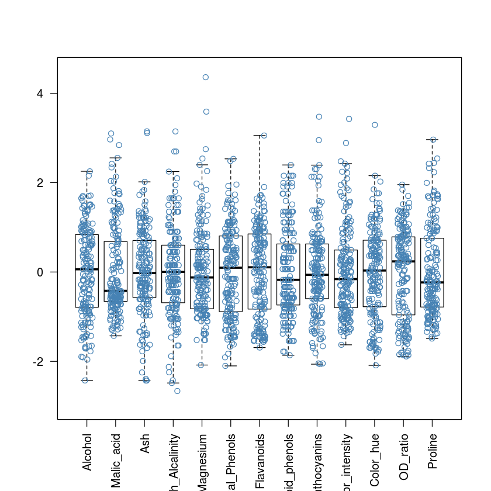


### Excercise:
##### How does the sqrt and log10 transformation change the scaling?


```R
wine.transf.mUV<-scale(log10(wine[,-1]),center = TRUE,scale = TRUE)

#how does the boxplot change?
boxplot(wine.transf.mUV, las=2, outline = FALSE, ylim=c(-5,5))
for(i in 1:ncol(wine.transf.mUV)){
    xpos<-rep(i,nrow(wine.transf.mUV))
    xpos<-xpos+jitter(rep(0,nrow(wine.transf.mUV)),factor=10)
    points(x=xpos,y=wine.transf.mUV[,i], col="steelblue")
}
```


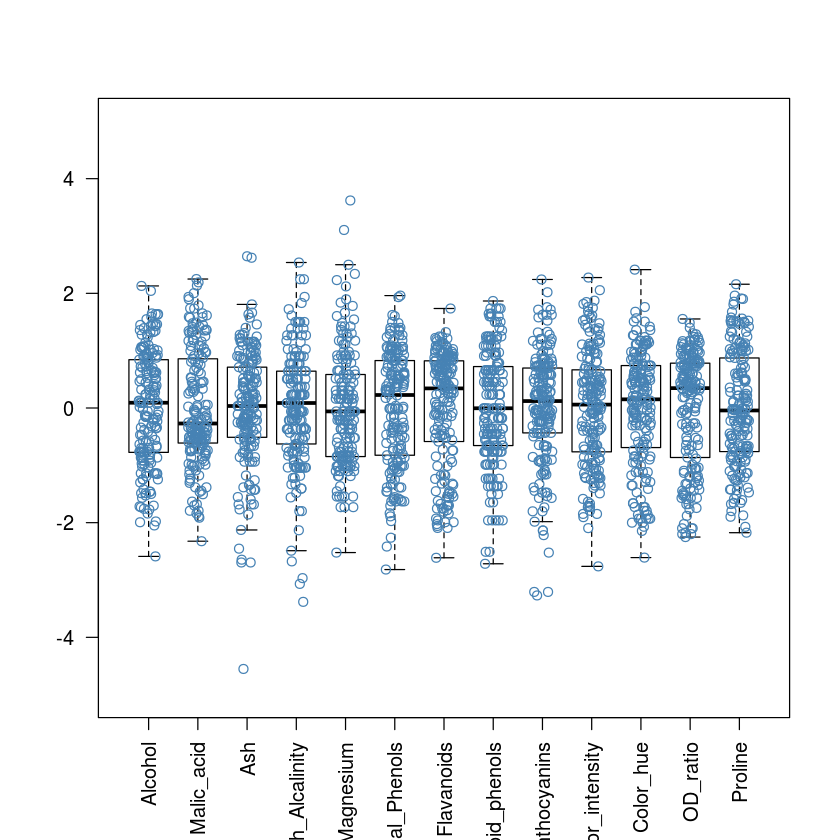


## The data distribution


```R
#how can we explore data distributions? Can we compare our data with known distributions?

#Let's start thinking about the gaussian
set.seed(10)

#What happens if we sample points from a gaussian? Does it looks like a gaussian... always?
#Try the different commands for different number of points N

N<-25

#randomly sample N points from a normal distribution with the specified mean and sd
x<-rnorm(N, mean = 0, sd =1)

#the layout command is useful for putting more than one plot close together
nf <- layout(mat = matrix(c(1,2),2,1, byrow=TRUE),  height = c(3,1))
#avoids extra space around the plot
par(mar=c(3.1, 3.1, 1.1, 2.1))
##top plot 
hist(x,xlim=c(-4,4), col = "lightblue", freq = FALSE) #histogram
lines(density(x),col="black",lty=3)                   #adds the density line
rug(x)                                                #adds the rugs at the histogram bottom (one vertical line=one point)
#bottom plot
boxplot(x, horizontal=TRUE,  outline=TRUE,ylim=c(-4,4), frame=F, col = "gray90", width = 10) 
points(y=jitter(rep(1,length(x))),x=x,col="steelblue")
```


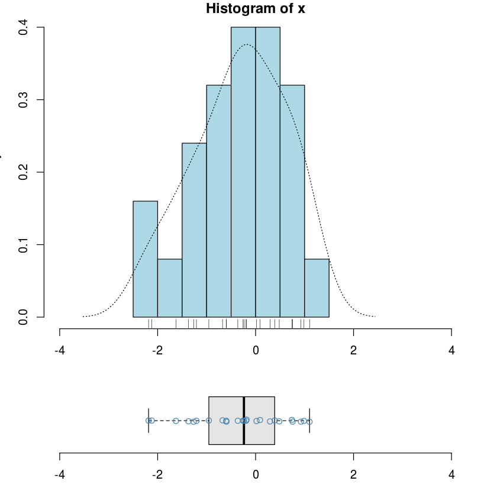


```R
#the quantiles can be useful for exploring the data distribution
quantile(x)
```


<dl class=dl-horizontal>
	<dt>0%</dt>
		<dd>-2.18528683816953</dd>
	<dt>25%</dt>
		<dd>-0.954943856152377</dd>
	<dt>50%</dt>
		<dd>-0.238233556018718</dd>
	<dt>75%</dt>
		<dd>0.389794300700167</dd>
	<dt>100%</dt>
		<dd>1.10177950308713</dd>
</dl>


```R
qqnorm(x)
qqline(x)
```


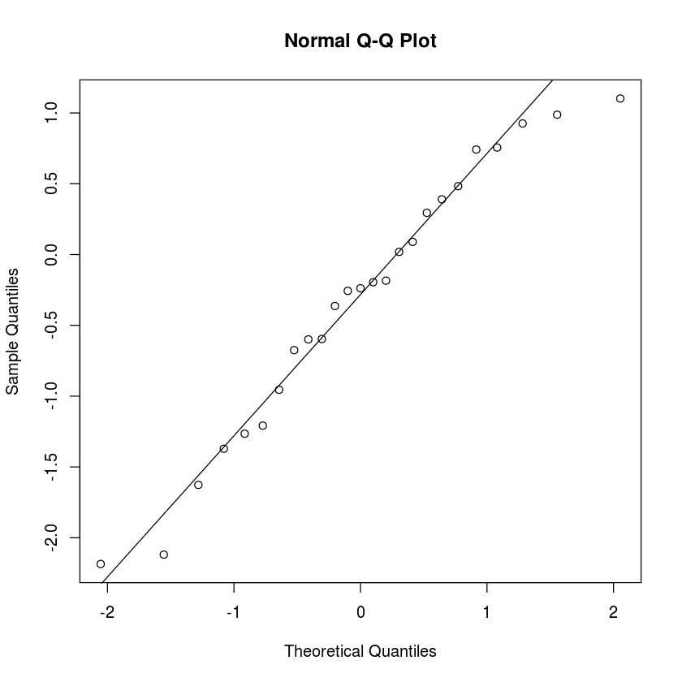


```R
library(car)
qqp(x,"norm")
```


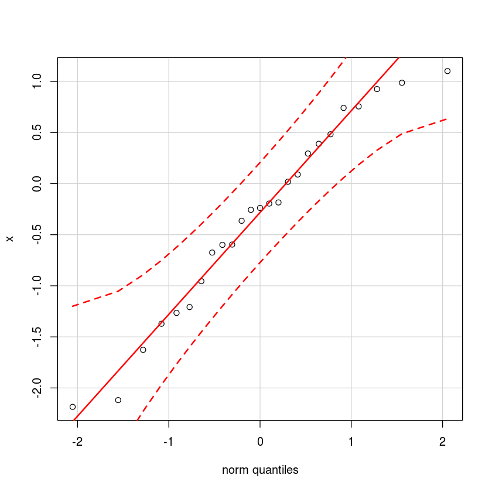


### Exercise:
##### Check the data distribution of the wine dataset. Start looking at a few variables.
##### [Advanced] 
##### Create a quantile plot comparing all the variables of the wine dataset. Hint: start building a matrix with the quantile of all the variables.


```R
nq<-100 #we decide in advance how many points of the distribution require to compute at the quantile distribution
qmat<-matrix(NA, ncol=ncol(wine)-1,nrow=nq) #we prepare the matrix where to store the computed quantiles

for(i in 2:ncol(wine)){
    qmat[,i-1]<-quantile(wine[,i],seq(0,1,length=nq))
}

colnames(qmat)<-names(wine)[-1]

my_line <- function(x,y,...){
    points(x,y,...)
    abline(a = 0,b = 1, col="red",lwd=2,...)
}


pairs(qmat, lower.panel = my_line, upper.panel = my_line)


```


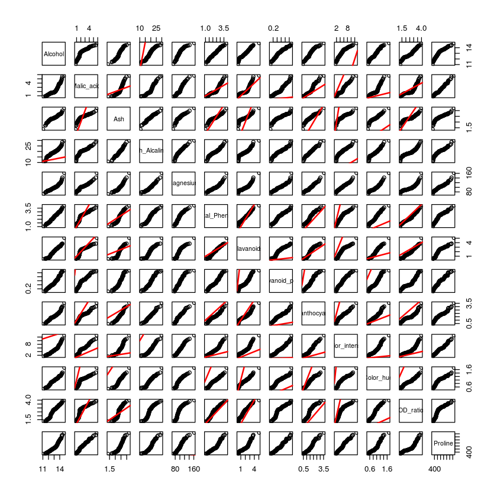


### Exercise:
##### [Advanced] In the data folder there is the file *"rnaseq_raw_sample.txt"*. Try to import it and check the first sample distribution. We know from state of the art rnaseq methods that rnaseq count data are negative binomial distributed. In R you can use the fitdistr of the MASS package for estimating the distribution parameters.


```R
#http://www.bioconductor.org/help/course-materials/2015/CSAMA2015/lect/L05-deseq2-anders.pdf

rnaseq<-read.table("data/rnaseq_raw_sample.txt", header=TRUE)
str(rnaseq)
head(rnaseq)
```

    'data.frame':	29970 obs. of  2 variables:
     $ ID        : Factor w/ 29970 levels "VIT_00s0120g00010",..: 2629 2630 2636 2639 2640 2641 2643 2644 2645 2646 ...
     $ SRR5227652: int  193 1016 2626 142 32 12 2 0 650 0 ...


<table>
<thead><tr><th scope=col>ID</th><th scope=col>SRR5227652</th></tr></thead>
<tbody>
	<tr><td>VIT_01s0010g00020</td><td> 193             </td></tr>
	<tr><td>VIT_01s0010g00060</td><td>1016             </td></tr>
	<tr><td>VIT_01s0010g00240</td><td>2626             </td></tr>
	<tr><td>VIT_01s0010g00330</td><td> 142             </td></tr>
	<tr><td>VIT_01s0010g00340</td><td>  32             </td></tr>
	<tr><td>VIT_01s0010g00360</td><td>  12             </td></tr>
</tbody>
</table>


```R
library(MASS)
dd<-fitdistr(rnaseq[[2]],densfun="negative binomial",lower=c(0,0))
hist(rnaseq[[2]],breaks=200,xlim=c(0,40000),freq=FALSE)
curve(dnbinom(x,size=dd$estimate[1],mu=dd$estimate[2]),add=TRUE, lwd=2, col="coral3")
```


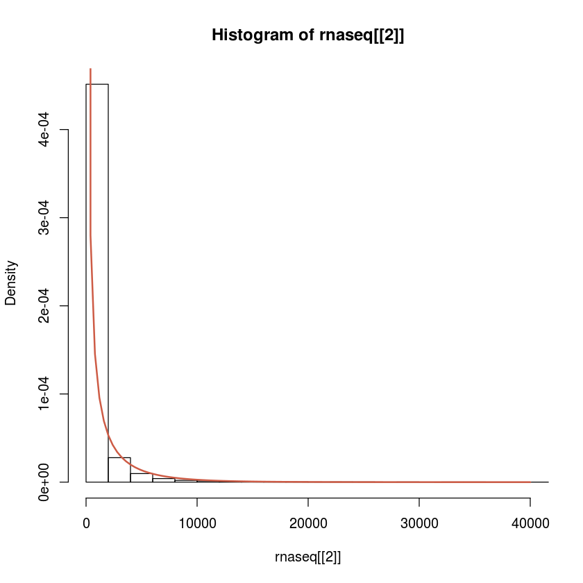


## Imputing: which effect?

We will now explore the effect of imputing missing values on the data distribution.


```R
#importing Rubus data
load("data/rubusNAsmall.RData") #dataset with missing values
load("data/rubusFilledSmall.RData") #complete dataset: a specific tool for metabolomics has been used for imputing (xcms::fillPeaks)
dim(rubusNAsmall)
dim(rubusFilledSmall)
#the original file contains >6,000 features (m/z,rt)
```


<ol class=list-inline>
	<li>26</li>
	<li>500</li>
</ol>


<ol class=list-inline>
	<li>26</li>
	<li>500</li>
</ol>


```R
#first we should explore the "distribution" of missing values among variables
#is it reliable to always impute?
summary(rubusNAsmall)
```


         59/896         59/2153         73/296          74/1501      
     Min.   :398.7   Min.   :1244   Min.   : 73.79   Min.   : 89.08  
     1st Qu.:510.0   1st Qu.:1374   1st Qu.: 86.41   1st Qu.:121.12  
     Median :559.2   Median :1505   Median : 99.02   Median :170.75  
     Mean   :593.4   Mean   :1505   Mean   : 91.63   Mean   :254.58  
     3rd Qu.:707.7   3rd Qu.:1635   3rd Qu.:100.54   3rd Qu.:362.00  
     Max.   :853.8   Max.   :1765   Max.   :102.07   Max.   :556.00  
                     NA's   :24     NA's   :23       NA's   :19      
        75/1315          81/1125          83/1512          85/1040     
     Min.   : 77.56   Min.   : 57.41   Min.   : 82.44   Min.   :295.4  
     1st Qu.: 93.95   1st Qu.: 58.33   1st Qu.: 83.18   1st Qu.:486.9  
     Median :122.68   Median : 64.87   Median :103.34   Median :565.7  
     Mean   :132.67   Mean   : 72.05   Mean   :119.28   Mean   :570.8  
     3rd Qu.:158.60   3rd Qu.: 64.87   3rd Qu.:163.01   3rd Qu.:664.0  
     Max.   :245.41   Max.   :114.78   Max.   :164.41   Max.   :871.0  
     NA's   :15       NA's   :21       NA's   :21       NA's   :10     
        85/1512          85/858          88/228          90/112     
     Min.   :156.4   Min.   :108.2   Min.   :54.96   Min.   :166.5  
     1st Qu.:193.0   1st Qu.:129.1   1st Qu.:57.99   1st Qu.:195.0  
     Median :229.6   Median :157.3   Median :61.01   Median :214.2  
     Mean   :420.2   Mean   :156.6   Mean   :61.01   Mean   :235.2  
     3rd Qu.:552.1   3rd Qu.:184.7   3rd Qu.:64.04   3rd Qu.:248.6  
     Max.   :874.5   Max.   :203.4   Max.   :67.07   Max.   :381.1  
     NA's   :23      NA's   :22      NA's   :24      NA's   :7      
         93/769          93/1332         95/1332          97/135      
     Min.   : 581.4   Min.   :159.3   Min.   :214.1   Min.   : 225.7  
     1st Qu.: 650.0   1st Qu.:195.8   1st Qu.:273.5   1st Qu.: 430.8  
     Median : 768.6   Median :245.0   Median :310.2   Median : 543.8  
     Mean   : 861.7   Mean   :246.4   Mean   :334.9   Mean   : 621.5  
     3rd Qu.: 967.4   3rd Qu.:288.8   3rd Qu.:397.3   3rd Qu.: 781.2  
     Max.   :1612.5   Max.   :360.4   Max.   :510.2   Max.   :1449.8  
                                                      NA's   :9       
        101/187        101/163          101/1364        102.1/79    
     Min.   : 649   Min.   : 486.0   Min.   :382.4   Min.   :88.66  
     1st Qu.:1207   1st Qu.: 724.7   1st Qu.:429.6   1st Qu.:89.81  
     Median :1472   Median : 973.5   Median :476.9   Median :90.96  
     Mean   :1585   Mean   :1033.2   Mean   :463.8   Mean   :90.96  
     3rd Qu.:1839   3rd Qu.:1196.1   3rd Qu.:504.6   3rd Qu.:92.10  
     Max.   :3671   Max.   :1841.9   Max.   :532.3   Max.   :93.25  
                    NA's   :10       NA's   :23      NA's   :24     
        105/1332         109/778          109/846         111/672       
     Min.   : 82.54   Min.   : 65.41   Min.   :156.4   Min.   :  95.47  
     1st Qu.:109.23   1st Qu.: 68.80   1st Qu.:158.1   1st Qu.: 296.87  
     Median :139.53   Median : 92.10   Median :175.5   Median : 477.26  
     Mean   :140.26   Mean   :102.66   Mean   :227.9   Mean   : 565.97  
     3rd Qu.:157.67   3rd Qu.:122.31   3rd Qu.:245.4   3rd Qu.: 567.53  
     Max.   :256.29   Max.   :164.71   Max.   :404.1   Max.   :2274.19  
     NA's   :1        NA's   :21       NA's   :22      NA's   :10       
        111/753          111/1511        115/1118        115.1/1600    
     Min.   : 54.20   Min.   :284.9   Min.   : 183.8   Min.   : 165.2  
     1st Qu.: 65.79   1st Qu.:318.0   1st Qu.: 302.0   1st Qu.: 179.2  
     Median : 77.38   Median :351.1   Median : 680.9   Median :1011.3  
     Mean   : 77.38   Mean   :351.1   Mean   : 648.3   Mean   :1277.1  
     3rd Qu.: 88.98   3rd Qu.:384.3   3rd Qu.:1008.0   3rd Qu.:2109.2  
     Max.   :100.57   Max.   :417.4   Max.   :1142.0   Max.   :2920.8  
     NA's   :24       NA's   :24                       NA's   :22      
        120/1326        121/108         123/1318         125/1511     
     Min.   :58.37   Min.   :43.72   Min.   : 77.77   Min.   : 549.7  
     1st Qu.:58.55   1st Qu.:49.80   1st Qu.:146.40   1st Qu.: 832.1  
     Median :58.72   Median :55.89   Median :160.86   Median :1595.7  
     Mean   :60.69   Mean   :55.89   Mean   :191.18   Mean   :1946.7  
     3rd Qu.:61.84   3rd Qu.:61.97   3rd Qu.:208.77   3rd Qu.:2841.7  
     Max.   :64.96   Max.   :68.05   Max.   :389.31   Max.   :5054.9  
     NA's   :23      NA's   :24      NA's   :19       NA's   :4       
        125/1332       125/917          126/1104        126/1007    
     Min.   :1027   Min.   : 361.4   Min.   :194.9   Min.   :113.5  
     1st Qu.:1463   1st Qu.: 613.9   1st Qu.:258.4   1st Qu.:122.7  
     Median :1733   Median : 852.2   Median :321.9   Median :132.0  
     Mean   :2328   Mean   : 843.0   Mean   :304.9   Mean   :132.0  
     3rd Qu.:2589   3rd Qu.:1060.6   3rd Qu.:359.9   3rd Qu.:141.2  
     Max.   :8366   Max.   :1394.4   Max.   :397.9   Max.   :150.5  
     NA's   :4      NA's   :9        NA's   :23      NA's   :24     
        127.1/76         128/208          129/70       130.1/1500   
     Min.   : 49.67   Min.   :132.1   Min.   :1591   Min.   :75.02  
     1st Qu.: 64.05   1st Qu.:240.8   1st Qu.:1760   1st Qu.:76.54  
     Median : 70.09   Median :295.6   Median :1810   Median :78.06  
     Mean   : 77.50   Mean   :289.9   Mean   :2000   Mean   :78.06  
     3rd Qu.: 83.99   3rd Qu.:322.7   3rd Qu.:1911   3rd Qu.:79.58  
     Max.   :118.12   Max.   :489.6   Max.   :3099   Max.   :81.09  
     NA's   :18       NA's   :1       NA's   :20     NA's   :24     
        135/1411         135/815         135/1193         136/615      
     Min.   : 309.0   Min.   :129.6   Min.   : 467.9   Min.   : 50.21  
     1st Qu.: 504.6   1st Qu.:168.0   1st Qu.: 692.0   1st Qu.: 74.29  
     Median : 570.2   Median :191.2   Median : 976.2   Median : 83.25  
     Mean   : 669.0   Mean   :211.6   Mean   :1771.5   Mean   : 81.57  
     3rd Qu.: 739.0   3rd Qu.:258.5   3rd Qu.:1553.7   3rd Qu.: 84.22  
     Max.   :1364.4   Max.   :307.3   Max.   :7170.7   Max.   :116.85  
     NA's   :4        NA's   :19                       NA's   :20      
        136/1290         137/136          137/1087         139/106      
     Min.   : 94.31   Min.   : 49.31   Min.   : 85.59   Min.   : 65.55  
     1st Qu.: 97.79   1st Qu.: 73.47   1st Qu.:140.57   1st Qu.:137.49  
     Median :120.98   Median : 79.40   Median :202.63   Median :272.15  
     Mean   :127.94   Mean   : 82.01   Mean   :190.49   Mean   :237.06  
     3rd Qu.:151.13   3rd Qu.: 88.03   3rd Qu.:252.55   3rd Qu.:320.65  
     Max.   :175.50   Max.   :138.22   Max.   :271.10   Max.   :394.54  
     NA's   :22       NA's   :12       NA's   :22       NA's   :17      
        139/721           141/93         141.1/207         143/208      
     Min.   : 71.34   Min.   : 66.92   Min.   : 53.01   Min.   : 90.46  
     1st Qu.:141.54   1st Qu.: 80.49   1st Qu.: 60.49   1st Qu.:193.79  
     Median :199.65   Median : 94.51   Median : 68.01   Median :281.13  
     Mean   :216.14   Mean   : 94.61   Mean   : 71.95   Mean   :278.99  
     3rd Qu.:235.41   3rd Qu.:102.88   3rd Qu.: 79.52   3rd Qu.:352.65  
     Max.   :486.07   Max.   :134.09   Max.   :102.58   Max.   :468.78  
     NA's   :15       NA's   :19       NA's   :19                       
        143/531         144/745         147/1307        147/199      
     Min.   :118.8   Min.   :52.29   Min.   :253.0   Min.   : 98.44  
     1st Qu.:134.6   1st Qu.:62.14   1st Qu.:285.8   1st Qu.:121.05  
     Median :190.4   Median :71.99   Median :318.7   Median :191.50  
     Mean   :215.4   Mean   :71.99   Mean   :341.9   Mean   :229.82  
     3rd Qu.:237.7   3rd Qu.:81.84   3rd Qu.:386.4   3rd Qu.:280.19  
     Max.   :460.3   Max.   :91.69   Max.   :454.1   Max.   :728.41  
     NA's   :18      NA's   :24      NA's   :23                      
        147/1304        147/1108         149/1281         149/1253      
     Min.   :147.1   Min.   : 72.69   Min.   : 88.75   Min.   :  92.49  
     1st Qu.:189.6   1st Qu.: 82.81   1st Qu.:116.88   1st Qu.: 240.46  
     Median :232.0   Median : 92.93   Median :556.30   Median : 411.15  
     Mean   :232.0   Mean   : 88.84   Mean   :444.02   Mean   : 889.27  
     3rd Qu.:274.4   3rd Qu.: 96.92   3rd Qu.:619.06   3rd Qu.:1543.10  
     Max.   :316.8   Max.   :100.91   Max.   :839.09   Max.   :2622.25  
     NA's   :24      NA's   :23       NA's   :21       NA's   :14       
        149/2032        149.1/1316        150/970          152/1511      
     Min.   : 82.67   Min.   : 194.7   Min.   : 62.56   Min.   :  84.24  
     1st Qu.:195.38   1st Qu.: 247.6   1st Qu.: 86.43   1st Qu.: 136.47  
     Median :319.75   Median : 315.4   Median : 94.05   Median : 360.61  
     Mean   :300.19   Mean   : 627.1   Mean   : 95.31   Mean   : 447.39  
     3rd Qu.:424.56   3rd Qu.: 871.0   3rd Qu.:103.65   3rd Qu.: 573.07  
     Max.   :478.59   Max.   :1966.6   Max.   :130.49   Max.   :1686.63  
     NA's   :22       NA's   :17       NA's   :20       NA's   :4        
        153/1484       157.1/1332        159/2170       159.1/1447   
     Min.   :192.1   Min.   : 61.40   Min.   :191.3   Min.   :59.41  
     1st Qu.:192.9   1st Qu.: 77.22   1st Qu.:202.6   1st Qu.:71.74  
     Median :193.7   Median : 84.55   Median :213.8   Median :77.68  
     Mean   :193.7   Mean   : 82.40   Mean   :213.8   Mean   :75.79  
     3rd Qu.:194.5   3rd Qu.: 89.52   3rd Qu.:225.1   3rd Qu.:81.73  
     Max.   :195.3   Max.   :105.04   Max.   :236.3   Max.   :88.39  
     NA's   :24      NA's   :15       NA's   :24      NA's   :22     
         160/63          161/376         161/2167         162/1039     
     Min.   : 942.2   Min.   :168.4   Min.   : 996.8   Min.   : 72.86  
     1st Qu.:1095.6   1st Qu.:243.9   1st Qu.:1157.9   1st Qu.:154.07  
     Median :1166.4   Median :245.1   Median :1319.0   Median :223.99  
     Mean   :1165.1   Mean   :312.7   Mean   :1319.0   Mean   :249.40  
     3rd Qu.:1230.6   3rd Qu.:384.4   3rd Qu.:1480.1   3rd Qu.:338.91  
     Max.   :1369.8   Max.   :521.6   Max.   :1641.1   Max.   :531.36  
                      NA's   :21      NA's   :24       NA's   :3       
       163.1/1165       163/878         165.1/1489        166/1318      
     Min.   : 60.5   Min.   : 95.82   Min.   : 502.4   Min.   :  66.73  
     1st Qu.:132.9   1st Qu.:139.54   1st Qu.: 586.8   1st Qu.: 639.90  
     Median :229.4   Median :149.66   Median : 685.7   Median : 830.50  
     Mean   :243.2   Mean   :148.45   Mean   : 863.5   Mean   : 988.58  
     3rd Qu.:308.1   3rd Qu.:164.11   3rd Qu.:1146.8   3rd Qu.:1160.54  
     Max.   :530.5   Max.   :193.11   Max.   :1668.8   Max.   :2277.17  
     NA's   :19      NA's   :21       NA's   :16       NA's   :12       
        166/1238        166/1258         167/1318         167.1/1396     
     Min.   :184.3   Min.   : 390.7   Min.   :  82.02   Min.   :  88.98  
     1st Qu.:216.0   1st Qu.: 504.4   1st Qu.: 136.10   1st Qu.: 199.56  
     Median :253.4   Median : 618.0   Median : 499.76   Median : 320.16  
     Mean   :299.7   Mean   : 705.5   Mean   : 594.94   Mean   : 432.44  
     3rd Qu.:261.9   3rd Qu.: 862.8   3rd Qu.: 886.62   3rd Qu.: 496.92  
     Max.   :582.8   Max.   :1107.6   Max.   :2160.63   Max.   :1265.72  
     NA's   :21      NA's   :23       NA's   :3         NA's   :17       
        168/869          173/139         175/1117         175/919      
     Min.   : 39.20   Min.   :114.6   Min.   : 522.6   Min.   : 77.74  
     1st Qu.: 68.99   1st Qu.:166.9   1st Qu.: 823.9   1st Qu.:315.48  
     Median : 79.03   Median :192.8   Median :1708.4   Median :362.41  
     Mean   : 79.08   Mean   :241.2   Mean   :1787.2   Mean   :363.13  
     3rd Qu.: 91.63   3rd Qu.:345.5   3rd Qu.:2666.4   3rd Qu.:456.40  
     Max.   :107.99   Max.   :409.3   Max.   :3606.2   Max.   :563.66  
     NA's   :18       NA's   :17                       NA's   :14      
        175/1007         176/1319        177/1118        177/821      
     Min.   : 94.33   Min.   :252.5   Min.   :239.1   Min.   : 43.26  
     1st Qu.:111.41   1st Qu.:253.5   1st Qu.:323.4   1st Qu.: 62.54  
     Median :145.07   Median :254.0   Median :353.8   Median : 94.40  
     Mean   :151.22   Mean   :298.4   Mean   :352.5   Mean   : 87.27  
     3rd Qu.:182.75   3rd Qu.:277.7   3rd Qu.:368.2   3rd Qu.: 98.64  
     Max.   :230.81   Max.   :454.1   Max.   :585.5   Max.   :137.50  
     NA's   :19       NA's   :21      NA's   :12      NA's   :21      
        179/1743        179.1/169        179/584        179.1/2270    
     Min.   : 125.7   Min.   :132.8   Min.   :106.3   Min.   : 872.3  
     1st Qu.: 410.4   1st Qu.:359.1   1st Qu.:110.1   1st Qu.:1115.6  
     Median : 639.4   Median :468.4   Median :113.9   Median :1358.9  
     Mean   :1147.5   Mean   :445.0   Mean   :141.5   Mean   :1358.9  
     3rd Qu.:2175.2   3rd Qu.:539.5   3rd Qu.:159.0   3rd Qu.:1602.3  
     Max.   :2831.5   Max.   :716.7   Max.   :204.2   Max.   :1845.6  
     NA's   :6        NA's   :19      NA's   :23      NA's   :24      
       180.1/372        181/1092        181.1/1453       187.1/2189   
     Min.   :110.0   Min.   : 50.10   Min.   : 84.39   Min.   :180.9  
     1st Qu.:192.2   1st Qu.: 70.41   1st Qu.: 97.13   1st Qu.:290.9  
     Median :266.6   Median : 93.80   Median :112.78   Median :431.0  
     Mean   :284.9   Mean   : 91.88   Mean   :117.22   Mean   :473.3  
     3rd Qu.:318.3   3rd Qu.: 99.43   3rd Qu.:134.89   3rd Qu.:535.7  
     Max.   :574.5   Max.   :145.66   Max.   :159.32   Max.   :946.0  
     NA's   :6       NA's   :21       NA's   :19       NA's   :16     
       187.1/1879        191/229          191/1317       191.1/1470   
     Min.   : 227.1   Min.   : 475.3   Min.   :156.3   Min.   :125.6  
     1st Qu.: 265.8   1st Qu.: 596.4   1st Qu.:206.0   1st Qu.:279.6  
     Median : 714.9   Median : 745.4   Median :255.6   Median :314.8  
     Mean   : 715.1   Mean   : 819.4   Mean   :281.6   Mean   :381.6  
     3rd Qu.:1164.1   3rd Qu.: 994.9   3rd Qu.:344.2   3rd Qu.:462.7  
     Max.   :1203.4   Max.   :1607.3   Max.   :432.8   Max.   :725.1  
     NA's   :22       NA's   :1        NA's   :23      NA's   :21     
        192/1319         192/1238        193/1318        193/583     
     Min.   : 447.3   Min.   :323.2   Min.   :112.1   Min.   :40.16  
     1st Qu.: 623.4   1st Qu.:375.7   1st Qu.:246.8   1st Qu.:59.92  
     Median : 701.2   Median :458.8   Median :343.7   Median :70.58  
     Mean   : 745.0   Mean   :461.8   Mean   :319.4   Mean   :65.20  
     3rd Qu.: 892.2   3rd Qu.:536.3   3rd Qu.:362.4   3rd Qu.:75.86  
     Max.   :1217.7   Max.   :620.2   Max.   :501.2   Max.   :79.50  
     NA's   :13       NA's   :20      NA's   :13      NA's   :22     
       195.1/1376       199/1318         201/777           201/94      
     Min.   :257.5   Min.   : 128.3   Min.   : 51.25   Min.   : 92.52  
     1st Qu.:272.6   1st Qu.: 523.1   1st Qu.: 59.03   1st Qu.:120.86  
     Median :292.7   Median : 779.3   Median : 72.95   Median :149.20  
     Mean   :319.0   Mean   :1015.0   Mean   : 83.71   Mean   :137.85  
     3rd Qu.:339.2   3rd Qu.:1083.0   3rd Qu.:105.27   3rd Qu.:160.51  
     Max.   :433.1   Max.   :3827.3   Max.   :117.38   Max.   :171.82  
     NA's   :22      NA's   :13       NA's   :17       NA's   :23      
       203.1/1332      204.1/1499       205.1/1346      208.1/1053    
     Min.   :200.7   Min.   : 69.94   Min.   :182.1   Min.   : 87.96  
     1st Qu.:274.6   1st Qu.:141.94   1st Qu.:214.2   1st Qu.:119.27  
     Median :321.8   Median :213.94   Median :246.4   Median :150.58  
     Mean   :344.8   Mean   :186.25   Mean   :246.4   Mean   :181.01  
     3rd Qu.:419.3   3rd Qu.:244.41   3rd Qu.:278.5   3rd Qu.:227.54  
     Max.   :581.6   Max.   :274.87   Max.   :310.7   Max.   :304.51  
                     NA's   :23       NA's   :24      NA's   :23      
       210.1/583        217.1/1318       217.1/1238      217.1/1375   
     Min.   : 56.53   Min.   : 501.6   Min.   :340.0   Min.   :40.22  
     1st Qu.: 88.44   1st Qu.: 641.4   1st Qu.:362.5   1st Qu.:49.83  
     Median :111.43   Median : 829.6   Median :384.9   Median :59.44  
     Mean   :116.52   Mean   : 963.0   Mean   :384.9   Mean   :59.44  
     3rd Qu.:124.48   3rd Qu.:1066.6   3rd Qu.:407.4   3rd Qu.:69.04  
     Max.   :221.83   Max.   :2250.2   Max.   :429.9   Max.   :78.65  
     NA's   :19       NA's   :13       NA's   :24      NA's   :24     
        218.1/96         219.1/96        221/1319         221/88      
     Min.   : 53.98   Min.   :116.7   Min.   :154.3   Min.   : 93.69  
     1st Qu.: 96.74   1st Qu.:168.1   1st Qu.:253.3   1st Qu.:132.46  
     Median :101.84   Median :244.4   Median :346.2   Median :176.59  
     Mean   :130.69   Mean   :253.1   Mean   :363.9   Mean   :160.43  
     3rd Qu.:164.50   3rd Qu.:299.5   3rd Qu.:508.8   3rd Qu.:194.79  
     Max.   :269.31   Max.   :516.5   Max.   :540.5   Max.   :214.75  
     NA's   :9        NA's   :1       NA's   :15      NA's   :17      
        221/1451       223.1/1372      223.1/2082       225.1/1012   
     Min.   :102.2   Min.   :120.8   Min.   : 215.6   Min.   :67.82  
     1st Qu.:133.0   1st Qu.:161.9   1st Qu.:1083.8   1st Qu.:71.60  
     Median :175.7   Median :272.1   Median :1951.9   Median :75.39  
     Mean   :161.7   Mean   :318.5   Mean   :2494.4   Mean   :72.99  
     3rd Qu.:188.2   3rd Qu.:413.4   3rd Qu.:3633.8   3rd Qu.:75.58  
     Max.   :205.7   Max.   :970.5   Max.   :5315.7   Max.   :75.76  
     NA's   :20                      NA's   :23       NA's   :23     
       227.1/1201       229.1/1202       231/1254       241.1/1320    
     Min.   : 88.21   Min.   :100.6   Min.   :117.0   Min.   : 301.5  
     1st Qu.:183.05   1st Qu.:146.2   1st Qu.:126.2   1st Qu.:1459.0  
     Median :221.41   Median :177.3   Median :164.3   Median :1903.4  
     Mean   :215.41   Mean   :189.7   Mean   :186.1   Mean   :2589.4  
     3rd Qu.:243.95   3rd Qu.:239.8   3rd Qu.:212.7   3rd Qu.:2726.0  
     Max.   :325.68   Max.   :290.5   Max.   :328.4   Max.   :9632.6  
     NA's   :9        NA's   :8       NA's   :20      NA's   :10      
       241.1/1239       241.1/1297       241.1/1258      243/917     
     Min.   : 561.3   Min.   : 908.9   Min.   : 795   Min.   : 78.1  
     1st Qu.: 739.2   1st Qu.:1367.5   1st Qu.:1342   1st Qu.:169.6  
     Median : 943.2   Median :1591.6   Median :2098   Median :266.0  
     Mean   : 967.3   Mean   :1994.9   Mean   :1960   Mean   :261.8  
     3rd Qu.:1216.8   3rd Qu.:2610.4   3rd Qu.:2612   3rd Qu.:334.0  
     Max.   :1445.9   Max.   :3821.4   Max.   :2896   Max.   :422.6  
     NA's   :17       NA's   :16       NA's   :20     NA's   :12     
        243/1318         244/1826        245.1/1007       249/992     
     Min.   : 353.2   Min.   : 54.47   Min.   :126.0   Min.   :130.0  
     1st Qu.: 424.6   1st Qu.:124.23   1st Qu.:176.0   1st Qu.:142.1  
     Median : 489.5   Median :131.24   Median :221.2   Median :154.1  
     Mean   : 622.3   Mean   :126.54   Mean   :251.6   Mean   :154.1  
     3rd Qu.: 636.9   3rd Qu.:147.72   3rd Qu.:288.6   3rd Qu.:166.2  
     Max.   :1332.7   Max.   :175.02   Max.   :657.3   Max.   :178.2  
     NA's   :16       NA's   :21       NA's   :2       NA's   :24     
        249/621          249.1/96       253.1/1373       254.1/791    
     Min.   : 65.24   Min.   :54.27   Min.   : 94.15   Min.   :137.8  
     1st Qu.: 74.86   1st Qu.:55.74   1st Qu.:100.44   1st Qu.:138.8  
     Median : 89.48   Median :57.22   Median :123.50   Median :139.9  
     Mean   :103.67   Mean   :56.72   Mean   :225.73   Mean   :139.9  
     3rd Qu.:119.36   3rd Qu.:57.95   3rd Qu.:204.05   3rd Qu.:140.9  
     Max.   :200.69   Max.   :58.68   Max.   :606.52   Max.   :141.9  
     NA's   :13       NA's   :23      NA's   :21       NA's   :24     
        256/1104        256/1310         257/1339         259/87      
     Min.   :255.9   Min.   : 612.4   Min.   :273.1   Min.   : 83.64  
     1st Qu.:317.9   1st Qu.: 745.9   1st Qu.:275.6   1st Qu.:129.02  
     Median :353.2   Median : 879.3   Median :317.2   Median :160.62  
     Mean   :362.7   Mean   : 866.5   Mean   :329.6   Mean   :167.73  
     3rd Qu.:386.3   3rd Qu.: 993.6   3rd Qu.:371.2   3rd Qu.:214.01  
     Max.   :506.5   Max.   :1107.8   Max.   :410.8   Max.   :254.86  
     NA's   :17      NA's   :23       NA's   :22      NA's   :12      
       259.1/1511       259.1/1226        261/1166        261/917     
     Min.   : 94.39   Min.   : 48.84   Min.   :207.2   Min.   :126.2  
     1st Qu.:168.32   1st Qu.: 95.64   1st Qu.:321.2   1st Qu.:217.1  
     Median :245.63   Median :109.26   Median :435.2   Median :383.0  
     Mean   :310.85   Mean   :119.25   Mean   :435.2   Mean   :349.0  
     3rd Qu.:387.99   3rd Qu.:138.40   3rd Qu.:549.2   3rd Qu.:395.1  
     Max.   :897.43   Max.   :203.49   Max.   :663.2   Max.   :560.0  
     NA's   :12       NA's   :7        NA's   :24      NA's   :13     
       263.1/178         267.1/97         268/1367         268/1426     
     Min.   : 77.74   Min.   : 375.4   Min.   : 705.1   Min.   : 283.2  
     1st Qu.: 82.78   1st Qu.:1040.5   1st Qu.:1017.0   1st Qu.: 318.3  
     Median : 92.91   Median :1603.7   Median :1329.0   Median : 353.4  
     Mean   :133.95   Mean   :1541.5   Mean   :1260.4   Mean   : 585.2  
     3rd Qu.:100.96   3rd Qu.:2102.2   3rd Qu.:1538.0   3rd Qu.: 736.2  
     Max.   :315.34   Max.   :2644.3   Max.   :1747.0   Max.   :1119.1  
     NA's   :21       NA's   :3        NA's   :23       NA's   :23      
        269/1355          269/1107        270/1257         270/1339    
     Min.   :  94.54   Min.   :221.6   Min.   : 99.64   Min.   : 99.4  
     1st Qu.: 150.46   1st Qu.:254.4   1st Qu.:135.08   1st Qu.:202.3  
     Median : 501.40   Median :272.5   Median :208.66   Median :252.7  
     Mean   : 770.80   Mean   :338.0   Mean   :260.43   Mean   :226.8  
     3rd Qu.: 889.89   3rd Qu.:373.7   3rd Qu.:249.73   3rd Qu.:277.2  
     Max.   :3658.09   Max.   :589.2   Max.   :745.12   Max.   :302.3  
     NA's   :13        NA's   :18      NA's   :19       NA's   :22     
        273/126         274.1/100       274.1/1284        275/526      
     Min.   : 123.7   Min.   :54.04   Min.   : 59.45   Min.   : 53.81  
     1st Qu.: 165.6   1st Qu.:57.08   1st Qu.: 73.69   1st Qu.: 66.96  
     Median : 317.2   Median :70.17   Median : 87.92   Median : 80.11  
     Mean   : 379.5   Mean   :71.63   Mean   : 87.92   Mean   : 99.49  
     3rd Qu.: 519.3   3rd Qu.:84.72   3rd Qu.:102.15   3rd Qu.:122.33  
     Max.   :1170.0   Max.   :92.12   Max.   :116.38   Max.   :164.56  
     NA's   :13       NA's   :22      NA's   :24       NA's   :23      
       275.1/1511       278.1/1114        283/1238        283/1304   
     Min.   : 48.11   Min.   : 87.07   Min.   :333.0   Min.   :1100  
     1st Qu.:172.80   1st Qu.:113.61   1st Qu.:357.5   1st Qu.:1368  
     Median :258.02   Median :140.15   Median :430.5   Median :2212  
     Mean   :322.02   Mean   :127.41   Mean   :454.0   Mean   :3048  
     3rd Qu.:400.95   3rd Qu.:147.58   3rd Qu.:500.1   3rd Qu.:3891  
     Max.   :937.99   Max.   :155.01   Max.   :673.8   Max.   :6668  
     NA's   :10       NA's   :23       NA's   :20      NA's   :22    
        283/1259       283.1/1119      283.1/1174        284/1258       
     Min.   :651.5   Min.   :45.03   Min.   : 84.24   Min.   :   61.51  
     1st Qu.:695.8   1st Qu.:58.01   1st Qu.: 99.76   1st Qu.:10167.78  
     Median :740.1   Median :70.99   Median :163.67   Median :20199.26  
     Mean   :740.1   Mean   :70.99   Mean   :247.90   Mean   :23500.41  
     3rd Qu.:784.4   3rd Qu.:83.98   3rd Qu.:322.81   3rd Qu.:29155.94  
     Max.   :828.7   Max.   :96.96   Max.   :649.02   Max.   :93411.42  
     NA's   :24      NA's   :24      NA's   :13       NA's   :8         
        284/1238        284/1303        284/1423         284/1406     
     Min.   : 5469   Min.   : 2734   Min.   : 611.8   Min.   : 617.9  
     1st Qu.: 8274   1st Qu.: 8762   1st Qu.:1000.0   1st Qu.: 834.7  
     Median :14126   Median :10613   Median :2206.1   Median :1097.2  
     Mean   :12627   Mean   :13211   Mean   :2171.3   Mean   :1225.7  
     3rd Qu.:15458   3rd Qu.:15403   3rd Qu.:2705.8   3rd Qu.:1344.2  
     Max.   :21619   Max.   :33636   Max.   :5133.7   Max.   :2757.8  
     NA's   :14      NA's   :12      NA's   :16       NA's   :17      
        284/1212       284/1509          284/696         284/1843     
     Min.   :1054   Min.   :  81.88   Min.   :82.85   Min.   : 858.2  
     1st Qu.:1358   1st Qu.:  92.56   1st Qu.:83.07   1st Qu.:1036.0  
     Median :1601   Median : 163.38   Median :83.29   Median :1213.8  
     Mean   :1593   Mean   :1114.32   Mean   :83.29   Mean   :1115.4  
     3rd Qu.:1674   3rd Qu.:2307.68   3rd Qu.:83.51   3rd Qu.:1243.9  
     Max.   :2329   Max.   :2926.07   Max.   :83.72   Max.   :1274.1  
     NA's   :20     NA's   :21        NA's   :24      NA's   :23      
       284.1/1175       285/1261           285/1238       285/1351    
     Min.   :59.02   Min.   :   51.22   Min.   :2397   Min.   : 2055  
     1st Qu.:64.32   1st Qu.: 1158.44   1st Qu.:5141   1st Qu.: 6714  
     Median :69.62   Median : 9875.25   Median :6020   Median :13422  
     Mean   :74.27   Mean   :11271.91   Mean   :5648   Mean   :27394  
     3rd Qu.:81.90   3rd Qu.:14877.37   3rd Qu.:6447   3rd Qu.:52653  
     Max.   :94.17   Max.   :39855.22   Max.   :7383   Max.   :66109  
     NA's   :23      NA's   :8          NA's   :17     NA's   :17     
        285/1318          285/1298         285.1/1643        286/1257     
     Min.   :  408.8   Min.   :  595.3   Min.   : 69.87   Min.   : 138.7  
     1st Qu.: 1335.7   1st Qu.: 5321.6   1st Qu.: 92.94   1st Qu.: 757.2  
     Median : 7804.9   Median : 8156.6   Median :113.64   Median :1746.7  
     Mean   : 6443.5   Mean   : 8602.5   Mean   :113.59   Mean   :2046.8  
     3rd Qu.: 8822.0   3rd Qu.:10697.8   3rd Qu.:129.41   3rd Qu.:2928.3  
     Max.   :12600.2   Max.   :27023.6   Max.   :166.93   Max.   :5761.7  
     NA's   :10        NA's   :12        NA's   :19       NA's   :8       
        286/1318       286/1298         286/1355       286/1077    
     Min.   :1055   Min.   : 452.4   Min.   :1008   Min.   :173.2  
     1st Qu.:1274   1st Qu.:1458.1   1st Qu.:1189   1st Qu.:177.9  
     Median :1559   Median :1935.0   Median :1487   Median :184.2  
     Mean   :1616   Mean   :2196.9   Mean   :1766   Mean   :205.2  
     3rd Qu.:1800   3rd Qu.:2351.7   3rd Qu.:2156   3rd Qu.:209.8  
     Max.   :2537   Max.   :4588.9   Max.   :3145   Max.   :280.7  
     NA's   :15     NA's   :17       NA's   :20     NA's   :21     
       287.1/917        287.1/1355       287.1/1031      296.1/1642   
     Min.   : 129.2   Min.   : 803.6   Min.   :579.2   Min.   :133.3  
     1st Qu.: 284.6   1st Qu.: 820.0   1st Qu.:582.3   1st Qu.:134.0  
     Median : 834.6   Median : 827.3   Median :585.3   Median :134.7  
     Mean   : 749.7   Mean   :1134.8   Mean   :584.0   Mean   :134.7  
     3rd Qu.:1083.2   3rd Qu.:1142.0   3rd Qu.:586.4   3rd Qu.:135.4  
     Max.   :1615.8   Max.   :2080.9   Max.   :587.5   Max.   :136.0  
     NA's   :7        NA's   :22       NA's   :23      NA's   :24     
       297.2/2561      299.1/1239       299.1/769        299.1/1360    
     Min.   :204.6   Min.   : 408.6   Min.   : 49.35   Min.   : 81.32  
     1st Qu.:229.2   1st Qu.: 720.1   1st Qu.: 73.20   1st Qu.:121.34  
     Median :253.7   Median : 831.4   Median : 93.15   Median :161.36  
     Mean   :253.7   Mean   : 864.2   Mean   :108.40   Mean   :146.44  
     3rd Qu.:278.3   3rd Qu.:1023.5   3rd Qu.:135.96   3rd Qu.:179.00  
     Max.   :302.9   Max.   :1343.3   Max.   :205.54   Max.   :196.65  
     NA's   :24      NA's   :20       NA's   :8        NA's   :23      
        300/1005        300.1/1270        301/1092         301/2160     
     Min.   : 259.0   Min.   : 66.55   Min.   : 473.9   Min.   : 801.8  
     1st Qu.: 404.7   1st Qu.:121.33   1st Qu.: 824.7   1st Qu.: 949.7  
     Median : 567.2   Median :153.78   Median :1635.2   Median :1587.5  
     Mean   : 592.2   Mean   :209.02   Mean   :1682.5   Mean   :1597.3  
     3rd Qu.: 678.8   3rd Qu.:257.02   3rd Qu.:2204.6   3rd Qu.:1979.6  
     Max.   :1124.3   Max.   :517.57   Max.   :4960.6   Max.   :3651.5  
     NA's   :7        NA's   :15       NA's   :7        NA's   :12      
        302/1245       302/216          302/1092       306.1/208     
     Min.   :1715   Min.   : 64.44   Min.   :193.1   Min.   : 494.1  
     1st Qu.:2362   1st Qu.: 99.71   1st Qu.:257.2   1st Qu.: 941.0  
     Median :3156   Median :123.14   Median :333.7   Median :1106.1  
     Mean   :3374   Mean   :130.45   Mean   :349.4   Mean   :1247.1  
     3rd Qu.:4194   3rd Qu.:174.75   3rd Qu.:383.2   3rd Qu.:1653.4  
     Max.   :7004   Max.   :207.19   Max.   :754.2   Max.   :1983.8  
                    NA's   :9        NA's   :15                      
        309/1260         309/1239       311.1/1236       311.1/1258   
     Min.   : 451.2   Min.   :292.5   Min.   : 71.29   Min.   :569.8  
     1st Qu.: 566.7   1st Qu.:371.5   1st Qu.: 78.96   1st Qu.:577.8  
     Median : 714.1   Median :438.8   Median :112.42   Median :585.9  
     Mean   : 992.1   Mean   :402.3   Mean   :237.30   Mean   :639.7  
     3rd Qu.:1139.5   3rd Qu.:445.1   3rd Qu.:384.74   3rd Qu.:674.7  
     Max.   :2089.2   Max.   :452.0   Max.   :549.96   Max.   :763.5  
     NA's   :22       NA's   :19      NA's   :19       NA's   :23     
       315.1/1311        316/1894         319/1485         322/108     
     Min.   : 82.77   Min.   : 168.5   Min.   : 91.94   Min.   :79.26  
     1st Qu.: 91.61   1st Qu.: 323.1   1st Qu.:128.58   1st Qu.:79.55  
     Median :118.54   Median : 436.4   Median :165.21   Median :79.84  
     Mean   :167.39   Mean   : 541.0   Mean   :143.74   Mean   :79.84  
     3rd Qu.:209.45   3rd Qu.: 711.1   3rd Qu.:169.64   3rd Qu.:80.13  
     Max.   :334.56   Max.   :1337.2   Max.   :174.07   Max.   :80.42  
     NA's   :21       NA's   :6        NA's   :23       NA's   :24     
        323/170          323/108       325.1/1176       326.1/1768   
     Min.   : 329.0   Min.   : 645   Min.   : 140.2   Min.   :230.4  
     1st Qu.: 942.5   1st Qu.:1602   1st Qu.: 212.7   1st Qu.:272.6  
     Median :1409.8   Median :2130   Median : 405.4   Median :314.9  
     Mean   :1645.9   Mean   :2789   Mean   : 474.2   Mean   :314.9  
     3rd Qu.:2321.8   3rd Qu.:3005   3rd Qu.: 593.2   3rd Qu.:357.1  
     Max.   :4442.9   Max.   :7550   Max.   :1286.1   Max.   :399.4  
                                     NA's   :5        NA's   :24     
       327.1/1118       329.1/1667      331.1/1201       333/1303     
     Min.   : 78.17   Min.   :275.2   Min.   : 44.4   Min.   : 82.29  
     1st Qu.:158.57   1st Qu.:440.0   1st Qu.:105.3   1st Qu.: 97.40  
     Median :284.31   Median :462.8   Median :177.4   Median :103.62  
     Mean   :278.30   Mean   :510.9   Mean   :145.9   Mean   :124.00  
     3rd Qu.:395.65   3rd Qu.:557.5   3rd Qu.:189.6   3rd Qu.:113.41  
     Max.   :522.97   Max.   :843.5   Max.   :201.3   Max.   :223.26  
     NA's   :5        NA's   :19      NA's   :20      NA's   :21      
        333/1239       339.1/1422      339.1/1259     339.1/1238    
     Min.   : 74.0   Min.   :118.8   Min.   :1090   Min.   : 603.3  
     1st Qu.: 84.7   1st Qu.:277.3   1st Qu.:2291   1st Qu.:1221.6  
     Median : 95.4   Median :505.7   Median :3330   Median :1274.4  
     Mean   :211.0   Mean   :532.2   Mean   :3100   Mean   :1305.9  
     3rd Qu.:279.4   3rd Qu.:817.8   3rd Qu.:3772   3rd Qu.:1329.4  
     Max.   :463.5   Max.   :964.0   Max.   :5119   Max.   :2127.5  
     NA's   :23      NA's   :14      NA's   :17     NA's   :16      
       340.1/1423      340.1/1296       340.1/1246       345.1/1118    
     Min.   :108.4   Min.   : 527.9   Min.   : 329.5   Min.   : 67.61  
     1st Qu.:128.4   1st Qu.: 595.0   1st Qu.: 503.2   1st Qu.:126.07  
     Median :162.5   Median : 662.2   Median : 676.9   Median :229.07  
     Mean   :168.2   Mean   :1248.3   Mean   : 764.0   Mean   :229.54  
     3rd Qu.:209.6   3rd Qu.:1608.4   3rd Qu.: 981.2   3rd Qu.:342.68  
     Max.   :226.0   Max.   :2554.7   Max.   :1285.6   Max.   :414.54  
     NA's   :18      NA's   :23       NA's   :23       NA's   :8       
       351.1/1238      351.1/1259       351.1/1200      354.1/1627   
     Min.   :125.7   Min.   : 102.1   Min.   :211.2   Min.   :101.9  
     1st Qu.:268.1   1st Qu.: 485.6   1st Qu.:336.9   1st Qu.:111.8  
     Median :395.5   Median : 777.2   Median :468.7   Median :121.8  
     Mean   :400.4   Mean   : 836.1   Mean   :496.3   Mean   :121.8  
     3rd Qu.:504.0   3rd Qu.: 947.1   3rd Qu.:657.5   3rd Qu.:131.7  
     Max.   :756.4   Max.   :2134.6   Max.   :850.0   Max.   :141.7  
     NA's   :14      NA's   :14                       NA's   :24     
       358.1/1630       365.1/1429       368.1/857       377.2/2559   
     Min.   : 68.69   Min.   : 73.23   Min.   :117.8   Min.   :330.0  
     1st Qu.:106.36   1st Qu.:110.40   1st Qu.:265.4   1st Qu.:369.5  
     Median :164.14   Median :118.78   Median :380.4   Median :415.8  
     Mean   :192.53   Mean   :198.53   Mean   :385.5   Mean   :518.3  
     3rd Qu.:248.48   3rd Qu.:290.99   3rd Qu.:461.5   3rd Qu.:643.4  
     Max.   :433.38   Max.   :394.92   Max.   :880.8   Max.   :856.9  
     NA's   :15       NA's   :19                       NA's   :19     
       379.2/2279      381.1/197       381.1/371        381.1/1103   
     Min.   :182.2   Min.   :121.3   Min.   : 99.98   Min.   :232.9  
     1st Qu.:199.5   1st Qu.:126.7   1st Qu.:160.08   1st Qu.:282.8  
     Median :216.8   Median :132.1   Median :183.37   Median :402.0  
     Mean   :216.8   Mean   :225.7   Mean   :221.71   Mean   :385.9  
     3rd Qu.:234.0   3rd Qu.:277.9   3rd Qu.:302.16   3rd Qu.:464.8  
     Max.   :251.3   Max.   :423.7   Max.   :386.94   Max.   :549.9  
     NA's   :24      NA's   :23      NA's   :15       NA's   :20     
       385.2/1945       387.1/1708       397.1/696       397.1/1261    
     Min.   : 84.47   Min.   : 80.27   Min.   :68.00   Min.   : 75.42  
     1st Qu.: 94.35   1st Qu.:100.29   1st Qu.:68.75   1st Qu.:122.61  
     Median :104.24   Median :115.55   Median :69.51   Median :179.61  
     Mean   :104.24   Mean   :113.07   Mean   :69.51   Mean   :163.20  
     3rd Qu.:114.12   3rd Qu.:128.32   3rd Qu.:70.26   3rd Qu.:195.22  
     Max.   :124.00   Max.   :140.90   Max.   :71.01   Max.   :251.73  
     NA's   :24       NA's   :22       NA's   :24      NA's   :19      
       405.1/917        407.1/96         408/398         409.1/1235    
     Min.   :110.0   Min.   : 74.23   Min.   : 92.08   Min.   : 53.10  
     1st Qu.:235.4   1st Qu.:159.04   1st Qu.:143.41   1st Qu.: 90.23  
     Median :272.4   Median :243.84   Median :194.74   Median :112.59  
     Mean   :270.8   Mean   :243.84   Mean   :194.74   Mean   :125.11  
     3rd Qu.:311.1   3rd Qu.:328.64   3rd Qu.:246.08   3rd Qu.:158.80  
     Max.   :448.7   Max.   :413.44   Max.   :297.41   Max.   :243.23  
     NA's   :13      NA's   :24       NA's   :24       NA's   :14      
       411.1/1133        416.8/69       417.1/1183       419.9/63     
     Min.   : 88.60   Min.   :52.51   Min.   :196.5   Min.   : 82.21  
     1st Qu.: 98.64   1st Qu.:54.50   1st Qu.:257.7   1st Qu.:106.97  
     Median :137.41   Median :56.49   Median :293.4   Median :118.24  
     Mean   :136.13   Mean   :63.46   Mean   :334.2   Mean   :121.00  
     3rd Qu.:174.90   3rd Qu.:68.93   3rd Qu.:354.6   3rd Qu.:135.06  
     Max.   :181.08   Max.   :81.36   Max.   :766.7   Max.   :164.54  
     NA's   :22       NA's   :23      NA's   :6       NA's   :10      
       423.1/917        424/176           428/98         437.1/1511    
     Min.   :163.5   Min.   : 60.62   Min.   : 71.81   Min.   : 90.88  
     1st Qu.:285.1   1st Qu.: 65.87   1st Qu.: 92.67   1st Qu.:134.47  
     Median :358.9   Median : 71.11   Median :113.64   Median :183.70  
     Mean   :367.5   Mean   : 86.91   Mean   :126.49   Mean   :227.96  
     3rd Qu.:420.4   3rd Qu.: 76.36   3rd Qu.:158.35   3rd Qu.:258.80  
     Max.   :644.3   Max.   :176.36   Max.   :197.97   Max.   :575.11  
     NA's   :13      NA's   :20       NA's   :19       NA's   :15      
       447.1/1300        447.2/2167       448.1/1309       448.1/1293    
     Min.   :  386.7   Min.   : 542.6   Min.   : 422.8   Min.   : 385.2  
     1st Qu.: 3540.3   1st Qu.: 706.8   1st Qu.: 639.7   1st Qu.: 589.8  
     Median : 6324.9   Median : 870.9   Median :1138.2   Median : 647.9  
     Mean   : 6379.6   Mean   : 870.9   Mean   :1333.2   Mean   :1967.9  
     3rd Qu.: 8204.0   3rd Qu.:1035.0   3rd Qu.:1689.7   3rd Qu.:1776.3  
     Max.   :18158.5   Max.   :1199.1   Max.   :3841.3   Max.   :8335.7  
     NA's   :10        NA's   :24       NA's   :14       NA's   :16      
       450.1/1008      453.3/2462      457.1/604         458.1/92     
     Min.   :60.44   Min.   :135.3   Min.   : 46.59   Min.   : 74.46  
     1st Qu.:68.51   1st Qu.:144.0   1st Qu.:106.54   1st Qu.:208.38  
     Median :76.57   Median :152.6   Median :166.50   Median :246.58  
     Mean   :76.57   Mean   :169.4   Mean   :166.50   Mean   :230.00  
     3rd Qu.:84.64   3rd Qu.:186.5   3rd Qu.:226.45   3rd Qu.:255.08  
     Max.   :92.70   Max.   :220.3   Max.   :286.40   Max.   :347.65  
     NA's   :24      NA's   :23      NA's   :24       NA's   :18      
         461/79        462.2/1641       463.1/1118       465.1/1317    
     Min.   :67.59   Min.   : 74.81   Min.   : 174.1   Min.   : 116.4  
     1st Qu.:72.77   1st Qu.:105.32   1st Qu.: 255.1   1st Qu.: 593.6  
     Median :77.95   Median :128.37   Median : 576.6   Median :1232.9  
     Mean   :76.09   Mean   :125.19   Mean   : 673.2   Mean   :1579.9  
     3rd Qu.:80.34   3rd Qu.:135.13   3rd Qu.: 976.5   3rd Qu.:1793.2  
     Max.   :82.74   Max.   :192.25   Max.   :1591.6   Max.   :8013.1  
     NA's   :23      NA's   :19                        NA's   :1       
       465.1/1511        466.1/1317       466.1/1510        469/1005    
     Min.   :  95.54   Min.   :  77.9   Min.   : 78.22   Min.   :149.6  
     1st Qu.: 232.83   1st Qu.: 143.5   1st Qu.:163.75   1st Qu.:294.2  
     Median : 385.40   Median : 287.2   Median :229.16   Median :349.8  
     Mean   : 665.45   Mean   : 413.0   Mean   :246.12   Mean   :393.1  
     3rd Qu.: 968.39   3rd Qu.: 454.0   3rd Qu.:242.21   3rd Qu.:486.4  
     Max.   :2887.77   Max.   :1806.9   Max.   :684.91   Max.   :810.3  
                       NA's   :2        NA's   :13       NA's   :8      
        469/1291        469/539         471.1/1419       471.3/2079     
     Min.   :123.9   Min.   : 54.77   Min.   : 102.6   Min.   :  69.65  
     1st Qu.:214.2   1st Qu.: 69.95   1st Qu.: 178.4   1st Qu.: 448.44  
     Median :250.0   Median : 90.13   Median : 219.2   Median : 651.09  
     Mean   :271.2   Mean   : 92.37   Mean   : 389.7   Mean   : 648.34  
     3rd Qu.:333.2   3rd Qu.:118.99   3rd Qu.: 430.5   3rd Qu.: 869.98  
     Max.   :418.2   Max.   :123.82   Max.   :1017.8   Max.   :1359.61  
     NA's   :16      NA's   :19       NA's   :22       NA's   :10       
       471.3/2776       473.3/2033      475.2/153       481.1/993     
     Min.   : 64.46   Min.   :102.4   Min.   :55.27   Min.   : 532.3  
     1st Qu.: 76.63   1st Qu.:188.1   1st Qu.:57.50   1st Qu.: 663.5  
     Median : 88.81   Median :249.7   Median :59.74   Median : 760.6  
     Mean   : 88.81   Mean   :248.9   Mean   :60.32   Mean   : 790.3  
     3rd Qu.:100.99   3rd Qu.:291.8   3rd Qu.:62.84   3rd Qu.: 875.6  
     Max.   :113.16   Max.   :464.3   Max.   :65.94   Max.   :1426.8  
     NA's   :24       NA's   :7       NA's   :23                      
       481.1/172       485.3/2387      491.1/1319        491.1/1239    
     Min.   :131.5   Min.   :236.1   Min.   :  63.29   Min.   : 478.3  
     1st Qu.:142.0   1st Qu.:282.7   1st Qu.: 219.10   1st Qu.:1004.1  
     Median :152.6   Median :329.3   Median : 973.87   Median :1164.4  
     Mean   :221.0   Mean   :329.3   Mean   :1249.25   Mean   :1220.8  
     3rd Qu.:265.8   3rd Qu.:375.9   3rd Qu.:2163.05   3rd Qu.:1545.9  
     Max.   :379.0   Max.   :422.5   Max.   :3075.30   Max.   :1933.4  
     NA's   :23      NA's   :24      NA's   :7         NA's   :18      
       492.1/1319       492.1/1258       492.1/1239      503.3/1847    
     Min.   : 67.78   Min.   : 384.7   Min.   :215.5   Min.   : 236.3  
     1st Qu.:207.86   1st Qu.: 421.8   1st Qu.:224.8   1st Qu.: 355.6  
     Median :389.74   Median : 491.0   Median :277.5   Median : 483.8  
     Mean   :396.72   Mean   : 814.4   Mean   :279.0   Mean   : 555.3  
     3rd Qu.:548.23   3rd Qu.:1142.2   3rd Qu.:284.0   3rd Qu.: 636.4  
     Max.   :779.78   Max.   :1761.7   Max.   :393.4   Max.   :1478.0  
     NA's   :12       NA's   :20       NA's   :21      NA's   :3       
       504.3/2410      511.1/177        516.3/2493       517.3/2396    
     Min.   :208.2   Min.   : 89.29   Min.   : 246.2   Min.   : 597.9  
     1st Qu.:276.6   1st Qu.: 94.21   1st Qu.: 442.8   1st Qu.:1042.3  
     Median :345.0   Median : 99.12   Median : 518.4   Median :1285.4  
     Mean   :345.0   Mean   : 99.18   Mean   : 611.7   Mean   :1328.6  
     3rd Qu.:413.4   3rd Qu.:104.12   3rd Qu.: 685.6   3rd Qu.:1445.8  
     Max.   :481.8   Max.   :109.12   Max.   :1881.6   Max.   :3021.3  
     NA's   :24      NA's   :23       NA's   :1        NA's   :3       
       518.1/1319      518.3/1767       519.3/2200       525.1/180     
     Min.   :61.44   Min.   : 75.92   Min.   : 492.5   Min.   : 79.68  
     1st Qu.:65.86   1st Qu.: 95.47   1st Qu.: 625.2   1st Qu.: 98.61  
     Median :70.28   Median :116.63   Median : 757.9   Median :117.53  
     Mean   :70.28   Mean   :159.08   Mean   : 757.9   Mean   :117.53  
     3rd Qu.:74.69   3rd Qu.:151.09   3rd Qu.: 890.6   3rd Qu.:136.46  
     Max.   :79.11   Max.   :394.31   Max.   :1023.3   Max.   :155.39  
     NA's   :24      NA's   :20       NA's   :24       NA's   :24      
       535.1/669       539.1/180       543.8/233        553.1/666    
     Min.   :41.67   Min.   :148.0   Min.   : 64.86   Min.   :104.6  
     1st Qu.:46.17   1st Qu.:213.4   1st Qu.:105.52   1st Qu.:115.0  
     Median :50.68   Median :285.7   Median :117.64   Median :125.5  
     Mean   :50.68   Mean   :286.3   Mean   :113.78   Mean   :121.2  
     3rd Qu.:55.18   3rd Qu.:344.1   3rd Qu.:137.48   3rd Qu.:129.5  
     Max.   :59.69   Max.   :440.1   Max.   :148.41   Max.   :133.5  
     NA's   :24      NA's   :21      NA's   :12       NA's   :23     
        565/108         566.1/108        567.2/1560       575.1/917     
     Min.   : 356.1   Min.   : 91.87   Min.   : 84.47   Min.   :  60.5  
     1st Qu.: 690.5   1st Qu.:130.64   1st Qu.:114.77   1st Qu.: 310.1  
     Median : 853.1   Median :168.14   Median :145.07   Median : 403.6  
     Mean   :1194.5   Mean   :241.65   Mean   :128.10   Mean   : 466.6  
     3rd Qu.:1311.6   3rd Qu.:323.89   3rd Qu.:149.92   3rd Qu.: 588.6  
     Max.   :2984.7   Max.   :562.33   Max.   :154.77   Max.   :1375.7  
     NA's   :2        NA's   :7        NA's   :23       NA's   :9       
       575.1/1032       576.1/1007       578.2/1365       584.3/1907    
     Min.   : 395.4   Min.   : 54.63   Min.   : 61.14   Min.   : 92.41  
     1st Qu.: 526.5   1st Qu.: 89.76   1st Qu.:120.53   1st Qu.:127.13  
     Median : 546.1   Median :111.39   Median :156.26   Median :175.45  
     Mean   : 722.4   Mean   : 98.98   Mean   :140.52   Mean   :204.71  
     3rd Qu.: 664.4   3rd Qu.:115.85   3rd Qu.:176.25   3rd Qu.:253.04  
     Max.   :1622.8   Max.   :123.28   Max.   :188.40   Max.   :375.49  
     NA's   :20       NA's   :21       NA's   :22       NA's   :21      
       585.2/1908       588.2/701        593/146         593.2/187     
     Min.   : 342.8   Min.   :52.31   Min.   : 51.59   Min.   : 57.60  
     1st Qu.: 595.7   1st Qu.:58.60   1st Qu.:100.25   1st Qu.: 58.79  
     Median : 716.8   Median :77.06   Median :107.48   Median : 69.20  
     Mean   : 817.7   Mean   :72.40   Mean   :114.56   Mean   : 86.34  
     3rd Qu.: 975.6   3rd Qu.:84.19   3rd Qu.:136.20   3rd Qu.:118.12  
     Max.   :1723.4   Max.   :91.80   Max.   :178.13   Max.   :136.95  
                      NA's   :19      NA's   :13       NA's   :17      
       593.2/1314       594.2/1312      595.2/1355       603.2/390    
     Min.   : 346.8   Min.   :179.1   Min.   : 285.5   Min.   :217.0  
     1st Qu.: 524.7   1st Qu.:219.8   1st Qu.: 348.7   1st Qu.:249.8  
     Median : 631.6   Median :260.5   Median : 621.1   Median :307.9  
     Mean   : 656.3   Mean   :260.5   Mean   : 735.2   Mean   :300.8  
     3rd Qu.: 721.4   3rd Qu.:301.2   3rd Qu.: 803.9   3rd Qu.:358.9  
     Max.   :1123.7   Max.   :341.8   Max.   :1761.0   Max.   :370.4  
     NA's   :19       NA's   :24      NA's   :20       NA's   :22     
       605.2/744       609.1/1251        609.1/1423       609.1/1388   
     Min.   : 81.5   Min.   :  149.9   Min.   : 206.3   Min.   :673.8  
     1st Qu.:119.5   1st Qu.:  735.5   1st Qu.: 492.0   1st Qu.:748.4  
     Median :163.2   Median : 7207.4   Median :1306.0   Median :822.9  
     Mean   :224.6   Mean   :13042.7   Mean   :1374.0   Mean   :822.9  
     3rd Qu.:278.5   3rd Qu.:19573.8   3rd Qu.:2058.3   3rd Qu.:897.5  
     Max.   :494.4   Max.   :54371.2   Max.   :2676.1   Max.   :972.0  
     NA's   :12      NA's   :4         NA's   :13       NA's   :24     
       610.1/1249        610.1/1422       611.2/1251        612.2/1251   
     Min.   :  146.9   Min.   : 63.01   Min.   :  93.52   Min.   :283.6  
     1st Qu.: 2055.9   1st Qu.:161.26   1st Qu.: 576.05   1st Qu.:387.4  
     Median : 3934.9   Median :414.37   Median :1635.37   Median :534.7  
     Mean   : 5280.8   Mean   :398.62   Mean   :1688.65   Mean   :562.1  
     3rd Qu.: 6726.6   3rd Qu.:558.12   3rd Qu.:2053.35   3rd Qu.:656.1  
     Max.   :15932.8   Max.   :812.45   Max.   :4708.20   Max.   :984.5  
     NA's   :10        NA's   :13       NA's   :11        NA's   :20     
       614.1/1140      615.1/1248       617.9/62         618.9/62     
     Min.   :203.9   Min.   :114.4   Min.   : 86.34   Min.   : 67.98  
     1st Qu.:281.1   1st Qu.:226.3   1st Qu.:109.93   1st Qu.: 79.54  
     Median :416.8   Median :262.3   Median :131.46   Median :101.04  
     Mean   :423.8   Mean   :256.6   Mean   :132.62   Mean   : 96.86  
     3rd Qu.:539.1   3rd Qu.:309.9   3rd Qu.:150.51   3rd Qu.:108.11  
     Max.   :763.0   Max.   :349.5   Max.   :191.83   Max.   :124.58  
                     NA's   :14      NA's   :9        NA's   :16      
       622.4/2474      625.1/847       625.2/1354      627.2/1318    
     Min.   :114.3   Min.   :58.68   Min.   :476.7   Min.   :  58.6  
     1st Qu.:234.8   1st Qu.:68.34   1st Qu.:516.2   1st Qu.: 356.0  
     Median :308.5   Median :77.99   Median :555.7   Median :2405.2  
     Mean   :353.8   Mean   :77.99   Mean   :530.6   Mean   :2833.5  
     3rd Qu.:385.8   3rd Qu.:87.65   3rd Qu.:557.5   3rd Qu.:4190.8  
     Max.   :746.5   Max.   :97.30   Max.   :559.3   Max.   :7468.5  
     NA's   :5       NA's   :24      NA's   :23      NA's   :8       
       627.2/1251        628.2/1252       628.2/1319       629.2/1319   
     Min.   :  802.1   Min.   : 301.8   Min.   : 272.4   Min.   : 74.1  
     1st Qu.: 1902.9   1st Qu.: 709.0   1st Qu.: 561.7   1st Qu.:187.0  
     Median : 6416.5   Median :1766.8   Median : 983.3   Median :251.0  
     Mean   : 5795.6   Mean   :1959.0   Mean   :1159.6   Mean   :316.8  
     3rd Qu.: 7762.2   3rd Qu.:2467.0   3rd Qu.:1725.0   3rd Qu.:478.9  
     Max.   :13943.1   Max.   :4450.0   Max.   :2250.5   Max.   :620.2  
     NA's   :13        NA's   :13       NA's   :13       NA's   :13     
       631.1/1245     635.1/996       635.2/1388        635.2/645    
     Min.   :1726   Min.   :182.2   Min.   :  87.08   Min.   :52.36  
     1st Qu.:2531   1st Qu.:258.6   1st Qu.: 385.34   1st Qu.:65.86  
     Median :3125   Median :335.1   Median : 634.16   Median :79.13  
     Mean   :3181   Mean   :357.9   Mean   : 594.93   Mean   :77.11  
     3rd Qu.:3825   3rd Qu.:445.8   3rd Qu.: 843.74   3rd Qu.:89.35  
     Max.   :5274   Max.   :556.6   Max.   :1024.32   Max.   :97.86  
                    NA's   :23      NA's   :22        NA's   :19     
       636.1/1246       636.4/2390      638.9/138        639.1/1531   
     Min.   : 70.69   Min.   :171.6   Min.   : 75.31   Min.   :110.7  
     1st Qu.:143.58   1st Qu.:226.9   1st Qu.: 84.17   1st Qu.:265.7  
     Median :189.07   Median :282.2   Median : 93.02   Median :271.2  
     Mean   :184.94   Mean   :271.7   Mean   : 93.02   Mean   :262.9  
     3rd Qu.:220.15   3rd Qu.:321.7   3rd Qu.:101.88   3rd Qu.:290.8  
     Max.   :290.55   Max.   :361.2   Max.   :110.73   Max.   :375.9  
     NA's   :8        NA's   :23      NA's   :24       NA's   :21     
       641.2/1239      641.2/1150       641.2/1257       644.4/1411    
     Min.   :256.6   Min.   : 77.02   Min.   : 203.0   Min.   : 76.83  
     1st Qu.:262.6   1st Qu.:127.81   1st Qu.: 423.5   1st Qu.: 83.50  
     Median :268.7   Median :178.59   Median : 631.9   Median : 90.18  
     Mean   :268.7   Mean   :149.24   Mean   : 791.1   Mean   : 90.18  
     3rd Qu.:274.8   3rd Qu.:185.35   3rd Qu.: 923.9   3rd Qu.: 96.85  
     Max.   :280.9   Max.   :192.11   Max.   :1989.9   Max.   :103.53  
     NA's   :24      NA's   :23       NA's   :15       NA's   :24      
       646.2/850        647.1/172        649.4/2230      661.4/2327    
     Min.   : 78.59   Min.   : 65.55   Min.   :107.8   Min.   : 173.4  
     1st Qu.: 91.33   1st Qu.: 77.37   1st Qu.:116.3   1st Qu.: 321.1  
     Median :104.06   Median : 89.20   Median :156.4   Median : 486.3  
     Mean   : 95.81   Mean   :123.05   Mean   :164.9   Mean   : 558.2  
     3rd Qu.:104.42   3rd Qu.:151.80   3rd Qu.:187.4   3rd Qu.: 679.3  
     Max.   :104.78   Max.   :214.40   Max.   :310.8   Max.   :1526.4  
     NA's   :23       NA's   :23       NA's   :17      NA's   :5       
       663.4/2358       667.2/664       669.2/1422      684.3/2296   
     Min.   : 678.2   Min.   :66.35   Min.   :70.55   Min.   :258.8  
     1st Qu.:1347.8   1st Qu.:67.02   1st Qu.:76.13   1st Qu.:269.5  
     Median :1770.0   Median :67.69   Median :81.72   Median :280.1  
     Mean   :1929.9   Mean   :67.69   Mean   :81.72   Mean   :280.1  
     3rd Qu.:2308.3   3rd Qu.:68.36   3rd Qu.:87.30   3rd Qu.:290.7  
     Max.   :4553.4   Max.   :69.03   Max.   :92.88   Max.   :301.3  
     NA's   :1        NA's   :24      NA's   :24      NA's   :24     
       686.2/665        687.2/849       697.2/1388      705.2/672    
     Min.   : 61.54   Min.   :52.49   Min.   :91.54   Min.   : 64.0  
     1st Qu.: 80.46   1st Qu.:54.35   1st Qu.:92.42   1st Qu.:134.8  
     Median : 92.98   Median :56.22   Median :93.30   Median :145.3  
     Mean   :115.53   Mean   :56.22   Mean   :93.30   Mean   :153.2  
     3rd Qu.:142.19   3rd Qu.:58.08   3rd Qu.:94.18   3rd Qu.:174.6  
     Max.   :224.42   Max.   :59.95   Max.   :95.05   Max.   :237.6  
     NA's   :18       NA's   :24      NA's   :24      NA's   :18     
       707.2/1304       717.2/825       739.2/1132       739.2/1363    
     Min.   : 82.60   Min.   :213.7   Min.   : 74.87   Min.   : 396.6  
     1st Qu.: 90.27   1st Qu.:267.9   1st Qu.:110.75   1st Qu.: 469.6  
     Median : 97.93   Median :304.5   Median :169.35   Median : 827.0  
     Mean   :114.54   Mean   :386.1   Mean   :162.80   Mean   :1523.3  
     3rd Qu.:130.50   3rd Qu.:433.4   3rd Qu.:199.73   3rd Qu.:1470.2  
     Max.   :163.08   Max.   :866.9   Max.   :235.76   Max.   :5053.9  
     NA's   :23       NA's   :17      NA's   :12       NA's   :20      
       741.4/2355      745.2/997        746.2/996       751.2/917    
     Min.   :45.84   Min.   : 379.4   Min.   :227.9   Min.   :178.2  
     1st Qu.:53.28   1st Qu.: 660.7   1st Qu.:292.0   1st Qu.:274.8  
     Median :60.73   Median :1084.5   Median :457.2   Median :299.2  
     Mean   :60.73   Mean   :1015.8   Mean   :488.4   Mean   :357.8  
     3rd Qu.:68.18   3rd Qu.:1208.5   3rd Qu.:629.3   3rd Qu.:450.9  
     Max.   :75.63   Max.   :1952.3   Max.   :891.4   Max.   :657.8  
     NA's   :24      NA's   :14       NA's   :19      NA's   :13     
       755.2/1384       755.2/1453      763.2/669        764/1165     
     Min.   : 587.6   Min.   :201.1   Min.   :116.8   Min.   : 66.48  
     1st Qu.:1001.2   1st Qu.:294.6   1st Qu.:230.4   1st Qu.: 80.60  
     Median :1312.0   Median :388.1   Median :281.8   Median : 94.72  
     Mean   :1349.6   Mean   :388.1   Mean   :323.6   Mean   : 94.72  
     3rd Qu.:1590.0   3rd Qu.:481.5   3rd Qu.:366.4   3rd Qu.:108.84  
     Max.   :2364.8   Max.   :575.0   Max.   :761.3   Max.   :122.96  
     NA's   :19       NA's   :24      NA's   :7       NA's   :24      
        776.8/63        780.3/787        781.1/1146      781.3/809     
     Min.   : 55.82   Min.   : 387.5   Min.   :167.0   Min.   : 99.74  
     1st Qu.:120.78   1st Qu.: 721.3   1st Qu.:177.0   1st Qu.:119.09  
     Median :125.05   Median :1137.5   Median :187.1   Median :132.06  
     Mean   :134.94   Mean   :1276.0   Mean   :187.1   Mean   :140.48  
     3rd Qu.:165.42   3rd Qu.:1621.8   3rd Qu.:197.2   3rd Qu.:153.45  
     Max.   :203.07   Max.   :3325.1   Max.   :207.3   Max.   :198.09  
     NA's   :13                        NA's   :24      NA's   :22      
       784.1/993       785.1/1291       787.1/995       814.2/1385    
     Min.   :158.3   Min.   : 267.5   Min.   :56.68   Min.   : 71.24  
     1st Qu.:273.5   1st Qu.: 413.6   1st Qu.:58.69   1st Qu.: 77.66  
     Median :319.3   Median : 662.6   Median :60.70   Median : 85.67  
     Mean   :326.1   Mean   : 651.3   Mean   :60.70   Mean   :103.27  
     3rd Qu.:368.0   3rd Qu.: 756.7   3rd Qu.:62.71   3rd Qu.:117.81  
     Max.   :503.3   Max.   :1508.7   Max.   :64.72   Max.   :163.99  
     NA's   :7       NA's   :6        NA's   :24      NA's   :21      
       816.2/1351      817.2/1305       822.2/1175      826.2/136     
     Min.   :128.2   Min.   : 74.30   Min.   :67.00   Min.   : 52.73  
     1st Qu.:361.4   1st Qu.: 96.56   1st Qu.:69.87   1st Qu.: 81.93  
     Median :382.1   Median :119.61   Median :72.73   Median : 93.06  
     Mean   :384.9   Mean   :139.87   Mean   :74.20   Mean   :102.49  
     3rd Qu.:493.1   3rd Qu.:168.09   3rd Qu.:77.80   3rd Qu.:113.62  
     Max.   :532.3   Max.   :273.51   Max.   :82.87   Max.   :171.11  
     NA's   :20      NA's   :15       NA's   :23      NA's   :22      
       841.3/1755      848.2/1179       863.2/1032       864.2/1032   
     Min.   :107.8   Min.   : 88.72   Min.   : 237.7   Min.   :189.9  
     1st Qu.:112.6   1st Qu.:141.53   1st Qu.: 838.7   1st Qu.:431.0  
     Median :168.9   Median :158.12   Median :1001.3   Median :501.7  
     Mean   :201.0   Mean   :174.83   Mean   :1015.4   Mean   :524.8  
     3rd Qu.:277.0   3rd Qu.:201.12   3rd Qu.:1323.5   3rd Qu.:656.8  
     Max.   :351.1   Max.   :332.35   Max.   :1529.7   Max.   :759.5  
     NA's   :19      NA's   :5        NA's   :12       NA's   :14     
       867.1/1755       871.1/1246        878.8/63        897/1247   
     Min.   : 102.1   Min.   : 87.49   Min.   :65.43   Min.   :2047  
     1st Qu.: 126.2   1st Qu.: 92.19   1st Qu.:67.24   1st Qu.:3148  
     Median : 207.6   Median : 97.91   Median :69.05   Median :3761  
     Mean   : 302.3   Mean   :106.54   Mean   :74.18   Mean   :3948  
     3rd Qu.: 381.5   3rd Qu.:118.86   3rd Qu.:78.55   3rd Qu.:4803  
     Max.   :1244.2   Max.   :139.82   Max.   :88.06   Max.   :5913  
     NA's   :12       NA's   :20       NA's   :23                    
       897.2/994       899.1/1247       905.1/1247      906.1/1309    
     Min.   :144.9   Min.   : 433.8   Min.   :154.2   Min.   : 61.90  
     1st Qu.:288.3   1st Qu.: 524.8   1st Qu.:221.3   1st Qu.: 66.23  
     Median :397.5   Median : 628.5   Median :243.3   Median : 70.57  
     Mean   :411.0   Mean   : 668.9   Mean   :257.1   Mean   : 85.35  
     3rd Qu.:470.9   3rd Qu.: 799.0   3rd Qu.:312.9   3rd Qu.: 97.07  
     Max.   :919.8   Max.   :1052.7   Max.   :339.3   Max.   :123.58  
     NA's   :16                       NA's   :18      NA's   :23      
       918.1/1091       925.2/1388       933.1/1141       933.1/1217    
     Min.   : 69.66   Min.   : 72.11   Min.   : 558.5   Min.   : 901.4  
     1st Qu.: 77.42   1st Qu.:148.52   1st Qu.: 712.2   1st Qu.:1439.5  
     Median : 94.37   Median :271.67   Median : 997.5   Median :1519.2  
     Mean   : 89.26   Mean   :285.83   Mean   :1368.4   Mean   :1721.9  
     3rd Qu.:100.24   3rd Qu.:312.39   3rd Qu.:1477.1   3rd Qu.:1784.5  
     Max.   :106.96   Max.   :624.44   Max.   :6283.5   Max.   :3325.7  
     NA's   :12       NA's   :21                        NA's   :4       
       934.1/1247      934.1/762        934.6/1247     948.3/164     
     Min.   : 4571   Min.   : 96.16   Min.   :1216   Min.   : 71.29  
     1st Qu.: 6940   1st Qu.:179.59   1st Qu.:2247   1st Qu.:110.37  
     Median : 8196   Median :283.63   Median :2762   Median :131.06  
     Mean   : 9060   Mean   :275.50   Mean   :2890   Mean   :148.06  
     3rd Qu.:11140   3rd Qu.:341.69   3rd Qu.:3587   3rd Qu.:167.37  
     Max.   :15915   Max.   :509.20   Max.   :4995   Max.   :320.44  
                     NA's   :8                       NA's   :12      
       955.3/934       969.3/766        981.4/1167       985.3/660    
     Min.   : 94.5   Min.   : 335.7   Min.   : 82.15   Min.   :72.69  
     1st Qu.:122.8   1st Qu.: 518.5   1st Qu.: 83.57   1st Qu.:77.34  
     Median :151.2   Median : 729.3   Median :168.18   Median :82.00  
     Mean   :151.2   Mean   : 803.1   Mean   :173.35   Mean   :82.00  
     3rd Qu.:179.5   3rd Qu.: 913.3   3rd Qu.:221.64   3rd Qu.:86.65  
     Max.   :207.9   Max.   :2407.3   Max.   :311.22   Max.   :91.30  
     NA's   :24                       NA's   :21       NA's   :24     
        992.8/63       1001.3/655      1045.3/189       1045.3/630    
     Min.   :50.92   Min.   :42.75   Min.   : 97.94   Min.   : 87.38  
     1st Qu.:57.71   1st Qu.:52.84   1st Qu.:138.48   1st Qu.:110.71  
     Median :61.70   Median :57.29   Median :160.01   Median :168.18  
     Mean   :65.04   Mean   :57.77   Mean   :163.93   Mean   :166.19  
     3rd Qu.:69.02   3rd Qu.:62.23   3rd Qu.:189.41   3rd Qu.:220.68  
     Max.   :85.84   Max.   :73.75   Max.   :248.82   Max.   :243.65  
     NA's   :22      NA's   :22      NA's   :8        NA's   :20      
       1049.3/792        1050.3/766      1051.5/2017     1059.1/1539    
     Min.   :  61.63   Min.   : 68.86   Min.   :123.6   Min.   : 77.68  
     1st Qu.: 397.97   1st Qu.:153.02   1st Qu.:133.7   1st Qu.:167.24  
     Median : 671.14   Median :237.17   Median :169.0   Median :216.37  
     Mean   : 725.39   Mean   :211.42   Mean   :218.3   Mean   :315.07  
     3rd Qu.: 904.35   3rd Qu.:282.70   3rd Qu.:265.9   3rd Qu.:396.49  
     Max.   :1909.65   Max.   :328.23   Max.   :436.4   Max.   :939.22  
     NA's   :2         NA's   :23       NA's   :19      NA's   :13      
       1071.3/952     1085.1/1292     1093.3/1319      1103.1/1245   
     Min.   :61.82   Min.   :157.3   Min.   : 78.64   Min.   :199.9  
     1st Qu.:63.98   1st Qu.:205.6   1st Qu.: 79.19   1st Qu.:294.2  
     Median :66.15   Median :328.2   Median : 91.51   Median :368.7  
     Mean   :74.65   Mean   :335.7   Mean   :151.53   Mean   :367.7  
     3rd Qu.:81.07   3rd Qu.:421.0   3rd Qu.:157.08   3rd Qu.:428.5  
     Max.   :95.98   Max.   :678.9   Max.   :351.22   Max.   :564.7  
     NA's   :23      NA's   :6       NA's   :21       NA's   :7      
      1123.3/1200      1137.3/1259      1145.1/1199      1151.3/1006   
     Min.   : 372.0   Min.   : 188.1   Min.   : 55.62   Min.   :216.4  
     1st Qu.: 587.8   1st Qu.: 289.3   1st Qu.: 77.28   1st Qu.:409.7  
     Median : 872.4   Median : 368.9   Median : 96.07   Median :592.8  
     Mean   :1021.6   Mean   : 513.7   Mean   :121.44   Mean   :566.9  
     3rd Qu.:1321.9   3rd Qu.: 499.7   3rd Qu.:117.76   3rd Qu.:722.8  
     Max.   :3012.7   Max.   :1574.0   Max.   :436.30   Max.   :842.7  
                      NA's   :15       NA's   :13       NA's   :14     
      1151.3/1052     1152.3/1005     1153.3/1005      1204.1/145   
     Min.   :217.4   Min.   :126.5   Min.   :138.5   Min.   :72.31  
     1st Qu.:261.6   1st Qu.:237.0   1st Qu.:146.6   1st Qu.:81.76  
     Median :324.4   Median :345.4   Median :154.6   Median :86.15  
     Mean   :322.1   Mean   :346.2   Mean   :163.1   Mean   :84.12  
     3rd Qu.:384.9   3rd Qu.:450.6   3rd Qu.:175.4   3rd Qu.:88.51  
     Max.   :422.1   Max.   :540.9   Max.   :196.2   Max.   :91.87  
     NA's   :22      NA's   :13      NA's   :23      NA's   :22     
      1206.2/1131     1224.1/1199      1225.2/1125      1226.2/1125    
     Min.   :61.82   Min.   : 84.28   Min.   : 61.99   Min.   : 60.43  
     1st Qu.:67.38   1st Qu.:126.30   1st Qu.:143.89   1st Qu.: 94.08  
     Median :72.94   Median :168.32   Median :164.31   Median :102.02  
     Mean   :70.47   Mean   :178.57   Mean   :280.38   Mean   :186.26  
     3rd Qu.:74.80   3rd Qu.:225.72   3rd Qu.:341.63   3rd Qu.:255.16  
     Max.   :76.66   Max.   :283.11   Max.   :781.90   Max.   :461.83  
     NA's   :23      NA's   :23       NA's   :7        NA's   :9       
      1235.1/1247    1237.1/1219     1239.3/1255     1251.1/1131     1317.8/2515   
     Min.   :2791   Min.   :147.5   Min.   :232.6   Min.   :162.6   Min.   :136.2  
     1st Qu.:3914   1st Qu.:154.8   1st Qu.:241.6   1st Qu.:203.7   1st Qu.:216.3  
     Median :4743   Median :162.1   Median :250.6   Median :267.5   Median :226.1  
     Mean   :4838   Mean   :159.6   Mean   :250.6   Mean   :289.2   Mean   :274.9  
     3rd Qu.:5590   3rd Qu.:165.6   3rd Qu.:259.6   3rd Qu.:324.8   3rd Qu.:308.1  
     Max.   :7215   Max.   :169.1   Max.   :268.5   Max.   :681.4   Max.   :570.4  
                    NA's   :23      NA's   :24      NA's   :6       NA's   :10     
      1325.6/1062      1326.1/1201     1326.1/1102      1326.2/583   
     Min.   : 197.9   Min.   :105.7   Min.   :109.3   Min.   :47.90  
     1st Qu.: 385.3   1st Qu.:130.9   1st Qu.:137.9   1st Qu.:49.51  
     Median : 486.6   Median :159.3   Median :152.5   Median :51.13  
     Mean   : 527.3   Mean   :214.3   Mean   :154.4   Mean   :53.06  
     3rd Qu.: 562.7   3rd Qu.:239.8   3rd Qu.:168.2   3rd Qu.:55.64  
     Max.   :1288.5   Max.   :641.1   Max.   :205.7   Max.   :60.15  
                      NA's   :12      NA's   :17      NA's   :23     
      1327.3/1005      1336.2/2516       1341.3/146      1341.7/2489    
     Min.   : 98.94   Min.   : 84.59   Min.   : 37.04   Min.   : 234.8  
     1st Qu.:132.33   1st Qu.: 87.59   1st Qu.: 76.86   1st Qu.: 401.6  
     Median :157.98   Median : 90.59   Median :109.49   Median : 579.5  
     Mean   :167.81   Mean   : 98.23   Mean   :117.15   Mean   : 670.6  
     3rd Qu.:202.70   3rd Qu.:105.05   3rd Qu.:158.98   3rd Qu.: 764.0  
     Max.   :264.98   Max.   :119.51   Max.   :199.65   Max.   :1544.5  
     NA's   :15       NA's   :23       NA's   :18       NA's   :3       
      1360.7/2497      1378.4/1351       1391.4/597     1393.3/1329   
     Min.   : 157.2   Min.   : 86.42   Min.   :194.2   Min.   :308.5  
     1st Qu.: 648.6   1st Qu.:125.20   1st Qu.:197.8   1st Qu.:327.8  
     Median : 734.8   Median :183.28   Median :201.3   Median :433.0  
     Mean   : 750.4   Mean   :225.91   Mean   :201.3   Mean   :458.2  
     3rd Qu.: 866.3   3rd Qu.:289.58   3rd Qu.:204.9   3rd Qu.:593.3  
     Max.   :1161.5   Max.   :551.19   Max.   :208.4   Max.   :635.3  
     NA's   :5        NA's   :11       NA's   :24      NA's   :20     
      1410.6/1187       1417.2/961        1435/124      1441.3/1211   
     Min.   : 94.58   Min.   : 80.75   Min.   :49.42   Min.   :254.7  
     1st Qu.:121.44   1st Qu.: 81.03   1st Qu.:50.36   1st Qu.:256.3  
     Median :148.30   Median : 81.30   Median :51.31   Median :257.9  
     Mean   :134.31   Mean   : 96.68   Mean   :51.31   Mean   :336.6  
     3rd Qu.:154.18   3rd Qu.:104.64   3rd Qu.:52.26   3rd Qu.:377.5  
     Max.   :160.05   Max.   :127.99   Max.   :53.20   Max.   :497.1  
     NA's   :23       NA's   :23       NA's   :24      NA's   :23     
      1443.4/1235      1448.7/62       1546.2/1253       1563.3/1253    
     Min.   :115.8   Min.   : 59.36   Min.   :  55.12   Min.   : 67.75  
     1st Qu.:152.1   1st Qu.: 65.72   1st Qu.: 120.75   1st Qu.: 92.82  
     Median :216.7   Median : 69.69   Median : 622.83   Median :143.28  
     Mean   :273.6   Mean   : 75.34   Mean   : 619.13   Mean   :163.47  
     3rd Qu.:390.5   3rd Qu.: 79.31   3rd Qu.: 748.63   3rd Qu.:217.13  
     Max.   :496.5   Max.   :102.61   Max.   :1980.30   Max.   :296.38  
     NA's   :16      NA's   :22       NA's   :12        NA's   :21      
       1565.1/988       1570.2/988     1623.1/1140     1699.4/1140    
     Min.   : 58.62   Min.   :131.7   Min.   :38.37   Min.   : 87.16  
     1st Qu.: 72.56   1st Qu.:272.6   1st Qu.:48.22   1st Qu.: 99.33  
     Median : 91.92   Median :361.5   Median :58.18   Median :111.50  
     Mean   :101.71   Mean   :380.9   Mean   :60.12   Mean   :111.50  
     3rd Qu.:127.77   3rd Qu.:477.0   3rd Qu.:69.08   3rd Qu.:123.67  
     Max.   :192.98   Max.   :671.1   Max.   :88.40   Max.   :135.84  
     NA's   :13       NA's   :1       NA's   :20      NA's   :24      
      1706.2/1225      1706.7/1224     1707.2/1225     1707.7/1224   
     Min.   : 88.81   Min.   :171.8   Min.   :175.5   Min.   :181.9  
     1st Qu.:237.52   1st Qu.:292.4   1st Qu.:276.4   1st Qu.:224.1  
     Median :267.49   Median :376.6   Median :303.8   Median :289.0  
     Mean   :257.04   Mean   :407.6   Mean   :346.0   Mean   :312.8  
     3rd Qu.:289.35   3rd Qu.:460.9   3rd Qu.:389.7   3rd Qu.:351.4  
     Max.   :403.80   Max.   :711.8   Max.   :618.1   Max.   :592.8  
     NA's   :18       NA's   :16      NA's   :16      NA's   :18     
      1717.2/1207     1733.4/1260      1735.5/765      1818.7/1234    
     Min.   :110.7   Min.   :113.7   Min.   : 53.15   Min.   : 80.36  
     1st Qu.:213.1   1st Qu.:120.5   1st Qu.: 82.75   1st Qu.: 96.25  
     Median :256.8   Median :129.0   Median :112.34   Median :133.70  
     Mean   :258.7   Mean   :132.5   Mean   :112.34   Mean   :131.45  
     3rd Qu.:319.2   3rd Qu.:141.0   3rd Qu.:141.94   3rd Qu.:158.01  
     Max.   :406.3   Max.   :158.2   Max.   :171.54   Max.   :185.00  
     NA's   :16      NA's   :22      NA's   :24       NA's   :18      
      1849.8/1251     1868.2/1248      1868.7/1247     1868.8/1219    
     Min.   :104.5   Min.   : 313.3   Min.   :225.8   Min.   : 636.7  
     1st Qu.:155.7   1st Qu.: 648.8   1st Qu.:247.6   1st Qu.:1886.8  
     Median :184.8   Median : 698.4   Median :269.5   Median :2258.9  
     Mean   :209.3   Mean   : 797.0   Mean   :269.5   Mean   :2398.5  
     3rd Qu.:238.4   3rd Qu.: 960.1   3rd Qu.:291.4   3rd Qu.:2956.4  
     Max.   :363.2   Max.   :1835.2   Max.   :313.3   Max.   :4510.1  
     NA's   :22      NA's   :3        NA's   :24                      
      1871.8/1219      1875.2/1247      1887.8/1218      1895.6/1189    
     Min.   : 66.73   Min.   : 52.73   Min.   : 69.52   Min.   : 71.38  
     1st Qu.: 91.91   1st Qu.: 77.43   1st Qu.:111.54   1st Qu.: 81.55  
     Median :113.79   Median : 92.83   Median :120.50   Median : 91.72  
     Mean   :104.62   Mean   : 96.28   Mean   :124.23   Mean   : 91.72  
     3rd Qu.:121.35   3rd Qu.:110.56   3rd Qu.:141.15   3rd Qu.:101.89  
     Max.   :124.92   Max.   :142.52   Max.   :170.37   Max.   :112.05  
     NA's   :20       NA's   :18       NA's   :5        NA's   :24      
      1897.6/1248      1904.2/1239      1932.6/161      1953.2/1244    
     Min.   : 71.53   Min.   : 99.9   Min.   : 54.55   Min.   : 56.51  
     1st Qu.: 86.30   1st Qu.:107.6   1st Qu.: 60.62   1st Qu.: 64.94  
     Median :121.55   Median :115.4   Median : 61.96   Median : 67.87  
     Mean   :115.39   Mean   :360.5   Mean   : 95.33   Mean   : 83.19  
     3rd Qu.:141.78   3rd Qu.:490.8   3rd Qu.: 84.41   3rd Qu.:101.17  
     Max.   :154.62   Max.   :866.2   Max.   :215.11   Max.   :125.46  
     NA's   :20       NA's   :23      NA's   :21       NA's   :21      
      2060.6/1251     2116.6/1219     2181.5/1251      2182.5/1251    
     Min.   :64.68   Min.   :59.70   Min.   : 45.75   Min.   : 60.86  
     1st Qu.:69.61   1st Qu.:63.79   1st Qu.: 64.40   1st Qu.: 79.42  
     Median :73.56   Median :69.12   Median : 83.05   Median : 88.04  
     Mean   :72.67   Mean   :71.64   Mean   : 83.05   Mean   :131.32  
     3rd Qu.:76.62   3rd Qu.:79.84   3rd Qu.:101.70   3rd Qu.:139.94  
     Max.   :78.89   Max.   :89.57   Max.   :120.35   Max.   :288.36  
     NA's   :22      NA's   :17      NA's   :24       NA's   :22      
      2201.2/1019       2256/1219       2266.9/2514      2295.8/1189    
     Min.   : 71.27   Min.   : 91.94   Min.   : 95.32   Min.   : 57.22  
     1st Qu.:118.75   1st Qu.: 93.96   1st Qu.:130.02   1st Qu.: 60.71  
     Median :142.47   Median : 95.98   Median :172.42   Median : 83.74  
     Mean   :147.56   Mean   : 97.36   Mean   :204.14   Mean   :106.50  
     3rd Qu.:165.25   3rd Qu.:100.08   3rd Qu.:277.12   3rd Qu.:129.53  
     Max.   :311.91   Max.   :104.18   Max.   :365.84   Max.   :201.29  
     NA's   :3        NA's   :23       NA's   :14       NA's   :22      
      2373.8/2499     2479.8/1248      2480.3/1249      2489.7/1246    
     Min.   :102.2   Min.   : 72.57   Min.   : 53.01   Min.   : 64.74  
     1st Qu.:134.5   1st Qu.:112.69   1st Qu.:169.95   1st Qu.: 84.46  
     Median :166.8   Median :125.77   Median :355.31   Median : 92.30  
     Mean   :172.5   Mean   :169.76   Mean   :340.85   Mean   : 89.90  
     3rd Qu.:207.6   3rd Qu.:202.85   3rd Qu.:472.18   3rd Qu.: 97.73  
     Max.   :248.4   Max.   :357.54   Max.   :722.12   Max.   :110.26  
     NA's   :23      NA's   :20       NA's   :16       NA's   :22      
      2493.9/1245      2494.6/1245     2696.6/1247      2697.3/1247   
     Min.   : 320.5   Min.   :191.2   Min.   : 75.89   Min.   :156.3  
     1st Qu.: 592.3   1st Qu.:404.1   1st Qu.:125.84   1st Qu.:176.2  
     Median : 676.8   Median :440.5   Median :131.49   Median :192.8  
     Mean   : 707.0   Mean   :482.2   Mean   :132.16   Mean   :194.9  
     3rd Qu.: 821.8   3rd Qu.:545.3   3rd Qu.:142.37   3rd Qu.:213.2  
     Max.   :1294.5   Max.   :943.3   Max.   :183.26   Max.   :253.2  
                      NA's   :1       NA's   :16       NA's   :16     
      2720.5/2514      2805.5/1245     2807.3/1245    
     Min.   : 78.39   Min.   :256.9   Min.   : 91.42  
     1st Qu.:113.84   1st Qu.:296.6   1st Qu.:126.51  
     Median :149.30   Median :336.3   Median :139.95  
     Mean   :149.30   Mean   :311.9   Mean   :148.28  
     3rd Qu.:184.76   3rd Qu.:339.3   3rd Qu.:149.09  
     Max.   :220.22   Max.   :342.3   Max.   :256.43  
     NA's   :24       NA's   :23      NA's   :11      


### Excercise
##### Before scrolling down, think about how to implement different imputing strategies.


```R

```


```R
#does it make sense to impute variables such as
rubusNAsmall[,1:4]
```


<table>
<thead><tr><th></th><th scope=col>59/896</th><th scope=col>59/2153</th><th scope=col>73/296</th><th scope=col>74/1501</th></tr></thead>
<tbody>
	<tr><th scope=row>Ab_11_DR_R_20_1601</th><td>554.2641 </td><td>      NA </td><td>      NA </td><td>       NA</td></tr>
	<tr><th scope=row>Ab_11_VG_R_16_2701</th><td>583.8497 </td><td>      NA </td><td>      NA </td><td>       NA</td></tr>
	<tr><th scope=row>AG_11_BP_Y_01_0801</th><td>715.3637 </td><td>      NA </td><td>      NA </td><td>       NA</td></tr>
	<tr><th scope=row>AG_11_SM_Y_28_1301</th><td>738.7447 </td><td>1244.421 </td><td>      NA </td><td>520.70191</td></tr>
	<tr><th scope=row>AG_12_BP_Y_02_2901</th><td>736.0212 </td><td>      NA </td><td>      NA </td><td>       NA</td></tr>
	<tr><th scope=row>An_10_VG_Y_03_0101</th><td>741.8574 </td><td>      NA </td><td>      NA </td><td>       NA</td></tr>
	<tr><th scope=row>An_11_VG_Y_04_0401</th><td>530.0425 </td><td>      NA </td><td>      NA </td><td>       NA</td></tr>
	<tr><th scope=row>BP_10_BP_R_13_0201</th><td>773.5761 </td><td>      NA </td><td>      NA </td><td>       NA</td></tr>
	<tr><th scope=row>FG_11_VG_Y_05_2001</th><td>506.1077 </td><td>      NA </td><td>      NA </td><td>556.00434</td></tr>
	<tr><th scope=row>GQ_11_VG_Y_06_1801</th><td>853.8415 </td><td>      NA </td><td>      NA </td><td>       NA</td></tr>
	<tr><th scope=row>He_11_VG_R_15_1701</th><td>521.7184 </td><td>      NA </td><td> 73.7889 </td><td>       NA</td></tr>
	<tr><th scope=row>JM_11_VG_Y_07_0501</th><td>824.8505 </td><td>1764.657 </td><td>      NA </td><td>203.29570</td></tr>
	<tr><th scope=row>Lu_11_DR_Y_08_2801</th><td>489.8937 </td><td>      NA </td><td>      NA </td><td>       NA</td></tr>
	<tr><th scope=row>OM_11_DR_P_09_1501</th><td>533.5954 </td><td>      NA </td><td>      NA </td><td>151.00929</td></tr>
	<tr><th scope=row>Po_10_BP_R_14_2301</th><td>465.6876 </td><td>      NA </td><td>      NA </td><td> 89.07574</td></tr>
	<tr><th scope=row>Pp_10_VG_R_18_3001</th><td>398.7447 </td><td>      NA </td><td>      NA </td><td>       NA</td></tr>
	<tr><th scope=row>SG_10_BP_Y_10_0901</th><td>655.6778 </td><td>      NA </td><td>      NA </td><td>       NA</td></tr>
	<tr><th scope=row>SG_11_BP_Y_11_2101</th><td>479.0847 </td><td>      NA </td><td>      NA </td><td>       NA</td></tr>
	<tr><th scope=row>SG_12_BP_Y_12_1201</th><td>588.0526 </td><td>      NA </td><td>      NA </td><td>170.74945</td></tr>
	<tr><th scope=row>SR_10_BP_R_21_2401</th><td>404.7320 </td><td>      NA </td><td> 99.0218 </td><td>       NA</td></tr>
	<tr><th scope=row>SR_11_BP_R_22_2201</th><td>684.5261 </td><td>      NA </td><td>102.0678 </td><td>       NA</td></tr>
	<tr><th scope=row>SR_12_BP_R_23_0701</th><td>560.3715 </td><td>      NA </td><td>      NA </td><td>       NA</td></tr>
	<tr><th scope=row>Tu_10_BP_R_24_1001</th><td>426.1482 </td><td>      NA </td><td>      NA </td><td>       NA</td></tr>
	<tr><th scope=row>Tu_11_BP_R_26_2501</th><td>558.0673 </td><td>      NA </td><td>      NA </td><td>       NA</td></tr>
	<tr><th scope=row>Tu_11_DR_R_19_1401</th><td>523.6262 </td><td>      NA </td><td>      NA </td><td> 91.23776</td></tr>
	<tr><th scope=row>Tu_11_VG_R_27_1901</th><td>580.3790 </td><td>      NA </td><td>      NA </td><td>       NA</td></tr>
</tbody>
</table>


```R
#in case of missing values we can impute with a small number (less than the minimum of the dataset)

m<-min(as.numeric(rubusNAsmall), na.rm=TRUE)
m
```


37.0390164387391


```R
rubusK<-apply(rubusNAsmall,2,function(x, val=m/2){x[is.na(x)]<-val; return(x)})
summary(rubusK)
```


         59/896         59/2153            73/296          74/1501      
     Min.   :398.7   Min.   :  18.52   Min.   : 18.52   Min.   : 18.52  
     1st Qu.:510.0   1st Qu.:  18.52   1st Qu.: 18.52   1st Qu.: 18.52  
     Median :559.2   Median :  18.52   Median : 18.52   Median : 18.52  
     Mean   :593.4   Mean   : 132.83   Mean   : 26.95   Mean   : 82.07  
     3rd Qu.:707.7   3rd Qu.:  18.52   3rd Qu.: 18.52   3rd Qu.: 71.44  
     Max.   :853.8   Max.   :1764.66   Max.   :102.07   Max.   :556.00  
        75/1315          81/1125          83/1512          85/1040      
     Min.   : 18.52   Min.   : 18.52   Min.   : 18.52   Min.   : 18.52  
     1st Qu.: 18.52   1st Qu.: 18.52   1st Qu.: 18.52   1st Qu.: 18.52  
     Median : 18.52   Median : 18.52   Median : 18.52   Median :370.31  
     Mean   : 66.81   Mean   : 28.81   Mean   : 37.90   Mean   :358.41  
     3rd Qu.: 97.33   3rd Qu.: 18.52   3rd Qu.: 18.52   3rd Qu.:598.19  
     Max.   :245.41   Max.   :114.78   Max.   :164.41   Max.   :871.00  
        85/1512           85/858           88/228          90/112      
     Min.   : 18.52   Min.   : 18.52   Min.   :18.52   Min.   : 18.52  
     1st Qu.: 18.52   1st Qu.: 18.52   1st Qu.:18.52   1st Qu.: 55.51  
     Median : 18.52   Median : 18.52   Median :18.52   Median :197.72  
     Mean   : 64.86   Mean   : 39.76   Mean   :21.79   Mean   :176.89  
     3rd Qu.: 18.52   3rd Qu.: 18.52   3rd Qu.:18.52   3rd Qu.:238.05  
     Max.   :874.51   Max.   :203.39   Max.   :67.07   Max.   :381.11  
         93/769          93/1332         95/1332          97/135       
     Min.   : 581.4   Min.   :159.3   Min.   :214.1   Min.   :  18.52  
     1st Qu.: 650.0   1st Qu.:195.8   1st Qu.:273.5   1st Qu.:  18.52  
     Median : 768.6   Median :245.0   Median :310.2   Median : 411.80  
     Mean   : 861.7   Mean   :246.4   Mean   :334.9   Mean   : 412.76  
     3rd Qu.: 967.4   3rd Qu.:288.8   3rd Qu.:397.3   3rd Qu.: 600.85  
     Max.   :1612.5   Max.   :360.4   Max.   :510.2   Max.   :1449.77  
        101/187        101/163           101/1364         102.1/79    
     Min.   : 649   Min.   :  18.52   Min.   : 18.52   Min.   :18.52  
     1st Qu.:1207   1st Qu.:  18.52   1st Qu.: 18.52   1st Qu.:18.52  
     Median :1472   Median : 672.35   Median : 18.52   Median :18.52  
     Mean   :1585   Mean   : 642.91   Mean   : 69.90   Mean   :24.09  
     3rd Qu.:1839   3rd Qu.:1105.96   3rd Qu.: 18.52   3rd Qu.:18.52  
     Max.   :3671   Max.   :1841.93   Max.   :532.26   Max.   :93.25  
        105/1332         109/778          109/846          111/672       
     Min.   : 18.52   Min.   : 18.52   Min.   : 18.52   Min.   :  18.52  
     1st Qu.:107.26   1st Qu.: 18.52   1st Qu.: 18.52   1st Qu.:  18.52  
     Median :138.02   Median : 18.52   Median : 18.52   Median : 173.78  
     Mean   :135.57   Mean   : 34.70   Mean   : 50.73   Mean   : 355.41  
     3rd Qu.:157.03   3rd Qu.: 18.52   3rd Qu.: 18.52   3rd Qu.: 506.75  
     Max.   :256.29   Max.   :164.71   Max.   :404.13   Max.   :2274.19  
        111/753          111/1511         115/1118        115.1/1600     
     Min.   : 18.52   Min.   : 18.52   Min.   : 183.8   Min.   :  18.52  
     1st Qu.: 18.52   1st Qu.: 18.52   1st Qu.: 302.0   1st Qu.:  18.52  
     Median : 18.52   Median : 18.52   Median : 680.9   Median :  18.52  
     Mean   : 23.05   Mean   : 44.11   Mean   : 648.3   Mean   : 212.15  
     3rd Qu.: 18.52   3rd Qu.: 18.52   3rd Qu.:1008.0   3rd Qu.:  18.52  
     Max.   :100.57   Max.   :417.44   Max.   :1142.0   Max.   :2920.80  
        120/1326        121/108         123/1318         125/1511      
     Min.   :18.52   Min.   :18.52   Min.   : 18.52   Min.   :  18.52  
     1st Qu.:18.52   1st Qu.:18.52   1st Qu.: 18.52   1st Qu.: 669.93  
     Median :18.52   Median :18.52   Median : 18.52   Median :1320.45  
     Mean   :23.38   Mean   :21.39   Mean   : 65.01   Mean   :1650.02  
     3rd Qu.:18.52   3rd Qu.:18.52   3rd Qu.: 62.96   3rd Qu.:2382.70  
     Max.   :64.96   Max.   :68.05   Max.   :389.31   Max.   :5054.90  
        125/1332          125/917           126/1104         126/1007     
     Min.   :  18.52   Min.   :  18.52   Min.   : 18.52   Min.   : 18.52  
     1st Qu.:1375.90   1st Qu.:  18.52   1st Qu.: 18.52   1st Qu.: 18.52  
     Median :1675.27   Median : 604.23   Median : 18.52   Median : 18.52  
     Mean   :1972.73   Mean   : 557.62   Mean   : 51.56   Mean   : 27.25  
     3rd Qu.:2337.93   3rd Qu.: 923.77   3rd Qu.: 18.52   3rd Qu.: 18.52  
     Max.   :8366.34   Max.   :1394.36   Max.   :397.87   Max.   :150.46  
        127.1/76         128/208           129/70          130.1/1500   
     Min.   : 18.52   Min.   : 18.52   Min.   :  18.52   Min.   :18.52  
     1st Qu.: 18.52   1st Qu.:224.73   1st Qu.:  18.52   1st Qu.:18.52  
     Median : 18.52   Median :294.79   Median :  18.52   Median :18.52  
     Mean   : 36.67   Mean   :279.49   Mean   : 475.75   Mean   :23.10  
     3rd Qu.: 59.43   3rd Qu.:321.36   3rd Qu.:  18.52   3rd Qu.:18.52  
     Max.   :118.12   Max.   :489.59   Max.   :3099.18   Max.   :81.09  
        135/1411          135/815          135/1193         136/615      
     Min.   :  18.52   Min.   : 18.52   Min.   : 467.9   Min.   : 18.52  
     1st Qu.: 407.28   1st Qu.: 18.52   1st Qu.: 692.0   1st Qu.: 18.52  
     Median : 535.40   Median : 18.52   Median : 976.2   Median : 18.52  
     Mean   : 568.92   Mean   : 70.50   Mean   :1771.5   Mean   : 33.07  
     3rd Qu.: 726.21   3rd Qu.:101.87   3rd Qu.:1553.7   3rd Qu.: 18.52  
     Max.   :1364.35   Max.   :307.31   Max.   :7170.7   Max.   :116.85  
        136/1290         137/136          137/1087         139/106      
     Min.   : 18.52   Min.   : 18.52   Min.   : 18.52   Min.   : 18.52  
     1st Qu.: 18.52   1st Qu.: 18.52   1st Qu.: 18.52   1st Qu.: 18.52  
     Median : 18.52   Median : 53.00   Median : 18.52   Median : 18.52  
     Mean   : 35.35   Mean   : 52.71   Mean   : 44.98   Mean   : 94.17  
     3rd Qu.: 18.52   3rd Qu.: 80.39   3rd Qu.: 18.52   3rd Qu.:122.53  
     Max.   :175.50   Max.   :138.22   Max.   :271.10   Max.   :394.54  
        139/721           141/93         141.1/207         143/208      
     Min.   : 18.52   Min.   : 18.52   Min.   : 18.52   Min.   : 90.46  
     1st Qu.: 18.52   1st Qu.: 18.52   1st Qu.: 18.52   1st Qu.:193.79  
     Median : 18.52   Median : 18.52   Median : 18.52   Median :281.13  
     Mean   :102.13   Mean   : 39.00   Mean   : 32.90   Mean   :278.99  
     3rd Qu.:164.27   3rd Qu.: 54.82   3rd Qu.: 44.39   3rd Qu.:352.65  
     Max.   :486.07   Max.   :134.09   Max.   :102.58   Max.   :468.78  
        143/531          144/745         147/1307         147/199      
     Min.   : 18.52   Min.   :18.52   Min.   : 18.52   Min.   : 98.44  
     1st Qu.: 18.52   1st Qu.:18.52   1st Qu.: 18.52   1st Qu.:121.05  
     Median : 18.52   Median :18.52   Median : 18.52   Median :191.50  
     Mean   : 79.11   Mean   :22.63   Mean   : 55.83   Mean   :229.82  
     3rd Qu.:128.56   3rd Qu.:18.52   3rd Qu.: 18.52   3rd Qu.:280.19  
     Max.   :460.30   Max.   :91.69   Max.   :454.06   Max.   :728.41  
        147/1304         147/1108         149/1281         149/1253      
     Min.   : 18.52   Min.   : 18.52   Min.   : 18.52   Min.   :  18.52  
     1st Qu.: 18.52   1st Qu.: 18.52   1st Qu.: 18.52   1st Qu.:  18.52  
     Median : 18.52   Median : 18.52   Median : 18.52   Median :  18.52  
     Mean   : 34.94   Mean   : 26.63   Mean   :100.35   Mean   : 420.40  
     3rd Qu.: 18.52   3rd Qu.: 18.52   3rd Qu.: 18.52   3rd Qu.: 380.74  
     Max.   :316.82   Max.   :100.91   Max.   :839.09   Max.   :2622.25  
        149/2032        149.1/1316         150/970          152/1511      
     Min.   : 18.52   Min.   :  18.52   Min.   : 18.52   Min.   :  18.52  
     1st Qu.: 18.52   1st Qu.:  18.52   1st Qu.: 18.52   1st Qu.:  93.15  
     Median : 18.52   Median :  18.52   Median : 18.52   Median : 262.01  
     Mean   : 61.85   Mean   : 229.17   Mean   : 36.24   Mean   : 381.41  
     3rd Qu.: 18.52   3rd Qu.: 237.48   3rd Qu.: 18.52   3rd Qu.: 556.33  
     Max.   :478.59   Max.   :1966.55   Max.   :130.49   Max.   :1686.63  
        153/1484        157.1/1332        159/2170        159.1/1447   
     Min.   : 18.52   Min.   : 18.52   Min.   : 18.52   Min.   :18.52  
     1st Qu.: 18.52   1st Qu.: 18.52   1st Qu.: 18.52   1st Qu.:18.52  
     Median : 18.52   Median : 18.52   Median : 18.52   Median :18.52  
     Mean   : 31.99   Mean   : 45.55   Mean   : 33.54   Mean   :27.33  
     3rd Qu.: 18.52   3rd Qu.: 81.51   3rd Qu.: 18.52   3rd Qu.:18.52  
     Max.   :195.31   Max.   :105.04   Max.   :236.35   Max.   :88.39  
         160/63          161/376          161/2167          162/1039     
     Min.   : 942.2   Min.   : 18.52   Min.   :  18.52   Min.   : 18.52  
     1st Qu.:1095.6   1st Qu.: 18.52   1st Qu.:  18.52   1st Qu.:117.92  
     Median :1166.4   Median : 18.52   Median :  18.52   Median :203.35  
     Mean   :1165.1   Mean   : 75.09   Mean   : 118.55   Mean   :222.76  
     3rd Qu.:1230.6   3rd Qu.: 18.52   3rd Qu.:  18.52   3rd Qu.:324.36  
     Max.   :1369.8   Max.   :521.56   Max.   :1641.14   Max.   :531.36  
       163.1/1165        163/878         165.1/1489         166/1318      
     Min.   : 18.52   Min.   : 18.52   Min.   :  18.52   Min.   :  18.52  
     1st Qu.: 18.52   1st Qu.: 18.52   1st Qu.:  18.52   1st Qu.:  18.52  
     Median : 18.52   Median : 18.52   Median :  18.52   Median : 291.90  
     Mean   : 79.01   Mean   : 43.51   Mean   : 343.51   Mean   : 540.86  
     3rd Qu.: 50.01   3rd Qu.: 18.52   3rd Qu.: 596.84   3rd Qu.: 844.48  
     Max.   :530.51   Max.   :193.11   Max.   :1668.85   Max.   :2277.17  
        166/1238         166/1258          167/1318         167.1/1396     
     Min.   : 18.52   Min.   :  18.52   Min.   :  18.52   Min.   :  18.52  
     1st Qu.: 18.52   1st Qu.:  18.52   1st Qu.: 116.84   1st Qu.:  18.52  
     Median : 18.52   Median :  18.52   Median : 465.73   Median :  18.52  
     Mean   : 72.59   Mean   :  97.78   Mean   : 528.43   Mean   : 161.80  
     3rd Qu.: 18.52   3rd Qu.:  18.52   3rd Qu.: 749.67   3rd Qu.: 198.06  
     Max.   :582.84   Max.   :1107.61   Max.   :2160.63   Max.   :1265.72  
        168/869          173/139          175/1117         175/919      
     Min.   : 18.52   Min.   : 18.52   Min.   : 522.6   Min.   : 18.52  
     1st Qu.: 18.52   1st Qu.: 18.52   1st Qu.: 823.9   1st Qu.: 18.52  
     Median : 18.52   Median : 18.52   Median :1708.4   Median : 18.52  
     Mean   : 37.15   Mean   : 95.62   Mean   :1787.2   Mean   :177.57  
     3rd Qu.: 60.54   3rd Qu.:155.89   3rd Qu.:2666.4   3rd Qu.:343.38  
     Max.   :107.99   Max.   :409.26   Max.   :3606.2   Max.   :563.66  
        175/1007         176/1319         177/1118         177/821      
     Min.   : 18.52   Min.   : 18.52   Min.   : 18.52   Min.   : 18.52  
     1st Qu.: 18.52   1st Qu.: 18.52   1st Qu.: 18.52   1st Qu.: 18.52  
     Median : 18.52   Median : 18.52   Median :244.85   Median : 18.52  
     Mean   : 54.25   Mean   : 72.34   Mean   :198.33   Mean   : 31.74  
     3rd Qu.: 75.38   3rd Qu.: 18.52   3rd Qu.:355.66   3rd Qu.: 18.52  
     Max.   :230.81   Max.   :454.08   Max.   :585.47   Max.   :137.50  
        179/1743         179.1/169         179/584         179.1/2270     
     Min.   :  18.52   Min.   : 18.52   Min.   : 18.52   Min.   :  18.52  
     1st Qu.: 139.66   1st Qu.: 18.52   1st Qu.: 18.52   1st Qu.:  18.52  
     Median : 518.91   Median : 18.52   Median : 18.52   Median :  18.52  
     Mean   : 886.94   Mean   :133.34   Mean   : 32.71   Mean   : 121.63  
     3rd Qu.:1386.63   3rd Qu.:104.20   3rd Qu.: 18.52   3rd Qu.:  18.52  
     Max.   :2831.49   Max.   :716.71   Max.   :204.21   Max.   :1845.60  
       180.1/372         181/1092        181.1/1453       187.1/2189    
     Min.   : 18.52   Min.   : 18.52   Min.   : 18.52   Min.   : 18.52  
     1st Qu.:111.99   1st Qu.: 18.52   1st Qu.: 18.52   1st Qu.: 18.52  
     Median :238.99   Median : 18.52   Median : 18.52   Median : 18.52  
     Mean   :223.40   Mean   : 32.63   Mean   : 45.09   Mean   :193.43  
     3rd Qu.:305.54   3rd Qu.: 18.52   3rd Qu.: 67.92   3rd Qu.:337.42  
     Max.   :574.53   Max.   :145.66   Max.   :159.32   Max.   :946.00  
       187.1/1879         191/229           191/1317        191.1/1470    
     Min.   :  18.52   Min.   :  18.52   Min.   : 18.52   Min.   : 18.52  
     1st Qu.:  18.52   1st Qu.: 591.04   1st Qu.: 18.52   1st Qu.: 18.52  
     Median :  18.52   Median : 727.23   Median : 18.52   Median : 18.52  
     Mean   : 125.68   Mean   : 788.62   Mean   : 48.87   Mean   : 88.34  
     3rd Qu.:  18.52   3rd Qu.: 980.81   3rd Qu.: 18.52   3rd Qu.: 18.52  
     Max.   :1203.36   Max.   :1607.34   Max.   :432.82   Max.   :725.13  
        192/1319          192/1238         193/1318         193/583     
     Min.   :  18.52   Min.   : 18.52   Min.   : 18.52   Min.   :18.52  
     1st Qu.:  18.52   1st Qu.: 18.52   1st Qu.: 18.52   1st Qu.:18.52  
     Median : 232.92   Median : 18.52   Median : 65.29   Median :18.52  
     Mean   : 381.77   Mean   :120.82   Mean   :168.98   Mean   :25.70  
     3rd Qu.: 697.32   3rd Qu.: 18.52   3rd Qu.:342.03   3rd Qu.:18.52  
     Max.   :1217.69   Max.   :620.17   Max.   :501.21   Max.   :79.50  
       195.1/1376        199/1318          201/777           201/94      
     Min.   : 18.52   Min.   :  18.52   Min.   : 18.52   Min.   : 18.52  
     1st Qu.: 18.52   1st Qu.:  18.52   1st Qu.: 18.52   1st Qu.: 18.52  
     Median : 18.52   Median :  73.43   Median : 18.52   Median : 18.52  
     Mean   : 64.75   Mean   : 516.74   Mean   : 41.09   Mean   : 32.29  
     3rd Qu.: 18.52   3rd Qu.: 769.64   3rd Qu.: 58.53   3rd Qu.: 18.52  
     Max.   :433.10   Max.   :3827.27   Max.   :117.38   Max.   :171.82  
       203.1/1332      204.1/1499       205.1/1346       208.1/1053    
     Min.   :200.7   Min.   : 18.52   Min.   : 18.52   Min.   : 18.52  
     1st Qu.:274.6   1st Qu.: 18.52   1st Qu.: 18.52   1st Qu.: 18.52  
     Median :321.8   Median : 18.52   Median : 18.52   Median : 18.52  
     Mean   :344.8   Mean   : 37.87   Mean   : 36.05   Mean   : 37.27  
     3rd Qu.:419.3   3rd Qu.: 18.52   3rd Qu.: 18.52   3rd Qu.: 18.52  
     Max.   :581.6   Max.   :274.87   Max.   :310.68   Max.   :304.51  
       210.1/583        217.1/1318        217.1/1238       217.1/1375   
     Min.   : 18.52   Min.   :  18.52   Min.   : 18.52   Min.   :18.52  
     1st Qu.: 18.52   1st Qu.:  18.52   1st Qu.: 18.52   1st Qu.:18.52  
     Median : 18.52   Median : 260.04   Median : 18.52   Median :18.52  
     Mean   : 44.90   Mean   : 490.78   Mean   : 46.71   Mean   :21.67  
     3rd Qu.: 47.03   3rd Qu.: 811.24   3rd Qu.: 18.52   3rd Qu.:18.52  
     Max.   :221.83   Max.   :2250.22   Max.   :429.86   Max.   :78.65  
        218.1/96         219.1/96         221/1319          221/88      
     Min.   : 18.52   Min.   : 18.52   Min.   : 18.52   Min.   : 18.52  
     1st Qu.: 18.52   1st Qu.:161.53   1st Qu.: 18.52   1st Qu.: 18.52  
     Median : 93.63   Median :242.88   Median : 18.52   Median : 18.52  
     Mean   : 91.86   Mean   :244.12   Mean   :164.65   Mean   : 67.64  
     3rd Qu.:131.45   3rd Qu.:298.66   3rd Qu.:298.62   3rd Qu.:127.29  
     Max.   :269.31   Max.   :516.50   Max.   :540.46   Max.   :214.75  
        221/1451        223.1/1372      223.1/2082        225.1/1012   
     Min.   : 18.52   Min.   :120.8   Min.   :  18.52   Min.   :18.52  
     1st Qu.: 18.52   1st Qu.:161.9   1st Qu.:  18.52   1st Qu.:18.52  
     Median : 18.52   Median :272.1   Median :  18.52   Median :18.52  
     Mean   : 51.57   Mean   :318.5   Mean   : 304.20   Mean   :24.80  
     3rd Qu.: 18.52   3rd Qu.:413.4   3rd Qu.:  18.52   3rd Qu.:18.52  
     Max.   :205.72   Max.   :970.5   Max.   :5315.71   Max.   :75.76  
       227.1/1201       229.1/1202        231/1254        241.1/1320     
     Min.   : 18.52   Min.   : 18.52   Min.   : 18.52   Min.   :  18.52  
     1st Qu.: 18.52   1st Qu.: 18.52   1st Qu.: 18.52   1st Qu.:  18.52  
     Median :182.99   Median :148.09   Median : 18.52   Median : 901.48  
     Mean   :147.26   Mean   :137.00   Mean   : 57.18   Mean   :1600.63  
     3rd Qu.:227.23   3rd Qu.:200.65   3rd Qu.: 18.52   3rd Qu.:2137.91  
     Max.   :325.68   Max.   :290.48   Max.   :328.44   Max.   :9632.60  
       241.1/1239        241.1/1297        241.1/1258         243/917      
     Min.   :  18.52   Min.   :  18.52   Min.   :  18.52   Min.   : 18.52  
     1st Qu.:  18.52   1st Qu.:  18.52   1st Qu.:  18.52   1st Qu.: 18.52  
     Median :  18.52   Median :  18.52   Median :  18.52   Median :112.55  
     Mean   : 346.93   Mean   : 778.66   Mean   : 466.56   Mean   :149.54  
     3rd Qu.: 729.65   3rd Qu.:1447.02   3rd Qu.:  18.52   3rd Qu.:273.93  
     Max.   :1445.88   Max.   :3821.43   Max.   :2895.54   Max.   :422.60  
        243/1318          244/1826        245.1/1007        249/992      
     Min.   :  18.52   Min.   : 18.52   Min.   : 18.52   Min.   : 18.52  
     1st Qu.:  18.52   1st Qu.: 18.52   1st Qu.:161.68   1st Qu.: 18.52  
     Median :  18.52   Median : 18.52   Median :210.64   Median : 18.52  
     Mean   : 250.72   Mean   : 39.29   Mean   :233.71   Mean   : 28.95  
     3rd Qu.: 444.01   3rd Qu.: 18.52   3rd Qu.:281.99   3rd Qu.: 18.52  
     Max.   :1332.67   Max.   :175.02   Max.   :657.30   Max.   :178.22  
        249/621          249.1/96       253.1/1373       254.1/791     
     Min.   : 18.52   Min.   :18.52   Min.   : 18.52   Min.   : 18.52  
     1st Qu.: 18.52   1st Qu.:18.52   1st Qu.: 18.52   1st Qu.: 18.52  
     Median : 41.88   Median :18.52   Median : 18.52   Median : 18.52  
     Mean   : 61.10   Mean   :22.93   Mean   : 58.37   Mean   : 27.85  
     3rd Qu.: 86.87   3rd Qu.:18.52   3rd Qu.: 18.52   3rd Qu.: 18.52  
     Max.   :200.69   Max.   :58.68   Max.   :606.52   Max.   :141.95  
        256/1104         256/1310          257/1339          259/87      
     Min.   : 18.52   Min.   :  18.52   Min.   : 18.52   Min.   : 18.52  
     1st Qu.: 18.52   1st Qu.:  18.52   1st Qu.: 18.52   1st Qu.: 18.52  
     Median : 18.52   Median :  18.52   Median : 18.52   Median : 89.07  
     Mean   :137.66   Mean   : 116.36   Mean   : 66.37   Mean   : 98.86  
     3rd Qu.:304.56   3rd Qu.:  18.52   3rd Qu.: 18.52   3rd Qu.:161.46  
     Max.   :506.53   Max.   :1107.81   Max.   :410.76   Max.   :254.86  
       259.1/1511       259.1/1226        261/1166         261/917      
     Min.   : 18.52   Min.   : 18.52   Min.   : 18.52   Min.   : 18.52  
     1st Qu.: 18.52   1st Qu.: 26.10   1st Qu.: 18.52   1st Qu.: 18.52  
     Median :119.87   Median : 97.16   Median : 18.52   Median : 72.35  
     Mean   :175.93   Mean   : 92.13   Mean   : 50.57   Mean   :183.75  
     3rd Qu.:253.63   3rd Qu.:131.69   3rd Qu.: 18.52   3rd Qu.:374.98  
     Max.   :897.43   Max.   :203.49   Max.   :663.22   Max.   :559.99  
       263.1/178         267.1/97          268/1367          268/1426      
     Min.   : 18.52   Min.   :  18.52   Min.   :  18.52   Min.   :  18.52  
     1st Qu.: 18.52   1st Qu.: 997.46   1st Qu.:  18.52   1st Qu.:  18.52  
     Median : 18.52   Median :1469.28   Median :  18.52   Median :  18.52  
     Mean   : 40.72   Mean   :1365.77   Mean   : 161.81   Mean   :  83.91  
     3rd Qu.: 18.52   3rd Qu.:2028.35   3rd Qu.:  18.52   3rd Qu.:  18.52  
     Max.   :315.34   Max.   :2644.31   Max.   :1746.99   Max.   :1119.08  
        269/1355          269/1107         270/1257         270/1339     
     Min.   :  18.52   Min.   : 18.52   Min.   : 18.52   Min.   : 18.52  
     1st Qu.:  18.52   1st Qu.: 18.52   1st Qu.: 18.52   1st Qu.: 18.52  
     Median :  56.53   Median : 18.52   Median : 18.52   Median : 18.52  
     Mean   : 394.66   Mean   :116.81   Mean   : 83.65   Mean   : 50.56  
     3rd Qu.: 490.92   3rd Qu.:240.72   3rd Qu.: 79.36   3rd Qu.: 18.52  
     Max.   :3658.09   Max.   :589.16   Max.   :745.12   Max.   :302.31  
        273/126          274.1/100       274.1/1284        275/526      
     Min.   :  18.52   Min.   :18.52   Min.   : 18.52   Min.   : 18.52  
     1st Qu.:  18.52   1st Qu.:18.52   1st Qu.: 18.52   1st Qu.: 18.52  
     Median :  71.12   Median :18.52   Median : 18.52   Median : 18.52  
     Mean   : 199.02   Mean   :26.69   Mean   : 23.86   Mean   : 27.86  
     3rd Qu.: 292.29   3rd Qu.:18.52   3rd Qu.: 18.52   3rd Qu.: 18.52  
     Max.   :1169.96   Max.   :92.12   Max.   :116.38   Max.   :164.56  
       275.1/1511       278.1/1114        283/1238         283/1304      
     Min.   : 18.52   Min.   : 18.52   Min.   : 18.52   Min.   :  18.52  
     1st Qu.: 18.52   1st Qu.: 18.52   1st Qu.: 18.52   1st Qu.:  18.52  
     Median :140.04   Median : 18.52   Median : 18.52   Median :  18.52  
     Mean   :205.29   Mean   : 31.08   Mean   :119.02   Mean   : 484.56  
     3rd Qu.:309.58   3rd Qu.: 18.52   3rd Qu.: 18.52   3rd Qu.:  18.52  
     Max.   :937.99   Max.   :155.01   Max.   :673.76   Max.   :6667.76  
        283/1259        283.1/1119      283.1/1174        284/1258       
     Min.   : 18.52   Min.   :18.52   Min.   : 18.52   Min.   :   18.52  
     1st Qu.: 18.52   1st Qu.:18.52   1st Qu.: 18.52   1st Qu.:   18.52  
     Median : 18.52   Median :18.52   Median : 51.38   Median :11580.39  
     Mean   : 74.03   Mean   :22.56   Mean   :133.21   Mean   :16275.21  
     3rd Qu.: 18.52   3rd Qu.:18.52   3rd Qu.:158.28   3rd Qu.:24207.21  
     Max.   :828.74   Max.   :96.96   Max.   :649.02   Max.   :93411.42  
        284/1238           284/1303           284/1423          284/1406      
     Min.   :   18.52   Min.   :   18.52   Min.   :  18.52   Min.   :  18.52  
     1st Qu.:   18.52   1st Qu.:   18.52   1st Qu.:  18.52   1st Qu.:  18.52  
     Median :   18.52   Median : 3902.55   Median :  18.52   Median :  18.52  
     Mean   : 5837.86   Mean   : 7121.99   Mean   : 846.49   Mean   : 436.37  
     3rd Qu.:13687.41   3rd Qu.:10694.95   3rd Qu.:1599.92   3rd Qu.: 815.18  
     Max.   :21618.90   Max.   :33636.01   Max.   :5133.72   Max.   :2757.84  
        284/1212          284/1509          284/696         284/1843      
     Min.   :  18.52   Min.   :  18.52   Min.   :18.52   Min.   :  18.52  
     1st Qu.:  18.52   1st Qu.:  18.52   1st Qu.:18.52   1st Qu.:  18.52  
     Median :  18.52   Median :  18.52   Median :18.52   Median :  18.52  
     Mean   : 381.96   Mean   : 229.25   Mean   :23.50   Mean   : 145.08  
     3rd Qu.:  18.52   3rd Qu.:  18.52   3rd Qu.:18.52   3rd Qu.:  18.52  
     Max.   :2329.18   Max.   :2926.07   Max.   :83.72   Max.   :1274.11  
       284.1/1175       285/1261           285/1238          285/1351       
     Min.   :18.52   Min.   :   18.52   Min.   :  18.52   Min.   :   18.52  
     1st Qu.:18.52   1st Qu.:   18.52   1st Qu.:  18.52   1st Qu.:   18.52  
     Median :18.52   Median : 2113.58   Median :  18.52   Median :   18.52  
     Mean   :24.95   Mean   : 7809.33   Mean   :1967.28   Mean   : 9494.69  
     3rd Qu.:18.52   3rd Qu.:13786.08   3rd Qu.:4995.74   3rd Qu.: 5670.15  
     Max.   :94.17   Max.   :39855.22   Max.   :7382.73   Max.   :66108.61  
        285/1318           285/1298          285.1/1643        286/1257      
     Min.   :   18.52   Min.   :   18.52   Min.   : 18.52   Min.   :  18.52  
     1st Qu.:   18.52   1st Qu.:   18.52   1st Qu.: 18.52   1st Qu.:  18.52  
     Median :  926.55   Median :  605.46   Median : 18.52   Median : 907.93  
     Mean   : 3972.37   Mean   : 4640.67   Mean   : 44.12   Mean   :1422.68  
     3rd Qu.: 8233.66   3rd Qu.: 8293.49   3rd Qu.: 57.03   3rd Qu.:2461.65  
     Max.   :12600.22   Max.   :27023.64   Max.   :166.93   Max.   :5761.66  
        286/1318          286/1298          286/1355          286/1077     
     Min.   :  18.52   Min.   :  18.52   Min.   :  18.52   Min.   : 18.52  
     1st Qu.:  18.52   1st Qu.:  18.52   1st Qu.:  18.52   1st Qu.: 18.52  
     Median :  18.52   Median :  18.52   Median :  18.52   Median : 18.52  
     Mean   : 694.22   Mean   : 772.56   Mean   : 421.75   Mean   : 54.41  
     3rd Qu.:1416.87   3rd Qu.:1445.99   3rd Qu.:  18.52   3rd Qu.: 18.52  
     Max.   :2536.68   Max.   :4588.94   Max.   :3145.23   Max.   :280.68  
       287.1/917         287.1/1355        287.1/1031       296.1/1642    
     Min.   :  18.52   Min.   :  18.52   Min.   : 18.52   Min.   : 18.52  
     1st Qu.:  46.19   1st Qu.:  18.52   1st Qu.: 18.52   1st Qu.: 18.52  
     Median : 445.16   Median :  18.52   Median : 18.52   Median : 18.52  
     Mean   : 552.86   Mean   : 190.25   Mean   : 83.77   Mean   : 27.46  
     3rd Qu.:1053.10   3rd Qu.:  18.52   3rd Qu.: 18.52   3rd Qu.: 18.52  
     Max.   :1615.78   Max.   :2080.88   Max.   :587.54   Max.   :136.04  
       297.2/2561       299.1/1239        299.1/769        299.1/1360    
     Min.   : 18.52   Min.   :  18.52   Min.   : 18.52   Min.   : 18.52  
     1st Qu.: 18.52   1st Qu.:  18.52   1st Qu.: 18.52   1st Qu.: 18.52  
     Median : 18.52   Median :  18.52   Median : 74.50   Median : 18.52  
     Mean   : 36.61   Mean   : 213.68   Mean   : 80.74   Mean   : 33.28  
     3rd Qu.: 18.52   3rd Qu.:  18.52   3rd Qu.:120.99   3rd Qu.: 18.52  
     Max.   :302.87   Max.   :1343.31   Max.   :205.54   Max.   :196.65  
        300/1005         300.1/1270        301/1092          301/2160      
     Min.   :  18.52   Min.   : 18.52   Min.   :  18.52   Min.   :  18.52  
     1st Qu.:  78.64   1st Qu.: 18.52   1st Qu.: 132.36   1st Qu.:  18.52  
     Median : 467.00   Median : 18.52   Median : 964.97   Median : 834.39  
     Mean   : 437.72   Mean   : 99.12   Mean   :1234.48   Mean   : 868.62  
     3rd Qu.: 644.91   3rd Qu.:134.00   3rd Qu.:1842.32   3rd Qu.:1641.59  
     Max.   :1124.34   Max.   :517.57   Max.   :4960.61   Max.   :3651.46  
        302/1245       302/216          302/1092        306.1/208     
     Min.   :1715   Min.   : 18.52   Min.   : 18.52   Min.   : 494.1  
     1st Qu.:2362   1st Qu.: 18.52   1st Qu.: 18.52   1st Qu.: 941.0  
     Median :3156   Median : 97.80   Median : 18.52   Median :1106.1  
     Mean   :3374   Mean   : 91.70   Mean   :158.49   Mean   :1247.1  
     3rd Qu.:4194   3rd Qu.:137.78   3rd Qu.:298.36   3rd Qu.:1653.4  
     Max.   :7004   Max.   :207.19   Max.   :754.18   Max.   :1983.8  
        309/1260          309/1239        311.1/1236       311.1/1258    
     Min.   :  18.52   Min.   : 18.52   Min.   : 18.52   Min.   : 18.52  
     1st Qu.:  18.52   1st Qu.: 18.52   1st Qu.: 18.52   1st Qu.: 18.52  
     Median :  18.52   Median : 18.52   Median : 18.52   Median : 18.52  
     Mean   : 168.31   Mean   :121.86   Mean   : 77.42   Mean   : 90.20  
     3rd Qu.:  18.52   3rd Qu.:224.03   3rd Qu.: 58.09   3rd Qu.: 18.52  
     Max.   :2089.20   Max.   :452.01   Max.   :549.96   Max.   :763.49  
       315.1/1311        316/1894          319/1485         322/108     
     Min.   : 18.52   Min.   :  18.52   Min.   : 18.52   Min.   :18.52  
     1st Qu.: 18.52   1st Qu.: 179.80   1st Qu.: 18.52   1st Qu.:18.52  
     Median : 18.52   Median : 404.45   Median : 18.52   Median :18.52  
     Mean   : 47.15   Mean   : 420.42   Mean   : 32.97   Mean   :23.24  
     3rd Qu.: 18.52   3rd Qu.: 628.73   3rd Qu.: 18.52   3rd Qu.:18.52  
     Max.   :334.56   Max.   :1337.21   Max.   :174.07   Max.   :80.42  
        323/170          323/108       325.1/1176        326.1/1768    
     Min.   : 329.0   Min.   : 645   Min.   :  18.52   Min.   : 18.52  
     1st Qu.: 942.5   1st Qu.:1602   1st Qu.: 150.84   1st Qu.: 18.52  
     Median :1409.8   Median :2130   Median : 353.54   Median : 18.52  
     Mean   :1645.9   Mean   :2789   Mean   : 386.56   Mean   : 41.32  
     3rd Qu.:2321.8   3rd Qu.:3005   3rd Qu.: 555.98   3rd Qu.: 18.52  
     Max.   :4442.9   Max.   :7550   Max.   :1286.10   Max.   :399.37  
       327.1/1118       329.1/1667       331.1/1201        333/1303     
     Min.   : 18.52   Min.   : 18.52   Min.   : 18.52   Min.   : 18.52  
     1st Qu.: 84.17   1st Qu.: 18.52   1st Qu.: 18.52   1st Qu.: 18.52  
     Median :178.61   Median : 18.52   Median : 18.52   Median : 18.52  
     Mean   :228.34   Mean   :151.09   Mean   : 47.92   Mean   : 38.80  
     3rd Qu.:366.09   3rd Qu.:211.00   3rd Qu.: 18.52   3rd Qu.: 18.52  
     Max.   :522.97   Max.   :843.51   Max.   :201.32   Max.   :223.26  
        333/1239        339.1/1422       339.1/1259        339.1/1238     
     Min.   : 18.52   Min.   : 18.52   Min.   :  18.52   Min.   :  18.52  
     1st Qu.: 18.52   1st Qu.: 18.52   1st Qu.:  18.52   1st Qu.:  18.52  
     Median : 18.52   Median : 18.52   Median :  18.52   Median :  18.52  
     Mean   : 40.72   Mean   :255.62   Mean   :1085.24   Mean   : 513.65  
     3rd Qu.: 18.52   3rd Qu.:436.24   3rd Qu.:2120.34   3rd Qu.:1226.92  
     Max.   :463.46   Max.   :963.96   Max.   :5118.83   Max.   :2127.54  
       340.1/1423       340.1/1296        340.1/1246        345.1/1118    
     Min.   : 18.52   Min.   :  18.52   Min.   :  18.52   Min.   : 18.52  
     1st Qu.: 18.52   1st Qu.:  18.52   1st Qu.:  18.52   1st Qu.: 18.52  
     Median : 18.52   Median :  18.52   Median :  18.52   Median :132.82  
     Mean   : 64.56   Mean   : 160.41   Mean   : 104.53   Mean   :164.61  
     3rd Qu.:122.36   3rd Qu.:  18.52   3rd Qu.:  18.52   3rd Qu.:270.43  
     Max.   :226.03   Max.   :2554.72   Max.   :1285.58   Max.   :414.54  
       351.1/1238       351.1/1259        351.1/1200      354.1/1627    
     Min.   : 18.52   Min.   :  18.52   Min.   :211.2   Min.   : 18.52  
     1st Qu.: 18.52   1st Qu.:  18.52   1st Qu.:336.9   1st Qu.: 18.52  
     Median : 18.52   Median :  18.52   Median :468.7   Median : 18.52  
     Mean   :194.75   Mean   : 395.86   Mean   :496.3   Mean   : 26.46  
     3rd Qu.:357.33   3rd Qu.: 729.90   3rd Qu.:657.5   3rd Qu.: 18.52  
     Max.   :756.41   Max.   :2134.60   Max.   :850.0   Max.   :141.65  
       358.1/1630       365.1/1429       368.1/857       377.2/2559    
     Min.   : 18.52   Min.   : 18.52   Min.   :117.8   Min.   : 18.52  
     1st Qu.: 18.52   1st Qu.: 18.52   1st Qu.:265.4   1st Qu.: 18.52  
     Median : 18.52   Median : 18.52   Median :380.4   Median : 18.52  
     Mean   : 92.14   Mean   : 66.98   Mean   :385.5   Mean   :153.09  
     3rd Qu.:147.51   3rd Qu.: 59.55   3rd Qu.:461.5   3rd Qu.:252.11  
     Max.   :433.38   Max.   :394.92   Max.   :880.8   Max.   :856.87  
       379.2/2279       381.1/197        381.1/371        381.1/1103    
     Min.   : 18.52   Min.   : 18.52   Min.   : 18.52   Min.   : 18.52  
     1st Qu.: 18.52   1st Qu.: 18.52   1st Qu.: 18.52   1st Qu.: 18.52  
     Median : 18.52   Median : 18.52   Median : 18.52   Median : 18.52  
     Mean   : 33.77   Mean   : 42.43   Mean   :104.49   Mean   :103.31  
     3rd Qu.: 18.52   3rd Qu.: 18.52   3rd Qu.:168.87   3rd Qu.: 18.52  
     Max.   :251.30   Max.   :423.70   Max.   :386.94   Max.   :549.86  
       385.2/1945       387.1/1708       397.1/696       397.1/1261    
     Min.   : 18.52   Min.   : 18.52   Min.   :18.52   Min.   : 18.52  
     1st Qu.: 18.52   1st Qu.: 18.52   1st Qu.:18.52   1st Qu.: 18.52  
     Median : 18.52   Median : 18.52   Median :18.52   Median : 18.52  
     Mean   : 25.11   Mean   : 33.07   Mean   :22.44   Mean   : 57.47  
     3rd Qu.: 18.52   3rd Qu.: 18.52   3rd Qu.:18.52   3rd Qu.: 61.20  
     Max.   :124.00   Max.   :140.90   Max.   :71.01   Max.   :251.73  
       405.1/917         407.1/96         408/398         409.1/1235    
     Min.   : 18.52   Min.   : 18.52   Min.   : 18.52   Min.   : 18.52  
     1st Qu.: 18.52   1st Qu.: 18.52   1st Qu.: 18.52   1st Qu.: 18.52  
     Median : 64.28   Median : 18.52   Median : 18.52   Median : 18.52  
     Mean   :144.66   Mean   : 35.85   Mean   : 32.08   Mean   : 67.72  
     3rd Qu.:265.15   3rd Qu.: 18.52   3rd Qu.: 18.52   3rd Qu.:109.48  
     Max.   :448.67   Max.   :413.44   Max.   :297.41   Max.   :243.23  
       411.1/1133        416.8/69       417.1/1183        419.9/63     
     Min.   : 18.52   Min.   :18.52   Min.   : 18.52   Min.   : 18.52  
     1st Qu.: 18.52   1st Qu.:18.52   1st Qu.:206.29   1st Qu.: 18.52  
     Median : 18.52   Median :18.52   Median :272.67   Median :105.01  
     Mean   : 36.61   Mean   :23.70   Mean   :261.32   Mean   : 81.59  
     3rd Qu.: 18.52   3rd Qu.:18.52   3rd Qu.:323.57   3rd Qu.:121.53  
     Max.   :181.08   Max.   :81.36   Max.   :766.72   Max.   :164.54  
       423.1/917         424/176           428/98         437.1/1511    
     Min.   : 18.52   Min.   : 18.52   Min.   : 18.52   Min.   : 18.52  
     1st Qu.: 18.52   1st Qu.: 18.52   1st Qu.: 18.52   1st Qu.: 18.52  
     Median : 91.02   Median : 18.52   Median : 18.52   Median : 18.52  
     Mean   :193.03   Mean   : 34.30   Mean   : 47.59   Mean   :107.13  
     3rd Qu.:355.79   3rd Qu.: 18.52   3rd Qu.: 58.49   3rd Qu.:172.02  
     Max.   :644.32   Max.   :176.36   Max.   :197.97   Max.   :575.11  
       447.1/1300         447.2/2167        448.1/1309        448.1/1293     
     Min.   :   18.52   Min.   :  18.52   Min.   :  18.52   Min.   :  18.52  
     1st Qu.:   18.52   1st Qu.:  18.52   1st Qu.:  18.52   1st Qu.:  18.52  
     Median : 2474.41   Median :  18.52   Median :  18.52   Median :  18.52  
     Mean   : 3933.05   Mean   :  84.09   Mean   : 625.30   Mean   : 768.29  
     3rd Qu.: 7013.44   3rd Qu.:  18.52   3rd Qu.: 955.89   3rd Qu.: 589.84  
     Max.   :18158.52   Max.   :1199.12   Max.   :3841.34   Max.   :8335.68  
       450.1/1008      453.3/2462       457.1/604         458.1/92     
     Min.   :18.52   Min.   : 18.52   Min.   : 18.52   Min.   : 18.52  
     1st Qu.:18.52   1st Qu.: 18.52   1st Qu.: 18.52   1st Qu.: 18.52  
     Median :18.52   Median : 18.52   Median : 18.52   Median : 18.52  
     Mean   :22.99   Mean   : 35.93   Mean   : 29.90   Mean   : 83.59  
     3rd Qu.:18.52   3rd Qu.: 18.52   3rd Qu.: 18.52   3rd Qu.:169.27  
     Max.   :92.70   Max.   :220.31   Max.   :286.40   Max.   :347.65  
         461/79        462.2/1641       463.1/1118       465.1/1317     
     Min.   :18.52   Min.   : 18.52   Min.   : 174.1   Min.   :  18.52  
     1st Qu.:18.52   1st Qu.: 18.52   1st Qu.: 255.1   1st Qu.: 563.08  
     Median :18.52   Median : 18.52   Median : 576.6   Median :1215.36  
     Mean   :25.16   Mean   : 47.24   Mean   : 673.2   Mean   :1519.86  
     3rd Qu.:18.52   3rd Qu.: 60.74   3rd Qu.: 976.5   3rd Qu.:1774.21  
     Max.   :82.74   Max.   :192.25   Max.   :1591.6   Max.   :8013.14  
       465.1/1511        466.1/1317        466.1/1510        469/1005     
     Min.   :  95.54   Min.   :  18.52   Min.   : 18.52   Min.   : 18.52  
     1st Qu.: 232.83   1st Qu.: 123.01   1st Qu.: 18.52   1st Qu.: 18.52  
     Median : 385.40   Median : 278.28   Median : 48.37   Median :294.31  
     Mean   : 665.45   Mean   : 382.68   Mean   :132.32   Mean   :277.82  
     3rd Qu.: 968.39   3rd Qu.: 433.72   3rd Qu.:222.11   3rd Qu.:401.15  
     Max.   :2887.77   Max.   :1806.92   Max.   :684.91   Max.   :810.29  
        469/1291         469/539         471.1/1419        471.3/2079     
     Min.   : 18.52   Min.   : 18.52   Min.   :  18.52   Min.   :  18.52  
     1st Qu.: 18.52   1st Qu.: 18.52   1st Qu.:  18.52   1st Qu.:  18.52  
     Median : 18.52   Median : 18.52   Median :  18.52   Median : 343.98  
     Mean   :115.72   Mean   : 38.40   Mean   :  75.63   Mean   : 406.10  
     3rd Qu.:222.05   3rd Qu.: 45.70   3rd Qu.:  18.52   3rd Qu.: 753.71  
     Max.   :418.19   Max.   :123.82   Max.   :1017.79   Max.   :1359.61  
       471.3/2776       473.3/2033       475.2/153       481.1/993     
     Min.   : 18.52   Min.   : 18.52   Min.   :18.52   Min.   : 532.3  
     1st Qu.: 18.52   1st Qu.: 39.49   1st Qu.:18.52   1st Qu.: 663.5  
     Median : 18.52   Median :206.01   Median :18.52   Median : 760.6  
     Mean   : 23.93   Mean   :186.86   Mean   :23.34   Mean   : 790.3  
     3rd Qu.: 18.52   3rd Qu.:274.44   3rd Qu.:18.52   3rd Qu.: 875.6  
     Max.   :113.16   Max.   :464.33   Max.   :65.94   Max.   :1426.8  
       481.1/172        485.3/2387       491.1/1319        491.1/1239     
     Min.   : 18.52   Min.   : 18.52   Min.   :  18.52   Min.   :  18.52  
     1st Qu.: 18.52   1st Qu.: 18.52   1st Qu.:  29.71   1st Qu.:  18.52  
     Median : 18.52   Median : 18.52   Median : 414.10   Median :  18.52  
     Mean   : 41.89   Mean   : 42.43   Mean   : 917.90   Mean   : 388.45  
     3rd Qu.: 18.52   3rd Qu.: 18.52   3rd Qu.:1651.15   3rd Qu.: 609.58  
     Max.   :379.04   Max.   :422.48   Max.   :3075.30   Max.   :1933.38  
       492.1/1319       492.1/1258        492.1/1239       503.3/1847     
     Min.   : 18.52   Min.   :  18.52   Min.   : 18.52   Min.   :  18.52  
     1st Qu.: 18.52   1st Qu.:  18.52   1st Qu.: 18.52   1st Qu.: 323.49  
     Median :106.60   Median :  18.52   Median : 18.52   Median : 471.44  
     Mean   :222.17   Mean   : 202.18   Mean   : 68.62   Mean   : 493.36  
     3rd Qu.:398.82   3rd Qu.:  18.52   3rd Qu.: 18.52   3rd Qu.: 600.35  
     Max.   :779.78   Max.   :1761.71   Max.   :393.35   Max.   :1477.98  
       504.3/2410       511.1/177        516.3/2493        517.3/2396     
     Min.   : 18.52   Min.   : 18.52   Min.   :  18.52   Min.   :  18.52  
     1st Qu.: 18.52   1st Qu.: 18.52   1st Qu.: 432.03   1st Qu.: 884.01  
     Median : 18.52   Median : 18.52   Median : 514.95   Median :1238.58  
     Mean   : 43.63   Mean   : 27.83   Mean   : 588.89   Mean   :1177.44  
     3rd Qu.: 18.52   3rd Qu.: 18.52   3rd Qu.: 681.48   3rd Qu.:1437.82  
     Max.   :481.78   Max.   :109.12   Max.   :1881.60   Max.   :3021.28  
       518.1/1319      518.3/1767       519.3/2200        525.1/180     
     Min.   :18.52   Min.   : 18.52   Min.   :  18.52   Min.   : 18.52  
     1st Qu.:18.52   1st Qu.: 18.52   1st Qu.:  18.52   1st Qu.: 18.52  
     Median :18.52   Median : 18.52   Median :  18.52   Median : 18.52  
     Mean   :22.50   Mean   : 50.96   Mean   :  75.40   Mean   : 26.14  
     3rd Qu.:18.52   3rd Qu.: 18.52   3rd Qu.:  18.52   3rd Qu.: 18.52  
     Max.   :79.11   Max.   :394.31   Max.   :1023.35   Max.   :155.39  
       535.1/669       539.1/180        543.8/233        553.1/666     
     Min.   :18.52   Min.   : 18.52   Min.   : 18.52   Min.   : 18.52  
     1st Qu.:18.52   1st Qu.: 18.52   1st Qu.: 18.52   1st Qu.: 18.52  
     Median :18.52   Median : 18.52   Median : 66.61   Median : 18.52  
     Mean   :20.99   Mean   : 70.01   Mean   : 69.81   Mean   : 30.37  
     3rd Qu.:18.52   3rd Qu.: 18.52   3rd Qu.:119.75   3rd Qu.: 18.52  
     Max.   :59.69   Max.   :440.14   Max.   :148.41   Max.   :133.54  
        565/108          566.1/108        567.2/1560       575.1/917      
     Min.   :  18.52   Min.   : 18.52   Min.   : 18.52   Min.   :  18.52  
     1st Qu.: 662.56   1st Qu.: 36.86   1st Qu.: 18.52   1st Qu.:  18.52  
     Median : 825.27   Median :142.47   Median : 18.52   Median : 227.32  
     Mean   :1104.08   Mean   :181.58   Mean   : 31.16   Mean   : 311.48  
     3rd Qu.:1195.12   3rd Qu.:274.33   3rd Qu.: 18.52   3rd Qu.: 507.95  
     Max.   :2984.73   Max.   :562.33   Max.   :154.77   Max.   :1375.70  
       575.1/1032        576.1/1007       578.2/1365       584.3/1907    
     Min.   :  18.52   Min.   : 18.52   Min.   : 18.52   Min.   : 18.52  
     1st Qu.:  18.52   1st Qu.: 18.52   1st Qu.: 18.52   1st Qu.: 18.52  
     Median :  18.52   Median : 18.52   Median : 18.52   Median : 18.52  
     Mean   : 180.94   Mean   : 33.99   Mean   : 37.29   Mean   : 54.32  
     3rd Qu.:  18.52   3rd Qu.: 18.52   3rd Qu.: 18.52   3rd Qu.: 18.52  
     Max.   :1622.81   Max.   :123.28   Max.   :188.40   Max.   :375.49  
       585.2/1908       588.2/701        593/146         593.2/187     
     Min.   : 342.8   Min.   :18.52   Min.   : 18.52   Min.   : 18.52  
     1st Qu.: 595.7   1st Qu.:18.52   1st Qu.: 18.52   1st Qu.: 18.52  
     Median : 716.8   Median :18.52   Median : 35.06   Median : 18.52  
     Mean   : 817.7   Mean   :33.02   Mean   : 66.54   Mean   : 41.99  
     3rd Qu.: 975.6   3rd Qu.:43.87   3rd Qu.:106.38   3rd Qu.: 58.68  
     Max.   :1723.4   Max.   :91.80   Max.   :178.13   Max.   :136.95  
       593.2/1314        594.2/1312       595.2/1355        603.2/390     
     Min.   :  18.52   Min.   : 18.52   Min.   :  18.52   Min.   : 18.52  
     1st Qu.:  18.52   1st Qu.: 18.52   1st Qu.:  18.52   1st Qu.: 18.52  
     Median :  18.52   Median : 18.52   Median :  18.52   Median : 18.52  
     Mean   : 190.24   Mean   : 37.13   Mean   : 183.91   Mean   : 61.95  
     3rd Qu.: 264.72   3rd Qu.: 18.52   3rd Qu.:  18.52   3rd Qu.: 18.52  
     Max.   :1123.74   Max.   :341.85   Max.   :1760.95   Max.   :370.45  
       605.2/744        609.1/1251         609.1/1423        609.1/1388    
     Min.   : 18.52   Min.   :   18.52   Min.   :  18.52   Min.   : 18.52  
     1st Qu.: 18.52   1st Qu.:  311.23   1st Qu.:  18.52   1st Qu.: 18.52  
     Median : 87.17   Median : 5134.23   Median : 112.43   Median : 18.52  
     Mean   :129.51   Mean   :11038.99   Mean   : 696.24   Mean   : 80.40  
     3rd Qu.:168.44   3rd Qu.:13711.18   3rd Qu.:1278.14   3rd Qu.: 18.52  
     Max.   :494.45   Max.   :54371.15   Max.   :2676.07   Max.   :972.01  
       610.1/1249         610.1/1422       611.2/1251        612.2/1251    
     Min.   :   18.52   Min.   : 18.52   Min.   :  18.52   Min.   : 18.52  
     1st Qu.:   18.52   1st Qu.: 18.52   1st Qu.:  18.52   1st Qu.: 18.52  
     Median : 1361.17   Median : 40.76   Median : 166.01   Median : 18.52  
     Mean   : 3256.86   Mean   :208.57   Mean   : 982.05   Mean   :143.95  
     3rd Qu.: 4546.80   3rd Qu.:399.59   3rd Qu.:1658.49   3rd Qu.: 18.52  
     Max.   :15932.76   Max.   :812.45   Max.   :4708.20   Max.   :984.47  
       614.1/1140      615.1/1248        617.9/62         618.9/62     
     Min.   :203.9   Min.   : 18.52   Min.   : 18.52   Min.   : 18.52  
     1st Qu.:281.1   1st Qu.: 18.52   1st Qu.: 18.52   1st Qu.: 18.52  
     Median :416.8   Median : 18.52   Median :101.17   Median : 18.52  
     Mean   :423.8   Mean   :128.40   Mean   : 93.12   Mean   : 48.65  
     3rd Qu.:539.1   3rd Qu.:243.85   3rd Qu.:143.73   3rd Qu.: 87.49  
     Max.   :763.0   Max.   :349.50   Max.   :191.83   Max.   :124.58  
       622.4/2474       625.1/847       625.2/1354       627.2/1318     
     Min.   : 18.52   Min.   :18.52   Min.   : 18.52   Min.   :  18.52  
     1st Qu.:145.81   1st Qu.:18.52   1st Qu.: 18.52   1st Qu.:  18.52  
     Median :285.90   Median :18.52   Median : 18.52   Median : 544.17  
     Mean   :289.35   Mean   :23.09   Mean   : 77.60   Mean   :1967.35  
     3rd Qu.:368.98   3rd Qu.:18.52   3rd Qu.: 18.52   3rd Qu.:2997.08  
     Max.   :746.47   Max.   :97.30   Max.   :559.31   Max.   :7468.55  
       627.2/1251         628.2/1252        628.2/1319        629.2/1319    
     Min.   :   18.52   Min.   :  18.52   Min.   :  18.52   Min.   : 18.52  
     1st Qu.:   18.52   1st Qu.:  18.52   1st Qu.:  18.52   1st Qu.: 18.52  
     Median :  410.32   Median : 160.17   Median : 145.46   Median : 46.31  
     Mean   : 2907.04   Mean   : 988.76   Mean   : 589.08   Mean   :167.65  
     3rd Qu.: 6378.29   3rd Qu.:1766.58   3rd Qu.: 961.51   3rd Qu.:250.63  
     Max.   :13943.09   Max.   :4449.96   Max.   :2250.53   Max.   :620.19  
       631.1/1245     635.1/996        635.2/1388        635.2/645    
     Min.   :1726   Min.   : 18.52   Min.   :  18.52   Min.   :18.52  
     1st Qu.:2531   1st Qu.: 18.52   1st Qu.:  18.52   1st Qu.:18.52  
     Median :3125   Median : 18.52   Median :  18.52   Median :18.52  
     Mean   :3181   Mean   : 57.68   Mean   : 107.20   Mean   :34.29  
     3rd Qu.:3825   3rd Qu.: 18.52   3rd Qu.:  18.52   3rd Qu.:43.90  
     Max.   :5274   Max.   :556.58   Max.   :1024.32   Max.   :97.86  
       636.1/1246       636.4/2390       638.9/138        639.1/1531    
     Min.   : 18.52   Min.   : 18.52   Min.   : 18.52   Min.   : 18.52  
     1st Qu.: 18.52   1st Qu.: 18.52   1st Qu.: 18.52   1st Qu.: 18.52  
     Median :146.30   Median : 18.52   Median : 18.52   Median : 18.52  
     Mean   :133.73   Mean   : 47.73   Mean   : 24.25   Mean   : 65.51  
     3rd Qu.:210.06   3rd Qu.: 18.52   3rd Qu.: 18.52   3rd Qu.: 18.52  
     Max.   :290.55   Max.   :361.18   Max.   :110.73   Max.   :375.92  
       641.2/1239       641.2/1150       641.2/1257        644.4/1411    
     Min.   : 18.52   Min.   : 18.52   Min.   :  18.52   Min.   : 18.52  
     1st Qu.: 18.52   1st Qu.: 18.52   1st Qu.:  18.52   1st Qu.: 18.52  
     Median : 18.52   Median : 18.52   Median :  18.52   Median : 18.52  
     Mean   : 37.77   Mean   : 33.60   Mean   : 345.39   Mean   : 24.03  
     3rd Qu.: 18.52   3rd Qu.: 18.52   3rd Qu.: 502.39   3rd Qu.: 18.52  
     Max.   :280.86   Max.   :192.11   Max.   :1989.93   Max.   :103.53  
       646.2/850        647.1/172        649.4/2230       661.4/2327     
     Min.   : 18.52   Min.   : 18.52   Min.   : 18.52   Min.   :  18.52  
     1st Qu.: 18.52   1st Qu.: 18.52   1st Qu.: 18.52   1st Qu.: 189.71  
     Median : 18.52   Median : 18.52   Median : 18.52   Median : 421.01  
     Mean   : 27.44   Mean   : 30.58   Mean   : 69.18   Mean   : 454.39  
     3rd Qu.: 18.52   3rd Qu.: 18.52   3rd Qu.:114.55   3rd Qu.: 606.08  
     Max.   :104.78   Max.   :214.40   Max.   :310.76   Max.   :1526.43  
       663.4/2358        667.2/664       669.2/1422      684.3/2296    
     Min.   :  18.52   Min.   :18.52   Min.   :18.52   Min.   : 18.52  
     1st Qu.:1171.19   1st Qu.:18.52   1st Qu.:18.52   1st Qu.: 18.52  
     Median :1727.47   Median :18.52   Median :18.52   Median : 18.52  
     Mean   :1856.34   Mean   :22.30   Mean   :23.38   Mean   : 38.64  
     3rd Qu.:2265.05   3rd Qu.:18.52   3rd Qu.:18.52   3rd Qu.: 18.52  
     Max.   :4553.42   Max.   :69.03   Max.   :92.88   Max.   :301.33  
       686.2/665        687.2/849       697.2/1388      705.2/672     
     Min.   : 18.52   Min.   :18.52   Min.   :18.52   Min.   : 18.52  
     1st Qu.: 18.52   1st Qu.:18.52   1st Qu.:18.52   1st Qu.: 18.52  
     Median : 18.52   Median :18.52   Median :18.52   Median : 18.52  
     Mean   : 48.37   Mean   :21.42   Mean   :24.27   Mean   : 59.96  
     3rd Qu.: 67.31   3rd Qu.:18.52   3rd Qu.:18.52   3rd Qu.:116.03  
     Max.   :224.42   Max.   :59.95   Max.   :95.05   Max.   :237.57  
       707.2/1304       717.2/825        739.2/1132       739.2/1363     
     Min.   : 18.52   Min.   : 18.52   Min.   : 18.52   Min.   :  18.52  
     1st Qu.: 18.52   1st Qu.: 18.52   1st Qu.: 18.52   1st Qu.:  18.52  
     Median : 18.52   Median : 18.52   Median : 88.28   Median :  18.52  
     Mean   : 29.60   Mean   :145.75   Mean   : 96.21   Mean   : 365.77  
     3rd Qu.: 18.52   3rd Qu.:259.39   3rd Qu.:178.83   3rd Qu.:  18.52  
     Max.   :163.08   Max.   :866.87   Max.   :235.76   Max.   :5053.93  
       741.4/2355      745.2/997         746.2/996        751.2/917     
     Min.   :18.52   Min.   :  18.52   Min.   : 18.52   Min.   : 18.52  
     1st Qu.:18.52   1st Qu.:  18.52   1st Qu.: 18.52   1st Qu.: 18.52  
     Median :18.52   Median :  18.52   Median : 18.52   Median : 98.35  
     Mean   :21.77   Mean   : 478.82   Mean   :145.04   Mean   :188.18  
     3rd Qu.:18.52   3rd Qu.:1051.77   3rd Qu.:175.53   3rd Qu.:297.19  
     Max.   :75.63   Max.   :1952.30   Max.   :891.45   Max.   :657.83  
       755.2/1384        755.2/1453       763.2/669         764/1165     
     Min.   :  18.52   Min.   : 18.52   Min.   : 18.52   Min.   : 18.52  
     1st Qu.:  18.52   1st Qu.: 18.52   1st Qu.: 43.08   1st Qu.: 18.52  
     Median :  18.52   Median : 18.52   Median :241.51   Median : 18.52  
     Mean   : 376.88   Mean   : 46.95   Mean   :241.45   Mean   : 24.38  
     3rd Qu.: 445.31   3rd Qu.: 18.52   3rd Qu.:310.99   3rd Qu.: 18.52  
     Max.   :2364.84   Max.   :575.01   Max.   :761.28   Max.   :122.96  
        776.8/63        780.3/787        781.1/1146       781.3/809     
     Min.   : 18.52   Min.   : 387.5   Min.   : 18.52   Min.   : 18.52  
     1st Qu.: 18.52   1st Qu.: 721.3   1st Qu.: 18.52   1st Qu.: 18.52  
     Median : 37.17   Median :1137.5   Median : 18.52   Median : 18.52  
     Mean   : 76.73   Mean   :1276.0   Mean   : 31.49   Mean   : 37.28  
     3rd Qu.:124.86   3rd Qu.:1621.8   3rd Qu.: 18.52   3rd Qu.: 18.52  
     Max.   :203.07   Max.   :3325.1   Max.   :207.30   Max.   :198.09  
       784.1/993        785.1/1291        787.1/995       814.2/1385    
     Min.   : 18.52   Min.   :  18.52   Min.   :18.52   Min.   : 18.52  
     1st Qu.: 53.46   1st Qu.: 279.79   1st Qu.:18.52   1st Qu.: 18.52  
     Median :285.75   Median : 441.38   Median :18.52   Median : 18.52  
     Mean   :243.31   Mean   : 505.28   Mean   :21.76   Mean   : 34.82  
     3rd Qu.:355.42   3rd Qu.: 729.84   3rd Qu.:18.52   3rd Qu.: 18.52  
     Max.   :503.34   Max.   :1508.70   Max.   :64.72   Max.   :163.99  
       816.2/1351       817.2/1305       822.2/1175      826.2/136     
     Min.   : 18.52   Min.   : 18.52   Min.   :18.52   Min.   : 18.52  
     1st Qu.: 18.52   1st Qu.: 18.52   1st Qu.:18.52   1st Qu.: 18.52  
     Median : 18.52   Median : 18.52   Median :18.52   Median : 18.52  
     Mean   :103.06   Mean   : 69.86   Mean   :24.94   Mean   : 31.44  
     3rd Qu.: 18.52   3rd Qu.:109.31   3rd Qu.:18.52   3rd Qu.: 18.52  
     Max.   :532.26   Max.   :273.51   Max.   :82.87   Max.   :171.11  
       841.3/1755       848.2/1179       863.2/1032        864.2/1032    
     Min.   : 18.52   Min.   : 18.52   Min.   :  18.52   Min.   : 18.52  
     1st Qu.: 18.52   1st Qu.: 92.89   1st Qu.:  18.52   1st Qu.: 18.52  
     Median : 18.52   Median :148.66   Median : 354.07   Median : 18.52  
     Mean   : 67.65   Mean   :144.77   Mean   : 555.30   Mean   :252.21  
     3rd Qu.: 85.44   3rd Qu.:171.83   3rd Qu.:1011.05   3rd Qu.:481.06  
     Max.   :351.14   Max.   :332.35   Max.   :1529.74   Max.   :759.49  
       867.1/1755        871.1/1246        878.8/63        897/1247   
     Min.   :  18.52   Min.   : 18.52   Min.   :18.52   Min.   :2047  
     1st Qu.:  18.52   1st Qu.: 18.52   1st Qu.:18.52   1st Qu.:3148  
     Median : 105.42   Median : 18.52   Median :18.52   Median :3761  
     Mean   : 171.31   Mean   : 38.83   Mean   :24.94   Mean   :3948  
     3rd Qu.: 208.17   3rd Qu.: 18.52   3rd Qu.:18.52   3rd Qu.:4803  
     Max.   :1244.20   Max.   :139.82   Max.   :88.06   Max.   :5913  
       897.2/994        899.1/1247       905.1/1247       906.1/1309    
     Min.   : 18.52   Min.   : 433.8   Min.   : 18.52   Min.   : 18.52  
     1st Qu.: 18.52   1st Qu.: 524.8   1st Qu.: 18.52   1st Qu.: 18.52  
     Median : 18.52   Median : 628.5   Median : 18.52   Median : 18.52  
     Mean   :169.46   Mean   : 668.9   Mean   : 91.92   Mean   : 26.23  
     3rd Qu.:313.97   3rd Qu.: 799.0   3rd Qu.:194.51   3rd Qu.: 18.52  
     Max.   :919.83   Max.   :1052.7   Max.   :339.28   Max.   :123.58  
       918.1/1091       925.2/1388       933.1/1141       933.1/1217     
     Min.   : 18.52   Min.   : 18.52   Min.   : 558.5   Min.   :  18.52  
     1st Qu.: 18.52   1st Qu.: 18.52   1st Qu.: 712.2   1st Qu.:1236.95  
     Median : 71.05   Median : 18.52   Median : 997.5   Median :1469.87  
     Mean   : 56.61   Mean   : 69.92   Mean   :1368.4   Mean   :1459.88  
     3rd Qu.: 95.71   3rd Qu.: 18.52   3rd Qu.:1477.1   3rd Qu.:1679.26  
     Max.   :106.96   Max.   :624.44   Max.   :6283.5   Max.   :3325.73  
       934.1/1247      934.1/762        934.6/1247     948.3/164     
     Min.   : 4571   Min.   : 18.52   Min.   :1216   Min.   : 18.52  
     1st Qu.: 6940   1st Qu.: 18.52   1st Qu.:2247   1st Qu.: 18.52  
     Median : 8196   Median :180.07   Median :2762   Median : 84.35  
     Mean   : 9060   Mean   :196.43   Mean   :2890   Mean   : 88.27  
     3rd Qu.:11140   3rd Qu.:312.80   3rd Qu.:3587   3rd Qu.:131.11  
     Max.   :15915   Max.   :509.20   Max.   :4995   Max.   :320.44  
       955.3/934        969.3/766        981.4/1167       985.3/660    
     Min.   : 18.52   Min.   : 335.7   Min.   : 18.52   Min.   :18.52  
     1st Qu.: 18.52   1st Qu.: 518.5   1st Qu.: 18.52   1st Qu.:18.52  
     Median : 18.52   Median : 729.3   Median : 18.52   Median :18.52  
     Mean   : 28.72   Mean   : 803.1   Mean   : 48.29   Mean   :23.40  
     3rd Qu.: 18.52   3rd Qu.: 913.3   3rd Qu.: 18.52   3rd Qu.:18.52  
     Max.   :207.85   Max.   :2407.3   Max.   :311.22   Max.   :91.30  
        992.8/63       1001.3/655      1045.3/189       1045.3/630    
     Min.   :18.52   Min.   :18.52   Min.   : 18.52   Min.   : 18.52  
     1st Qu.:18.52   1st Qu.:18.52   1st Qu.: 18.52   1st Qu.: 18.52  
     Median :18.52   Median :18.52   Median :141.79   Median : 18.52  
     Mean   :25.68   Mean   :24.56   Mean   :119.19   Mean   : 52.60  
     3rd Qu.:18.52   3rd Qu.:18.52   3rd Qu.:168.38   3rd Qu.: 18.52  
     Max.   :85.84   Max.   :73.75   Max.   :248.82   Max.   :243.65  
       1049.3/792        1050.3/766      1051.5/2017      1059.1/1539    
     Min.   :  18.52   Min.   : 18.52   Min.   : 18.52   Min.   : 18.52  
     1st Qu.: 337.32   1st Qu.: 18.52   1st Qu.: 18.52   1st Qu.: 18.52  
     Median : 637.45   Median : 18.52   Median : 18.52   Median : 48.10  
     Mean   : 671.02   Mean   : 40.78   Mean   : 72.32   Mean   :166.79  
     3rd Qu.: 895.05   3rd Qu.: 18.52   3rd Qu.: 97.36   3rd Qu.:212.70  
     Max.   :1909.65   Max.   :328.23   Max.   :436.42   Max.   :939.22  
       1071.3/952     1085.1/1292      1093.3/1319      1103.1/1245    
     Min.   :18.52   Min.   : 18.52   Min.   : 18.52   Min.   : 18.52  
     1st Qu.:18.52   1st Qu.:158.92   1st Qu.: 18.52   1st Qu.: 63.88  
     Median :18.52   Median :236.31   Median : 18.52   Median :307.00  
     Mean   :25.00   Mean   :262.53   Mean   : 44.10   Mean   :273.72  
     3rd Qu.:18.52   3rd Qu.:394.53   3rd Qu.: 18.52   3rd Qu.:393.32  
     Max.   :95.98   Max.   :678.92   Max.   :351.22   Max.   :564.70  
      1123.3/1200      1137.3/1259       1145.1/1199      1151.3/1006    
     Min.   : 372.0   Min.   :  18.52   Min.   : 18.52   Min.   : 18.52  
     1st Qu.: 587.8   1st Qu.:  18.52   1st Qu.: 18.52   1st Qu.: 18.52  
     Median : 872.4   Median :  18.52   Median : 37.07   Median : 18.52  
     Mean   :1021.6   Mean   : 228.03   Mean   : 69.98   Mean   :271.60  
     3rd Qu.:1321.9   3rd Qu.: 344.78   3rd Qu.: 95.68   3rd Qu.:544.72  
     Max.   :3012.7   Max.   :1574.04   Max.   :436.30   Max.   :842.74  
      1151.3/1052      1152.3/1005      1153.3/1005       1204.1/145   
     Min.   : 18.52   Min.   : 18.52   Min.   : 18.52   Min.   :18.52  
     1st Qu.: 18.52   1st Qu.: 18.52   1st Qu.: 18.52   1st Qu.:18.52  
     Median : 18.52   Median : 72.51   Median : 18.52   Median :18.52  
     Mean   : 65.22   Mean   :182.38   Mean   : 35.20   Mean   :28.61  
     3rd Qu.: 18.52   3rd Qu.:340.63   3rd Qu.: 18.52   3rd Qu.:18.52  
     Max.   :422.15   Max.   :540.92   Max.   :196.19   Max.   :91.87  
      1206.2/1131     1224.1/1199      1225.2/1125      1226.2/1125    
     Min.   :18.52   Min.   : 18.52   Min.   : 18.52   Min.   : 18.52  
     1st Qu.:18.52   1st Qu.: 18.52   1st Qu.: 29.39   1st Qu.: 18.52  
     Median :18.52   Median : 18.52   Median :150.59   Median : 89.14  
     Mean   :24.51   Mean   : 36.99   Mean   :209.88   Mean   :128.20  
     3rd Qu.:18.52   3rd Qu.: 18.52   3rd Qu.:216.74   3rd Qu.:157.55  
     Max.   :76.66   Max.   :283.11   Max.   :781.90   Max.   :461.83  
      1235.1/1247    1237.1/1219      1239.3/1255      1251.1/1131    
     Min.   :2791   Min.   : 18.52   Min.   : 18.52   Min.   : 18.52  
     1st Qu.:3914   1st Qu.: 18.52   1st Qu.: 18.52   1st Qu.:164.26  
     Median :4743   Median : 18.52   Median : 18.52   Median :222.03  
     Mean   :4838   Mean   : 34.80   Mean   : 36.37   Mean   :226.74  
     3rd Qu.:5590   3rd Qu.: 18.52   3rd Qu.: 18.52   3rd Qu.:308.87  
     Max.   :7215   Max.   :169.12   Max.   :268.55   Max.   :681.41  
      1317.8/2515      1325.6/1062      1326.1/1201      1326.1/1102    
     Min.   : 18.52   Min.   : 197.9   Min.   : 18.52   Min.   : 18.52  
     1st Qu.: 18.52   1st Qu.: 385.3   1st Qu.: 18.52   1st Qu.: 18.52  
     Median :201.94   Median : 486.6   Median :115.82   Median : 18.52  
     Mean   :176.29   Mean   : 527.3   Mean   :123.95   Mean   : 65.57  
     3rd Qu.:231.02   3rd Qu.: 562.7   3rd Qu.:162.18   3rd Qu.:131.46  
     Max.   :570.37   Max.   :1288.5   Max.   :641.09   Max.   :205.66  
       1326.2/583     1327.3/1005      1336.2/2516       1341.3/146    
     Min.   :18.52   Min.   : 18.52   Min.   : 18.52   Min.   : 18.52  
     1st Qu.:18.52   1st Qu.: 18.52   1st Qu.: 18.52   1st Qu.: 18.52  
     Median :18.52   Median : 18.52   Median : 18.52   Median : 18.52  
     Mean   :22.50   Mean   : 81.68   Mean   : 27.72   Mean   : 48.87  
     3rd Qu.:18.52   3rd Qu.:142.80   3rd Qu.: 18.52   3rd Qu.: 64.02  
     Max.   :60.15   Max.   :264.98   Max.   :119.51   Max.   :199.65  
      1341.7/2489       1360.7/2497       1378.4/1351       1391.4/597    
     Min.   :  18.52   Min.   :  18.52   Min.   : 18.52   Min.   : 18.52  
     1st Qu.: 337.64   1st Qu.: 428.86   1st Qu.: 18.52   1st Qu.: 18.52  
     Median : 472.90   Median : 678.74   Median :105.85   Median : 18.52  
     Mean   : 595.37   Mean   : 609.67   Mean   :138.17   Mean   : 32.58  
     3rd Qu.: 746.78   3rd Qu.: 862.21   3rd Qu.:188.20   3rd Qu.: 18.52  
     Max.   :1544.55   Max.   :1161.53   Max.   :551.19   Max.   :208.42  
      1393.3/1329      1410.6/1187       1417.2/961        1435/124    
     Min.   : 18.52   Min.   : 18.52   Min.   : 18.52   Min.   :18.52  
     1st Qu.: 18.52   1st Qu.: 18.52   1st Qu.: 18.52   1st Qu.:18.52  
     Median : 18.52   Median : 18.52   Median : 18.52   Median :18.52  
     Mean   :119.99   Mean   : 31.88   Mean   : 27.54   Mean   :21.04  
     3rd Qu.: 18.52   3rd Qu.: 18.52   3rd Qu.: 18.52   3rd Qu.:18.52  
     Max.   :635.27   Max.   :160.05   Max.   :127.99   Max.   :53.20  
      1441.3/1211      1443.4/1235       1448.7/62       1546.2/1253     
     Min.   : 18.52   Min.   : 18.52   Min.   : 18.52   Min.   :  18.52  
     1st Qu.: 18.52   1st Qu.: 18.52   1st Qu.: 18.52   1st Qu.:  18.52  
     Median : 18.52   Median : 18.52   Median : 18.52   Median :  61.04  
     Mean   : 55.22   Mean   :116.62   Mean   : 27.26   Mean   : 341.92  
     3rd Qu.: 18.52   3rd Qu.:156.90   3rd Qu.: 18.52   3rd Qu.: 632.49  
     Max.   :497.11   Max.   :496.45   Max.   :102.61   Max.   :1980.30  
      1563.3/1253       1565.1/988       1570.2/988      1623.1/1140   
     Min.   : 18.52   Min.   : 18.52   Min.   : 18.52   Min.   :18.52  
     1st Qu.: 18.52   1st Qu.: 18.52   1st Qu.:263.27   1st Qu.:18.52  
     Median : 18.52   Median : 38.57   Median :353.33   Median :18.52  
     Mean   : 46.40   Mean   : 60.12   Mean   :366.97   Mean   :28.12  
     3rd Qu.: 18.52   3rd Qu.: 91.54   3rd Qu.:474.02   3rd Qu.:18.52  
     Max.   :296.38   Max.   :192.98   Max.   :671.14   Max.   :88.40  
      1699.4/1140      1706.2/1225      1706.7/1224      1707.2/1225    
     Min.   : 18.52   Min.   : 18.52   Min.   : 18.52   Min.   : 18.52  
     1st Qu.: 18.52   1st Qu.: 18.52   1st Qu.: 18.52   1st Qu.: 18.52  
     Median : 18.52   Median : 18.52   Median : 18.52   Median : 18.52  
     Mean   : 25.67   Mean   : 91.91   Mean   :168.16   Mean   :144.46  
     3rd Qu.: 18.52   3rd Qu.:158.56   3rd Qu.:318.86   3rd Qu.:280.77  
     Max.   :135.84   Max.   :403.80   Max.   :711.81   Max.   :618.10  
      1707.7/1224      1717.2/1207      1733.4/1260       1735.5/765    
     Min.   : 18.52   Min.   : 18.52   Min.   : 18.52   Min.   : 18.52  
     1st Qu.: 18.52   1st Qu.: 18.52   1st Qu.: 18.52   1st Qu.: 18.52  
     Median : 18.52   Median : 18.52   Median : 18.52   Median : 18.52  
     Mean   :109.06   Mean   :110.89   Mean   : 36.05   Mean   : 25.74  
     3rd Qu.:207.94   3rd Qu.:217.89   3rd Qu.: 18.52   3rd Qu.: 18.52  
     Max.   :592.84   Max.   :406.26   Max.   :158.15   Max.   :171.54  
      1818.7/1234      1849.8/1251      1868.2/1248       1868.7/1247    
     Min.   : 18.52   Min.   : 18.52   Min.   :  18.52   Min.   : 18.52  
     1st Qu.: 18.52   1st Qu.: 18.52   1st Qu.: 546.33   1st Qu.: 18.52  
     Median : 18.52   Median : 18.52   Median : 688.33   Median : 18.52  
     Mean   : 53.27   Mean   : 47.87   Mean   : 707.21   Mean   : 37.83  
     3rd Qu.: 88.85   3rd Qu.: 18.52   3rd Qu.: 936.95   3rd Qu.: 18.52  
     Max.   :185.00   Max.   :363.23   Max.   :1835.24   Max.   :313.28  
      1868.8/1219      1871.8/1219      1875.2/1247      1887.8/1218    
     Min.   : 636.7   Min.   : 18.52   Min.   : 18.52   Min.   : 18.52  
     1st Qu.:1886.8   1st Qu.: 18.52   1st Qu.: 18.52   1st Qu.: 87.46  
     Median :2258.9   Median : 18.52   Median : 18.52   Median :115.64  
     Mean   :2398.5   Mean   : 38.39   Mean   : 42.44   Mean   :103.90  
     3rd Qu.:2956.4   3rd Qu.: 18.52   3rd Qu.: 68.33   3rd Qu.:137.91  
     Max.   :4510.1   Max.   :124.92   Max.   :142.52   Max.   :170.37  
      1895.6/1189      1897.6/1248      1904.2/1239       1932.6/161    
     Min.   : 18.52   Min.   : 18.52   Min.   : 18.52   Min.   : 18.52  
     1st Qu.: 18.52   1st Qu.: 18.52   1st Qu.: 18.52   1st Qu.: 18.52  
     Median : 18.52   Median : 18.52   Median : 18.52   Median : 18.52  
     Mean   : 24.15   Mean   : 40.87   Mean   : 57.98   Mean   : 33.29  
     3rd Qu.: 18.52   3rd Qu.: 18.52   3rd Qu.: 18.52   3rd Qu.: 18.52  
     Max.   :112.05   Max.   :154.62   Max.   :866.18   Max.   :215.11  
      1953.2/1244      2060.6/1251     2116.6/1219     2181.5/1251    
     Min.   : 18.52   Min.   :18.52   Min.   :18.52   Min.   : 18.52  
     1st Qu.: 18.52   1st Qu.:18.52   1st Qu.:18.52   1st Qu.: 18.52  
     Median : 18.52   Median :18.52   Median :18.52   Median : 18.52  
     Mean   : 30.96   Mean   :26.85   Mean   :36.91   Mean   : 23.48  
     3rd Qu.: 18.52   3rd Qu.:18.52   3rd Qu.:63.43   3rd Qu.: 18.52  
     Max.   :125.46   Max.   :78.89   Max.   :89.57   Max.   :120.35  
      2182.5/1251      2201.2/1019       2256/1219       2266.9/2514    
     Min.   : 18.52   Min.   : 18.52   Min.   : 18.52   Min.   : 18.52  
     1st Qu.: 18.52   1st Qu.:111.71   1st Qu.: 18.52   1st Qu.: 18.52  
     Median : 18.52   Median :136.83   Median : 18.52   Median : 18.52  
     Mean   : 35.87   Mean   :132.67   Mean   : 27.62   Mean   :104.19  
     3rd Qu.: 18.52   3rd Qu.:158.33   3rd Qu.: 18.52   3rd Qu.:162.75  
     Max.   :288.36   Max.   :311.91   Max.   :104.18   Max.   :365.84  
      2295.8/1189      2373.8/2499      2479.8/1248      2480.3/1249    
     Min.   : 18.52   Min.   : 18.52   Min.   : 18.52   Min.   : 18.52  
     1st Qu.: 18.52   1st Qu.: 18.52   1st Qu.: 18.52   1st Qu.: 18.52  
     Median : 18.52   Median : 18.52   Median : 18.52   Median : 18.52  
     Mean   : 32.05   Mean   : 36.28   Mean   : 53.42   Mean   :142.49  
     3rd Qu.: 18.52   3rd Qu.: 18.52   3rd Qu.: 18.52   3rd Qu.:203.28  
     Max.   :201.29   Max.   :248.36   Max.   :357.54   Max.   :722.12  
      2489.7/1246      2493.9/1245      2494.6/1245      2696.6/1247    
     Min.   : 18.52   Min.   : 320.5   Min.   : 18.52   Min.   : 18.52  
     1st Qu.: 18.52   1st Qu.: 592.3   1st Qu.:403.04   1st Qu.: 18.52  
     Median : 18.52   Median : 676.8   Median :437.13   Median : 18.52  
     Mean   : 29.50   Mean   : 707.0   Mean   :464.38   Mean   : 62.23  
     3rd Qu.: 18.52   3rd Qu.: 821.8   3rd Qu.:543.87   3rd Qu.:127.35  
     Max.   :110.26   Max.   :1294.5   Max.   :943.29   Max.   :183.26  
      2697.3/1247      2720.5/2514      2805.5/1245      2807.3/1245    
     Min.   : 18.52   Min.   : 18.52   Min.   : 18.52   Min.   : 18.52  
     1st Qu.: 18.52   1st Qu.: 18.52   1st Qu.: 18.52   1st Qu.: 18.52  
     Median : 18.52   Median : 18.52   Median : 18.52   Median :105.19  
     Mean   : 86.35   Mean   : 28.58   Mean   : 52.37   Mean   : 93.38  
     3rd Qu.:178.49   3rd Qu.: 18.52   3rd Qu.: 18.52   3rd Qu.:142.22  
     Max.   :253.16   Max.   :220.22   Max.   :342.31   Max.   :256.43  


```R
set.seed(10)
impute<-function(x,val=m/2){
    n<-sum(is.na(x))
    x[is.na(x)]<-runif(n,min = 0,max = val)
    return(x)
}
rubusNoise<-apply(rubusNAsmall,2,impute,val=m/2)
summary(rubusNoise)
```


         59/896         59/2153              73/296            74/1501        
     Min.   :398.7   Min.   :   0.9612   Min.   :  0.2673   Min.   :  0.5906  
     1st Qu.:510.0   1st Qu.:   5.2334   1st Qu.:  4.4847   1st Qu.:  7.3652  
     Median :559.2   Median :   7.9493   Median :  9.5940   Median :  9.1800  
     Mean   :593.4   Mean   : 123.3656   Mean   : 18.2827   Mean   : 74.6771  
     3rd Qu.:707.7   3rd Qu.:  11.9025   3rd Qu.: 14.9949   3rd Qu.: 71.1424  
     Max.   :853.8   Max.   :1764.6566   Max.   :102.0678   Max.   :556.0043  
        75/1315            81/1125            83/1512           85/1040        
     Min.   :  0.7275   Min.   :  0.3643   Min.   :  1.999   Min.   :  0.8678  
     1st Qu.:  7.2495   1st Qu.:  4.2484   1st Qu.:  7.632   1st Qu.: 14.6489  
     Median : 13.9150   Median :  9.3122   Median : 12.997   Median :370.3066  
     Mean   : 60.6511   Mean   : 19.8660   Mean   : 31.661   Mean   :355.1975  
     3rd Qu.: 97.3345   3rd Qu.: 14.5277   3rd Qu.: 16.928   3rd Qu.:598.1887  
     Max.   :245.4069   Max.   :114.7770   Max.   :164.409   Max.   :871.0026  
        85/1512            85/858            88/228           90/112       
     Min.   :  1.262   Min.   :  1.898   Min.   : 1.001   Min.   :  2.763  
     1st Qu.:  3.414   1st Qu.:  7.635   1st Qu.: 5.455   1st Qu.: 55.486  
     Median :  6.917   Median : 12.759   Median : 9.173   Median :197.719  
     Mean   : 55.410   Mean   : 32.733   Mean   :12.521   Mean   :175.000  
     3rd Qu.: 15.782   3rd Qu.: 16.535   3rd Qu.:13.087   3rd Qu.:238.048  
     Max.   :874.514   Max.   :203.392   Max.   :67.070   Max.   :381.108  
         93/769          93/1332         95/1332          97/135        
     Min.   : 581.4   Min.   :159.3   Min.   :214.1   Min.   :   0.901  
     1st Qu.: 650.0   1st Qu.:195.8   1st Qu.:273.5   1st Qu.:  14.548  
     Median : 768.6   Median :245.0   Median :310.2   Median : 411.795  
     Mean   : 861.7   Mean   :246.4   Mean   :334.9   Mean   : 410.354  
     3rd Qu.: 967.4   3rd Qu.:288.8   3rd Qu.:397.3   3rd Qu.: 600.852  
     Max.   :1612.5   Max.   :360.4   Max.   :510.2   Max.   :1449.775  
        101/187        101/163            101/1364          102.1/79      
     Min.   : 649   Min.   :   1.857   Min.   :  1.001   Min.   : 0.4245  
     1st Qu.:1207   1st Qu.:  14.425   1st Qu.:  7.504   1st Qu.: 4.8161  
     Median :1472   Median : 672.349   Median : 11.943   Median : 8.4040  
     Mean   :1585   Mean   : 639.456   Mean   : 62.529   Mean   :15.4998  
     3rd Qu.:1839   3rd Qu.:1105.964   3rd Qu.: 15.324   3rd Qu.:15.3336  
     Max.   :3671   Max.   :1841.934   Max.   :532.262   Max.   :93.2459  
        105/1332         109/778            109/846           111/672        
     Min.   : 18.35   Min.   :  0.4594   Min.   :  0.148   Min.   :   4.484  
     1st Qu.:107.26   1st Qu.: 10.7028   1st Qu.:  3.142   1st Qu.:  11.395  
     Median :138.02   Median : 16.0492   Median :  7.229   Median : 173.785  
     Mean   :135.57   Mean   : 29.6023   Mean   : 40.895   Mean   : 351.933  
     3rd Qu.:157.03   3rd Qu.: 18.3014   3rd Qu.: 14.721   3rd Qu.: 506.747  
     Max.   :256.29   Max.   :164.7051   Max.   :404.128   Max.   :2274.185  
        111/753           111/1511          115/1118        115.1/1600      
     Min.   :  1.315   Min.   :  1.557   Min.   : 183.8   Min.   :   0.819  
     1st Qu.:  4.775   1st Qu.:  7.020   1st Qu.: 302.0   1st Qu.:   2.868  
     Median : 12.336   Median : 11.924   Median : 680.9   Median :   8.658  
     Mean   : 15.407   Mean   : 36.564   Mean   : 648.3   Mean   : 202.588  
     3rd Qu.: 15.803   3rd Qu.: 13.917   3rd Qu.:1008.0   3rd Qu.:  13.347  
     Max.   :100.570   Max.   :417.436   Max.   :1142.0   Max.   :2920.800  
        120/1326          121/108           123/1318           125/1511       
     Min.   : 0.4637   Min.   : 0.6329   Min.   :  0.2819   Min.   :   6.143  
     1st Qu.: 5.8132   1st Qu.: 3.8953   1st Qu.:  6.6999   1st Qu.: 669.930  
     Median :11.5526   Median : 9.0924   Median : 11.5861   Median :1320.452  
     Mean   :15.4424   Mean   :12.6445   Mean   : 57.8607   Mean   :1648.938  
     3rd Qu.:15.6010   3rd Qu.:16.3498   3rd Qu.: 62.7207   3rd Qu.:2382.698  
     Max.   :64.9638   Max.   :68.0521   Max.   :389.3082   Max.   :5054.902  
        125/1332           125/917             126/1104          126/1007       
     Min.   :   3.709   Min.   :   0.2539   Min.   :  1.334   Min.   :  0.1835  
     1st Qu.:1375.902   1st Qu.:   8.6757   1st Qu.:  5.994   1st Qu.:  4.5427  
     Median :1675.271   Median : 604.2304   Median : 10.984   Median : 11.2188  
     Mean   :1971.624   Mean   : 553.1959   Mean   : 43.926   Mean   : 19.1598  
     3rd Qu.:2337.933   3rd Qu.: 923.7702   3rd Qu.: 15.597   3rd Qu.: 15.7647  
     Max.   :8366.339   Max.   :1394.3638   Max.   :397.875   Max.   :150.4623  
        127.1/76            128/208           129/70            130.1/1500    
     Min.   :  0.04014   Min.   : 13.46   Min.   :   0.4209   Min.   : 2.083  
     1st Qu.:  6.95208   1st Qu.:224.73   1st Qu.:   6.1823   1st Qu.: 7.749  
     Median : 14.20999   Median :294.79   Median :  12.4762   Median :11.621  
     Mean   : 30.26525   Mean   :279.30   Mean   : 468.7664   Mean   :16.026  
     3rd Qu.: 59.42983   3rd Qu.:321.36   3rd Qu.:  18.3650   3rd Qu.:15.679  
     Max.   :118.12020   Max.   :489.59   Max.   :3099.1797   Max.   :81.094  
        135/1411           135/815            135/1193         136/615       
     Min.   :   2.787   Min.   :  0.8848   Min.   : 467.9   Min.   :  1.486  
     1st Qu.: 407.279   1st Qu.: 10.1265   1st Qu.: 692.0   1st Qu.:  7.902  
     Median : 535.400   Median : 13.6157   Median : 976.2   Median : 14.667  
     Mean   : 567.606   Mean   : 64.6734   Mean   :1771.5   Mean   : 26.731  
     3rd Qu.: 726.210   3rd Qu.:101.5575   3rd Qu.:1553.7   3rd Qu.: 18.297  
     Max.   :1364.355   Max.   :307.3131   Max.   :7170.7   Max.   :116.847  
        136/1290           137/136            137/1087          139/106       
     Min.   :  0.2397   Min.   :  0.4206   Min.   :  2.186   Min.   :  0.477  
     1st Qu.:  6.6539   1st Qu.: 10.3454   1st Qu.:  6.529   1st Qu.:  5.832  
     Median : 11.1148   Median : 53.0003   Median :  9.492   Median : 15.085  
     Mean   : 28.2055   Mean   : 48.3911   Mean   : 37.082   Mean   : 88.002  
     3rd Qu.: 17.2620   3rd Qu.: 80.3912   3rd Qu.: 15.377   3rd Qu.:122.534  
     Max.   :175.4957   Max.   :138.2189   Max.   :271.102   Max.   :394.543  
        139/721             141/93           141.1/207          143/208      
     Min.   :  0.6779   Min.   :  0.6602   Min.   :  1.272   Min.   : 90.46  
     1st Qu.: 13.2564   1st Qu.:  3.1809   1st Qu.:  7.103   1st Qu.:193.79  
     Median : 17.6520   Median : 13.7788   Median : 11.297   Median :281.13  
     Mean   : 98.8343   Mean   : 31.3103   Mean   : 26.120   Mean   :278.99  
     3rd Qu.:164.2716   3rd Qu.: 54.8051   3rd Qu.: 44.325   3rd Qu.:352.65  
     Max.   :486.0727   Max.   :134.0898   Max.   :102.578   Max.   :468.78  
        143/531            144/745           147/1307           147/199      
     Min.   :  0.2421   Min.   : 0.4672   Min.   :  0.4668   Min.   : 98.44  
     1st Qu.:  5.0620   1st Qu.: 5.7407   1st Qu.:  3.5866   1st Qu.:121.05  
     Median : 13.5685   Median : 9.5454   Median :  7.3091   Median :191.50  
     Mean   : 72.0692   Mean   :14.5504   Mean   : 46.1091   Mean   :229.82  
     3rd Qu.:128.5615   3rd Qu.:15.2130   3rd Qu.: 13.7373   3rd Qu.:280.19  
     Max.   :460.3023   Max.   :91.6851   Max.   :454.0596   Max.   :728.41  
        147/1304           147/1108           149/1281          149/1253        
     Min.   :  0.0249   Min.   :  0.8098   Min.   :  1.558   Min.   :   0.1092  
     1st Qu.:  3.6503   1st Qu.:  6.8814   1st Qu.:  6.530   1st Qu.:   8.9951  
     Median : 10.3396   Median : 13.0747   Median : 11.576   Median :  17.5242  
     Mean   : 25.6834   Mean   : 19.4096   Mean   : 93.062   Mean   : 415.2990  
     3rd Qu.: 13.5052   3rd Qu.: 16.5004   3rd Qu.: 16.886   3rd Qu.: 380.7361  
     Max.   :316.8175   Max.   :100.9052   Max.   :839.090   Max.   :2622.2466  
        149/2032         149.1/1316           150/970            152/1511        
     Min.   :  1.380   Min.   :   0.5014   Min.   :  0.2862   Min.   :   0.6248  
     1st Qu.:  6.271   1st Qu.:   5.5574   1st Qu.:  7.8018   1st Qu.:  93.1468  
     Median :  8.372   Median :  15.7401   Median : 16.5272   Median : 262.0071  
     Mean   : 53.660   Mean   : 223.1089   Mean   : 30.7115   Mean   : 379.2015  
     3rd Qu.: 15.786   3rd Qu.: 237.4768   3rd Qu.: 18.2387   3rd Qu.: 556.3344  
     Max.   :478.591   Max.   :1966.5535   Max.   :130.4856   Max.   :1686.6261  
        153/1484          157.1/1332         159/2170         159.1/1447     
     Min.   :  0.2549   Min.   :  3.362   Min.   :  1.489   Min.   : 0.1518  
     1st Qu.:  5.7034   1st Qu.:  8.613   1st Qu.:  9.130   1st Qu.: 5.4297  
     Median : 10.3661   Median : 14.760   Median : 13.162   Median : 9.3572  
     Mean   : 23.4213   Mean   : 40.465   Mean   : 27.046   Mean   :18.4106  
     3rd Qu.: 15.2268   3rd Qu.: 81.511   3rd Qu.: 16.429   3rd Qu.:13.5479  
     Max.   :195.3074   Max.   :105.045   Max.   :236.349   Max.   :88.3889  
         160/63          161/376            161/2167            162/1039       
     Min.   : 942.2   Min.   :  0.2003   Min.   :   0.7069   Min.   :  0.7913  
     1st Qu.:1095.6   1st Qu.:  5.1502   1st Qu.:   3.9272   1st Qu.:117.9243  
     Median :1166.4   Median : 14.5306   Median :   6.4710   Median :203.3521  
     Mean   :1165.1   Mean   : 68.1400   Mean   : 108.3270   Mean   :221.4103  
     3rd Qu.:1230.6   3rd Qu.: 18.1684   3rd Qu.:  12.3264   3rd Qu.:324.3639  
     Max.   :1369.8   Max.   :521.5628   Max.   :1641.1396   Max.   :531.3553  
       163.1/1165          163/878          165.1/1489          166/1318        
     Min.   :  0.0759   Min.   :  1.611   Min.   :   1.807   Min.   :   0.2789  
     1st Qu.:  6.0669   1st Qu.:  9.006   1st Qu.:   7.376   1st Qu.:   5.4650  
     Median : 14.4249   Median : 13.882   Median :  15.183   Median : 291.8961  
     Mean   : 72.1421   Mean   : 37.865   Mean   : 337.778   Mean   : 534.9599  
     3rd Qu.: 49.5665   3rd Qu.: 18.134   3rd Qu.: 596.838   3rd Qu.: 844.4765  
     Max.   :530.5147   Max.   :193.109   Max.   :1668.850   Max.   :2277.1694  
        166/1238          166/1258            167/1318          167.1/1396       
     Min.   :  1.824   Min.   :   0.1362   Min.   :   6.253   Min.   :   0.7721  
     1st Qu.:  5.379   1st Qu.:   3.6183   1st Qu.: 116.845   1st Qu.:   3.8553  
     Median : 10.774   Median :  10.8617   Median : 465.730   Median :  13.1306  
     Mean   : 65.037   Mean   :  89.3659   Mean   : 527.586   Mean   : 154.6775  
     3rd Qu.: 17.231   3rd Qu.:  15.1090   3rd Qu.: 749.667   3rd Qu.: 198.0606  
     Max.   :582.841   Max.   :1107.6090   Max.   :2160.630   Max.   :1265.7151  
        168/869            173/139           175/1117         175/919       
     Min.   :  0.8861   Min.   :  2.669   Min.   : 522.6   Min.   :  1.768  
     1st Qu.:  5.1250   1st Qu.:  5.831   1st Qu.: 823.9   1st Qu.:  7.845  
     Median :  8.9644   Median : 14.016   Median :1708.4   Median : 16.620  
     Mean   : 29.2038   Mean   : 89.325   Mean   :1787.2   Mean   :172.564  
     3rd Qu.: 60.5427   3rd Qu.:155.890   3rd Qu.:2666.4   3rd Qu.:343.379  
     Max.   :107.9934   Max.   :409.258   Max.   :3606.2   Max.   :563.662  
        175/1007           176/1319           177/1118          177/821        
     Min.   :  0.5885   Min.   :  0.6917   Min.   :  4.311   Min.   :  0.5443  
     1st Qu.:  4.2339   1st Qu.:  5.6231   1st Qu.: 12.903   1st Qu.:  5.4296  
     Median : 10.6849   Median :  9.1882   Median :244.853   Median : 10.4681  
     Mean   : 46.0556   Mean   : 64.2941   Mean   :195.375   Mean   : 23.8288  
     3rd Qu.: 74.4290   3rd Qu.: 17.3597   3rd Qu.:355.662   3rd Qu.: 17.5816  
     Max.   :230.8143   Max.   :454.0835   Max.   :585.475   Max.   :137.4987  
        179/1743           179.1/169           179/584           179.1/2270       
     Min.   :   0.5266   Min.   :  0.5265   Min.   :  0.2203   Min.   :   0.4627  
     1st Qu.: 139.6598   1st Qu.:  9.1960   1st Qu.:  3.9988   1st Qu.:   3.3680  
     Median : 518.9116   Median : 12.8000   Median :  6.9147   Median :   9.0757  
     Mean   : 884.6847   Mean   :127.2840   Mean   : 23.1767   Mean   : 112.0424  
     3rd Qu.:1386.6309   3rd Qu.:103.9590   3rd Qu.: 14.2028   3rd Qu.:  12.8197  
     Max.   :2831.4920   Max.   :716.7134   Max.   :204.2138   Max.   :1845.5978  
       180.1/372          181/1092         181.1/1453          187.1/2189     
     Min.   :  1.098   Min.   :  1.352   Min.   :  0.02402   Min.   :  3.114  
     1st Qu.:111.988   1st Qu.:  4.179   1st Qu.:  4.50034   1st Qu.:  7.144  
     Median :238.988   Median :  8.990   Median :  8.79703   Median : 14.343  
     Mean   :220.523   Mean   : 23.890   Mean   : 36.54468   Mean   :187.922  
     3rd Qu.:305.536   3rd Qu.: 15.308   3rd Qu.: 67.73149   3rd Qu.:337.421  
     Max.   :574.532   Max.   :145.664   Max.   :159.31831   Max.   :945.995  
       187.1/1879           191/229           191/1317          191.1/1470      
     Min.   :   0.4765   Min.   :  16.01   Min.   :  0.1568   Min.   :  0.9521  
     1st Qu.:   5.1745   1st Qu.: 591.04   1st Qu.:  5.0618   1st Qu.:  5.2149  
     Median :  12.2585   Median : 727.23   Median : 10.1113   Median : 11.2766  
     Mean   : 118.0053   Mean   : 788.52   Mean   : 40.3413   Mean   : 80.6523  
     3rd Qu.:  16.2578   3rd Qu.: 980.81   3rd Qu.: 16.3101   3rd Qu.: 16.3463  
     Max.   :1203.3595   Max.   :1607.34   Max.   :432.8243   Max.   :725.1275  
        192/1319           192/1238           193/1318           193/583       
     Min.   :   3.646   Min.   :  0.1666   Min.   :  0.1781   Min.   : 0.7672  
     1st Qu.:  11.192   1st Qu.:  7.1042   1st Qu.:  8.1161   1st Qu.: 4.7037  
     Median : 232.850   Median : 11.0213   Median : 63.9983   Median :12.4217  
     Mean   : 377.591   Mean   :113.3798   Mean   :163.6670   Mean   :17.8481  
     3rd Qu.: 697.322   3rd Qu.: 17.4564   3rd Qu.:342.0258   3rd Qu.:16.2202  
     Max.   :1217.694   Max.   :620.1727   Max.   :501.2067   Max.   :79.4959  
       195.1/1376         199/1318           201/777            201/94        
     Min.   :  1.863   Min.   :   0.418   Min.   :  2.207   Min.   :  0.2914  
     1st Qu.:  5.971   1st Qu.:   8.134   1st Qu.:  9.445   1st Qu.:  4.9332  
     Median : 11.693   Median :  71.545   Median : 14.657   Median : 11.6615  
     Mean   : 56.959   Mean   : 511.411   Mean   : 35.864   Mean   : 24.0312  
     3rd Qu.: 14.560   3rd Qu.: 769.643   3rd Qu.: 58.526   3rd Qu.: 15.5104  
     Max.   :433.099   Max.   :3827.270   Max.   :117.381   Max.   :171.8240  
       203.1/1332      204.1/1499        205.1/1346         208.1/1053      
     Min.   :200.7   Min.   :  1.521   Min.   :  0.9754   Min.   :  0.9009  
     1st Qu.:274.6   1st Qu.:  5.152   1st Qu.:  9.6994   1st Qu.:  7.1738  
     Median :321.8   Median :  9.858   Median : 12.9633   Median : 10.9549  
     Mean   :344.8   Mean   : 29.599   Mean   : 29.6162   Mean   : 29.5322  
     3rd Qu.:419.3   3rd Qu.: 15.430   3rd Qu.: 15.9961   3rd Qu.: 14.4133  
     Max.   :581.6   Max.   :274.875   Max.   :310.6800   Max.   :304.5052  
       210.1/583          217.1/1318         217.1/1238         217.1/1375    
     Min.   :  0.1991   Min.   :   1.511   Min.   :  0.2429   Min.   : 0.433  
     1st Qu.:  6.9472   1st Qu.:  10.335   1st Qu.:  6.6369   1st Qu.: 4.422  
     Median : 14.5826   Median : 259.908   Median : 10.6025   Median :10.106  
     Mean   : 38.2797   Mean   : 486.446   Mean   : 38.5178   Mean   :13.053  
     3rd Qu.: 46.9418   3rd Qu.: 811.235   3rd Qu.: 13.8115   3rd Qu.:15.180  
     Max.   :221.8296   Max.   :2250.218   Max.   :429.8607   Max.   :78.650  
        218.1/96          219.1/96         221/1319           221/88         
     Min.   :  2.513   Min.   : 17.08   Min.   :  2.774   Min.   :  0.01938  
     1st Qu.: 17.633   1st Qu.:161.53   1st Qu.: 12.874   1st Qu.:  6.90449  
     Median : 93.629   Median :242.88   Median : 16.695   Median : 14.01050  
     Mean   : 89.954   Mean   :244.06   Mean   :160.663   Mean   : 61.45392  
     3rd Qu.:131.454   3rd Qu.:298.66   3rd Qu.:298.617   3rd Qu.:127.29272  
     Max.   :269.311   Max.   :516.50   Max.   :540.456   Max.   :214.75457  
        221/1451         223.1/1372      223.1/2082         225.1/1012      
     Min.   :  0.447   Min.   :120.8   Min.   :   0.244   Min.   : 0.06999  
     1st Qu.:  8.226   1st Qu.:161.9   1st Qu.:   4.406   1st Qu.: 5.20061  
     Median : 14.148   Median :272.1   Median :   7.378   Median : 9.75474  
     Mean   : 45.633   Mean   :318.5   Mean   : 294.409   Mean   :16.17637  
     3rd Qu.: 17.975   3rd Qu.:413.4   3rd Qu.:  13.705   3rd Qu.:14.43135  
     Max.   :205.721   Max.   :970.5   Max.   :5315.714   Max.   :75.76460  
       227.1/1201        229.1/1202         231/1254         241.1/1320      
     Min.   :  4.872   Min.   :  1.577   Min.   :  1.346   Min.   :   3.315  
     1st Qu.: 13.274   1st Qu.: 12.465   1st Qu.:  9.335   1st Qu.:  15.027  
     Median :182.987   Median :148.094   Median : 13.786   Median : 901.475  
     Mean   :144.188   Mean   :133.776   Mean   : 51.592   Mean   :1597.762  
     3rd Qu.:227.229   3rd Qu.:200.650   3rd Qu.: 18.278   3rd Qu.:2137.907  
     Max.   :325.678   Max.   :290.477   Max.   :328.443   Max.   :9632.605  
       241.1/1239          241.1/1297         241.1/1258           243/917        
     Min.   :   0.0377   Min.   :   1.171   Min.   :   0.9059   Min.   :  0.9638  
     1st Qu.:   7.1095   1st Qu.:   5.911   1st Qu.:   3.7804   1st Qu.: 13.3707  
     Median :  15.0623   Median :  15.656   Median :   8.4529   Median :112.5485  
     Mean   : 340.4923   Mean   : 772.109   Mean   : 458.0087   Mean   :145.1081  
     3rd Qu.: 729.6471   3rd Qu.:1447.019   3rd Qu.:  17.0045   3rd Qu.:273.9250  
     Max.   :1445.8840   Max.   :3821.429   Max.   :2895.5433   Max.   :422.6032  
        243/1318           244/1826          245.1/1007         249/992       
     Min.   :   1.732   Min.   :  0.6715   Min.   :  5.947   Min.   :  1.089  
     1st Qu.:   8.794   1st Qu.:  5.3927   1st Qu.:161.677   1st Qu.:  5.691  
     Median :  15.776   Median :  9.4273   Median :210.639   Median : 11.140  
     Mean   : 245.500   Mean   : 31.2549   Mean   :232.741   Mean   : 21.441  
     3rd Qu.: 444.007   3rd Qu.: 16.2065   3rd Qu.:281.990   3rd Qu.: 17.128  
     Max.   :1332.667   Max.   :175.0233   Max.   :657.301   Max.   :178.222  
        249/621           249.1/96          253.1/1373         254.1/791       
     Min.   :  1.002   Min.   : 0.02974   Min.   :  0.0752   Min.   :  0.8886  
     1st Qu.:  7.414   1st Qu.: 6.30508   1st Qu.:  2.7171   1st Qu.:  5.2724  
     Median : 41.460   Median :10.63426   Median :  6.8146   Median : 10.8623  
     Mean   : 56.263   Mean   :14.72564   Mean   : 48.0681   Mean   : 20.0490  
     3rd Qu.: 86.869   3rd Qu.:15.03292   3rd Qu.: 12.6149   3rd Qu.: 16.7936  
     Max.   :200.694   Max.   :58.68353   Max.   :606.5230   Max.   :141.9457  
        256/1104           256/1310           257/1339            259/87       
     Min.   :  0.5853   Min.   :   0.684   Min.   :  0.1528   Min.   :  1.264  
     1st Qu.:  4.8616   1st Qu.:   2.618   1st Qu.:  7.4420   1st Qu.:  8.658  
     Median : 14.3483   Median :   6.463   Median : 15.1281   Median : 89.074  
     Mean   :131.0995   Mean   : 107.046   Mean   : 60.0959   Mean   : 93.731  
     3rd Qu.:304.5557   3rd Qu.:  17.338   3rd Qu.: 16.9634   3rd Qu.:161.465  
     Max.   :506.5337   Max.   :1107.813   Max.   :410.7644   Max.   :254.858  
       259.1/1511        259.1/1226         261/1166           261/917        
     Min.   :  3.523   Min.   :  1.569   Min.   :  0.1092   Min.   :  0.5149  
     1st Qu.: 12.181   1st Qu.: 24.229   1st Qu.:  6.7530   1st Qu.:  8.6398  
     Median :119.868   Median : 97.159   Median : 11.2119   Median : 72.2681  
     Mean   :172.578   Mean   : 89.410   Mean   : 42.2375   Mean   :178.9560  
     3rd Qu.:253.626   3rd Qu.:131.694   3rd Qu.: 13.8291   3rd Qu.:374.9811  
     Max.   :897.435   Max.   :203.489   Max.   :663.2226   Max.   :559.9893  
       263.1/178           267.1/97           268/1367            268/1426       
     Min.   :  0.1782   Min.   :   1.004   Min.   :   0.1398   Min.   :   0.091  
     1st Qu.:  6.6424   1st Qu.: 997.457   1st Qu.:   4.1185   1st Qu.:   8.924  
     Median : 11.9708   Median :1469.278   Median :   8.2366   Median :  11.667  
     Mean   : 33.3824   Mean   :1364.521   Mean   : 152.0195   Mean   :  76.298  
     3rd Qu.: 17.2867   3rd Qu.:2028.349   3rd Qu.:  12.7998   3rd Qu.:  14.958  
     Max.   :315.3407   Max.   :2644.307   Max.   :1746.9886   Max.   :1119.075  
        269/1355           269/1107           270/1257           270/1339        
     Min.   :   0.353   Min.   :  0.7401   Min.   :  0.4335   Min.   :  0.05211  
     1st Qu.:  12.360   1st Qu.:  5.7466   1st Qu.:  6.5861   1st Qu.:  4.87544  
     Median :  56.220   Median : 13.9586   Median : 16.4998   Median : 14.09720  
     Mean   : 390.951   Mean   :110.2650   Mean   : 77.8041   Mean   : 43.27112  
     3rd Qu.: 490.922   3rd Qu.:240.7152   3rd Qu.: 79.2726   3rd Qu.: 16.34283  
     Max.   :3658.093   Max.   :589.1625   Max.   :745.1177   Max.   :302.31293  
        273/126           274.1/100        274.1/1284         275/526       
     Min.   :   1.436   Min.   : 1.342   Min.   :  1.446   Min.   :  2.920  
     1st Qu.:   9.131   1st Qu.: 5.488   1st Qu.:  4.815   1st Qu.:  7.873  
     Median :  70.688   Median :10.487   Median : 11.582   Median : 12.507  
     Mean   : 194.660   Mean   :18.877   Mean   : 15.368   Mean   : 21.278  
     3rd Qu.: 292.286   3rd Qu.:16.590   3rd Qu.: 14.180   3rd Qu.: 16.018  
     Max.   :1169.957   Max.   :92.123   Max.   :116.379   Max.   :164.560  
       275.1/1511         278.1/1114         283/1238           283/1304       
     Min.   :  0.6839   Min.   :  0.486   Min.   :  0.5728   Min.   :   0.733  
     1st Qu.: 11.2310   1st Qu.:  8.041   1st Qu.:  5.7958   1st Qu.:   7.615  
     Median :140.0384   Median : 11.291   Median : 12.5799   Median :  13.251  
     Mean   :201.3023   Mean   : 24.209   Mean   :111.8619   Mean   : 477.650  
     3rd Qu.:309.5760   3rd Qu.: 16.404   3rd Qu.: 17.6730   3rd Qu.:  16.418  
     Max.   :937.9914   Max.   :155.013   Max.   :673.7603   Max.   :6667.759  
        283/1259         283.1/1119       283.1/1174          284/1258       
     Min.   :  1.875   Min.   : 1.119   Min.   :  0.5019   Min.   :    0.45  
     1st Qu.:  4.255   1st Qu.: 4.193   1st Qu.: 11.7319   1st Qu.:   16.94  
     Median :  9.973   Median : 9.291   Median : 50.5997   Median :11580.39  
     Mean   : 65.076   Mean   :13.443   Mean   :129.2574   Mean   :16272.27  
     3rd Qu.: 12.477   3rd Qu.:13.348   3rd Qu.:158.2836   3rd Qu.:24207.21  
     Max.   :828.741   Max.   :96.964   Max.   :649.0152   Max.   :93411.42  
        284/1238            284/1303           284/1423           284/1406       
     Min.   :    0.432   Min.   :    0.91   Min.   :   0.074   Min.   :   2.735  
     1st Qu.:   10.854   1st Qu.:   12.08   1st Qu.:   5.309   1st Qu.:   7.127  
     Median :   16.890   Median : 3902.55   Median :  14.778   Median :  13.627  
     Mean   : 5833.139   Mean   : 7118.11   Mean   : 840.083   Mean   : 430.430  
     3rd Qu.:13687.410   3rd Qu.:10694.95   3rd Qu.:1599.919   3rd Qu.: 815.180  
     Max.   :21618.900   Max.   :33636.01   Max.   :5133.716   Max.   :2757.836  
        284/1212            284/1509            284/696          284/1843        
     Min.   :   0.1196   Min.   :   0.3505   Min.   : 2.176   Min.   :   0.1157  
     1st Qu.:   7.5298   1st Qu.:   6.2461   1st Qu.: 4.874   1st Qu.:   3.1199  
     Median :  14.9575   Median :  13.6032   Median : 9.693   Median :   8.5788  
     Mean   : 376.1054   Mean   : 222.8169   Mean   :15.186   Mean   : 136.3042  
     3rd Qu.:  17.3353   3rd Qu.:  17.6243   3rd Qu.:15.772   3rd Qu.:  16.9126  
     Max.   :2329.1768   Max.   :2926.0655   Max.   :83.725   Max.   :1274.1072  
       284.1/1175        285/1261           285/1238           285/1351       
     Min.   : 1.124   Min.   :    1.16   Min.   :   0.424   Min.   :    1.67  
     1st Qu.: 7.653   1st Qu.:   16.64   1st Qu.:   7.369   1st Qu.:    8.70  
     Median :12.178   Median : 2113.58   Median :  14.627   Median :   16.15  
     Mean   :18.003   Mean   : 7806.76   Mean   :1961.133   Mean   : 9489.64  
     3rd Qu.:16.845   3rd Qu.:13786.08   3rd Qu.:4995.740   3rd Qu.: 5670.15  
     Max.   :94.172   Max.   :39855.22   Max.   :7382.731   Max.   :66108.61  
        285/1318            285/1298           285.1/1643         286/1257       
     Min.   :    2.733   Min.   :    0.360   Min.   :  0.153   Min.   :   4.123  
     1st Qu.:   15.407   1st Qu.:    9.388   1st Qu.:  4.781   1st Qu.:  17.122  
     Median :  926.555   Median :  605.460   Median : 14.919   Median : 907.928  
     Mean   : 3969.434   Mean   : 4635.986   Mean   : 37.559   Mean   :1420.364  
     3rd Qu.: 8233.658   3rd Qu.: 8293.488   3rd Qu.: 56.989   3rd Qu.:2461.648  
     Max.   :12600.218   Max.   :27023.642   Max.   :166.931   Max.   :5761.664  
        286/1318            286/1298           286/1355            286/1077       
     Min.   :   0.3842   Min.   :   1.988   Min.   :   0.7005   Min.   :  0.4354  
     1st Qu.:   4.7880   1st Qu.:   7.248   1st Qu.:   6.8653   1st Qu.:  5.6923  
     Median :  17.0751   Median :  12.335   Median :  11.9718   Median :  9.1445  
     Mean   : 688.6039   Mean   : 766.180   Mean   : 414.9216   Mean   : 46.9353  
     3rd Qu.:1416.8662   3rd Qu.:1445.990   3rd Qu.:  18.0594   3rd Qu.: 18.1992  
     Max.   :2536.6792   Max.   :4588.940   Max.   :3145.2330   Max.   :280.6819  
       287.1/917           287.1/1355          287.1/1031         296.1/1642     
     Min.   :   0.9969   Min.   :   0.4707   Min.   :  0.2703   Min.   :  1.361  
     1st Qu.:  42.5800   1st Qu.:   5.9088   1st Qu.:  0.8732   1st Qu.:  6.466  
     Median : 445.1621   Median :  10.6429   Median :  6.5680   Median : 12.546  
     Mean   : 549.7151   Mean   : 182.1154   Mean   : 73.2806   Mean   : 19.907  
     3rd Qu.:1053.1024   3rd Qu.:  14.1653   3rd Qu.: 14.9374   3rd Qu.: 16.037  
     Max.   :1615.7822   Max.   :2080.8760   Max.   :587.5448   Max.   :136.041  
       297.2/2561         299.1/1239          299.1/769          299.1/1360     
     Min.   :  0.7657   Min.   :   0.4167   Min.   :  0.8235   Min.   :  1.335  
     1st Qu.:  6.4543   1st Qu.:   4.5076   1st Qu.: 11.9788   1st Qu.:  8.812  
     Median : 11.8127   Median :  14.8760   Median : 74.5032   Median : 12.500  
     Mean   : 28.8017   Mean   : 206.9224   Mean   : 77.2351   Mean   : 26.467  
     3rd Qu.: 15.6950   3rd Qu.:  17.6657   3rd Qu.:120.9910   3rd Qu.: 15.865  
     Max.   :302.8730   Max.   :1343.3139   Max.   :205.5370   Max.   :196.648  
        300/1005          300.1/1270         301/1092           301/2160       
     Min.   :   1.692   Min.   :  3.062   Min.   :   0.794   Min.   :   1.008  
     1st Qu.:  77.921   1st Qu.: 11.527   1st Qu.: 130.700   1st Qu.:  11.901  
     Median : 467.001   Median : 16.563   Median : 964.966   Median : 834.388  
     Mean   : 435.426   Mean   : 94.722   Mean   :1231.081   Mean   : 864.591  
     3rd Qu.: 644.909   3rd Qu.:134.000   3rd Qu.:1842.323   3rd Qu.:1641.587  
     Max.   :1124.338   Max.   :517.569   Max.   :4960.610   Max.   :3651.457  
        302/1245       302/216           302/1092         306.1/208     
     Min.   :1715   Min.   :  2.845   Min.   :  3.118   Min.   : 494.1  
     1st Qu.:2362   1st Qu.: 13.841   1st Qu.:  9.199   1st Qu.: 941.0  
     Median :3156   Median : 97.796   Median : 15.907   Median :1106.1  
     Mean   :3374   Mean   : 89.062   Mean   :153.879   Mean   :1247.1  
     3rd Qu.:4194   3rd Qu.:137.783   3rd Qu.:298.355   3rd Qu.:1653.4  
     Max.   :7004   Max.   :207.193   Max.   :754.177   Max.   :1983.8  
        309/1260            309/1239         311.1/1236        311.1/1258      
     Min.   :   0.5229   Min.   :  2.498   Min.   :  0.372   Min.   :  0.0862  
     1st Qu.:   4.8622   1st Qu.:  6.976   1st Qu.:  9.451   1st Qu.:  8.6049  
     Median :   9.8863   Median : 13.575   Median : 11.268   Median : 13.3106  
     Mean   : 159.8134   Mean   :115.995   Mean   : 70.989   Mean   : 84.3390  
     3rd Qu.:  16.1193   3rd Qu.:223.986   3rd Qu.: 58.064   3rd Qu.: 17.3912  
     Max.   :2089.2000   Max.   :452.006   Max.   :549.964   Max.   :763.4924  
       315.1/1311          316/1894           319/1485           322/108        
     Min.   :  0.7383   Min.   :   6.206   Min.   :  0.7805   Min.   : 0.08968  
     1st Qu.:  5.2708   1st Qu.: 179.799   1st Qu.:  3.7995   1st Qu.: 4.99189  
     Median : 13.4361   Median : 404.449   Median : 12.1772   Median : 8.22047  
     Mean   : 39.9111   Mean   : 418.605   Mean   : 25.4204   Mean   :13.52016  
     3rd Qu.: 16.9518   3rd Qu.: 628.733   3rd Qu.: 17.2130   3rd Qu.:12.17350  
     Max.   :334.5647   Max.   :1337.206   Max.   :174.0713   Max.   :80.41613  
        323/170          323/108       325.1/1176          326.1/1768      
     Min.   : 329.0   Min.   : 645   Min.   :   0.8985   Min.   :  0.4049  
     1st Qu.: 942.5   1st Qu.:1602   1st Qu.: 150.8379   1st Qu.:  5.4212  
     Median :1409.8   Median :2130   Median : 353.5369   Median :  9.5728  
     Mean   :1645.9   Mean   :2789   Mean   : 385.4889   Mean   : 33.1609  
     3rd Qu.:2321.8   3rd Qu.:3005   3rd Qu.: 555.9772   3rd Qu.: 16.9614  
     Max.   :4442.9   Max.   :7550   Max.   :1286.0961   Max.   :399.3743  
       327.1/1118        329.1/1667        331.1/1201           333/1303      
     Min.   :  5.772   Min.   :  1.664   Min.   :  0.01148   Min.   :  5.125  
     1st Qu.: 84.166   1st Qu.:  6.082   1st Qu.:  4.05569   1st Qu.:  7.628  
     Median :178.609   Median : 11.562   Median :  7.12376   Median : 10.603  
     Mean   :226.616   Mean   :144.039   Mean   : 38.22839   Mean   : 32.042  
     3rd Qu.:366.086   3rd Qu.:210.948   3rd Qu.: 16.24656   3rd Qu.: 16.756  
     Max.   :522.970   Max.   :843.508   Max.   :201.31903   Max.   :223.260  
        333/1239          339.1/1422        339.1/1259         339.1/1238      
     Min.   :  0.2251   Min.   :  3.643   Min.   :   3.280   Min.   :   3.962  
     1st Qu.:  5.8643   1st Qu.: 12.972   1st Qu.:   8.031   1st Qu.:  10.397  
     Median : 10.1007   Median : 16.903   Median :  14.471   Median :  15.686  
     Mean   : 32.4095   Mean   :251.895   Mean   :1079.642   Mean   : 508.942  
     3rd Qu.: 14.2701   3rd Qu.:436.239   3rd Qu.:2120.337   3rd Qu.:1226.920  
     Max.   :463.4645   Max.   :963.958   Max.   :5118.831   Max.   :2127.542  
       340.1/1423         340.1/1296          340.1/1246          345.1/1118      
     Min.   :  0.2343   Min.   :   0.1482   Min.   :   0.1258   Min.   :  0.7026  
     1st Qu.:  8.7674   1st Qu.:   6.4137   1st Qu.:   7.6244   1st Qu.: 17.0766  
     Median : 14.3916   Median :  12.4386   Median :  11.1310   Median :132.8229  
     Mean   : 58.2288   Mean   : 152.8043   Mean   :  97.1005   Mean   :162.6828  
     3rd Qu.:122.3560   3rd Qu.:  15.0941   3rd Qu.:  15.3748   3rd Qu.:270.4310  
     Max.   :226.0313   Max.   :2554.7185   Max.   :1285.5811   Max.   :414.5410  
       351.1/1238         351.1/1259         351.1/1200      354.1/1627       
     Min.   :  0.0459   Min.   :   6.365   Min.   :211.2   Min.   :  0.02917  
     1st Qu.:  7.3841   1st Qu.:  13.752   1st Qu.:336.9   1st Qu.:  4.19575  
     Median : 16.6151   Median :  18.311   Median :468.7   Median :  7.28524  
     Mean   :189.1111   Mean   : 392.885   Mean   :496.3   Mean   : 16.69531  
     3rd Qu.:357.3252   3rd Qu.: 729.896   3rd Qu.:657.5   3rd Qu.: 13.67142  
     Max.   :756.4136   Max.   :2134.600   Max.   :850.0   Max.   :141.65353  
       358.1/1630         365.1/1429         368.1/857       377.2/2559      
     Min.   :  0.5628   Min.   :  0.1868   Min.   :117.8   Min.   :  0.4334  
     1st Qu.:  7.6804   1st Qu.: 10.3176   1st Qu.:265.4   1st Qu.:  4.5589  
     Median : 14.2172   Median : 15.1196   Median :380.4   Median : 10.5030  
     Mean   : 86.5438   Mean   : 61.0685   Mean   :385.5   Mean   :145.4782  
     3rd Qu.:147.5136   3rd Qu.: 59.1322   3rd Qu.:461.5   3rd Qu.:251.9610  
     Max.   :433.3808   Max.   :394.9196   Max.   :880.8   Max.   :856.8705  
       379.2/2279         381.1/197          381.1/371          381.1/1103      
     Min.   :  0.1489   Min.   :  0.8896   Min.   :  0.2595   Min.   :  0.3476  
     1st Qu.:  2.5678   1st Qu.:  3.5941   1st Qu.:  3.8975   1st Qu.:  7.1838  
     Median :  8.8023   Median : 10.9479   Median : 15.7268   Median : 11.0600  
     Mean   : 24.1754   Mean   : 34.0077   Mean   : 97.8987   Mean   : 96.2404  
     3rd Qu.: 14.7166   3rd Qu.: 14.2994   3rd Qu.:168.8741   3rd Qu.: 17.8214  
     Max.   :251.2951   Max.   :423.6990   Max.   :386.9428   Max.   :549.8592  
       385.2/1945        387.1/1708          397.1/696          397.1/1261     
     Min.   :  1.330   Min.   :  0.01714   Min.   : 0.08127   Min.   :  1.025  
     1st Qu.:  3.614   1st Qu.:  6.77881   1st Qu.: 5.34844   1st Qu.:  9.970  
     Median :  8.291   Median : 12.23857   Median : 7.67017   Median : 12.966  
     Mean   : 15.601   Mean   : 26.14034   Mean   :12.88713   Mean   : 51.930  
     3rd Qu.: 15.250   3rd Qu.: 17.07220   3rd Qu.:12.41741   3rd Qu.: 61.019  
     Max.   :124.003   Max.   :140.90013   Max.   :71.01445   Max.   :251.732  
       405.1/917           407.1/96          408/398          409.1/1235      
     Min.   :  0.9634   Min.   :  1.320   Min.   :  1.442   Min.   :  0.1256  
     1st Qu.:  7.0045   1st Qu.:  5.179   1st Qu.:  5.516   1st Qu.:  7.3091  
     Median : 64.2088   Median :  8.713   Median :  9.261   Median : 17.4572  
     Mean   :138.9836   Mean   : 26.446   Mean   : 23.194   Mean   : 62.4849  
     3rd Qu.:265.1522   3rd Qu.: 12.825   3rd Qu.: 13.797   3rd Qu.:109.4833  
     Max.   :448.6742   Max.   :413.440   Max.   :297.411   Max.   :243.2307  
       411.1/1133          416.8/69        417.1/1183         419.9/63      
     Min.   :  0.6901   Min.   : 1.146   Min.   :  6.317   Min.   :  1.167  
     1st Qu.:  8.3495   1st Qu.: 3.607   1st Qu.:206.290   1st Qu.: 16.191  
     Median : 13.9819   Median : 6.789   Median :272.668   Median :105.010  
     Mean   : 30.1430   Mean   :13.789   Mean   :259.389   Mean   : 79.012  
     3rd Qu.: 16.3621   3rd Qu.:13.793   3rd Qu.:323.570   3rd Qu.:121.527  
     Max.   :181.0793   Max.   :81.363   Max.   :766.721   Max.   :164.536  
       423.1/917          424/176             428/98           437.1/1511     
     Min.   :  1.189   Min.   :  0.5818   Min.   :  0.2878   Min.   :  1.110  
     1st Qu.:  6.347   1st Qu.:  6.8820   1st Qu.:  4.5068   1st Qu.:  7.779  
     Median : 87.626   Median : 11.9852   Median : 13.0428   Median : 16.212  
     Mean   :187.023   Mean   : 26.9834   Mean   : 40.2065   Mean   :101.908  
     3rd Qu.:355.790   3rd Qu.: 15.7656   3rd Qu.: 58.1533   3rd Qu.:172.018  
     Max.   :644.318   Max.   :176.3583   Max.   :197.9671   Max.   :575.113  
       447.1/1300          447.2/2167         448.1/1309         448.1/1293      
     Min.   :    3.581   Min.   :   1.938   Min.   :   1.439   Min.   :   0.380  
     1st Qu.:   13.751   1st Qu.:   7.346   1st Qu.:   9.911   1st Qu.:   4.161  
     Median : 2474.408   Median :   9.268   Median :  16.837   Median :  15.078  
     Mean   : 3930.149   Mean   :  75.854   Mean   : 620.759   Mean   : 761.880  
     3rd Qu.: 7013.442   3rd Qu.:  13.258   3rd Qu.: 955.890   3rd Qu.: 589.841  
     Max.   :18158.519   Max.   :1199.118   Max.   :3841.338   Max.   :8335.676  
       450.1/1008        453.3/2462        457.1/604           458.1/92      
     Min.   : 0.1249   Min.   :  0.516   Min.   :  0.1317   Min.   :  1.050  
     1st Qu.: 4.9279   1st Qu.:  5.701   1st Qu.:  6.7602   1st Qu.:  7.596  
     Median : 9.4749   Median : 11.541   Median : 10.4341   Median : 11.158  
     Mean   :14.4118   Mean   : 28.460   Mean   : 22.1856   Mean   : 77.113  
     3rd Qu.:15.0603   3rd Qu.: 17.331   3rd Qu.: 16.4281   3rd Qu.:169.272  
     Max.   :92.7011   Max.   :220.311   Max.   :286.3992   Max.   :347.655  
         461/79           462.2/1641          463.1/1118       465.1/1317     
     Min.   : 0.01154   Min.   :  0.08786   Min.   : 174.1   Min.   :  12.46  
     1st Qu.: 6.15133   1st Qu.:  3.80721   1st Qu.: 255.1   1st Qu.: 563.08  
     Median : 9.81972   Median :  8.46043   Median : 576.6   Median :1215.36  
     Mean   :16.70338   Mean   : 39.04982   Mean   : 673.2   Mean   :1519.63  
     3rd Qu.:15.60377   3rd Qu.: 60.70268   3rd Qu.: 976.5   3rd Qu.:1774.21  
     Max.   :82.73673   Max.   :192.24510   Max.   :1591.6   Max.   :8013.14  
       465.1/1511        466.1/1317        466.1/1510         469/1005       
     Min.   :  95.54   Min.   :  10.22   Min.   :  2.490   Min.   :  0.6786  
     1st Qu.: 232.83   1st Qu.: 123.01   1st Qu.:  8.185   1st Qu.: 14.8476  
     Median : 385.40   Median : 278.28   Median : 47.850   Median :294.3117  
     Mean   : 665.45   Mean   : 382.34   Mean   :127.502   Mean   :275.1553  
     3rd Qu.: 968.39   3rd Qu.: 433.72   3rd Qu.:222.111   3rd Qu.:401.1497  
     Max.   :2887.77   Max.   :1806.92   Max.   :684.914   Max.   :810.2949  
        469/1291           469/539           471.1/1419          471.3/2079       
     Min.   :  0.6808   Min.   :  0.5782   Min.   :   0.2213   Min.   :   0.7509  
     1st Qu.: 11.8743   1st Qu.:  7.8477   1st Qu.:   4.4900   1st Qu.:  11.0202  
     Median : 16.2429   Median : 13.9304   Median :   9.6474   Median : 343.9767  
     Mean   :111.3735   Mean   : 32.5294   Mean   :  67.0209   Mean   : 401.7318  
     3rd Qu.:222.0511   3rd Qu.: 45.3801   3rd Qu.:  16.8256   3rd Qu.: 753.7052  
     Max.   :418.1881   Max.   :123.8205   Max.   :1017.7909   Max.   :1359.6087  
       471.3/2776         473.3/2033        475.2/153         481.1/993     
     Min.   :  0.7552   Min.   :  3.079   Min.   : 0.9193   Min.   : 532.3  
     1st Qu.:  3.4606   1st Qu.: 33.809   1st Qu.: 6.4405   1st Qu.: 663.5  
     Median : 12.0306   Median :206.006   Median :10.0086   Median : 760.6  
     Mean   : 15.2848   Mean   :183.487   Mean   :15.3828   Mean   : 790.3  
     3rd Qu.: 14.6189   3rd Qu.:274.443   3rd Qu.:15.6136   3rd Qu.: 875.6  
     Max.   :113.1636   Max.   :464.330   Max.   :65.9446   Max.   :1426.8  
       481.1/172          485.3/2387        491.1/1319          491.1/1239      
     Min.   :  0.4165   Min.   :  0.638   Min.   :   0.3338   Min.   :   1.017  
     1st Qu.:  3.7789   1st Qu.:  5.358   1st Qu.:  23.5110   1st Qu.:   9.150  
     Median :  8.7554   Median :  9.329   Median : 414.0984   Median :  14.686  
     Mean   : 32.2636   Mean   : 34.199   Mean   : 914.3510   Mean   : 382.669  
     3rd Qu.: 13.3521   3rd Qu.: 16.220   3rd Qu.:1651.1550   3rd Qu.: 609.582  
     Max.   :379.0377   Max.   :422.483   Max.   :3075.3014   Max.   :1933.384  
       492.1/1319        492.1/1258          492.1/1239         503.3/1847      
     Min.   :  2.643   Min.   :   0.0041   Min.   :  0.9528   Min.   :   2.189  
     1st Qu.: 10.520   1st Qu.:   4.5930   1st Qu.:  3.9344   1st Qu.: 323.488  
     Median :106.600   Median :   9.0709   Median : 10.4017   Median : 471.438  
     Mean   :218.482   Mean   : 193.7139   Mean   : 60.4980   Mean   : 491.760  
     3rd Qu.:398.818   3rd Qu.:  17.4197   3rd Qu.: 17.4404   3rd Qu.: 600.352  
     Max.   :779.779   Max.   :1761.7106   Max.   :393.3548   Max.   :1477.978  
       504.3/2410         511.1/177         516.3/2493         517.3/2396      
     Min.   :  0.2255   Min.   :  3.081   Min.   :   3.909   Min.   :   3.003  
     1st Qu.:  4.1308   1st Qu.:  8.246   1st Qu.: 432.030   1st Qu.: 884.010  
     Median :  9.2085   Median : 12.274   Median : 514.948   Median :1238.581  
     Mean   : 34.1018   Mean   : 20.884   Mean   : 588.330   Mean   :1176.119  
     3rd Qu.: 13.4911   3rd Qu.: 13.405   3rd Qu.: 681.480   3rd Qu.:1437.815  
     Max.   :481.7795   Max.   :109.123   Max.   :1881.601   Max.   :3021.283  
       518.1/1319        518.3/1767        519.3/2200          525.1/180       
     Min.   : 0.0481   Min.   :  1.206   Min.   :   0.4695   Min.   :  0.2269  
     1st Qu.: 2.8479   1st Qu.:  9.164   1st Qu.:   3.8819   1st Qu.:  5.3630  
     Median : 8.3565   Median : 12.368   Median :   7.6247   Median :  9.8667  
     Mean   :12.1666   Mean   : 44.947   Mean   :  65.5876   Mean   : 17.3850  
     3rd Qu.:13.0230   3rd Qu.: 17.922   3rd Qu.:  14.5122   3rd Qu.: 14.9708  
     Max.   :79.1068   Max.   :394.306   Max.   :1023.3455   Max.   :155.3877  
       535.1/669         539.1/180         543.8/233          553.1/666       
     Min.   : 0.7303   Min.   :  2.156   Min.   :  0.1692   Min.   :  0.1707  
     1st Qu.: 4.6711   1st Qu.:  9.429   1st Qu.: 15.5622   1st Qu.:  3.1946  
     Median : 8.4787   Median : 11.485   Median : 66.6106   Median :  8.1066  
     Mean   :11.0437   Mean   : 63.919   Mean   : 67.0954   Mean   : 20.7588  
     3rd Qu.:11.6464   3rd Qu.: 17.531   3rd Qu.:119.7498   3rd Qu.: 13.8953  
     Max.   :59.6889   Max.   :440.136   Max.   :148.4086   Max.   :133.5391  
        565/108           566.1/108         567.2/1560        575.1/917       
     Min.   :   9.743   Min.   :  1.337   Min.   :  0.205   Min.   :   3.315  
     1st Qu.: 662.558   1st Qu.: 36.176   1st Qu.:  2.756   1st Qu.:  15.002  
     Median : 825.269   Median :142.469   Median :  8.084   Median : 227.319  
     Mean   :1103.730   Mean   :178.696   Mean   : 21.069   Mean   : 308.670  
     3rd Qu.:1195.117   3rd Qu.:274.333   3rd Qu.: 12.314   3rd Qu.: 507.946  
     Max.   :2984.726   Max.   :562.333   Max.   :154.768   Max.   :1375.704  
       575.1/1032          576.1/1007         578.2/1365        584.3/1907      
     Min.   :   0.6931   Min.   :  0.1666   Min.   :  1.326   Min.   :  0.7502  
     1st Qu.:   5.7202   1st Qu.:  5.9642   1st Qu.:  6.772   1st Qu.:  8.8749  
     Median :  10.2161   Median : 10.8422   Median : 10.886   Median : 13.0061  
     Mean   : 172.7503   Mean   : 25.5956   Mean   : 29.707   Mean   : 48.0994  
     3rd Qu.:  16.4393   3rd Qu.: 14.9155   3rd Qu.: 16.272   3rd Qu.: 17.2693  
     Max.   :1622.8111   Max.   :123.2767   Max.   :188.403   Max.   :375.4863  
       585.2/1908       588.2/701          593/146          593.2/187        
     Min.   : 342.8   Min.   : 0.9439   Min.   :  1.142   Min.   :  0.04147  
     1st Qu.: 595.7   1st Qu.: 7.0605   1st Qu.: 11.046   1st Qu.:  7.44473  
     Median : 716.8   Median :12.3847   Median : 34.979   Median : 11.29837  
     Mean   : 817.7   Mean   :26.5856   Mean   : 62.204   Mean   : 35.36060  
     3rd Qu.: 975.6   3rd Qu.:43.5350   3rd Qu.:106.379   3rd Qu.: 58.67665  
     Max.   :1723.4   Max.   :91.8046   Max.   :178.133   Max.   :136.95157  
       593.2/1314          594.2/1312         595.2/1355          603.2/390       
     Min.   :   0.5831   Min.   :  0.6499   Min.   :   0.7243   Min.   :  0.6093  
     1st Qu.:   6.2656   1st Qu.:  4.6683   1st Qu.:   6.6678   1st Qu.:  3.5683  
     Median :  12.3535   Median :  7.1693   Median :  10.6686   Median :  9.8418  
     Mean   : 183.4041   Mean   : 27.4487   Mean   : 176.8042   Mean   : 53.4578  
     3rd Qu.: 264.6436   3rd Qu.: 14.0545   3rd Qu.:  17.6209   3rd Qu.: 16.1768  
     Max.   :1123.7435   Max.   :341.8470   Max.   :1760.9539   Max.   :370.4489  
       605.2/744         609.1/1251         609.1/1423         609.1/1388      
     Min.   :  1.116   Min.   :    0.06   Min.   :   3.124   Min.   :  0.2655  
     1st Qu.: 12.335   1st Qu.:  311.23   1st Qu.:  10.680   1st Qu.:  6.0873  
     Median : 87.175   Median : 5134.23   Median : 111.627   Median : 12.8265  
     Mean   :126.024   Mean   :11037.49   Mean   : 692.138   Mean   : 72.6869  
     3rd Qu.:168.444   3rd Qu.:13711.18   3rd Qu.:1278.140   3rd Qu.: 16.0512  
     Max.   :494.446   Max.   :54371.15   Max.   :2676.074   Max.   :972.0147  
       610.1/1249          610.1/1422        611.2/1251         612.2/1251      
     Min.   :    4.116   Min.   :  2.384   Min.   :   2.222   Min.   :  0.3822  
     1st Qu.:   11.651   1st Qu.: 12.026   1st Qu.:  14.063   1st Qu.:  5.5133  
     Median : 1361.172   Median : 40.754   Median : 166.007   Median : 13.8891  
     Mean   : 3253.334   Mean   :204.581   Mean   : 979.126   Mean   :137.1299  
     3rd Qu.: 4546.801   3rd Qu.:399.589   3rd Qu.:1658.490   3rd Qu.: 18.1581  
     Max.   :15932.762   Max.   :812.449   Max.   :4708.203   Max.   :984.4728  
       614.1/1140      615.1/1248         617.9/62          618.9/62      
     Min.   :203.9   Min.   :  4.587   Min.   :  1.439   Min.   :  1.376  
     1st Qu.:281.1   1st Qu.:  8.571   1st Qu.: 14.566   1st Qu.:  4.910  
     Median :416.8   Median : 17.064   Median :101.170   Median : 13.270  
     Mean   :423.8   Mean   :123.799   Mean   : 90.010   Mean   : 41.953  
     3rd Qu.:539.1   3rd Qu.:243.852   3rd Qu.:143.726   3rd Qu.: 87.492  
     Max.   :763.0   Max.   :349.503   Max.   :191.830   Max.   :124.580  
       622.4/2474       625.1/847          625.2/1354         627.2/1318      
     Min.   :  5.87   Min.   : 0.02405   Min.   :  0.1285   Min.   :   4.448  
     1st Qu.:145.81   1st Qu.: 6.92137   1st Qu.:  3.0857   1st Qu.:  13.710  
     Median :285.90   Median :10.06235   Median : 11.6115   Median : 544.167  
     Mean   :287.83   Mean   :13.91956   Mean   : 69.2546   Mean   :1964.869  
     3rd Qu.:368.98   3rd Qu.:12.46752   3rd Qu.: 14.3056   3rd Qu.:2997.080  
     Max.   :746.47   Max.   :97.30219   Max.   :559.3149   Max.   :7468.549  
       627.2/1251          628.2/1252         628.2/1319         629.2/1319     
     Min.   :    0.017   Min.   :   0.473   Min.   :   2.942   Min.   :  1.124  
     1st Qu.:   12.600   1st Qu.:   6.359   1st Qu.:   9.071   1st Qu.: 10.376  
     Median :  410.155   Median : 158.815   Median : 145.327   Median : 46.141  
     Mean   : 2903.095   Mean   : 983.372   Mean   : 584.441   Mean   :163.355  
     3rd Qu.: 6378.289   3rd Qu.:1766.579   3rd Qu.: 961.515   3rd Qu.:250.634  
     Max.   :13943.086   Max.   :4449.963   Max.   :2250.529   Max.   :620.187  
       631.1/1245     635.1/996          635.2/1388         635.2/645     
     Min.   :1726   Min.   :  0.2291   Min.   :   2.078   Min.   : 0.381  
     1st Qu.:2531   1st Qu.:  8.8593   1st Qu.:   7.367   1st Qu.: 8.216  
     Median :3125   Median : 11.5523   Median :  10.346   Median :13.092  
     Mean   :3181   Mean   : 50.6950   Mean   : 100.248   Mean   :27.729  
     3rd Qu.:3825   3rd Qu.: 14.1349   3rd Qu.:  17.240   3rd Qu.:43.632  
     Max.   :5274   Max.   :556.5844   Max.   :1024.322   Max.   :97.858  
       636.1/1246        636.4/2390         638.9/138           639.1/1531     
     Min.   :  3.243   Min.   :  0.4557   Min.   :  0.02752   Min.   :  3.155  
     1st Qu.: 14.595   1st Qu.:  5.0710   1st Qu.:  4.41353   1st Qu.:  7.279  
     Median :146.305   Median :  9.8643   Median :  8.28197   Median : 12.351  
     Mean   :131.259   Mean   : 39.2199   Mean   : 14.63624   Mean   : 58.642  
     3rd Qu.:210.060   3rd Qu.: 15.9451   3rd Qu.: 13.25053   3rd Qu.: 16.481  
     Max.   :290.554   Max.   :361.1845   Max.   :110.73263   Max.   :375.922  
       641.2/1239         641.2/1150        641.2/1257         644.4/1411      
     Min.   :  0.5889   Min.   :  2.447   Min.   :   2.558   Min.   :  0.2047  
     1st Qu.:  8.0022   1st Qu.:  8.869   1st Qu.:   9.473   1st Qu.:  2.4726  
     Median : 10.2772   Median : 12.283   Median :  14.953   Median :  7.8621  
     Mean   : 30.1419   Mean   : 26.934   Mean   : 340.375   Mean   : 14.3974  
     3rd Qu.: 16.2582   3rd Qu.: 15.578   3rd Qu.: 502.389   3rd Qu.: 13.6721  
     Max.   :280.8559   Max.   :192.107   Max.   :1989.927   Max.   :103.5255  
       646.2/850          647.1/172          649.4/2230        661.4/2327      
     Min.   :  0.3443   Min.   :  0.4856   Min.   :  1.088   Min.   :   2.258  
     1st Qu.:  6.1037   1st Qu.:  3.9124   1st Qu.:  7.339   1st Qu.: 189.714  
     Median :  9.7584   Median : 11.5361   Median : 10.707   Median : 421.010  
     Mean   : 19.2694   Mean   : 22.6867   Mean   : 62.204   Mean   : 452.500  
     3rd Qu.: 16.5529   3rd Qu.: 16.4442   3rd Qu.:114.552   3rd Qu.: 606.078  
     Max.   :104.7824   Max.   :214.4006   Max.   :310.763   Max.   :1526.434  
       663.4/2358         667.2/664         669.2/1422        684.3/2296      
     Min.   :   6.126   Min.   : 0.2975   Min.   : 0.5678   Min.   :  0.1736  
     1st Qu.:1171.187   1st Qu.: 7.8567   1st Qu.: 6.0385   1st Qu.:  7.6401  
     Median :1727.473   Median :11.5994   Median :10.3512   Median : 10.7553  
     Mean   :1855.863   Mean   :14.8324   Mean   :15.2205   Mean   : 30.8053  
     3rd Qu.:2265.052   3rd Qu.:14.3865   3rd Qu.:15.8445   3rd Qu.: 15.1091  
     Max.   :4553.420   Max.   :69.0304   Max.   :92.8821   Max.   :301.3292  
       686.2/665          687.2/849         697.2/1388         705.2/672       
     Min.   :  0.8555   Min.   : 0.3877   Min.   : 0.08945   Min.   :  0.1361  
     1st Qu.:  4.8034   1st Qu.: 6.2240   1st Qu.: 5.81575   1st Qu.:  6.2948  
     Median :  9.5210   Median :11.8685   Median : 8.42611   Median : 11.2953  
     Mean   : 40.6549   Mean   :13.7880   Mean   :15.42115   Mean   : 53.0266  
     3rd Qu.: 67.3139   3rd Qu.:15.3596   3rd Qu.:13.92400   3rd Qu.:116.0336  
     Max.   :224.4246   Max.   :59.9511   Max.   :95.05380   Max.   :237.5706  
       707.2/1304        717.2/825         739.2/1132         739.2/1363      
     Min.   :  1.139   Min.   :  2.874   Min.   :  0.5295   Min.   :   0.710  
     1st Qu.:  7.518   1st Qu.:  8.809   1st Qu.:  7.7058   1st Qu.:   7.551  
     Median : 13.958   Median : 15.675   Median : 88.2803   Median :  14.771  
     Mean   : 23.149   Mean   :140.722   Mean   : 91.2165   Mean   : 359.595  
     3rd Qu.: 17.758   3rd Qu.:259.390   3rd Qu.:178.8257   3rd Qu.:  17.403  
     Max.   :163.075   Max.   :866.867   Max.   :235.7551   Max.   :5053.926  
       741.4/2355         745.2/997           746.2/996          751.2/917       
     Min.   : 0.06228   Min.   :   0.1176   Min.   :  0.5142   Min.   :  0.6691  
     1st Qu.: 4.45369   1st Qu.:   6.7416   1st Qu.:  5.7611   1st Qu.: 10.9598  
     Median :10.95504   Median :  17.5040   Median : 11.4545   Median : 98.0158  
     Mean   :13.57877   Mean   : 473.2154   Mean   :137.8318   Mean   :183.7281  
     3rd Qu.:15.37671   3rd Qu.:1051.7673   3rd Qu.:175.4660   3rd Qu.:297.1938  
     Max.   :75.62578   Max.   :1952.3029   Max.   :891.4486   Max.   :657.8274  
       755.2/1384          755.2/1453        763.2/669          764/1165      
     Min.   :   0.7844   Min.   :  1.234   Min.   :  1.417   Min.   :  1.332  
     1st Qu.:   6.7820   1st Qu.:  4.957   1st Qu.: 40.032   1st Qu.:  7.119  
     Median :  12.8871   Median :  9.276   Median :241.513   Median : 10.865  
     Mean   : 370.5116   Mean   : 38.215   Mean   :238.604   Mean   : 16.804  
     3rd Qu.: 445.1042   3rd Qu.: 14.954   3rd Qu.:310.985   3rd Qu.: 15.440  
     Max.   :2364.8394   Max.   :575.011   Max.   :761.281   Max.   :122.963  
        776.8/63           780.3/787        781.1/1146          781.3/809       
     Min.   :  0.09906   Min.   : 387.5   Min.   :  0.01547   Min.   :  0.8336  
     1st Qu.:  7.46024   1st Qu.: 721.3   1st Qu.:  5.29601   1st Qu.:  4.6132  
     Median : 36.37020   Median :1137.5   Median :  9.38267   Median :  9.9273  
     Mean   : 71.67655   Mean   :1276.0   Mean   : 22.83469   Mean   : 28.8516  
     3rd Qu.:124.85677   3rd Qu.:1621.8   3rd Qu.: 15.52156   3rd Qu.: 16.6604  
     Max.   :203.07415   Max.   :3325.1   Max.   :207.29536   Max.   :198.0868  
       784.1/993        785.1/1291         787.1/995         814.2/1385       
     Min.   :  5.25   Min.   :   1.026   Min.   : 0.6396   Min.   :  0.09992  
     1st Qu.: 53.15   1st Qu.: 279.793   1st Qu.: 5.0535   1st Qu.:  7.07149  
     Median :285.75   Median : 441.376   Median :11.3305   Median : 12.72444  
     Mean   :241.94   Mean   : 502.039   Mean   :13.5209   Mean   : 27.59439  
     3rd Qu.:355.42   3rd Qu.: 729.842   3rd Qu.:14.9130   3rd Qu.: 17.71253  
     Max.   :503.34   Max.   :1508.703   Max.   :64.7191   Max.   :163.99318  
       816.2/1351         817.2/1305        822.2/1175         826.2/136        
     Min.   :  0.4707   Min.   :  1.511   Min.   : 0.08706   Min.   :  0.02236  
     1st Qu.:  4.3159   1st Qu.:  9.789   1st Qu.: 6.37387   1st Qu.:  4.14750  
     Median :  8.2080   Median : 15.659   Median :13.19611   Median :  8.00996  
     Mean   : 95.0396   Mean   : 64.937   Mean   :17.82327   Mean   : 22.43727  
     3rd Qu.: 18.4189   3rd Qu.:109.313   3rd Qu.:16.85718   3rd Qu.: 14.63826  
     Max.   :532.2563   Max.   :273.508   Max.   :82.86985   Max.   :171.10661  
       841.3/1755         848.2/1179        863.2/1032         864.2/1032     
     Min.   :  0.7034   Min.   :  8.186   Min.   :   3.029   Min.   :  1.401  
     1st Qu.:  8.2394   1st Qu.: 92.887   1st Qu.:   8.955   1st Qu.:  9.121  
     Median : 13.0463   Median :148.664   Median : 354.065   Median : 15.892  
     Mean   : 61.4503   Mean   :143.659   Mean   : 550.898   Mean   :246.845  
     3rd Qu.: 85.2009   3rd Qu.:171.833   3rd Qu.:1011.048   3rd Qu.:481.056  
     Max.   :351.1385   Max.   :332.351   Max.   :1529.742   Max.   :759.491  
       867.1/1755         871.1/1246          878.8/63          897/1247   
     Min.   :   0.412   Min.   :  0.3915   Min.   : 0.8569   Min.   :2047  
     1st Qu.:   6.785   1st Qu.:  6.3258   1st Qu.: 7.4195   1st Qu.:3148  
     Median : 105.417   Median : 14.2412   Median :12.0194   Median :3761  
     Mean   : 166.067   Mean   : 32.0270   Mean   :18.0720   Mean   :3948  
     3rd Qu.: 208.167   3rd Qu.: 18.3295   3rd Qu.:16.8300   3rd Qu.:4803  
     Max.   :1244.203   Max.   :139.8162   Max.   :88.0572   Max.   :5913  
       897.2/994          899.1/1247       905.1/1247         906.1/1309     
     Min.   :  0.8132   Min.   : 433.8   Min.   :  0.0213   Min.   :  2.023  
     1st Qu.:  7.8391   1st Qu.: 524.8   1st Qu.:  7.1748   1st Qu.:  4.130  
     Median : 14.2152   Median : 628.5   Median : 15.1956   Median : 11.534  
     Mean   :163.6732   Mean   : 668.9   Mean   : 86.0816   Mean   : 18.382  
     3rd Qu.:313.9721   3rd Qu.: 799.0   3rd Qu.:194.5118   3rd Qu.: 15.800  
     Max.   :919.8294   Max.   :1052.7   Max.   :339.2849   Max.   :123.579  
       918.1/1091         925.2/1388        933.1/1141       933.1/1217      
     Min.   :  0.2033   Min.   :  0.337   Min.   : 558.5   Min.   :   3.558  
     1st Qu.:  6.9268   1st Qu.:  4.692   1st Qu.: 712.2   1st Qu.:1236.952  
     Median : 71.0528   Median : 10.132   Median : 997.5   Median :1469.871  
     Mean   : 51.8437   Mean   : 61.713   Mean   :1368.4   Mean   :1458.380  
     3rd Qu.: 95.7091   3rd Qu.: 16.907   3rd Qu.:1477.1   3rd Qu.:1679.259  
     Max.   :106.9566   Max.   :624.444   Max.   :6283.5   Max.   :3325.728  
       934.1/1247      934.1/762         934.6/1247     948.3/164      
     Min.   : 4571   Min.   :  1.606   Min.   :1216   Min.   :  2.810  
     1st Qu.: 6940   1st Qu.: 16.111   1st Qu.:2247   1st Qu.:  9.746  
     Median : 8196   Median :180.069   Median :2762   Median : 84.354  
     Mean   : 9060   Mean   :193.860   Mean   :2890   Mean   : 84.190  
     3rd Qu.:11140   3rd Qu.:312.796   3rd Qu.:3587   3rd Qu.:131.106  
     Max.   :15915   Max.   :509.202   Max.   :4995   Max.   :320.441  
       955.3/934         969.3/766        981.4/1167        985.3/660      
     Min.   :  1.626   Min.   : 335.7   Min.   :  2.637   Min.   : 0.7343  
     1st Qu.:  7.259   1st Qu.: 518.5   1st Qu.:  7.126   1st Qu.: 5.1599  
     Median :  9.921   Median : 729.3   Median : 12.788   Median :13.2249  
     Mean   : 20.009   Mean   : 803.1   Mean   : 41.650   Mean   :16.1374  
     3rd Qu.: 13.288   3rd Qu.: 913.3   3rd Qu.: 17.978   3rd Qu.:16.9549  
     Max.   :207.854   Max.   :2407.3   Max.   :311.221   Max.   :91.3018  
        992.8/63        1001.3/655        1045.3/189        1045.3/630       
     Min.   : 1.617   Min.   : 0.2753   Min.   :  1.603   Min.   :  0.06953  
     1st Qu.: 8.564   1st Qu.: 5.5168   1st Qu.: 14.079   1st Qu.:  9.08549  
     Median :11.101   Median :13.0556   Median :141.787   Median : 14.39067  
     Mean   :19.168   Mean   :17.0375   Mean   :116.065   Mean   : 46.73362  
     3rd Qu.:17.535   3rd Qu.:17.0849   3rd Qu.:168.380   3rd Qu.: 18.33854  
     Max.   :85.841   Max.   :73.7505   Max.   :248.820   Max.   :243.65372  
       1049.3/792         1050.3/766        1051.5/2017       1059.1/1539     
     Min.   :   2.512   Min.   :  0.7044   Min.   :  3.406   Min.   :  1.184  
     1st Qu.: 337.322   1st Qu.:  7.5835   1st Qu.: 10.268   1st Qu.:  7.967  
     Median : 637.448   Median : 10.7813   Median : 15.147   Median : 47.201  
     Mean   : 670.389   Mean   : 33.3362   Mean   : 67.180   Mean   :161.474  
     3rd Qu.: 895.045   3rd Qu.: 15.3209   3rd Qu.: 97.276   3rd Qu.:212.699  
     Max.   :1909.646   Max.   :328.2257   Max.   :436.423   Max.   :939.224  
       1071.3/952       1085.1/1292       1093.3/1319        1103.1/1245      
     Min.   : 0.4214   Min.   :  1.624   Min.   :  0.1321   Min.   :  0.5819  
     1st Qu.: 7.7125   1st Qu.:158.918   1st Qu.:  4.8609   1st Qu.: 63.7966  
     Median :12.9491   Median :236.315   Median : 12.1953   Median :306.9958  
     Mean   :18.2250   Mean   :259.850   Mean   : 36.4921   Mean   :270.4053  
     3rd Qu.:15.6601   3rd Qu.:394.531   3rd Qu.: 17.1288   3rd Qu.:393.3212  
     Max.   :95.9841   Max.   :678.921   Max.   :351.2154   Max.   :564.6991  
      1123.3/1200      1137.3/1259         1145.1/1199        1151.3/1006     
     Min.   : 372.0   Min.   :   0.6771   Min.   :  0.2233   Min.   :  2.756  
     1st Qu.: 587.8   1st Qu.:   4.8174   1st Qu.: 11.5651   1st Qu.: 12.790  
     Median : 872.4   Median :  15.1898   Median : 37.0061   Median : 18.334  
     Mean   :1021.6   Mean   : 221.0964   Mean   : 65.9146   Mean   :268.318  
     3rd Qu.:1321.9   3rd Qu.: 344.7820   3rd Qu.: 95.6776   3rd Qu.:544.725  
     Max.   :3012.7   Max.   :1574.0427   Max.   :436.2987   Max.   :842.740  
      1151.3/1052        1152.3/1005       1153.3/1005          1204.1/145    
     Min.   :  0.1365   Min.   :  2.889   Min.   :  0.02604   Min.   : 0.462  
     1st Qu.:  5.8485   1st Qu.:  7.371   1st Qu.:  3.16568   1st Qu.: 6.953  
     Median : 12.8123   Median : 72.177   Median :  6.57413   Median :13.453  
     Mean   : 58.2349   Mean   :177.530   Mean   : 24.74905   Mean   :21.630  
     3rd Qu.: 16.9165   3rd Qu.:340.633   3rd Qu.: 13.29206   3rd Qu.:16.938  
     Max.   :422.1461   Max.   :540.916   Max.   :196.18861   Max.   :91.872  
      1206.2/1131       1224.1/1199       1225.2/1125       1226.2/1125      
     Min.   : 0.1581   Min.   :  1.048   Min.   :  1.465   Min.   :  0.7791  
     1st Qu.: 4.2535   1st Qu.:  6.971   1st Qu.: 27.711   1st Qu.: 13.4084  
     Median : 9.5549   Median : 10.570   Median :150.585   Median : 89.1444  
     Mean   :15.5358   Mean   : 28.361   Mean   :207.084   Mean   :124.9128  
     3rd Qu.:13.9179   3rd Qu.: 11.364   3rd Qu.:216.738   3rd Qu.:157.5475  
     Max.   :76.6624   Max.   :283.114   Max.   :781.898   Max.   :461.8297  
      1235.1/1247    1237.1/1219         1239.3/1255        1251.1/1131     
     Min.   :2791   Min.   :  0.05938   Min.   :  0.1624   Min.   :  3.014  
     1st Qu.:3914   1st Qu.:  4.36833   1st Qu.:  3.5656   1st Qu.:164.264  
     Median :4743   Median :  9.06218   Median :  9.4709   Median :222.030  
     Mean   :4838   Mean   : 26.10054   Mean   : 27.3200   Mean   :225.562  
     3rd Qu.:5590   3rd Qu.: 14.82864   3rd Qu.: 14.8130   3rd Qu.:308.874  
     Max.   :7215   Max.   :169.11673   Max.   :268.5498   Max.   :681.409  
      1317.8/2515        1325.6/1062      1326.1/1201        1326.1/1102     
     Min.   :  0.2742   Min.   : 197.9   Min.   :  0.6894   Min.   :  2.566  
     1st Qu.: 12.3842   1st Qu.: 385.3   1st Qu.:  9.9943   1st Qu.: 10.658  
     Median :201.9416   Median : 486.6   Median :115.8235   Median : 14.450  
     Mean   :172.7095   Mean   : 527.3   Mean   :118.8355   Mean   : 60.505  
     3rd Qu.:231.0213   3rd Qu.: 562.7   3rd Qu.:162.1761   3rd Qu.:131.462  
     Max.   :570.3665   Max.   :1288.5   Max.   :641.0864   Max.   :205.664  
       1326.2/583       1327.3/1005       1336.2/2516         1341.3/146      
     Min.   : 0.6646   Min.   :  2.283   Min.   :  0.1739   Min.   :  0.9436  
     1st Qu.: 4.6388   1st Qu.: 10.424   1st Qu.:  5.6822   1st Qu.:  8.6288  
     Median :11.3806   Median : 17.015   Median : 10.1888   Median : 13.6232  
     Mean   :14.5352   Mean   : 77.435   Mean   : 19.7319   Mean   : 43.1226  
     3rd Qu.:16.7789   3rd Qu.:142.804   3rd Qu.: 16.2452   3rd Qu.: 64.0234  
     Max.   :60.1517   Max.   :264.982   Max.   :119.5108   Max.   :199.6480  
      1341.7/2489        1360.7/2497        1378.4/1351        1391.4/597      
     Min.   :   3.929   Min.   :   4.896   Min.   :  1.566   Min.   :  0.4004  
     1st Qu.: 337.642   1st Qu.: 428.858   1st Qu.: 11.434   1st Qu.:  5.1686  
     Median : 472.899   Median : 678.742   Median :105.852   Median :  9.0900  
     Mean   : 594.161   Mean   : 607.979   Mean   :134.498   Mean   : 23.5399  
     3rd Qu.: 746.781   3rd Qu.: 862.211   3rd Qu.:188.205   3rd Qu.: 13.4929  
     Max.   :1544.549   Max.   :1161.527   Max.   :551.188   Max.   :208.4245  
      1393.3/1329        1410.6/1187          1417.2/961         1435/124     
     Min.   :  0.2224   Min.   :  0.07397   Min.   :  1.256   Min.   : 1.804  
     1st Qu.:  6.0721   1st Qu.:  4.96019   1st Qu.:  3.158   1st Qu.: 5.798  
     Median : 12.8654   Median :  8.96409   Median :  7.664   Median :10.040  
     Mean   :112.8177   Mean   : 23.33812   Mean   : 17.741   Mean   :12.893  
     3rd Qu.: 17.3159   3rd Qu.: 15.81160   3rd Qu.: 15.023   3rd Qu.:15.660  
     Max.   :635.2703   Max.   :160.05429   Max.   :127.989   Max.   :53.202  
      1441.3/1211        1443.4/1235         1448.7/62         1546.2/1253       
     Min.   :  0.0903   Min.   :  0.2943   Min.   :  0.0327   Min.   :   0.7806  
     1st Qu.:  5.2925   1st Qu.:  7.5795   1st Qu.:  3.6333   1st Qu.:   6.9281  
     Median :  8.8534   Median : 15.7167   Median : 10.1844   Median :  61.0416  
     Mean   : 45.9661   Mean   :110.6114   Mean   : 18.0313   Mean   : 336.9225  
     3rd Qu.: 12.8976   3rd Qu.:156.9043   3rd Qu.: 13.1097   3rd Qu.: 632.4893  
     Max.   :497.1136   Max.   :496.4503   Max.   :102.6148   Max.   :1980.2963  
      1563.3/1253        1565.1/988         1570.2/988       1623.1/1140    
     Min.   :  1.346   Min.   :  0.2423   Min.   :  2.778   Min.   : 1.015  
     1st Qu.:  4.783   1st Qu.:  5.6663   1st Qu.:263.268   1st Qu.: 5.334  
     Median :  8.180   Median : 37.9528   Median :353.329   Median :12.280  
     Mean   : 37.546   Mean   : 54.0199   Mean   :366.368   Mean   :21.021  
     3rd Qu.: 14.873   3rd Qu.: 91.5427   3rd Qu.:474.019   3rd Qu.:18.152  
     Max.   :296.382   Max.   :192.9797   Max.   :671.138   Max.   :88.401  
      1699.4/1140        1706.2/1225        1706.7/1224        1707.2/1225      
     Min.   :  0.3334   Min.   :  0.7467   Min.   :  0.7806   Min.   :  0.9026  
     1st Qu.:  5.9768   1st Qu.:  4.3383   1st Qu.:  8.9845   1st Qu.:  9.1853  
     Median : 10.8557   Median : 13.1392   Median : 15.4627   Median : 14.9553  
     Mean   : 17.4671   Mean   : 84.7934   Mean   :163.0423   Mean   :139.6142  
     3rd Qu.: 15.5736   3rd Qu.:158.5610   3rd Qu.:318.8602   3rd Qu.:280.7702  
     Max.   :135.8373   Max.   :403.7970   Max.   :711.8069   Max.   :618.1016  
      1707.7/1224       1717.2/1207        1733.4/1260        1735.5/765     
     Min.   :  1.432   Min.   :  0.4152   Min.   :  0.741   Min.   :  1.911  
     1st Qu.:  7.300   1st Qu.:  4.5892   1st Qu.:  4.439   1st Qu.:  8.056  
     Median : 13.175   Median : 13.9572   Median :  7.706   Median : 12.519  
     Mean   :102.705   Mean   :104.0185   Mean   : 26.783   Mean   : 19.220  
     3rd Qu.:207.943   3rd Qu.:217.8890   3rd Qu.: 15.510   3rd Qu.: 16.419  
     Max.   :592.840   Max.   :406.2599   Max.   :158.151   Max.   :171.535  
      1818.7/1234      1849.8/1251        1868.2/1248        1868.7/1247      
     Min.   :  2.01   Min.   :  0.0806   Min.   :   8.317   Min.   :  0.1274  
     1st Qu.:  6.35   1st Qu.:  6.7691   1st Qu.: 546.333   1st Qu.:  4.5816  
     Median : 13.64   Median : 14.0815   Median : 688.326   Median :  8.3001  
     Mean   : 47.24   Mean   : 41.0405   Mean   : 706.733   Mean   : 28.8598  
     3rd Qu.: 88.85   3rd Qu.: 17.3082   3rd Qu.: 936.952   3rd Qu.: 15.7157  
     Max.   :185.00   Max.   :363.2315   Max.   :1835.241   Max.   :313.2781  
      1868.8/1219      1871.8/1219        1875.2/1247        1887.8/1218     
     Min.   : 636.7   Min.   :  0.6543   Min.   :  0.5455   Min.   :  1.609  
     1st Qu.:1886.8   1st Qu.:  6.0748   1st Qu.:  8.7799   1st Qu.: 87.458  
     Median :2258.9   Median : 13.3371   Median : 15.0822   Median :115.640  
     Mean   :2398.5   Mean   : 31.4723   Mean   : 36.9675   Mean   :102.556  
     3rd Qu.:2956.4   3rd Qu.: 17.6031   3rd Qu.: 68.3303   3rd Qu.:137.908  
     Max.   :4510.1   Max.   :124.9161   Max.   :142.5225   Max.   :170.375  
      1895.6/1189        1897.6/1248        1904.2/1239         1932.6/161      
     Min.   :  0.5371   Min.   :  0.2211   Min.   :  0.2894   Min.   :  0.7945  
     1st Qu.:  5.9544   1st Qu.:  6.9205   1st Qu.:  3.3114   1st Qu.:  5.7049  
     Median : 10.6811   Median : 12.5305   Median :  7.8861   Median : 12.0209  
     Mean   : 16.0780   Mean   : 34.0004   Mean   : 48.7195   Mean   : 25.9413  
     3rd Qu.: 15.4445   3rd Qu.: 17.9014   3rd Qu.: 16.1727   3rd Qu.: 16.1181  
     Max.   :112.0539   Max.   :154.6237   Max.   :866.1815   Max.   :215.1121  
      1953.2/1244        2060.6/1251      2116.6/1219       2181.5/1251      
     Min.   :  0.5876   Min.   : 0.563   Min.   : 0.4232   Min.   :  0.2322  
     1st Qu.:  8.0479   1st Qu.: 5.196   1st Qu.: 9.1671   1st Qu.:  3.7002  
     Median : 11.7383   Median :10.551   Median :14.3663   Median :  9.9999  
     Mean   : 23.8339   Mean   :18.739   Mean   :32.0551   Mean   : 14.8550  
     3rd Qu.: 15.0658   3rd Qu.:16.166   3rd Qu.:63.4319   3rd Qu.: 14.9042  
     Max.   :125.4614   Max.   :78.893   Max.   :89.5673   Max.   :120.3461  
      2182.5/1251       2201.2/1019        2256/1219         2266.9/2514     
     Min.   :  3.028   Min.   :  1.512   Min.   :  0.1247   Min.   :  3.325  
     1st Qu.:  7.531   1st Qu.:111.715   1st Qu.:  4.6962   1st Qu.: 11.532  
     Median : 12.957   Median :136.826   Median :  9.2770   Median : 17.783  
     Mean   : 29.281   Mean   :131.540   Mean   : 18.6611   Mean   :100.168  
     3rd Qu.: 15.939   3rd Qu.:158.328   3rd Qu.: 14.9607   3rd Qu.:162.750  
     Max.   :288.358   Max.   :311.909   Max.   :104.1776   Max.   :365.836  
      2295.8/1189        2373.8/2499       2479.8/1248        2480.3/1249     
     Min.   :  0.6157   Min.   :  0.247   Min.   :  0.0324   Min.   :  1.012  
     1st Qu.:  5.6785   1st Qu.:  6.517   1st Qu.:  5.0568   1st Qu.:  6.288  
     Median : 12.2643   Median :  9.677   Median :  9.3338   Median : 14.060  
     Mean   : 24.1543   Mean   : 27.829   Mean   : 45.1840   Mean   :136.333  
     3rd Qu.: 15.8952   3rd Qu.: 13.562   3rd Qu.: 17.4393   3rd Qu.:203.283  
     Max.   :201.2877   Max.   :248.356   Max.   :357.5407   Max.   :722.119  
      2489.7/1246       2493.9/1245      2494.6/1245       2696.6/1247      
     Min.   :  2.796   Min.   : 320.5   Min.   :  1.138   Min.   :  0.3509  
     1st Qu.:  6.948   1st Qu.: 592.3   1st Qu.:403.038   1st Qu.:  4.5958  
     Median : 12.970   Median : 676.8   Median :437.131   Median : 13.4191  
     Mean   : 22.707   Mean   : 707.0   Mean   :463.713   Mean   : 55.0544  
     3rd Qu.: 16.767   3rd Qu.: 821.8   3rd Qu.:543.866   3rd Qu.:127.3456  
     Max.   :110.263   Max.   :1294.5   Max.   :943.287   Max.   :183.2586  
      2697.3/1247      2720.5/2514        2805.5/1245       2807.3/1245     
     Min.   :  4.06   Min.   :  0.3308   Min.   :  1.055   Min.   :  2.747  
     1st Qu.: 12.98   1st Qu.:  5.1396   1st Qu.:  5.787   1st Qu.: 10.592  
     Median : 15.96   Median :  8.3797   Median : 11.029   Median :105.190  
     Mean   : 82.88   Mean   : 19.3429   Mean   : 44.626   Mean   : 89.336  
     3rd Qu.:178.49   3rd Qu.: 13.3414   3rd Qu.: 15.423   3rd Qu.:142.220  
     Max.   :253.16   Max.   :220.2173   Max.   :342.307   Max.   :256.425  


### Excercise:
##### How does the imputing affect the data distribution? Could it be useful a filtering strategy?


```R
ncol<-4

nf<-layout(matrix(c(1,2),nrow=1,ncol=2))

mat<-cbind(NAm=rubusNAsmall[,ncol], K=rubusK[,ncol], 
                  unif=rubusNoise[,ncol], xcms=rubusFilledSmall[,ncol])

boxplot(mat, outline = FALSE, ylim=range(mat,na.rm=TRUE), main="original intensities")
xpos<-rep(1:4, each=nrow(rubusNAsmall))
xpos<-xpos+jitter(rep(0,nrow(rubusNAsmall)*4),factor=10)
points(xpos,cbind(rubusNAsmall[,ncol], rubusK[,ncol], rubusNoise[,ncol], rubusFilledSmall[,ncol]))

#repeat the code applying log10 transformation to the data

dat<-cbind(NAm=log10(rubusNAsmall[,ncol]), K=log10(rubusK[,ncol]), 
              unif=log10(rubusNoise[,ncol]), xcms=log10(rubusFilledSmall[,ncol]))

boxplot(dat,outline = FALSE, ylim=range(dat,na.rm=TRUE), main="log10 transformed intensities")
xpos<-rep(1:4, each=nrow(rubusNAsmall))
xpos<-xpos+jitter(rep(0,nrow(rubusNAsmall)*4),factor=10)
points(xpos,dat)


```


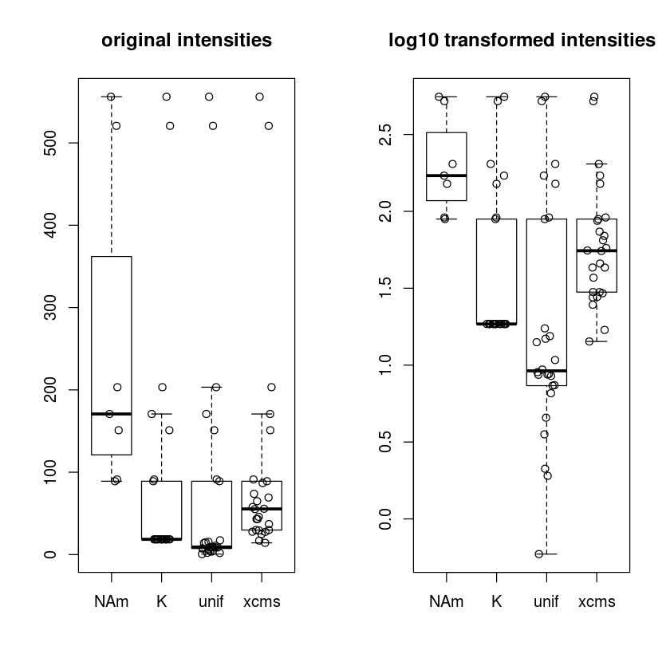


```R
(x<-quantile(log10(rubusNoise[,3]),seq(0,1,0.01), na.rm=TRUE))
(y<-quantile(log10(rubusFilled[,3]),seq(0,1,0.01)))
plot(x,y)
abline(0,1)

```


<dl class=dl-horizontal>
	<dt>0%</dt>
		<dd>-0.572986678989177</dd>
	<dt>1%</dt>
		<dd>-0.55494836457491</dd>
	<dt>2%</dt>
		<dd>-0.536910050160642</dd>
	<dt>3%</dt>
		<dd>-0.518871735746375</dd>
	<dt>4%</dt>
		<dd>-0.500833421332108</dd>
	<dt>5%</dt>
		<dd>-0.316494127542272</dd>
	<dt>6%</dt>
		<dd>-0.132154833752436</dd>
	<dt>7%</dt>
		<dd>0.0521844600373993</dd>
	<dt>8%</dt>
		<dd>0.236523753827235</dd>
	<dt>9%</dt>
		<dd>0.296130172915663</dd>
	<dt>10%</dt>
		<dd>0.355736592004091</dd>
	<dt>11%</dt>
		<dd>0.415343011092518</dd>
	<dt>12%</dt>
		<dd>0.474949430180946</dd>
	<dt>13%</dt>
		<dd>0.480605801373561</dd>
	<dt>14%</dt>
		<dd>0.486262172566176</dd>
	<dt>15%</dt>
		<dd>0.491918543758791</dd>
	<dt>16%</dt>
		<dd>0.497574914951405</dd>
	<dt>17%</dt>
		<dd>0.53000186799272</dd>
	<dt>18%</dt>
		<dd>0.562428821034034</dd>
	<dt>19%</dt>
		<dd>0.594855774075349</dd>
	<dt>20%</dt>
		<dd>0.627282727116663</dd>
	<dt>21%</dt>
		<dd>0.632236185992222</dd>
	<dt>22%</dt>
		<dd>0.637189644867781</dd>
	<dt>23%</dt>
		<dd>0.64214310374334</dd>
	<dt>24%</dt>
		<dd>0.647096562618899</dd>
	<dt>25%</dt>
		<dd>0.651662863732724</dd>
	<dt>26%</dt>
		<dd>0.656229164846549</dd>
	<dt>27%</dt>
		<dd>0.660795465960374</dd>
	<dt>28%</dt>
		<dd>0.665361767074199</dd>
	<dt>29%</dt>
		<dd>0.675952728661866</dd>
	<dt>30%</dt>
		<dd>0.686543690249533</dd>
	<dt>31%</dt>
		<dd>0.6971346518372</dd>
	<dt>32%</dt>
		<dd>0.707725613424867</dd>
	<dt>33%</dt>
		<dd>0.735532881443429</dd>
	<dt>34%</dt>
		<dd>0.763340149461991</dd>
	<dt>35%</dt>
		<dd>0.791147417480553</dd>
	<dt>36%</dt>
		<dd>0.818954685499115</dd>
	<dt>37%</dt>
		<dd>0.833214756701623</dd>
	<dt>38%</dt>
		<dd>0.847474827904131</dd>
	<dt>39%</dt>
		<dd>0.861734899106639</dd>
	<dt>40%</dt>
		<dd>0.875994970309148</dd>
	<dt>41%</dt>
		<dd>0.880395624876433</dd>
	<dt>42%</dt>
		<dd>0.884796279443718</dd>
	<dt>43%</dt>
		<dd>0.889196934011003</dd>
	<dt>44%</dt>
		<dd>0.893597588578288</dd>
	<dt>45%</dt>
		<dd>0.911957274980922</dd>
	<dt>46%</dt>
		<dd>0.930316961383556</dd>
	<dt>47%</dt>
		<dd>0.94867664778619</dd>
	<dt>48%</dt>
		<dd>0.967036334188824</dd>
	<dt>49%</dt>
		<dd>0.974394154717828</dd>
	<dt>50%</dt>
		<dd>0.981751975246833</dd>
	<dt>51%</dt>
		<dd>0.989109795775837</dd>
	<dt>52%</dt>
		<dd>0.996467616304841</dd>
	<dt>53%</dt>
		<dd>1.0232511501962</dd>
	<dt>54%</dt>
		<dd>1.05003468408756</dd>
	<dt>55%</dt>
		<dd>1.07681821797893</dd>
	<dt>56%</dt>
		<dd>1.10360175187029</dd>
	<dt>57%</dt>
		<dd>1.10690929304</dd>
	<dt>58%</dt>
		<dd>1.11021683420972</dd>
	<dt>59%</dt>
		<dd>1.11352437537944</dd>
	<dt>60%</dt>
		<dd>1.11683191654916</dd>
	<dt>61%</dt>
		<dd>1.12020790396395</dd>
	<dt>62%</dt>
		<dd>1.12358389137874</dd>
	<dt>63%</dt>
		<dd>1.12695987879353</dd>
	<dt>64%</dt>
		<dd>1.13033586620832</dd>
	<dt>65%</dt>
		<dd>1.13309785468833</dd>
	<dt>66%</dt>
		<dd>1.13585984316834</dd>
	<dt>67%</dt>
		<dd>1.13862183164835</dd>
	<dt>68%</dt>
		<dd>1.14138382012837</dd>
	<dt>69%</dt>
		<dd>1.14467664421966</dd>
	<dt>70%</dt>
		<dd>1.14796946831095</dd>
	<dt>71%</dt>
		<dd>1.15126229240224</dd>
	<dt>72%</dt>
		<dd>1.15455511649353</dd>
	<dt>73%</dt>
		<dd>1.16162781586824</dd>
	<dt>74%</dt>
		<dd>1.16870051524294</dd>
	<dt>75%</dt>
		<dd>1.17577321461764</dd>
	<dt>76%</dt>
		<dd>1.18284591399235</dd>
	<dt>77%</dt>
		<dd>1.18489006695385</dd>
	<dt>78%</dt>
		<dd>1.18693421991534</dd>
	<dt>79%</dt>
		<dd>1.18897837287684</dd>
	<dt>80%</dt>
		<dd>1.19102252583834</dd>
	<dt>81%</dt>
		<dd>1.19871466964361</dd>
	<dt>82%</dt>
		<dd>1.20640681344888</dd>
	<dt>83%</dt>
		<dd>1.21409895725415</dd>
	<dt>84%</dt>
		<dd>1.22179110105941</dd>
	<dt>85%</dt>
		<dd>1.22821214720026</dd>
	<dt>86%</dt>
		<dd>1.23463319334111</dd>
	<dt>87%</dt>
		<dd>1.24105423948196</dd>
	<dt>88%</dt>
		<dd>1.2474752856228</dd>
	<dt>89%</dt>
		<dd>1.40260421849433</dd>
	<dt>90%</dt>
		<dd>1.55773315136585</dd>
	<dt>91%</dt>
		<dd>1.71286208423737</dd>
	<dt>92%</dt>
		<dd>1.86799101710889</dd>
	<dt>93%</dt>
		<dd>1.89992596412052</dd>
	<dt>94%</dt>
		<dd>1.93186091113214</dd>
	<dt>95%</dt>
		<dd>1.96379585814376</dd>
	<dt>96%</dt>
		<dd>1.99573080515539</dd>
	<dt>97%</dt>
		<dd>1.99902025830654</dd>
	<dt>98%</dt>
		<dd>2.00230971145769</dd>
	<dt>99%</dt>
		<dd>2.00559916460883</dd>
	<dt>100%</dt>
		<dd>2.00888861775998</dd>
</dl>


    Error in quantile(log10(rubusFilled[, 3]), seq(0, 1, 0.01)): object 'rubusFilled' not found
    Traceback:


    1. quantile(log10(rubusFilled[, 3]), seq(0, 1, 0.01))


#### ..just the data export..


```R
##exporting the wine data for the next lesson
winesmall<-wine[wine$Cultivar %in% c(1,3),]
#summary(winesmall)

#let's subset the data such that it is balanced 
N<-48
Nc1<-sum(winesmall$Cultivar==1) #the number of samples of the first class
sampleid1<-seq(1,N) #the first three of the first class
sampleid3<-seq(Nc1+1,Nc1+N)#the first three of the other class

winesmall$Cultivar<-factor(as.character(winesmall$Cultivar))
summary(winesmall)

winesmall<-winesmall[c(sampleid1,sampleid3),]
summary(winesmall)

save(list = "winesmall",file = "data/winesmall.RData")
#plot(winesmall[,c("Alcohol","Total_Phenols","Color_intensity","Malic_acid","Flavanoids","Proline","OD_ratio")], 
#     col=c("steelblue3","coral3","seagreen3")[as.numeric(winesmall$Cultivar)])
```
