# Going multivariate...

## Principal Component Analysis (PCA)

There are many packages in R for performing PCA. We will show use some examples using factoMineR and factoextra. 
You can find a nice guide here:
- http://www.sthda.com/english/wiki/ade4-and-factoextra-principal-component-analysis-r-software-and-data-mining
- http://www.sthda.com/english/wiki/fviz-pca-quick-principal-component-analysis-data-visualization-r-software-and-data-mining
- http://www.sthda.com/english/wiki/factoextra-r-package-easy-multivariate-data-analyses-and-elegant-visualization

*Warning*: In the "facto" language the focus is shifted onto *individuals* and *variables* completely ignoring the theorical concepts of *scores* and *loadings*.


```R
#loading the required libraries
suppressPackageStartupMessages(library(FactoMineR))
suppressPackageStartupMessages(library(factoextra))

#loading the data
load("data/winesmall.RData")

#performing the PCA on all the "numerical" variables
res.pca<-PCA(winesmall[,-1], 
             scale.unit = TRUE,
             graph = FALSE)
```

How can we decide how many components it is worth to look at?


```R
fviz_screeplot(res.pca, addlabels = TRUE)
```


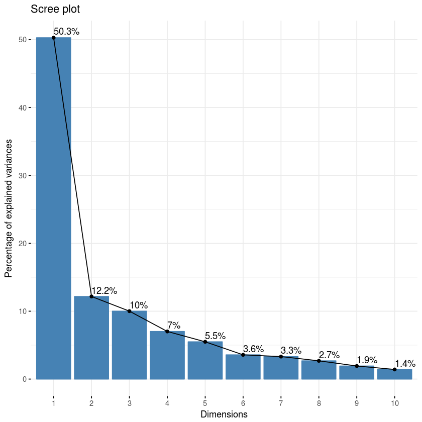


**Score plot**: let's look at the projected points. 


```R
ind <- get_pca_ind(res.pca)
head(ind$coord)
```


<table>
<thead><tr><th></th><th scope=col>Dim.1</th><th scope=col>Dim.2</th><th scope=col>Dim.3</th><th scope=col>Dim.4</th><th scope=col>Dim.5</th></tr></thead>
<tbody>
	<tr><th scope=row>1</th><td>3.628388   </td><td> 0.6881256 </td><td> 0.16770821</td><td>-1.10063377</td><td> 0.4575120 </td></tr>
	<tr><th scope=row>2</th><td>2.361970   </td><td>-2.6483470 </td><td>-0.45921113</td><td>-0.59264239</td><td>-0.3917221 </td></tr>
	<tr><th scope=row>3</th><td>2.576100   </td><td> 0.8683296 </td><td> 0.01560177</td><td> 0.60591967</td><td>-0.3769289 </td></tr>
	<tr><th scope=row>4</th><td>3.917840   </td><td> 1.0396550 </td><td> 1.50103347</td><td>-0.47104022</td><td> 0.3215605 </td></tr>
	<tr><th scope=row>5</th><td>1.204224   </td><td> 2.0487614 </td><td>-1.76689257</td><td> 0.33127430</td><td> 0.1501097 </td></tr>
	<tr><th scope=row>6</th><td>3.419391   </td><td> 0.3543725 </td><td> 0.96510929</td><td>-0.01095914</td><td>-0.1046296 </td></tr>
</tbody>
</table>


```R
fviz_pca_ind(res.pca, 
             habillage = winesmall$Cultivar,
             #label = "none", # hide individual labels
             repel = TRUE # Avoid text overlapping (slow if many points)
             )
```


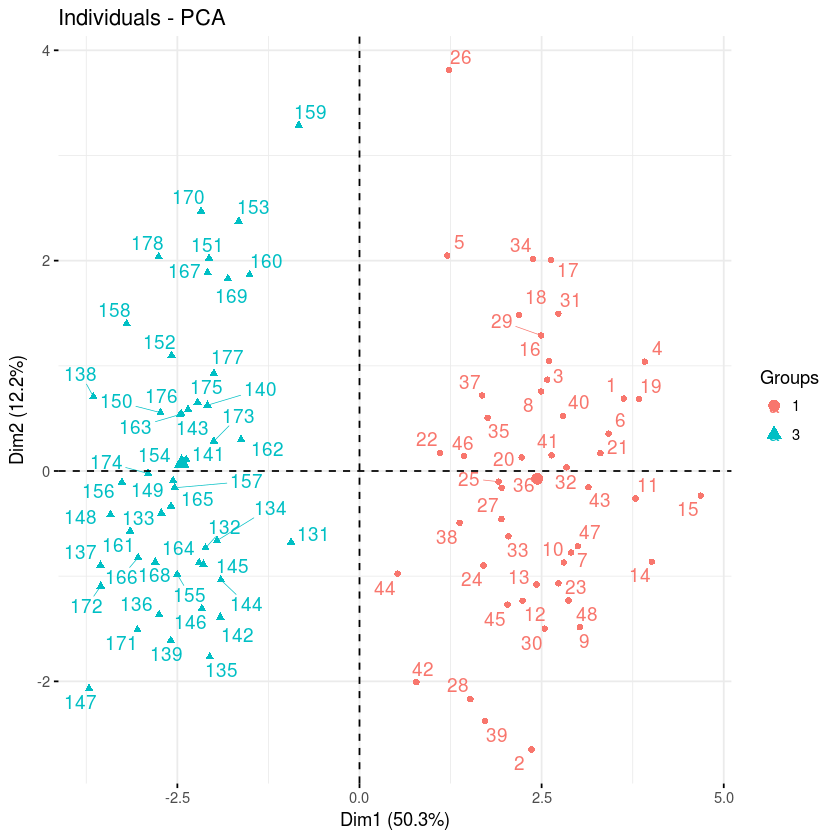


**Loading plot**: which are the variable that are contributing to the projection?


```R
var <- get_pca_var(res.pca)
head(var$coord)
```


<table>
<thead><tr><th></th><th scope=col>Dim.1</th><th scope=col>Dim.2</th><th scope=col>Dim.3</th><th scope=col>Dim.4</th><th scope=col>Dim.5</th></tr></thead>
<tbody>
	<tr><th scope=row>Alcohol</th><td> 0.62478731</td><td> 0.15442800</td><td> 0.45386696</td><td> 0.13351638</td><td> 0.39305070</td></tr>
	<tr><th scope=row>Malic_acid</th><td>-0.64830841</td><td>-0.01428569</td><td>-0.01116269</td><td> 0.06478528</td><td> 0.69800826</td></tr>
	<tr><th scope=row>Ash</th><td> 0.05231947</td><td> 0.83675750</td><td>-0.36296608</td><td> 0.26249664</td><td> 0.01465538</td></tr>
	<tr><th scope=row>Ash_Alcalinity</th><td>-0.70015936</td><td> 0.54014874</td><td>-0.13948923</td><td> 0.10901023</td><td>-0.04921609</td></tr>
	<tr><th scope=row>Magnesium</th><td> 0.36284104</td><td> 0.54786924</td><td>-0.24674743</td><td>-0.58038932</td><td> 0.07650371</td></tr>
	<tr><th scope=row>Total_Phenols</th><td> 0.90427423</td><td> 0.16827354</td><td> 0.11218225</td><td> 0.13470019</td><td> 0.01836421</td></tr>
</tbody>
</table>


```R
fviz_pca_var(res.pca, col.var = "black")
```


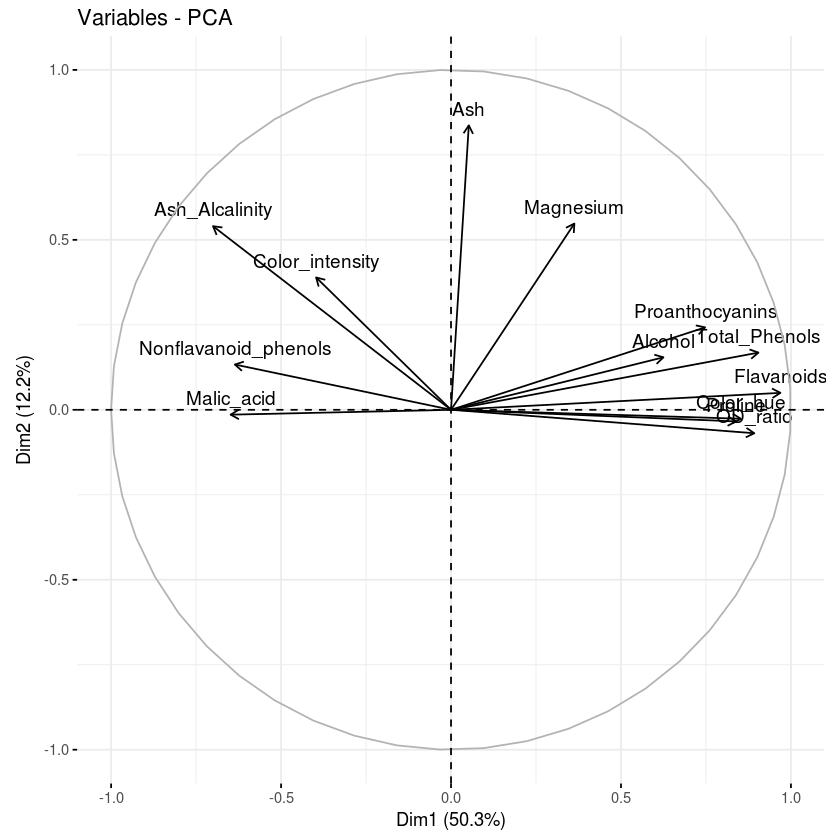


```R
#you can "beautify" to the plot
fviz_pca_var(res.pca, col.var="contrib",
             gradient.cols = c("gray70", "coral3"),
             repel = TRUE # Avoid text overlapping
             )
```


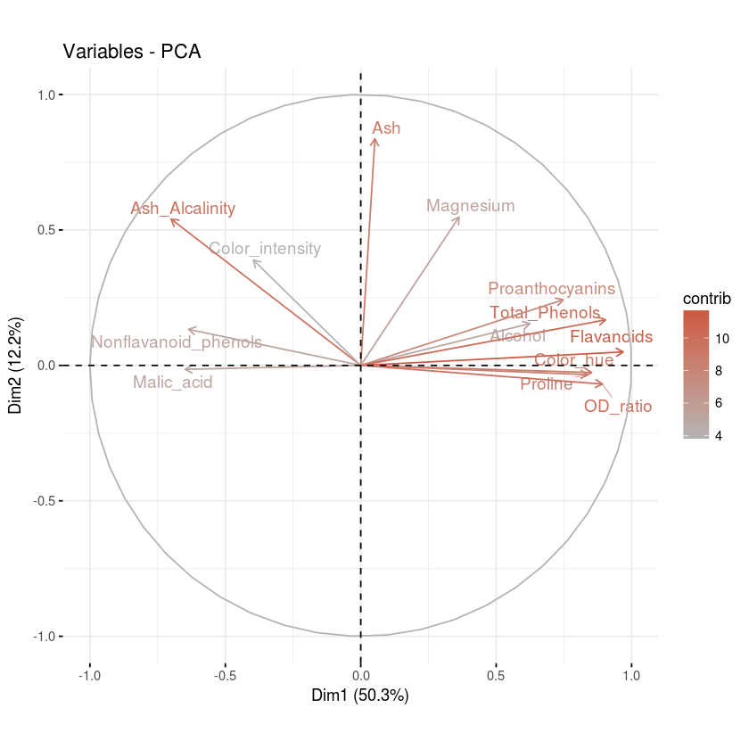


**Biplot**: putting samples and variables in the same visualization


```R
fviz_pca_biplot(res.pca, 
                habillage = winesmall$Cultivar,
                #label = "none", # hide individual labels
                repel = TRUE)
```


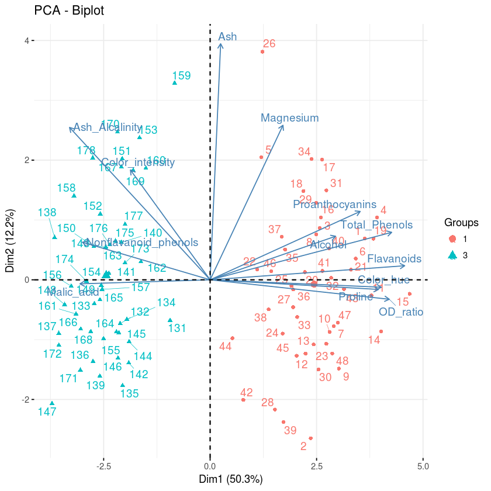


### Exercise:
##### Which is the effect of scaling?


```R
res.pca<-PCA(winesmall[,-1], 
             scale.unit = FALSE,
             graph = FALSE)

fviz_pca_biplot(res.pca, 
                habillage = winesmall$Cultivar,
                label = "none", #if you comment this line you will see the name of the features
                repel = TRUE)
```


### Exercise:
##### Perform a PCA on the RUBUS dataset.


```R
rubus<-read.table("data/rubusSmallInfo.txt",header=TRUE, check.names = FALSE,sep="\t")
#str(rubusFilled)
rubus[1:5,1:10]
summary(rubus[,1:9])

rownames(rubus)<-rubus$sampleName #to have labels in the "sample plot"

res.pca<-PCA(rubus[,-c(1:7)],
             scale.unit = TRUE,
            quali.sup = 2:7)
```


<table>
<thead><tr><th scope=col>sampleName</th><th scope=col>color</th><th scope=col>location</th><th scope=col>year</th><th scope=col>variety</th><th scope=col>variety.name</th><th scope=col>temperature</th><th scope=col>59/895.6</th><th scope=col>59/2153.3</th><th scope=col>73/296.2</th></tr></thead>
<tbody>
	<tr><td>Ab_11_DR_R_20_1601</td><td>R                 </td><td>DR                </td><td>2011              </td><td>Ab                </td><td>Autumn Bliss      </td><td>-20               </td><td>2.743718          </td><td>2.213392          </td><td>1.227496          </td></tr>
	<tr><td>Ab_11_VG_R_16_2701</td><td>R                 </td><td>VG                </td><td>2011              </td><td>Ab                </td><td>Autumn Bliss      </td><td>-80               </td><td>2.766302          </td><td>1.818145          </td><td>1.231253          </td></tr>
	<tr><td>AG_11_BP_Y_01_0801</td><td>Y                 </td><td>BP                </td><td>2011              </td><td>AG                </td><td>Alpen Gold        </td><td>-80               </td><td>2.854527          </td><td>2.388704          </td><td>1.053286          </td></tr>
	<tr><td>AG_11_SM_Y_28_1301</td><td>Y                 </td><td>SM                </td><td>2011              </td><td>AG                </td><td>Alpen Gold        </td><td>-80               </td><td>2.868495          </td><td>3.094968          </td><td>1.432673          </td></tr>
	<tr><td>AG_12_BP_Y_02_2901</td><td>Y                 </td><td>BP                </td><td>2012              </td><td>AG                </td><td>Alpen Gold        </td><td>-20               </td><td>2.866891          </td><td>2.338042          </td><td>1.658370          </td></tr>
</tbody>
</table>


                  sampleName color  location      year         variety 
     Ab_11_DR_R_20_1601: 1   R:13   BP:12    Min.   :2010   Tu     :4  
     Ab_11_VG_R_16_2701: 1   Y:12   DR: 3    1st Qu.:2010   AG     :3  
     AG_11_BP_Y_01_0801: 1          SM: 1    Median :2011   SG     :3  
     AG_11_SM_Y_28_1301: 1          VG: 9    Mean   :2011   SR     :3  
     AG_12_BP_Y_02_2901: 1                   3rd Qu.:2011   Ab     :2  
     An_10_VG_Y_03_0101: 1                   Max.   :2012   An     :2  
     (Other)           :19                                  (Other):8  
            variety.name  temperature       59/895.6       59/2153.3    
     Tulameen     :4     Min.   :-80.0   Min.   :2.601   Min.   :1.696  
     Alpen Gold   :3     1st Qu.:-80.0   1st Qu.:2.704   1st Qu.:1.956  
     Sugana Giallo:3     Median :-80.0   Median :2.748   Median :2.164  
     Sugana Red   :3     Mean   :-53.6   Mean   :2.765   Mean   :2.203  
     Anne         :2     3rd Qu.:-20.0   3rd Qu.:2.855   3rd Qu.:2.338  
     Autumn Bliss :2     Max.   :-20.0   Max.   :2.931   Max.   :3.247  
     (Other)      :8                                                    


```R
fviz_pca_ind(res.pca, 
                habillage = factor(rubus$color), #other confounding factors can be checked
                label = "none", # hide individual labels
                repel = TRUE)

```


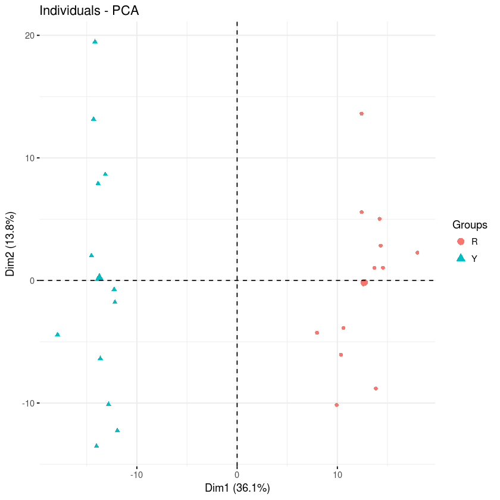


Assume that you perform and experiment and after the analysis is done you receive a few extra samples. 
How could you compare the new data with the old one? You can use a PCA, but how?


```R
## how to add extra point... scaling: the tricky part...
summary(rubus$color)

idr<-which(rubus$color=="R")
idy<-which(rubus$color=="Y")

#let's keep 9 sample per class and assume that this is your primary dataset 
sel<-c(idr[1:9],idy[1:9])
#after your analysis is done, you receive a few samples more:  
#now you want to understand how similar they are to your original data 
extra<-c(idr[10:13],idy[10:12])

res.pca<-PCA(rubus[,-1],
             ind.sup = extra, #we are adding samples to a projection computed on the first 9 points of each sample
             scale.unit = TRUE,
             quali.sup = 1:6) #adding qualitative variables (can be plotted)

summary(res.pca)
```


<dl class=dl-horizontal>
	<dt>R</dt>
		<dd>13</dd>
	<dt>Y</dt>
		<dd>12</dd>
</dl>


    
    Call:
    PCA(X = rubus[, -1], scale.unit = TRUE, ind.sup = extra, quali.sup = 1:6) 
    
    
    Eigenvalues
                           Dim.1   Dim.2   Dim.3   Dim.4   Dim.5   Dim.6   Dim.7
    Variance             187.650  75.441  36.058  26.397  25.069  20.996  18.952
    % of var.             37.530  15.088   7.212   5.279   5.014   4.199   3.790
    Cumulative % of var.  37.530  52.618  59.830  65.109  70.123  74.322  78.113
                           Dim.8   Dim.9  Dim.10  Dim.11  Dim.12  Dim.13  Dim.14
    Variance              17.292  15.250  14.784  11.985  11.551  10.701   9.254
    % of var.              3.458   3.050   2.957   2.397   2.310   2.140   1.851
    Cumulative % of var.  81.571  84.621  87.578  89.975  92.285  94.425  96.276
                          Dim.15  Dim.16  Dim.17
    Variance               7.236   5.839   5.546
    % of var.              1.447   1.168   1.109
    Cumulative % of var.  97.723  98.891 100.000
    
    Individuals (the 10 first)
                            Dist     Dim.1     ctr    cos2     Dim.2     ctr
    Ab_11_DR_R_20_1601 |  19.983 |  12.161   4.379   0.370 |  -3.723   1.021
    Ab_11_VG_R_16_2701 |  17.012 |   9.659   2.762   0.322 |  -4.497   1.489
    AG_11_BP_Y_01_0801 |  19.186 | -13.380   5.300   0.486 |   6.777   3.382
    AG_11_SM_Y_28_1301 |  26.974 | -14.766   6.455   0.300 |  18.729  25.831
    AG_12_BP_Y_02_2901 |  20.460 | -10.848   3.484   0.281 |  -2.235   0.368
    An_10_VG_Y_03_0101 |  20.852 | -14.414   6.151   0.478 |  -0.637   0.030
    An_11_VG_Y_04_0401 |  25.317 | -17.445   9.010   0.475 |  -7.673   4.336
    BP_10_BP_R_13_0201 |  22.724 |  14.267   6.026   0.394 |   7.172   3.788
    FG_11_VG_Y_05_2001 |  22.945 | -12.368   4.529   0.291 |  -7.222   3.840
    GQ_11_VG_Y_06_1801 |  22.902 | -11.400   3.847   0.248 |  -4.764   1.672
                          cos2     Dim.3     ctr    cos2  
    Ab_11_DR_R_20_1601   0.035 |  -8.480  11.080   0.180 |
    Ab_11_VG_R_16_2701   0.070 |  -3.355   1.734   0.039 |
    AG_11_BP_Y_01_0801   0.125 |   1.924   0.571   0.010 |
    AG_11_SM_Y_28_1301   0.482 |   1.921   0.568   0.005 |
    AG_12_BP_Y_02_2901   0.012 |   2.897   1.293   0.020 |
    An_10_VG_Y_03_0101   0.001 |  -6.044   5.628   0.084 |
    An_11_VG_Y_04_0401   0.092 |  -7.583   8.859   0.090 |
    BP_10_BP_R_13_0201   0.100 |   5.383   4.465   0.056 |
    FG_11_VG_Y_05_2001   0.099 |   6.405   6.321   0.078 |
    GQ_11_VG_Y_06_1801   0.043 |   9.095  12.745   0.158 |
    
    Supplementary individuals
                            Dist     Dim.1    cos2     Dim.2    cos2     Dim.3
    Tu_10_BP_R_24_1001 |  31.491 |  15.035   0.228 |   0.481   0.000 |   3.304
    Tu_11_BP_R_26_2501 |  20.130 |  13.674   0.461 |   0.809   0.002 |   2.177
    Tu_11_DR_R_19_1401 |  29.834 |  18.292   0.376 |   0.787   0.001 |  -2.769
    Tu_11_VG_R_27_1901 |  35.719 |  15.520   0.189 |  -1.511   0.002 |   2.582
    SG_10_BP_Y_10_0901 |  20.203 | -12.595   0.389 |   6.288   0.097 |   0.229
    SG_11_BP_Y_11_2101 |  23.188 |  -9.415   0.165 | -10.489   0.205 |   5.247
    SG_12_BP_Y_12_1201 |  22.613 | -10.274   0.206 |  -8.868   0.154 |   6.624
                          cos2  
    Tu_10_BP_R_24_1001   0.011 |
    Tu_11_BP_R_26_2501   0.012 |
    Tu_11_DR_R_19_1401   0.009 |
    Tu_11_VG_R_27_1901   0.005 |
    SG_10_BP_Y_10_0901   0.000 |
    SG_11_BP_Y_11_2101   0.051 |
    SG_12_BP_Y_12_1201   0.086 |
    
    Variables (the 10 first)
                          Dim.1    ctr   cos2    Dim.2    ctr   cos2    Dim.3
    59/895.6           | -0.464  0.115  0.215 |  0.252  0.084  0.064 |  0.412
    59/2153.3          | -0.567  0.171  0.321 |  0.693  0.636  0.480 | -0.080
    73/296.2           |  0.416  0.092  0.173 | -0.143  0.027  0.021 |  0.449
    74/1500.7          | -0.523  0.146  0.274 |  0.338  0.152  0.114 |  0.299
    75/1314.7          | -0.379  0.077  0.144 |  0.624  0.516  0.389 |  0.068
    81/1125.4          |  0.493  0.129  0.243 | -0.435  0.251  0.189 |  0.146
    83/1512.1          | -0.487  0.126  0.237 |  0.596  0.471  0.355 | -0.254
    85/1039.8          |  0.152  0.012  0.023 |  0.171  0.039  0.029 | -0.038
    85/1512.2          | -0.399  0.085  0.160 |  0.694  0.638  0.481 | -0.152
    85/857.5           | -0.369  0.072  0.136 |  0.549  0.399  0.301 | -0.009
                          ctr   cos2  
    59/895.6            0.472  0.170 |
    59/2153.3           0.018  0.006 |
    73/296.2            0.559  0.202 |
    74/1500.7           0.248  0.089 |
    75/1314.7           0.013  0.005 |
    81/1125.4           0.059  0.021 |
    83/1512.1           0.179  0.065 |
    85/1039.8           0.004  0.001 |
    85/1512.2           0.064  0.023 |
    85/857.5            0.000  0.000 |
    
    Supplementary categories (the 10 first)
                            Dist     Dim.1    cos2  v.test     Dim.2    cos2
    R                  |  13.570 |  13.556   0.998   4.080 |   0.128   0.000
    Y                  |  13.570 | -13.556   0.998  -4.080 |  -0.128   0.000
    BP                 |   8.638 |   6.488   0.564   1.558 |   1.034   0.014
    DR                 |  15.308 |  -0.079   0.000  -0.008 |  -9.729   0.404
    SM                 |  26.974 | -14.766   0.300  -1.078 |  18.729   0.482
    VG                 |   6.081 |  -3.812   0.393  -1.026 |  -0.814   0.018
    2010               |  11.104 |   8.212   0.547   1.533 |   4.326   0.152
    2011               |   5.267 |  -4.270   0.657  -1.611 |  -1.247   0.056
    2012               |  12.882 |   2.957   0.053   0.315 |  -3.955   0.094
    Ab                 |  16.155 |  10.910   0.456   1.161 |  -4.110   0.065
                        v.test     Dim.3    cos2  v.test  
    R                    0.061 |  -0.274   0.000  -0.188 |
    Y                   -0.061 |   0.274   0.000   0.188 |
    BP                   0.392 |   3.564   0.170   1.952 |
    DR                  -1.633 |  -8.015   0.274  -1.946 |
    SM                   2.156 |   1.921   0.005   0.320 |
    VG                  -0.346 |  -1.355   0.050  -0.832 |
    2010                 1.274 |  -1.385   0.016  -0.590 |
    2011                -0.742 |   0.088   0.000   0.076 |
    2012                -0.664 |   2.977   0.053   0.723 |
    Ab                  -0.690 |  -5.918   0.134  -1.437 |


```R
fviz_pca_ind(res.pca, 
                habillage = grep("color",names(rubus))-1, #other confounding factors can be checked, 
                                                          #just change the name of the column
                label = "none", # hide individual labels
                repel = TRUE)
```


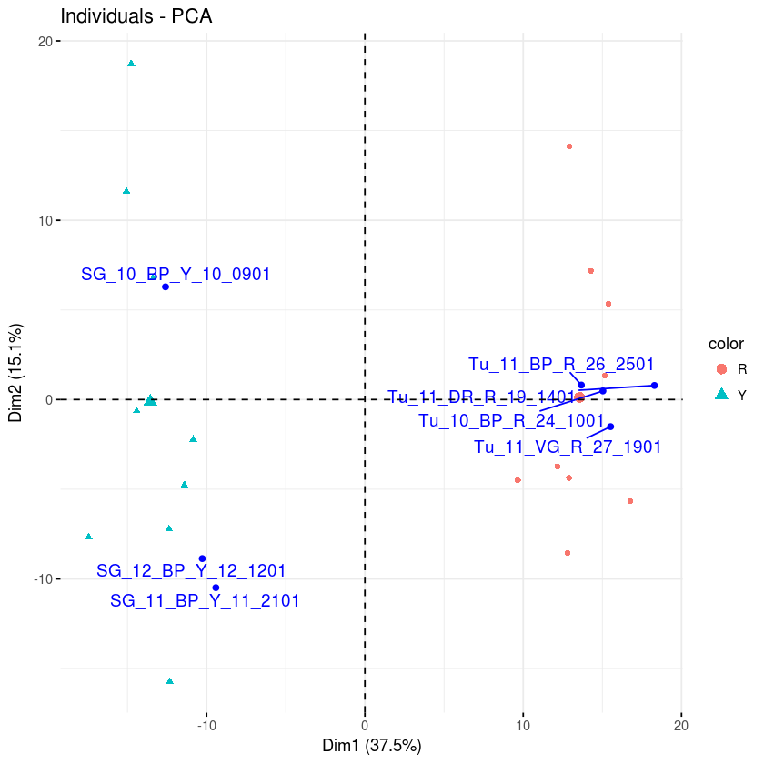


## Clustering: k-means

Credits:
- https://www.r-statistics.com/2013/08/k-means-clustering-from-r-in-action/
- http://www2.stat.unibo.it/montanari/Didattica/Multivariate/CA_lab.pdf
- http://cc.oulu.fi/~jarioksa/opetus/metodi/sessio3.pdf


```R
#we will use k-means.. 
#let's start looking at what the function does
?kmeans
```


```R
set.seed(20)
cl <- kmeans(winesmall[, -1], centers =  2, nstart = 20)
cl
```


    K-means clustering with 2 clusters of sizes 61, 35
    
    Cluster means:
       Alcohol Malic_acid      Ash Ash_Alcalinity Magnesium Total_Phenols
    1 13.22131   3.144262 2.466066       20.70656  101.9836      1.912951
    2 13.85086   1.930571 2.423714       16.75714  103.8571      2.817714
      Flavanoids Nonflavanoid_phenols Proanthocyanins Color_intensity Color_hue
    1   1.224426            0.4162295        1.304918        6.828197  0.755082
    2   2.970000            0.2940000        1.852000        5.489714  1.082286
      OD_ratio  Proline
    1 2.037049  670.082
    2 3.122571 1205.200
    
    Clustering vector:
      1   2   3   4   5   6   7   8   9  10  11  12  13  14  15  16  17  18  19  20 
      2   2   2   2   1   2   2   2   2   2   2   2   2   2   2   2   2   2   2   1 
     21  22  23  24  25  26  27  28  29  30  31  32  33  34  35  36  37  38  39  40 
      1   1   2   2   1   1   2   2   1   2   2   2   2   2   2   1   1   2   2   1 
     41  42  43  44  45  46  47  48 131 132 133 134 135 136 137 138 139 140 141 142 
      1   2   2   1   1   2   2   2   1   1   1   1   1   1   1   1   1   1   1   1 
    143 144 145 146 147 148 149 150 151 152 153 154 155 156 157 158 159 160 161 162 
      1   1   1   1   1   1   1   1   1   1   1   1   1   1   1   1   1   1   1   1 
    163 164 165 166 167 168 169 170 171 172 173 174 175 176 177 178 
      1   1   1   1   1   1   1   1   1   1   1   1   1   1   1   1 
    
    Within cluster sum of squares by cluster:
    [1] 1059174 1160853
     (between_SS / total_SS =  74.2 %)
    
    Available components:
    
    [1] "cluster"      "centers"      "totss"        "withinss"     "tot.withinss"
    [6] "betweenss"    "size"         "iter"         "ifault"      


```R
#Let's give a look at the output
plot(winesmall[,c("Alcohol","Total_Phenols","Color_intensity","Malic_acid","Flavanoids","Proline","OD_ratio")], 
     col=c("aquamarine4","violet")[cl$cluster])
```


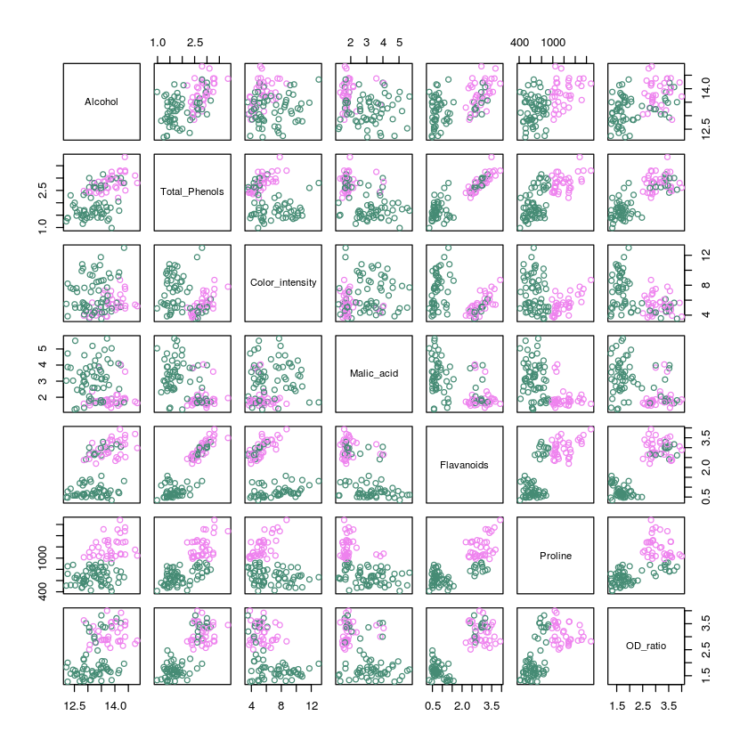


```R
#How good is the clustering?
table(winesmall$Cultivar, cl$cluster)
```


       
         1  2
      1 13 35
      3 48  0


```R
#how can we choose the number of clusters?
#the "elbow" method
wssplot <- function(data, nc=15, seed=1234){
               wss <- (nrow(data)-1)*sum(apply(data,2,var))
               for (i in 2:nc){
                    set.seed(seed)
                    wss[i] <- sum(kmeans(data, centers=i)$withinss)}
                plot(1:nc, wss, type="b", pch=19, xlab="Number of Clusters",
                     ylab="Within groups sum of squares")}
```


```R
wssplot(winesmall[,-1])
```


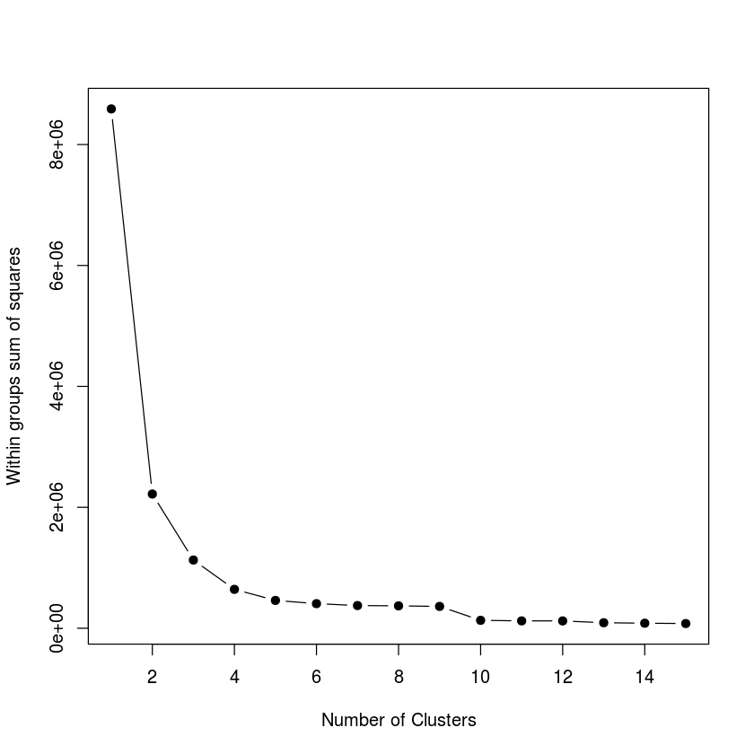


```R
#another option for choosing the number of clusters: a package with 30 indices (you can choose which distance)
library(NbClust)
?NbClust
#otherwise there is also the fpc package: check the cluster.stats function
```


```R
set.seed(1234)
nc <- NbClust(winesmall[,-1], min.nc=2, max.nc=15, method="kmeans", distance="euclidean")

#the recommended number of clusters is chosen using 26 criteria provided
table(nc$Best.n[1,])
```

    *** : The Hubert index is a graphical method of determining the number of clusters.
                    In the plot of Hubert index, we seek a significant knee that corresponds to a 
                    significant increase of the value of the measure i.e the significant peak in Hubert
                    index second differences plot. 
     


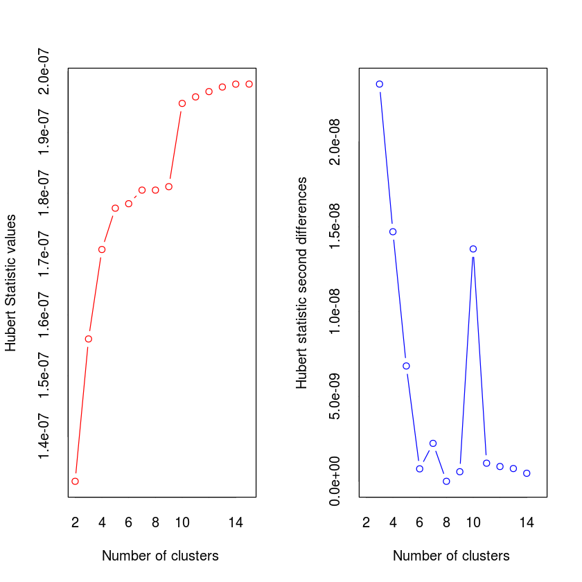


    *** : The D index is a graphical method of determining the number of clusters. 
                    In the plot of D index, we seek a significant knee (the significant peak in Dindex
                    second differences plot) that corresponds to a significant increase of the value of
                    the measure. 
     
    ******************************************************************* 
    * Among all indices:                                                
    * 6 proposed 2 as the best number of clusters 
    * 3 proposed 3 as the best number of clusters 
    * 4 proposed 4 as the best number of clusters 
    * 1 proposed 6 as the best number of clusters 
    * 1 proposed 7 as the best number of clusters 
    * 1 proposed 9 as the best number of clusters 
    * 4 proposed 10 as the best number of clusters 
    * 1 proposed 11 as the best number of clusters 
    * 1 proposed 13 as the best number of clusters 
    * 1 proposed 14 as the best number of clusters 
    * 1 proposed 15 as the best number of clusters 
    
                       ***** Conclusion *****                            
     
    * According to the majority rule, the best number of clusters is  2 
     
     
    ******************************************************************* 


    
     0  2  3  4  6  7  9 10 11 13 14 15 
     2  6  3  4  1  1  1  4  1  1  1  1 


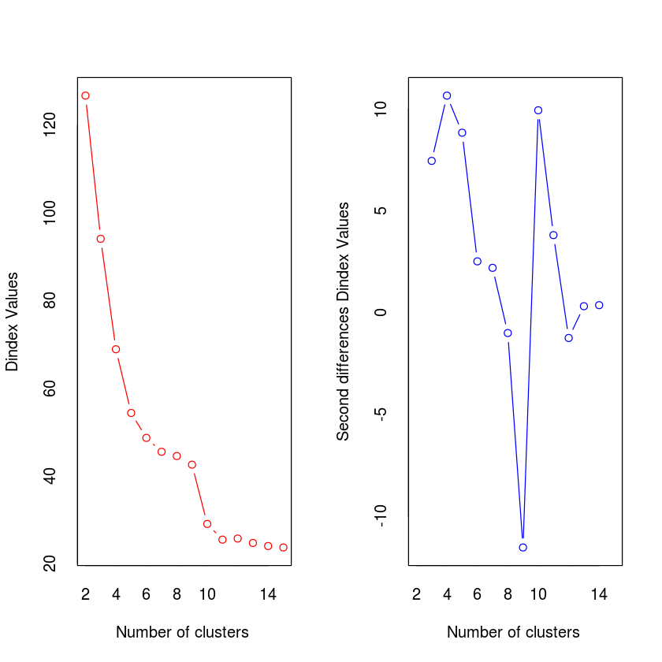


```R
barplot(table(nc$Best.n[1,]),
          xlab="Numer of Clusters", ylab="Number of Criteria",
          main="Number of Clusters Chosen by 26 Criteria")
```


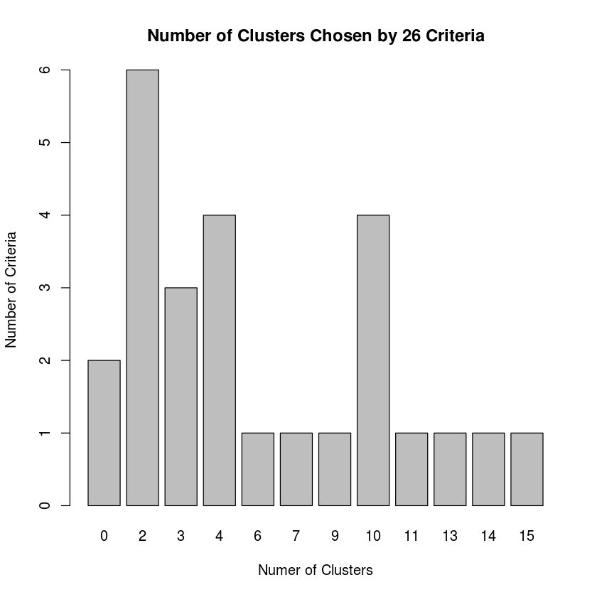


```R
#now we will try to understan the meaning of the nstart parameter
#for this reason we will use the complete dataset with three classes
wine<-read.table("data//wine.data.names.txt",header=TRUE)

#the layout command is useful for putting more than one plot close together
nf <- layout(mat = matrix(c(1,2,3),1,3, byrow=TRUE), height=c(0.5))
#avoids extra space around the plot
par(mar=c(3.1, 3.1, 1.1, 2.1))

plot(wine[,c("Flavanoids","Proline")], 
     col=c("aquamarine4","violet","cyan1")[as.numeric(wine$Cultivar)])

set.seed(100)
cl <- kmeans(wine[, -1], centers =  3, nstart = 1)
table(wine$Cultivar, cl$cluster)

plot(wine[,c("Flavanoids","Proline")], 
     col=c("aquamarine4","violet","cyan1")[cl$cluster])

set.seed(100)
cl <- kmeans(wine[, -1], centers =  3, nstart = 5)
table(wine$Cultivar, cl$cluster)

plot(wine[,c("Flavanoids","Proline")], 
     col=c("aquamarine4","violet","cyan1")[cl$cluster])

```


       
         1  2  3
      1 30 28  1
      2  9  0 62
      3 11  0 37


       
         1  2  3
      1 46 13  0
      2  1 20 50
      3  0 29 19


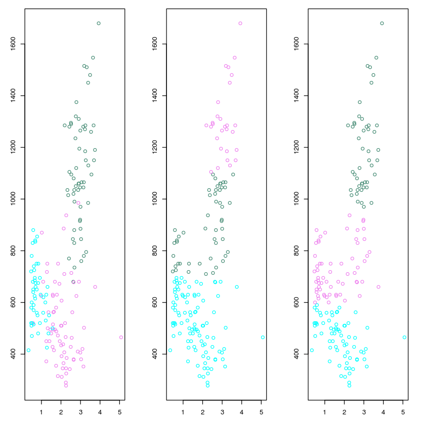


### EXCERCISE:
##### Check what happens if you scale the variables.


```R
set.seed(20)
ws<-scale(wine[,-1])
cl2 <- kmeans(ws, centers =  3, nstart = 20)

table(cl$cluster,wine$Cultivar)
table(cl2$cluster,wine$Cultivar)

nf <- layout(mat = matrix(c(1,2,3),1,3, byrow=TRUE))
plot(wine[,c("Proline","Magnesium")], 
     col=c("aquamarine4","violet","cyan1")[as.numeric(wine$Cultivar)])

plot(wine[,c("Proline","Magnesium")], 
     col=c("aquamarine4","violet","cyan1")[as.numeric(cl$cluster)])

plot(wine[,c("Proline","Magnesium")], 
     col=c("aquamarine4","violet","cyan1")[as.numeric(cl2$cluster)])

```


       
         1  2  3
      1 46  1  0
      2 13 20 29
      3  0 50 19


       
         1  2  3
      1  0  3 48
      2  0 65  0
      3 59  3  0


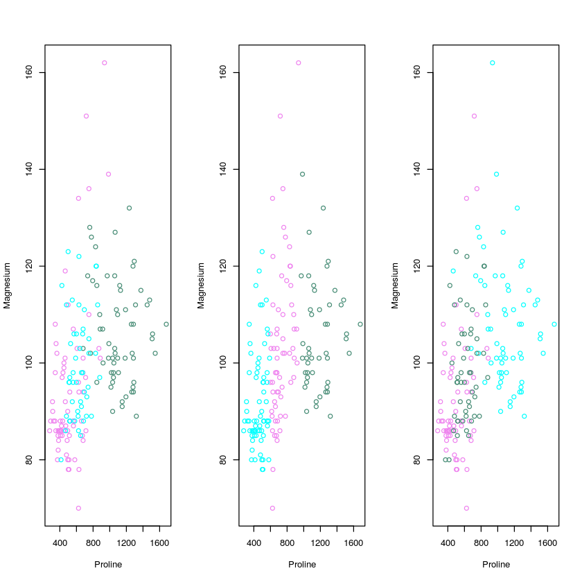


## Clustering: hierarchical clustering

Credits:
- Quick-R: http://www.statmethods.net/advstats/cluster.html
- http://cc.oulu.fi/~jarioksa/opetus/metodi/sessio3.pdf


```R
?hclust
```


```R
cl <- hclust(dist(scale(winesmall[,-1])))
plot(cl)
```


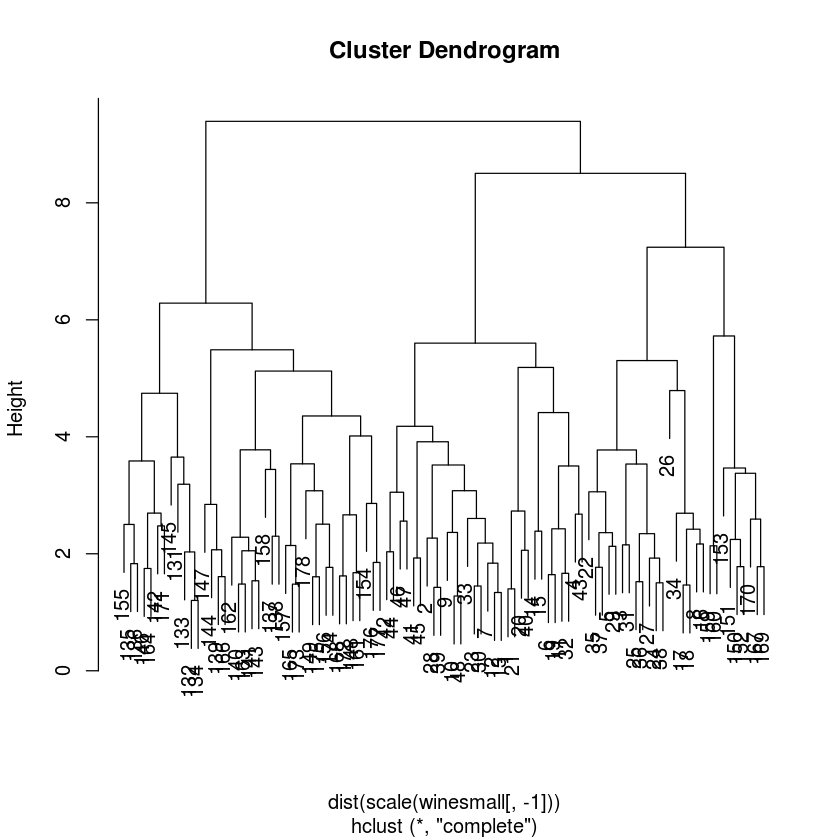


```R
#how can we decide which is the best number of clusters? look at the plot
#let's cut the dendrogram in order to define th,e clusters:
plot(cl)
rect.hclust(cl, 2) #we can use here the result of k-means for cutting


#create the vector with the cluster membership information
clusterCut <- cutree(cl, 2)
```


```R
#we can use the distance for cutting the dendrogram
plot(cl)
rect.hclust(cl, h=9) 
```


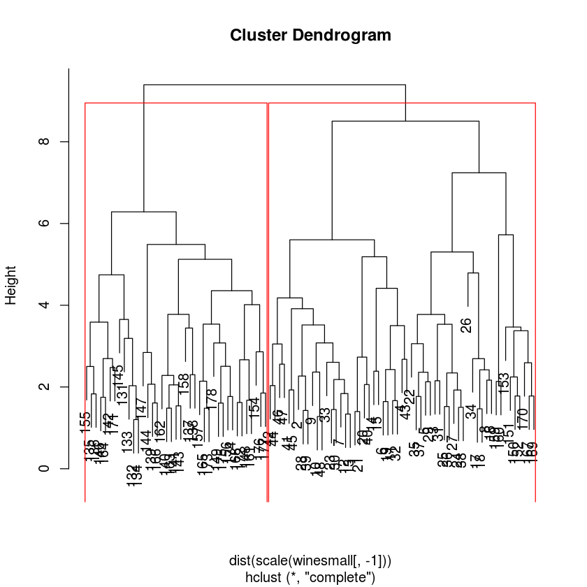


```R
#in this special case we have the info about the class... 
#we can check how it compares with the structure detected by hclust

table(clusterCut,winesmall$Cultivar)
```


              
    clusterCut  1  3
             1 48  9
             2  0 39


### EXCERCISE:
##### The hclust function in R uses the complete linkage method for hierarchical clustering by default. This particular clustering method defines the cluster distance between two clusters to be the maximum distance between their individual components. At every stage of the clustering process, the two nearest clusters are merged into a new cluster. The process is repeated until the whole data set is agglomerated into one single cluster. Explore what changes when you change the method parameter of the hierarchial clustering. Check in the help page which are the alternatives.

##### The dist function allows the computation of a distance matrix. You should choose the most appropriate to your needs. Start giving a look what happens if you change it.


```R
#Single linkage has a tendency to chain observations: most common case is
#to fuse a single observation to an existing class: the single link is the nearest
#neighbour, and a close neighbour is more probably in a large group than in a
#small group or a lonely point. Complete linkage has a tendency to produce
#compact bunches: complete link minimizes the spread within the cluster. The
#average linkage is between these two extremes.

d<-dist(scale(winesmall[,-1]),method="euclidean")

ccom <- hclust(d, method="complete")
caver <- hclust(d, method="average")
csin <- hclust(d, method="single")

nf<-layout(matrix(c(1:3),nrow=3))
plot(ccom, hang=-1)
rect.hclust(ccom, k=2)
plot(caver, hang=-1)
rect.hclust(caver, k=2)
plot(csin, hang=-1)
rect.hclust(csin, k=2)

```


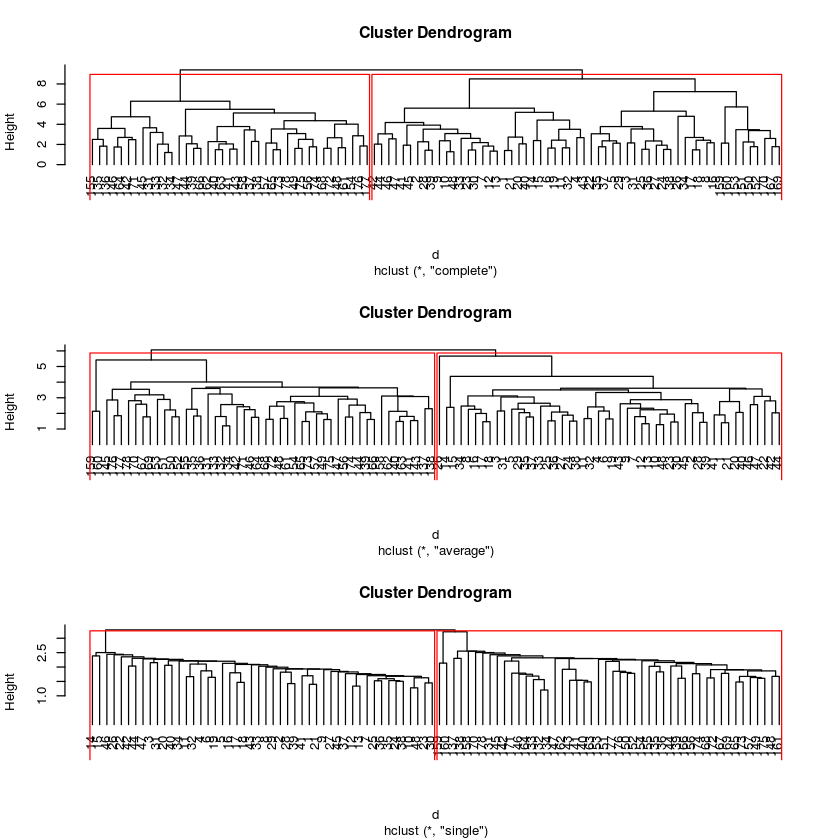


```R
clusterCut <- cutree(ccom, 2)
table(clusterCut,winesmall$Cultivar)

clusterCut <- cutree(caver, 2)
table(clusterCut,winesmall$Cultivar)

clusterCut <- cutree(csin, 2)
table(clusterCut,winesmall$Cultivar)

```


              
    clusterCut  1  3
             1 48  9
             2  0 39


              
    clusterCut  1  3
             1 48  0
             2  0 48


              
    clusterCut  1  3
             1 48  0
             2  0 48


```R
#?dist
#pick a subset so that it is easier to understand what is happening
id1<-which(winesmall$Cultivar==1)
id3<-which(winesmall$Cultivar==3)
sel<-c(id1[1:10],id3[1:10])

de<-dist(scale(winesmall[sel,-1]),method="euclidean")
dm<-dist(scale(winesmall[sel,-1]),method="manhattan")

summary(de)
summary(dm)

he<-hclust(de,method="average")
hm<-hclust(dm,method="average")
```


       Min. 1st Qu.  Median    Mean 3rd Qu.    Max. 
      1.151   3.455   5.193   4.863   6.012   8.396 


       Min. 1st Qu.  Median    Mean 3rd Qu.    Max. 
      3.549   9.556  15.835  14.802  19.214  27.711 


```R
##looking at the two trees
nf<-layout(matrix(c(1,2),nrow=2))
plot(he, main="Euclidean Distance")
rect.hclust(he, k=2)
plot(hm, main="Manhattan Distance")
rect.hclust(hm, k=2)

```


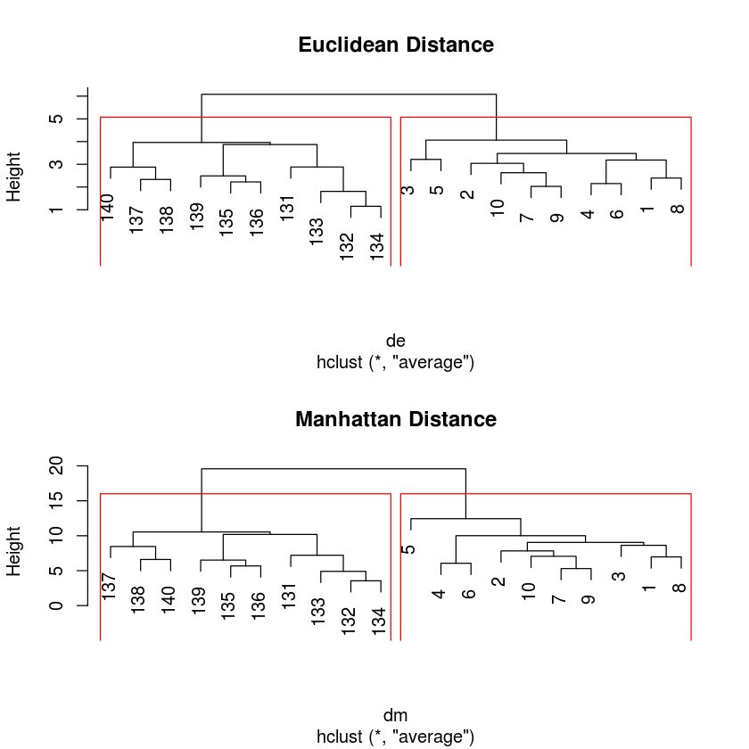


### EXCERCISE:
##### Explore the RUBUS dataset with the presented clustering techniques.


```R
rubush<-hclust(dist(scale(rubus[,-c(1:7)])))
plot(rubush)
rect.hclust(rubush,k=4) #or using h=height
```


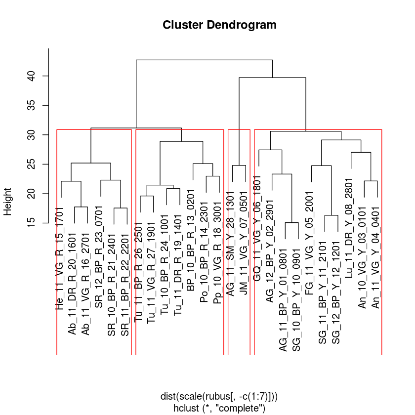


```R
#let's try with kmeans
wssplot(scale(rubus[,-c(1:7)]))
```


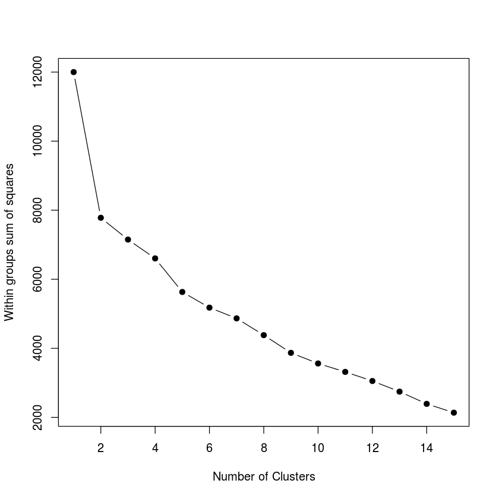


```R
km<-kmeans(scale(rubus[,-c(1:7)]),centers = 2,nstart = 20)
table(km$cluster,rubus$color)
```


       
         R  Y
      1 13  0
      2  0 12


```R
km<-kmeans(scale(rubus[,-c(1:7)]),centers = 4,nstart = 20)
table(km$cluster,rubus$color)
```


       
        R Y
      1 0 8
      2 0 4
      3 6 0
      4 7 0

