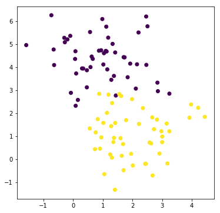

# The problem setting

## Building an example dataset

[Scikit-learn](http://scikit-learn.org/) (`sklearn`) comes with a few standard datasets and various random sample generators. Here we generate 2 [isotropic Gaussian blobs](http://scikit-learn.org/stable/modules/generated/sklearn.datasets.make_blobs.html), with 100 samples (50 per class) and 2 variables.

From the scikit-learn package import the module [`datasets`](http://scikit-learn.org/stable/modules/classes.html#module-sklearn.datasets):


```python
# TO BE COMPLETED
from sklearn import datasets
```

Now we can create the dataset. The [`make_blobs()`](http://scikit-learn.org/stable/modules/generated/sklearn.datasets.make_blobs.html) will return a tuple composed of a [numpy array](https://www.scipy.org/) of shape $n_{samples}, n_{features}$ (i.e. a matrix) containing the data and a numpy array of shape $n_{samples}$ (i.e. a vector) containing the integer labels for cluster membership of each sample.

The parameter `random_state=0` sets the [random seed](https://en.wikipedia.org/wiki/Random_seed) to 0 and ensures replicability .


```python
# TO BE COMPLETED
X, y = datasets.make_blobs(n_samples=100, n_features=2, centers=2, random_state=0)
```

Print 10 samples:


```python
# TO BE COMPLETED
print(X[0:10]) # print the first 10 samples
```

    [[ 4.21850347  2.23419161]
     [ 0.90779887  0.45984362]
     [-0.27652528  5.08127768]
     [ 0.08848433  2.32299086]
     [ 3.24329731  1.21460627]
     [ 1.44193252  2.76754364]
     [ 1.0220286   4.11660348]
     [ 3.97820955  2.37817845]
     [ 0.58894326  4.00148458]
     [ 1.25185786  0.20811388]]


The labels (in this case the species membership for each sample) are encoded with values from $0$ to $n_{classes}−1$:


```python
# TO BE COMPLETED
print(y)
```

    [1 1 0 0 1 0 0 1 0 1 0 1 0 0 1 1 1 0 1 1 0 0 1 0 1 0 1 0 0 1 1 0 1 1 1 0 1
     1 0 1 0 0 0 0 1 1 1 1 0 0 1 1 0 0 0 0 0 1 1 1 1 0 0 1 0 1 0 0 1 0 0 1 1 0
     0 0 1 1 0 0 1 0 0 0 0 0 1 0 1 1 1 1 1 1 0 0 1 1 0 1]


## Plot the dataset

Import the [Matplotlib](https://matplotlib.org/) library:


```python
# TO BE COMPLETED
import matplotlib.pyplot as plt
```

Initialize the [figure](https://matplotlib.org/api/pyplot_api.html?highlight=figure#matplotlib.pyplot.figure):


```python
# TO BE COMPLETED
plt.figure(figsize=(6, 6)) # width, height in inches
```


    <matplotlib.figure.Figure at 0x7fae5236da90>


Now we can make the [scatter plot](https://matplotlib.org/api/pyplot_api.html?highlight=scatter#matplotlib.pyplot.scatter). We pass the first column (the first variable) as the x axis and the second column (the second variable) as the y axis:


```python
# TO BE COMPLETED
plt.scatter(X[:, 0], X[:, 1], c=y)
plt.show()
```





```python

```
