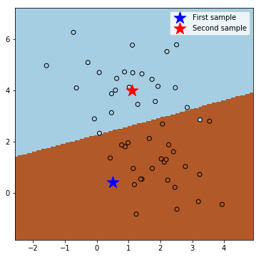

# Classifiers in scikit-learn

## Importing the libraries and data

Import the numpy, matplotlib and scikit-learn libraries:


```python
import numpy as np
import matplotlib.pyplot as plt

from sklearn import datasets
from sklearn.svm import SVC
```

Now we can build the example dataset:


```python
X, y = datasets.make_blobs(n_samples=50, n_features=2, centers=2, random_state=0)
```

## Learning and predicting

In scikit-learn, an estimator for classification is a Python object that implements the methods **`fit(X, y)`** and **`predict(T)`**. An example of an estimator is the class [SVC](http://scikit-learn.org/stable/modules/generated/sklearn.svm.SVC.html) that implements the Support Vector Machine for classification.

In this case we want to use a **linear SVM classifier** with the **penalty parameter `C` equal to 1**:


```python
# TO BE COMPLETED
clf = SVC(kernel='linear', C=1.0)
```

Now we train the classifier on the dataset:


```python
# TO BE COMPLETED
clf.fit(X, y)
```


    SVC(C=1.0, cache_size=200, class_weight=None, coef0=0.0,
      decision_function_shape=None, degree=3, gamma='auto', kernel='linear',
      max_iter=-1, probability=False, random_state=None, shrinking=True,
      tol=0.001, verbose=False)


Now we can predict the class label of two new samples:


```python
# TO BE COMPLETED
X_new = np.array([[0.5, 0.4], [1.1, 4.0]])
clf.predict(X_new)
```


    array([1, 0])


The first sample is predicted as class 1 and the second sample as class 0.

## Plot the samples and the decision regions


```python
# create a dense grid of points and predict
f0_min, f0_max = X[:, 0].min()-1, X[:, 0].max()+1
f1_min, f1_max = X[:, 1].min()-1, X[:, 1].max()+1
f0_grid, f1_grid = np.meshgrid(np.arange(f0_min, f0_max, 0.05), np.arange(f1_min, f1_max, 0.05))
X_grid = np.c_[f0_grid.ravel(), f1_grid.ravel()]
y_pred_grid = clf.predict(X_grid)

# plot the decision regions and the two predicted samples
fig = plt.figure(figsize=(6, 6))
cmap = plt.set_cmap(plt.cm.Paired)
plt.pcolormesh(f0_grid, f1_grid, y_pred_grid.reshape(f0_grid.shape))
plt.scatter(X[:, 0], X[:, 1], c=y, edgecolors='k')
plt.scatter(X_new[0, 0], X_new[0, 1], c='b', marker='*', s=300, label='First sample')
plt.scatter(X_new[1, 0], X_new[1, 1], c='r', marker='*', s=300, label='Second sample')
plt.legend()
plt.show()
```





```python

```
