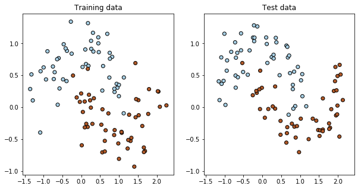
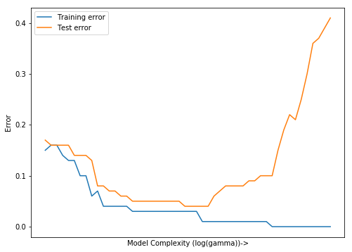
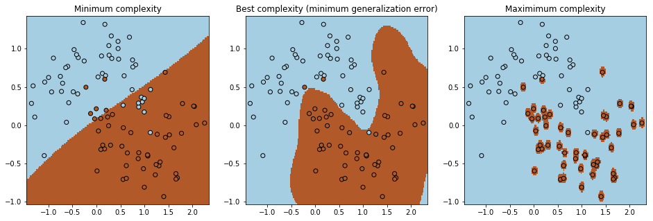

# Overfitting and underfitting

## Importing the libraries and data
Import the `numpy`, `matplotlib` and `scikit-learn` libraries:


```python
import numpy as np
import matplotlib.pyplot as plt

from sklearn.svm import SVC
from sklearn import metrics
from sklearn.model_selection import train_test_split
from sklearn.datasets import make_moons
```

Now we create a ["moons" dataset](http://scikit-learn.org/stable/modules/generated/sklearn.datasets.make_moons.html), composed by two interleaving half circles, one for each class, with 2 dimensions (features) and 200 samples:


```python
X, y = make_moons(n_samples=200, noise=0.2, random_state=0) # random_state=0 set the random seed to 0 and ensures replicability 
```

# Splitting into training and test sets

Split the moons dataset into training and test sets, using the function [train_test_split()](http://scikit-learn.org/stable/modules/generated/sklearn.model_selection.train_test_split.html):


```python
# TO BE COMPLETED

X_train, X_test, y_train, y_test = train_test_split(X, y, 
    test_size=0.5, random_state=0)
```

Make a scatter plot of the training and the test samples:


```python
plt.figure(figsize=(10, 5))
cmap = plt.set_cmap(plt.cm.Paired)

# first subplot
ax1 = plt.subplot(1, 2, 1)
ax1.scatter(X_train[:, 0], X_train[:, 1], c=y_train, edgecolors='k')
ax1.set_title("Training data")

# second subplot
ax2 = plt.subplot(1, 2, 2, sharex=ax1, sharey=ax1)
ax2.scatter(X_test[:, 0], X_test[:, 1], c=y_test, edgecolors='k')
ax2.set_title("Test data")

plt.show()
```





## Train the SVM with increasing model complexity

In this case we choose to adopt the [Support Vector Machine](http://scikit-learn.org/stable/modules/generated/sklearn.svm.SVC.html) with the Radial Basis Function (RBF) kernel. SVMs can efficiently perform a non-linear classification using what is called the kernel trick, implicitly mapping their inputs into high-dimensional feature spaces. We won't go into these in detail.


Train the model on the training set and predict on the test set at different values of the kernel's $\gamma$ parameter. The complexity of the model increases as the gamma parameter increases. In this case we keep the SVM penalty term ($C$) fixed to 1.


```python
# TO BE COMPLETED

# inizialize the training and test error lists
err_train, err_test = [], []

# from 10^-1 to 10^3, 50 steps in logaritmic scale
gammas = np.logspace(-1, 3, 50) 

# for each value of gamma:
for gamma in gammas:
    
    clf = SVC(kernel='rbf', gamma=gamma, C=1) # create a classifier instance with the current value of gamma   
    clf.fit(X_train, y_train) # train the model on the training data
        
    y_train_pred = clf.predict(X_train) # predict the samples in the training set
    y_test_pred = clf.predict(X_test) # predict the samples in the test set
    
    # compute the errors as 1-accuracy
    err_train.append(1-metrics.accuracy_score(y_train_pred, y_train))
    err_test.append(1-metrics.accuracy_score(y_test_pred, y_test))
```

Now we can plot the training and test error curves:


```python
help(metrics.accuracy_score)
```

    Help on function accuracy_score in module sklearn.metrics.classification:
    
    accuracy_score(y_true, y_pred, normalize=True, sample_weight=None)
        Accuracy classification score.
        
        In multilabel classification, this function computes subset accuracy:
        the set of labels predicted for a sample must *exactly* match the
        corresponding set of labels in y_true.
        
        Read more in the :ref:`User Guide <accuracy_score>`.
        
        Parameters
        ----------
        y_true : 1d array-like, or label indicator array / sparse matrix
            Ground truth (correct) labels.
        
        y_pred : 1d array-like, or label indicator array / sparse matrix
            Predicted labels, as returned by a classifier.
        
        normalize : bool, optional (default=True)
            If ``False``, return the number of correctly classified samples.
            Otherwise, return the fraction of correctly classified samples.
        
        sample_weight : array-like of shape = [n_samples], optional
            Sample weights.
        
        Returns
        -------
        score : float
            If ``normalize == True``, return the correctly classified samples
            (float), else it returns the number of correctly classified samples
            (int).
        
            The best performance is 1 with ``normalize == True`` and the number
            of samples with ``normalize == False``.
        
        See also
        --------
        jaccard_similarity_score, hamming_loss, zero_one_loss
        
        Notes
        -----
        In binary and multiclass classification, this function is equal
        to the ``jaccard_similarity_score`` function.
        
        Examples
        --------
        >>> import numpy as np
        >>> from sklearn.metrics import accuracy_score
        >>> y_pred = [0, 2, 1, 3]
        >>> y_true = [0, 1, 2, 3]
        >>> accuracy_score(y_true, y_pred)
        0.5
        >>> accuracy_score(y_true, y_pred, normalize=False)
        2
        
        In the multilabel case with binary label indicators:
        >>> accuracy_score(np.array([[0, 1], [1, 1]]), np.ones((2, 2)))
        0.5
    


```python
# TO BE COMPLETED

plt.figure(figsize=(8, 6))
plt.plot(np.log(gammas), err_train, label="Training error")
plt.plot(np.log(gammas), err_test, label="Test error")
plt.xlabel("Model Complexity (log(gamma))->")
plt.ylabel("Error")
plt.xticks([])
plt.legend()
plt.show()
```





```python
# TO BE COMPLETED

idx_min_err_test = np.argmin(err_test)
gamma_min_err_test = gammas[idx_min_err_test]
print("Best gamma: {:.2f}".format(gamma_min_err_test))
```

    Best gamma: 9.10


## Plot the decision regions

Plot the decision regions of the simplest, best and most complex models.


```python
# create a dense grid of points to predict in the same domain of the training data
f0_min, f0_max = X[:, 0].min()-0.1, X[:, 0].max()+0.1
f1_min, f1_max = X[:, 1].min()-0.1, X[:, 1].max()+0.1
f0_new, f1_new = np.meshgrid(np.arange(f0_min, f0_max, 0.02), np.arange(f1_min, f1_max, 0.02))
X_new = np.c_[f0_new.ravel(), f1_new.ravel()]

# initialize the tree classifiers
clf_min_complexity = SVC(kernel='rbf', gamma=1e-1, C=1) # simplest model
clf_best_complexity = SVC(kernel='rbf', gamma=gamma_min_err_test, C=1) # best model
clf_max_complexity = SVC(kernel='rbf', gamma=1e3, C=1) # most complex model

# train the models on the training data
clf_min_complexity.fit(X_train, y_train)
clf_best_complexity.fit(X_train, y_train)
clf_max_complexity.fit(X_train, y_train)

# predict the class on the new points
y_min_complexity = clf_min_complexity.predict(X_new)
y_best_complexity = clf_best_complexity.predict(X_new)
y_max_complexity = clf_max_complexity.predict(X_new)


# plot the decision regions for each model
fig = plt.figure(figsize=(16, 5))
cmap = plt.set_cmap(plt.cm.Paired)
ax1 = plt.subplot(1, 3, 1)
ax1.pcolormesh(f0_new, f1_new, y_min_complexity.reshape(f0_new.shape))
ax1.scatter(X_train[:, 0], X_train[:, 1], c=y_train, edgecolors='k')
ax1.set_title("Minimum complexity")
ax2 = plt.subplot(1, 3, 2)
ax2.pcolormesh(f0_new, f1_new, y_best_complexity.reshape(f0_new.shape))
ax2.scatter(X_train[:, 0], X_train[:, 1], c=y_train, edgecolors='k')
ax2.set_title("Best complexity (minimum generalization error)")
ax3 = plt.subplot(1, 3, 3)
ax3.pcolormesh(f0_new, f1_new, y_max_complexity.reshape(f0_new.shape))
ax3.scatter(X_train[:, 0], X_train[:, 1], c=y_train, edgecolors='k')
ax3.set_title("Maximimum complexity")
plt.show()
```





```python

```
