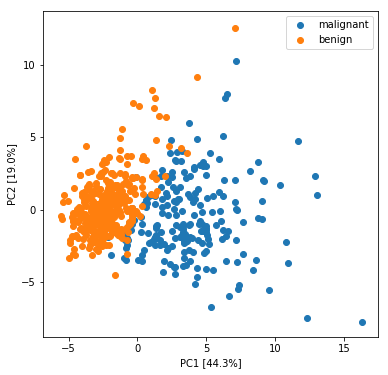
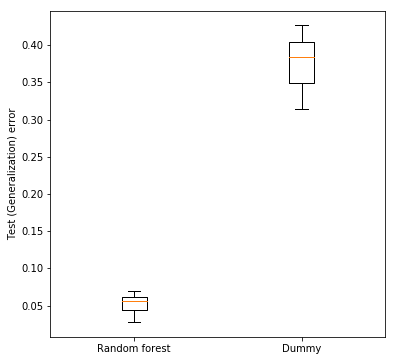

# Model selection and assessment, cross validation

## Importing the libraries and data
Import the `numpy`, `matplotlib` and `scikit-learn` libraries:


```python
import numpy as np
import matplotlib.pyplot as plt

from sklearn import datasets
from sklearn.preprocessing import StandardScaler
from sklearn.decomposition import PCA
from sklearn.ensemble import RandomForestClassifier
from sklearn.dummy import DummyClassifier
from sklearn.model_selection import GridSearchCV, cross_val_score, KFold, ShuffleSplit
from sklearn import metrics
```

Import the breast cancer dataset. The [breast cancer diagnostic dataset](http://scikit-learn.org/stable/modules/generated/sklearn.datasets.load_breast_cancer.html) is a classic and a easy binary classification dataset. It contains 569 samples (212 malignant cells, 357 benign cells) and 30 features. Features are computed from a digitized image of a fine needle aspirate (FNA) of a breast mass. They describe
characteristics of the cell nuclei present in the image (mean radius, mean symmetry, etc.).


```python
# TO BE COMPLETED

dataset = datasets.load_breast_cancer()
X, y = dataset.data, dataset.target
target_names = dataset.target_names
```

## Data exploration through PCA
We perform a [Principal Component Analysis](http://scikit-learn.org/stable/modules/generated/sklearn.decomposition.PCA.html) (PCA) for data exploration purposes. In order to obtain meaningful results, for each feature we remove the mean and scale to unit variance.


```python
# TO BE COMPLETED

# for each feature remove the mean and scale to unit variance
X_scaled = StandardScaler().fit_transform(X)

# build a PCA instance  
pca = PCA()

# PCA transform 
X_pca = pca.fit_transform(X_scaled)
```

Make the plot:


```python
# plot the first two principal components
plt.figure(figsize=(6, 6))
plt.scatter(X_pca[y==0, 0], X_pca[y==0, 1], label=target_names[0])
plt.scatter(X_pca[y==1, 0], X_pca[y==1, 1], label=target_names[1])
plt.xlabel("PC1 [{:.1f}%]".format(100 * pca.explained_variance_ratio_[0]))
plt.ylabel("PC2 [{:.1f}%]".format(100 * pca.explained_variance_ratio_[1]))
plt.legend()
plt.show()
```





# Model selection and assessment
Now we prepare a complete pipeline for model selection and assessment using the [random forest classifier](http://scikit-learn.org/stable/modules/generated/sklearn.ensemble.RandomForestClassifier.html). We tune the classifier by an inner cross validation where we search the optimal number of trees to use in the forest (the `n_estimators` parameter).


Initialize the classifier and the grid of parameters to be tuned:


```python
# TO BE COMPLETED

clf = RandomForestClassifier(random_state=0) # random_state=0 set the random seed to 0 and ensures replicability
param_grid = {'n_estimators': [1, 2, 5, 10, 20, 50]}
```

Now we define the inner and the outer cross validation (CV). We choose:
* a [random subsampling CV](http://scikit-learn.org/stable/modules/generated/sklearn.model_selection.ShuffleSplit.html) with 10 repeats and 1/4 samples in the test set for the outer CV (model assessment);
* a [k-fold CV](http://scikit-learn.org/stable/modules/generated/sklearn.model_selection.KFold.html) with 4 splits for the inner CV (model selection).


```python
# TO BE COMPLETED

outer_cv = ShuffleSplit(n_splits=10, test_size=0.25, random_state=0)
inner_cv = KFold(n_splits=4, random_state=0, shuffle=True)
```

Set up the model selection module using the [GridSearchCV](http://scikit-learn.org/stable/modules/generated/sklearn.model_selection.GridSearchCV.html#sklearn.model_selection.GridSearchCV) class. The `GridSearchCV` makes and exhaustive search over the specified parameter values through cross validation (the `inner_cv` in this case). In this case the best parameter setting is chosen maximizing the CV average accuracy. `GridSearchCV` is itself an estimator: it implements the `fit()` and the `predict()` methods.


```python
# TO BE COMPLETED

model_sel_clf = GridSearchCV(estimator=clf, param_grid=param_grid, 
                             cv=inner_cv)
```

Now we create the model assessment loop using the [cross_val_score()](http://scikit-learn.org/stable/modules/generated/sklearn.model_selection.cross_val_score.html) function. It takes an estimator (in this case `model_sel_clf`), the data and the cross validation setup (`outer_cv`) and returns the test (generalization) accuracy for each iteration:


```python
# TO BE COMPLETED

test_acc = cross_val_score(model_sel_clf, X=X, y=y, cv=outer_cv)
test_acc
```


    array([ 0.95104895,  0.94405594,  0.93706294,  0.95804196,  0.96503497,
            0.93006993,  0.97202797,  0.94405594,  0.93706294,  0.94405594])


We can compare the test accuracy of the random forest classifier with a baseline. For this purpose we compute the test accuracy of a simple ["most frequent" classifier](http://scikit-learn.org/stable/modules/generated/sklearn.dummy.DummyClassifier.html) which each time predicts with the most frequent class in the training set:


```python
# TO BE COMPLETED

dummy_clf = DummyClassifier(strategy='most_frequent')
dummy_test_acc = cross_val_score(dummy_clf, X=X, y=y, cv=outer_cv)
dummy_test_acc
```


    array([ 0.62937063,  0.6013986 ,  0.6013986 ,  0.62937063,  0.58741259,
            0.66433566,  0.65734266,  0.57342657,  0.68531469,  0.59440559])


## Plot the test (generalization) error


```python
plt.figure(figsize=(6, 6))
plt.boxplot([1-test_acc, 1-dummy_test_acc], labels=["Random forest", "Dummy"])
plt.ylabel("Test (Generalization) error")
plt.show()
```





## Build the final model

Given a honest estimate of the generalization error, we can compute the final model using all the data available. In order to do this we search the best model using the `GridSearchCV` defined above.


```python
# TO BE COMPLETED

model_sel_clf.fit(X, y)

# extract the best model
final_clf = model_sel_clf.best_estimator_
print(final_clf)
```

    RandomForestClassifier(bootstrap=True, class_weight=None, criterion='gini',
                max_depth=None, max_features='auto', max_leaf_nodes=None,
                min_impurity_split=1e-07, min_samples_leaf=1,
                min_samples_split=2, min_weight_fraction_leaf=0.0,
                n_estimators=20, n_jobs=1, oob_score=False, random_state=0,
                verbose=0, warm_start=False)


Now we can predict new samples with `final_clf.predict()`.
